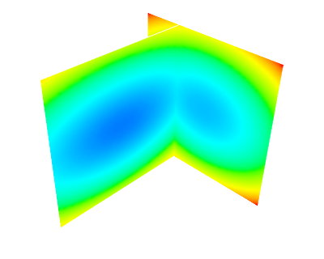

3D plotting functions
=======================

Points
-------
  
.. sourcecode:: ipython

    In [1]: import numpy as np

    In [2]: from enthought.mayavi import mlab

    In [3]: x, y, z, value = np.random.random((4, 40))

    In [4]: mlab.points3d(x, y, z, value)
    Out[4]: <enthought.mayavi.modules.glyph.Glyph object at 0xc3c795c>

.. image:: points3d.png
    :align: center

Lines
------

.. sourcecode:: ipython

    In [5]: mlab.clf()

    In [6]: t = np.linspace(0, 20, 200)

    In [7]: mlab.plot3d(np.sin(t), np.cos(t), 0.1*t, t)
    Out[7]: <enthought.mayavi.modules.surface.Surface object at 0xcc3e1dc>

.. image:: plot3d.png
    :align: center

Elevation surface
-------------------

.. sourcecode:: ipython

    In [8]: mlab.clf()

    In [9]: x, y = np.mgrid[-10:10:100j, -10:10:100j]

    In [10]: r = np.sqrt(x**2 + y**2)

    In [11]: z = np.sin(r)/r

    In [12]: mlab.surf(z, warp_scale='auto')
    Out[12]: <enthought.mayavi.modules.surface.Surface object at 0xcdb98fc>

.. image:: surf.png
    :align: center

Arbitrary regular mesh
-----------------------

.. sourcecode:: ipython

    In [13]: mlab.clf()

    In [14]: phi, theta = np.mgrid[0:np.pi:11j, 0:2*np.pi:11j]

    In [15]: x = np.sin(phi) * np.cos(theta)

    In [16]: y = np.sin(phi) * np.sin(theta)

    In [17]: z = np.cos(phi)

    In [18]: mlab.mesh(x, y, z)

    In [19]: mlab.mesh(x, y, z, representation='wireframe', color=(0, 0, 0))
    Out[19]: <enthought.mayavi.modules.surface.Surface object at 0xce1017c>

.. image:: mesh.png
    :align: center

.. note:: 

    A surface is defined by points **connected** to form triangles or
    polygones. In `mlab.func` and `mlab.mesh`, the connectivity is
    implicity given by the layout of the arrays. See also
    `mlab.triangular_mesh`.

**Our data is often more than points and values: it needs some
connectivity information**

.. _mayavi-voldata-label: 

Volumetric data
----------------

.. sourcecode:: ipython

    In [20]: mlab.clf()

    In [21]: x, y, z = np.mgrid[-5:5:64j, -5:5:64j, -5:5:64j]

    In [22]: values = x*x*0.5 + y*y + z*z*2.0

    In [23]: mlab.contour3d(values)
    Out[24]: <enthought.mayavi.modules.iso_surface.IsoSurface object at 0xcfe392c>

.. image:: contour3d.png
    :align: center

**This function works with a regular orthogonal grid:**

    .. image:: viz_volume_structure.png
	:align: center
	:scale: 70

.. sourcecode:: ipython

    In [25]: s = mlab.pipeline.scalar_field(values)

    In [26]: ipw_x = mlab.pipeline.image_plane_widget(s, plane_orientation='x_axes')

    In [27]: ipw_y = mlab.pipeline.image_plane_widget(s,
    plane_orientation='y_axes')

Interactive image plane widgets: drag to change the visualized plane.
