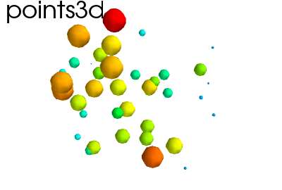
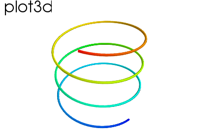
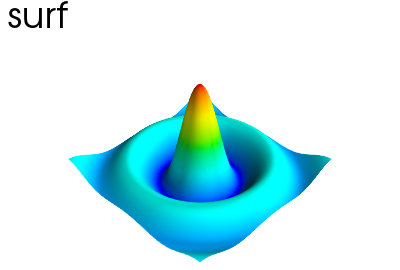
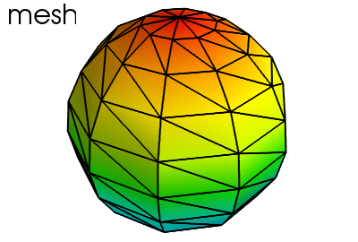
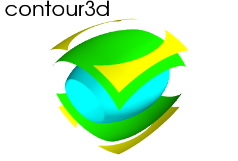
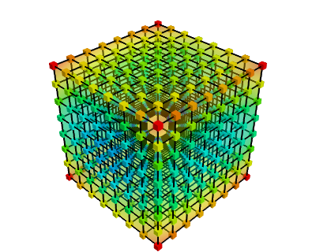

3D plotting functions
=======================

The :mod:`mayavi.mlab` module provides simple plotting functions to apply
to numpy arrays. Try them using in IPython, by starting IPython with the
switch ``--gui=wx``.

Points
-------
 
.. literalinclude:: examples/generate_figures.py
    :start-after: ### begin points3d example
    :end-before: ### end points3d example

|clear-floats|

Lines
------

.. literalinclude:: examples/generate_figures.py
    :start-after: ### begin plot3d example
    :end-before: ### end plot3d example

|clear-floats|

Elevation surface
-------------------

.. literalinclude:: examples/generate_figures.py
    :start-after: ### begin surf example
    :end-before: ### end surf example

|clear-floats|

Arbitrary regular mesh
-----------------------

.. literalinclude:: examples/generate_figures.py
    :start-after: ### begin mesh example
    :end-before: ### end mesh example

.. note:: 

    A surface is defined by points **connected** to form triangles or
    polygones. In `mlab.surf` and `mlab.mesh`, the connectivity is
    implicity given by the layout of the arrays. See also
    `mlab.triangular_mesh`.

**Our data is often more than points and values: it needs some
connectivity information**

.. _mayavi-voldata-label: 

Volumetric data
----------------

.. literalinclude:: examples/generate_figures.py
    :start-after: ### begin contour3d example
    :end-before: ### end contour3d example

**This function works with a regular orthogonal grid:** the `value` array
is a 3D array that gives the shape of the grid.

