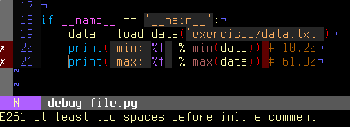

---
jupytext:
  text_representation:
    extension: .md
    format_name: myst
    format_version: 0.13
    jupytext_version: 1.18.0-dev
kernelspec:
  display_name: Python 3 (ipykernel)
  language: python
  name: python3
---

(debugging-chapter)=

# Debugging code

**Author**: _Gaël Varoquaux_

This section explores tools to understand better your code base:
debugging, to find and fix bugs.

It is not specific to the scientific Python community, but the strategies
that we will employ are tailored to its needs.

:::{admonition} Prerequisites

- NumPy
- IPython
- [nosetests](https://nose.readthedocs.io/en/latest/)
- [pyflakes](https://pypi.org/project/pyflakes)
- gdb for the C-debugging part.
  :::

## Avoiding bugs

### Coding best practices to avoid getting in trouble

:::{sidebar} Brian Kernighan
_“Everyone knows that debugging is twice as hard as writing a
program in the first place. So if you're as clever as you can be
when you write it, how will you ever debug it?”_
:::

- We all write buggy code. Accept it. Deal with it.

- Write your code with testing and debugging in mind.

- Keep It Simple, Stupid (KISS).

  - What is the simplest thing that could possibly work?

- Don't Repeat Yourself (DRY).

  - Every piece of knowledge must have a single, unambiguous,
    authoritative representation within a system.
  - Constants, algorithms, etc...

- Try to limit interdependencies of your code. (Loose Coupling)

- Give your variables, functions and modules meaningful names (not
  mathematics names)

### pyflakes: fast static analysis

They are several static analysis tools in Python; to name a few:

- [pylint](https://pylint.pycqa.org/en/latest/)
- [pychecker](https://pychecker.sourceforge.net/)
- [pyflakes](https://pypi.org/project/pyflakes)
- [flake8](https://pypi.org/project/flake8)

Here we focus on `pyflakes`, which is the simplest tool.

- **Fast, simple**
- Detects syntax errors, missing imports, typos on names.

Another good recommendation is the `flake8` tool which is a combination of
pyflakes and pep8. Thus, in addition to the types of errors that pyflakes
catches, flake8 detects violations of the recommendation in [PEP8](https://peps.python.org/pep-0008/) style guide.

Integrating pyflakes (or flake8) in your editor or IDE is highly
recommended, it **does yield productivity gains**.

#### Running pyflakes on the current edited file

You can bind a key to run pyflakes in the current buffer.

- **In kate**
  Menu: 'settings -> configure kate

  - In plugins enable 'external tools'
  - In external Tools', add `pyflakes`:

    ```
    kdialog --title "pyflakes %filename" --msgbox "$(pyflakes %filename)"
    ```

- **In TextMate**

  Menu: TextMate -> Preferences -> Advanced -> Shell variables, add a
  shell variable:

  ```shell
  TM_PYCHECKER = /Library/Frameworks/Python.framework/Versions/Current/bin/pyflakes
  ```

  Then `Ctrl-Shift-V` is binded to a pyflakes report

- **In vim**
  In your `.vimrc` (binds F5 to `pyflakes`):

  ```vim
  autocmd FileType python let &mp = 'echo "*** running % ***" ; pyflakes %'
  autocmd FileType tex,mp,rst,python imap <Esc>[15~ <C-O>:make!^M
  autocmd FileType tex,mp,rst,python map  <Esc>[15~ :make!^M
  autocmd FileType tex,mp,rst,python set autowrite
  ```

- **In emacs**
  In your `.emacs` (binds F5 to `pyflakes`):

  ```lisp
  (defun pyflakes-thisfile () (interactive)
         (compile (format "pyflakes %s" (buffer-file-name)))

  (define-minor-mode pyflakes-mode
      "Toggle pyflakes mode.
      With no argument, this command toggles the mode.
      Non-null prefix argument turns on the mode.
      Null prefix argument turns off the mode."
      ;; The initial value.
      nil
      ;; The indicator for the mode line.
      " Pyflakes"
      ;; The minor mode bindings.
      '( ([f5] . pyflakes-thisfile) )
  )

  (add-hook 'python-mode-hook (lambda () (pyflakes-mode t)))
  ```

#### A type-as-go spell-checker like integration

- **In vim**

  - Use the pyflakes.vim plugin:

    1. download the zip file from
       <https://www.vim.org/scripts/script.php?script_id=2441>
    2. extract the files in `~/.vim/ftplugin/python`
    3. make sure your vimrc has `filetype plugin indent on`

    

  - Alternatively: use the [syntastic](https://github.com/vim-syntastic/syntastic)
    plugin. This can be configured to use `flake8` too and also handles
    on-the-fly checking for many other languages.

    

- **In emacs**

  Use the flymake mode with pyflakes, documented on
  <https://www.emacswiki.org/emacs/FlyMake> and included in Emacs 26 and
  more recent. To activate it, use `M-x` (meta-key then x) and enter
  `flymake-mode` at the prompt. To enable it automatically when
  opening a Python file, add the following line to your .emacs file:

  ```lisp
  (add-hook 'python-mode-hook '(lambda () (flymake-mode)))
  ```

## Debugging workflow

If you do have a non trivial bug, this is when debugging strategies kick
in. There is no silver bullet. Yet, strategies help.

**For debugging a given problem, the favorable situation is when the problem is
isolated in a small number of lines of code, outside framework or application
code, with short modify-run-fail cycles.**

1. Make it fail reliably. Find a test case that makes the code fail
   every time.

2. Divide and Conquer. Once you have a failing test case, isolate the
   failing code.

   - Which module.
   - Which function.
   - Which line of code.

   => isolate a small reproducible failure: a test case

3. Change one thing at a time and re-run the failing test case.

4. Use the debugger to understand what is going wrong.

5. Take notes and be patient. It may take a while.

:::{note}
Once you have gone through this process: isolated a tight piece of
code reproducing the bug and fix the bug using this piece of code, add
the corresponding code to your test suite.
:::

+++

## Using the Python debugger

The python debugger, `pdb`: <https://docs.python.org/3/library/pdb.html>,
allows you to inspect your code interactively.

Specifically it allows you to:

- View the source code.
- Walk up and down the call stack.
- Inspect values of variables.
- Modify values of variables.
- Set breakpoints.

:::{admonition} print
Yes, `print` statements do work as a debugging tool. However to
inspect runtime, it is often more efficient to use the debugger.
:::

### Invoking the debugger

Ways to launch the debugger:

1. Postmortem, launch debugger after module errors.
2. Launch the module with the debugger.
3. Call the debugger inside the module

#### Postmortem

**Situation**: You're working in IPython and you get a traceback.

Here we debug the file {download}`index_error.py`. When running it, an
{class}`IndexError` is raised. Type `%debug` and drop into the debugger.

```ipython
In [1]: %run index_error.py
---------------------------------------------------------------------------
IndexError                                Traceback (most recent call last)
File ~/src/scientific-python-lectures/advanced/debugging/index_error.py:10
      6     print(lst[len(lst)])
      9 if __name__ == "__main__":
---> 10     index_error()

File ~/src/scientific-python-lectures/advanced/debugging/index_error.py:6, in index_error()
      4 def index_error():
      5     lst = list("foobar")
----> 6     print(lst[len(lst)])

IndexError: list index out of range

In [2]: %debug
> /home/jarrod/src/scientific-python-lectures/advanced/debugging/index_error.py(6)index_error()
      4 def index_error():
      5     lst = list("foobar")
----> 6     print(lst[len(lst)])
      7
      8

ipdb> list
      1 """Small snippet to raise an IndexError."""
      2
      3
      4 def index_error():
      5     lst = list("foobar")
----> 6     print(lst[len(lst)])
      7
      8
      9 if __name__ == "__main__":
     10     index_error()

ipdb> len(lst)
6
ipdb> print(lst[len(lst) - 1])
r
ipdb> quit
```

:::{admonition} Post-mortem debugging without IPython
In some situations you cannot use IPython, for instance to debug a
script that wants to be called from the command line. In this case,
you can call the script with `python -m pdb script.py`:

```shell
$ python -m pdb index_error.py
> /home/jarrod/src/scientific-python-lectures/advanced/debugging/index_error.py(1)<module>()
-> """Small snippet to raise an IndexError."""
(Pdb) continue
Traceback (most recent call last):
  File "/usr/lib64/python3.11/pdb.py", line 1793, in main
    pdb._run(target)
  File "/usr/lib64/python3.11/pdb.py", line 1659, in _run
    self.run(target.code)
  File "/usr/lib64/python3.11/bdb.py", line 600, in run
    exec(cmd, globals, locals)
  File "<string>", line 1, in <module>
  File "/home/jarrod/src/scientific-python-lectures/advanced/debugging/index_error.py", line 10, in <module>
    index_error()
  File "/home/jarrod/src/scientific-python-lectures/advanced/debugging/index_error.py", line 6, in index_error
    print(lst[len(lst)])
          ~~~^^^^^^^^^^
IndexError: list index out of range
Uncaught exception. Entering post mortem debugging
Running 'cont' or 'step' will restart the program
> /home/jarrod/src/scientific-python-lectures/advanced/debugging/index_error.py(6)index_error()
-> print(lst[len(lst)])
(Pdb)
```

:::

#### Step-by-step execution

**Situation**: You believe a bug exists in a module but are not sure where.

For instance we are trying to debug {download}`wiener_filtering.py`.
Indeed the code runs, but the filtering does not work well.

- Run the script in IPython with the debugger using `%run -d
wiener_filtering.py` :

  ```text
  In [1]: %run -d wiener_filtering.py
  *** Blank or comment
  *** Blank or comment
  *** Blank or comment
  NOTE: Enter 'c' at the ipdb>  prompt to continue execution.
  > /home/jarrod/src/scientific-python-lectures/advanced/debugging/wiener_filtering.py(1)<module>()
  ----> 1 """Wiener filtering a noisy raccoon face: this module is buggy"""
        2
        3 import numpy as np
        4 import scipy as sp
        5 import matplotlib.pyplot as plt
  ```

- Set a break point at line 29 using `b 29`:

  ```text
  ipdb> n
  > /home/jarrod/src/scientific-python-lectures/advanced/debugging/wiener_filtering.py(3)<module>()
        1 """Wiener filtering a noisy raccoon face: this module is buggy"""
        2
  ----> 3 import numpy as np
        4 import scipy as sp
        5 import matplotlib.pyplot as plt

  ipdb> b 29
  Breakpoint 1 at /home/jarrod/src/scientific-python-lectures/advanced/debugging/wiener_filtering.py:29
  ```

- Continue execution to next breakpoint with `c(ont(inue))`:

  ```text
  ipdb> c
  > /home/jarrod/src/scientific-python-lectures/advanced/debugging/wiener_filtering.py(29)iterated_wiener()
       27     Do not use this: this is crappy code to demo bugs!
       28     """
  1--> 29     noisy_img = noisy_img
       30     denoised_img = local_mean(noisy_img, size=size)
       31     l_var = local_var(noisy_img, size=size)
  ```

- Step into code with `n(ext)` and `s(tep)`: `next` jumps to the next
  statement in the current execution context, while `step` will go across
  execution contexts, i.e. enable exploring inside function calls:

  ```ipython
  ipdb> s
  > /home/jarrod/src/scientific-python-lectures/advanced/debugging/wiener_filtering.py(30)iterated_wiener()
       28     """
  1    29     noisy_img = noisy_img
  ---> 30     denoised_img = local_mean(noisy_img, size=size)
       31     l_var = local_var(noisy_img, size=size)
       32     for i in range(3):

  ipdb> n
  > /home/jarrod/src/scientific-python-lectures/advanced/debugging/wiener_filtering.py(31)iterated_wiener()
  1    29     noisy_img = noisy_img
       30     denoised_img = local_mean(noisy_img, size=size)
  ---> 31     l_var = local_var(noisy_img, size=size)
       32     for i in range(3):
       33         res = noisy_img - denoised_img
  ```

- Step a few lines and explore the local variables:

  ```text
  ipdb> n
  > /home/jarrod/src/scientific-python-lectures/advanced/debugging/wiener_filtering.py(32)iterated_wiener()
       30     denoised_img = local_mean(noisy_img, size=size)
       31     l_var = local_var(noisy_img, size=size)
  ---> 32     for i in range(3):
       33         res = noisy_img - denoised_img
       34         noise = (res**2).sum() / res.size

  ipdb> print(l_var)
  [[2571 2782 3474 ... 3008 2922 3141]
   [2105  708  475 ...  469  354 2884]
   [1697  420  645 ...  273  236 2517]
   ...
   [2437  345  432 ...  413  387 4188]
   [2598  179  247 ...  367  441 3909]
   [2808 2525 3117 ... 4413 4454 4385]]
  ipdb> print(l_var.min())
  0
  ```

Oh dear, nothing but integers, and 0 variation. Here is our bug, we are
doing integer arithmetic.

:::{admonition} Raising exception on numerical errors
When we run the {download}`wiener_filtering.py` file, the following
warnings are raised:

```ipython
In [2]: %run wiener_filtering.py
/home/jarrod/src/scientific-python-lectures/advanced/debugging/wiener_filtering.py:35: RuntimeWarning: divide by zero encountered in divide
  noise_level = 1 - noise / l_var
```

We can turn these warnings in exception, which enables us to do
post-mortem debugging on them, and find our problem more quickly:

```ipython
In [3]: np.seterr(all='raise')
Out[3]: {'divide': 'warn', 'over': 'warn', 'under': 'ignore', 'invalid': 'warn'}

In [4]:  %run wiener_filtering.py
---------------------------------------------------------------------------
FloatingPointError                        Traceback (most recent call last)
File ~/src/scientific-python-lectures/advanced/debugging/wiener_filtering.py:52
     49 plt.matshow(face[cut], cmap=plt.cm.gray)
     50 plt.matshow(noisy_face[cut], cmap=plt.cm.gray)
---> 52 denoised_face = iterated_wiener(noisy_face)
     53 plt.matshow(denoised_face[cut], cmap=plt.cm.gray)
     55 plt.show()

File ~/src/scientific-python-lectures/advanced/debugging/wiener_filtering.py:35, in iterated_wiener(noisy_img, size)
     33 res = noisy_img - denoised_img
     34 noise = (res**2).sum() / res.size
---> 35 noise_level = 1 - noise / l_var
     36 noise_level[noise_level < 0] = 0
     37 denoised_img = np.int64(noise_level * res)

FloatingPointError: divide by zero encountered in divide
```

:::

#### Other ways of starting a debugger

- **Raising an exception as a poor man break point**

  If you find it tedious to note the line number to set a break point,
  you can simply raise an exception at the point that you want to
  inspect and use IPython's `%debug`. Note that in this case you cannot
  step or continue the execution.

- **Debugging test failures using nosetests**

  You can run `nosetests --pdb` to drop in post-mortem debugging on
  exceptions, and `nosetests --pdb-failure` to inspect test failures
  using the debugger.

  In addition, you can use the IPython interface for the debugger in nose
  by installing the nose plugin
  [ipdbplugin](https://pypi.org/project/ipdbplugin). You can than
  pass `--ipdb` and `--ipdb-failure` options to nosetests.

- **Calling the debugger explicitly**

  Insert the following line where you want to drop in the debugger:

  ```python
  import pdb; pdb.set_trace()
  ```

:::{warning}
When running `nosetests`, the output is captured, and thus it seems
that the debugger does not work. Simply run the nosetests with the `-s`
flag.
:::

:::{admonition} Graphical debuggers and alternatives

- [pudb](https://pypi.org/project/pudb) is a good semi-graphical
  debugger with a text user interface in the console.
- The [Visual Studio Code](https://code.visualstudio.com/) integrated
  development environment includes a debugging mode.
- The [Mu editor](https://codewith.mu/) is a simple Python editor that
  includes a debugging mode.
  :::

### Debugger commands and interaction

|            |                                                                     |
| ---------- | ------------------------------------------------------------------- |
| `l(list)`  | Lists the code at the current position                              |
| `u(p)`     | Walk up the call stack                                              |
| `d(own)`   | Walk down the call stack                                            |
| `n(ext)`   | Execute the next line (does not go down in new functions)           |
| `s(tep)`   | Execute the next statement (goes down in new functions)             |
| `bt`       | Print the call stack                                                |
| `a`        | Print the local variables                                           |
| `!command` | Execute the given **Python** command (by opposition to pdb commands |

:::{warning}
**Debugger commands are not Python code**

You cannot name the variables the way you want. For instance, if in
you cannot override the variables in the current frame with the same
name: **use different names than your local variable when typing code
in the debugger**.
:::

#### Getting help when in the debugger

Type `h` or `help` to access the interactive help:

```python
ipdb> help

Documented commands (type help <topic>):
========================================
EOF    commands   enable      ll        pp       s                until
a      condition  exceptions  longlist  psource  skip_hidden      up
alias  cont       exit        n         q        skip_predicates  w
args   context    h           next      quit     source           whatis
b      continue   help        p         r        step             where
break  d          ignore      pdef      restart  tbreak
bt     debug      j           pdoc      return   u
c      disable    jump        pfile     retval   unalias
cl     display    l           pinfo     run      undisplay
clear  down       list        pinfo2    rv       unt

Miscellaneous help topics:
==========================
exec  pdb

Undocumented commands:
======================
interact
```

## Debugging segmentation faults using gdb

If you have a segmentation fault, you cannot debug it with pdb, as it
crashes the Python interpreter before it can drop in the debugger.
Similarly, if you have a bug in C code embedded in Python, pdb is
useless. For this we turn to the gnu debugger,
[gdb](https://www.gnu.org/software/gdb/), available on Linux.

Before we start with gdb, let us add a few Python-specific tools to it.
For this we add a few macros to our `~/.gdbinit`. The optimal choice of
macro depends on your Python version and your gdb version. I have added a
simplified version in {download}`gdbinit`, but feel free to read
[DebuggingWithGdb](https://wiki.python.org/moin/DebuggingWithGdb).

To debug with gdb the Python script {download}`segfault.py`, we can run the
script in gdb as follows

```console
$ gdb python
...
(gdb) run segfault.py
Starting program: /usr/bin/python segfault.py
[Thread debugging using libthread_db enabled]

Program received signal SIGSEGV, Segmentation fault.
_strided_byte_copy (dst=0x8537478 "\360\343G", outstrides=4, src=
    0x86c0690 <Address 0x86c0690 out of bounds>, instrides=32, N=3,
    elsize=4)
        at numpy/core/src/multiarray/ctors.c:365
365            _FAST_MOVE(Int32);
(gdb)
```

We get a segfault, and gdb captures it for post-mortem debugging in the C
level stack (not the Python call stack). We can debug the C call stack
using gdb's commands:

```console
(gdb) up
#1  0x004af4f5 in _copy_from_same_shape (dest=<value optimized out>,
    src=<value optimized out>, myfunc=0x496780 <_strided_byte_copy>,
    swap=0)
at numpy/core/src/multiarray/ctors.c:748
748         myfunc(dit->dataptr, dest->strides[maxaxis],
```

As you can see, right now, we are in the C code of numpy. We would like
to know what is the Python code that triggers this segfault, so we go up
the stack until we hit the Python execution loop:

```console
(gdb) up
#8  0x080ddd23 in call_function (f=
    Frame 0x85371ec, for file /home/varoquau/usr/lib/python2.6/site-packages/numpy/core/arrayprint.py, line 156, in _leading_trailing (a=<numpy.ndarray at remote 0x85371b0>, _nc=<module at remote 0xb7f93a64>), throwflag=0)
    at ../Python/ceval.c:3750
3750    ../Python/ceval.c: No such file or directory.
        in ../Python/ceval.c

(gdb) up
#9  PyEval_EvalFrameEx (f=
    Frame 0x85371ec, for file /home/varoquau/usr/lib/python2.6/site-packages/numpy/core/arrayprint.py, line 156, in _leading_trailing (a=<numpy.ndarray at remote 0x85371b0>, _nc=<module at remote 0xb7f93a64>), throwflag=0)
    at ../Python/ceval.c:2412
2412    in ../Python/ceval.c
(gdb)
```

Once we are in the Python execution loop, we can use our special Python
helper function. For instance we can find the corresponding Python code:

```console
(gdb) pyframe
/home/varoquau/usr/lib/python2.6/site-packages/numpy/core/arrayprint.py (158): _leading_trailing
(gdb)
```

This is numpy code, we need to go up until we find code that we have
written:

```console
(gdb) up
...
(gdb) up
#34 0x080dc97a in PyEval_EvalFrameEx (f=
    Frame 0x82f064c, for file segfault.py, line 11, in print_big_array (small_array=<numpy.ndarray at remote 0x853ecf0>, big_array=<numpy.ndarray at remote 0x853ed20>), throwflag=0) at ../Python/ceval.c:1630
1630    ../Python/ceval.c: No such file or directory.
        in ../Python/ceval.c
(gdb) pyframe
segfault.py (12): print_big_array
```

The corresponding code is:

```{literalinclude} segfault.py
:language: py
:lines: 8-14
```

Thus the segfault happens when printing `big_array[-10:]`. The reason is
simply that `big_array` has been allocated with its end outside the
program memory.

:::{note}
For a list of Python-specific commands defined in the `gdbinit`, read
the source of this file.
:::

---

::: {exercise-start}
:label: to-debug-ex
:class: dropdown
:::

The following script is well documented and hopefully legible. It
seeks to answer a problem of actual interest for numerical computing,
but it does not work... Can you debug it?

**Python source code:** {download}`to_debug.py <to_debug.py>`

:::{literalinclude} to_debug_solution.py
:::

::: {exercise-end}
:::

::: {solution-start} to-debug-ex
:class: dropdown
:::

:::{literalinclude} to_debug_solution.py
:::

::: {solution-end}
:::
