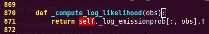

================
Debugging code 
================

:author: Gaël Varoquaux

This tutorial explores tool to understand better your code base:
debugging, to find and fix bugs.

It is not specific to the scientific Python community, but the strategies
that we will employ are tailored to its needs.

.. topic:: Prerequisites

    * Numpy
    * IPython
    * nosetests (http://readthedocs.org/docs/nose/en/latest/)
    * line_profiler (http://packages.python.org/line_profiler/)
    * pyflakes (http://pypi.python.org/pypi/pyflakes)
    * gdb for the C-debugging part.

.. contents:: Chapters contents
   :local:
   :depth: 4

Avoiding bugs
=============

Coding best practices to avoid getting in trouble
--------------------------------------------------

.. topic:: Brian Kernighan

   *“Everyone knows that debugging is twice as hard as writing a
   program in the first place. So if you're as clever as you can be
   when you write it, how will you ever debug it?”*

* We all write buggy code.  Accept it.  Deal with it.
* Write your code with testing and debugging in mind.
* Keep It Simple, Stupid (KISS).

  * What is the simplest thing that could possibly work?

* Don't Repeat Yourself (DRY).

  * Every piece of knowledge must have a single, unambiguous,
    authoritative representation within a system.
  * Constants, algorithms, etc...

* Try to limit interdependencies of your code. (Loose Coupling)
* Give your variables, functions and modules meaningful names (not
  mathematics names)

pyflakes: fast static analysis
-------------------------------

They are several static analysis tools in Python; to name a few: 
`pylint <http://www.logilab.org/857>`_, 
`pychecker <http://pychecker.sourceforge.net/>`_, and 
`pyflakes <http://pypi.python.org/pypi/pyflakes>`_.
Here we focus on pyflakes, which is the simplest tool.

    * **Fast, simple**

    * Detects syntax errors, missing imports, typos on names.

Integrating pyflakes in your editor is highly recommended, it **does
yield productivity gains**.

Running pyflakes on the current edited file
............................................

You can bind a key to run pyflakes in the current buffer.

* **In kate**
  Menu: 'settings -> configure kate 
  
    * In plugins enable 'external tools'

    * In external Tools', add `pyflakes`::

        kdialog --title "pyflakes %filename" --msgbox "$(pyflakes %filename)"

* **In TextMate**

  Menu: TextMate -> Preferences -> Advanced -> Shell variables, add a
  shell variable::

    TM_PYCHECKER=/Library/Frameworks/Python.framework/Versions/Current/bin/pyflakes

  Then `Ctrl-Shift-V` is binded to a pyflakes report

* **In vim**
  In your `.vimrc` (binds F5 to `pyflakes`)::

    autocmd FileType python let &mp = 'echo "*** running % ***" ; pyflakes %'
    autocmd FileType tex,mp,rst,python imap <Esc>[15~ <C-O>:make!^M
    autocmd FileType tex,mp,rst,python map  <Esc>[15~ :make!^M
    autocmd FileType tex,mp,rst,python set autowrite

* **In emacs**
  In your `.emacs` (binds F5 to `pyflakes`)::

    (defun pyflakes-thisfile () (interactive)
           (compile (format "pyflakes %s" (buffer-file-name)))
    )
    
    (define-minor-mode pyflakes-mode
        "Toggle pyflakes mode.
        With no argument, this command toggles the mode.
        Non-null prefix argument turns on the mode.
        Null prefix argument turns off the mode."
        ;; The initial value.
        nil
        ;; The indicator for the mode line.
        " Pyflakes"
        ;; The minor mode bindings.
        '( ([f5] . pyflakes-thisfile) )
    )
    
    (add-hook 'python-mode-hook (lambda () (pyflakes-mode t)))

A type-as-go spell-checker like integration
............................................

* **In vim**
  Use the pyflakes.vim plugin: 
  
  1. download the zip file from
     http://www.vim.org/scripts/script.php?script_id=2441
  
  2. extract the files in `~/.vim/ftplugin/python`

  3. make sure your vimrc has "filetype plugin indent on"

* **In emacs**
  Use the flymake mode with pyflakes, documented on
  http://www.plope.com/Members/chrism/flymake-mode : add the following to
  your .emacs file::
  
    (when (load "flymake" t) 
            (defun flymake-pyflakes-init () 
            (let* ((temp-file (flymake-init-create-temp-buffer-copy 
                                'flymake-create-temp-inplace)) 
                (local-file (file-relative-name 
                            temp-file 
                            (file-name-directory buffer-file-name)))) 
                (list "pyflakes" (list local-file)))) 

            (add-to-list 'flymake-allowed-file-name-masks 
                    '("\\.py\\'" flymake-pyflakes-init))) 

    (add-hook 'find-file-hook 'flymake-find-file-hook)

Debugging workflow
===================

I you do have a non trivial bug, this is when debugging strategies kick
in. There is no silver bullet. Yet, strategies help:

   **For debugging a given problem, the favorable situation is when the
   problem is isolated in a small number of lines of code, outside
   framework or application code, with short modify-run-fail cycles**

#. Make it fail reliably.  Find a test case that makes the code fail
   every time.
#. Divide and Conquer.  Once you have a failing test case, isolate the
   failing code.

   * Which module.
   * Which function.
   * Which line of code.

   => isolate a small reproducible failure: a test case

#. Change one thing at a time and re-run the failing test case.
#. Use the debugger to understand what is going wrong.
#. Take notes and be patient.  It may take a while.

.. note::

   Once you have gone through this process: isolated a tight piece of
   code reproducing the bug and fix the bug using this piece of code, add
   the corresponding code to your test suite.

Using the Python debugger
=========================

The python debugger, ``pdb``: http://docs.python.org/library/pdb.html,
allows you to inspect your code interactively.

Specifically it allows you to:

  * View the source code.
  * Walk up and down the call stack.
  * Inspect values of variables.
  * Modify values of variables.
  * Set breakpoints.

.. topic:: **print**

    Yes, ``print`` statements do work as a debugging tool. However to
    inspect runtime, it is often more efficient to use the debugger.

Invoking the debugger
-----------------------

Ways to launch the debugger:

#. Postmortem, launch debugger after module errors.
#. Launch the module with the debugger.
#. Call the debugger inside the module

Postmortem
...........

**Situation**: You're working in ipython and you get a traceback.

Here we debug the file :download:`index_error.py`. When running it, an
`IndexError` is raised. Type ``%debug`` and drop into the debugger.

.. sourcecode:: ipython

    In [1]: %run index_error.py
    ---------------------------------------------------------------------------
    IndexError                                Traceback (most recent call last)
    /home/varoquau/dev/scipy-lecture-notes/advanced/debugging_optimizing/index_error.py in <module>()
          6 
          7 if __name__ == '__main__':
    ----> 8     index_error()
          9 

    /home/varoquau/dev/scipy-lecture-notes/advanced/debugging_optimizing/index_error.py in index_error()
          3 def index_error():
          4     lst = list('foobar')
    ----> 5     print lst[len(lst)]
          6 
          7 if __name__ == '__main__':

    IndexError: list index out of range

    In [2]: %debug
    > /home/varoquau/dev/scipy-lecture-notes/advanced/debugging_optimizing/index_error.py(5)index_error()
          4     lst = list('foobar')
    ----> 5     print lst[len(lst)]
          6 

    ipdb> list
          1 """Small snippet to raise an IndexError."""
          2 
          3 def index_error():
          4     lst = list('foobar')
    ----> 5     print lst[len(lst)]
          6 
          7 if __name__ == '__main__':
          8     index_error()
          9 

    ipdb> len(lst)
    6
    ipdb> print lst[len(lst)-1]
    r
    ipdb> quit

    In [3]: 

.. topic:: Post-mortem debugging without IPython

   In some situations you cannot use IPython, for instance to debug a
   script that wants to be called from the command line. In this case,
   you can call the script with `python -m pdb script.py`::

    $ python -m pdb index_error.py
    > /home/varoquau/dev/scipy-lecture-notes/advanced/debugging_optimizing/index_error.py(1)<module>()
    -> """Small snippet to raise an IndexError."""
    (Pdb) continue
    Traceback (most recent call last):
    File "/usr/lib/python2.6/pdb.py", line 1296, in main
        pdb._runscript(mainpyfile)
    File "/usr/lib/python2.6/pdb.py", line 1215, in _runscript
        self.run(statement)
    File "/usr/lib/python2.6/bdb.py", line 372, in run
        exec cmd in globals, locals
    File "<string>", line 1, in <module>
    File "index_error.py", line 8, in <module>
        index_error()
    File "index_error.py", line 5, in index_error
        print lst[len(lst)]
    IndexError: list index out of range
    Uncaught exception. Entering post mortem debugging
    Running 'cont' or 'step' will restart the program
    > /home/varoquau/dev/scipy-lecture-notes/advanced/debugging_optimizing/index_error.py(5)index_error()
    -> print lst[len(lst)]
    (Pdb) 
 

Step-by-step execution
.......................

**Situation**: You believe a bug exists in a module but are not sure where.

For instance we are trying to debug :download:`wiener_filtering.py`.
Indeed the code runs, but the filtering does not work well.

* Run the script with the debugger:

  .. sourcecode:: ipython

    In [1]: %run -d wiener_filtering.py
    *** Blank or comment
    *** Blank or comment
    *** Blank or comment
    Breakpoint 1 at /home/varoquau/dev/scipy-lecture-notes/advanced/debugging_optimizing/wiener_filtering.py:4
    NOTE: Enter 'c' at the ipdb>  prompt to start your script.
    > <string>(1)<module>()

* Enter the :download:`wiener_filtering.py` file and set a break point at line
  34:

  .. sourcecode:: ipython

    ipdb> n
    > /home/varoquau/dev/scipy-lecture-notes/advanced/debugging_optimizing/wiener_filtering.py(4)<module>()
          3 
    1---> 4 import numpy as np
          5 import scipy as sp

    ipdb> b 34
    Breakpoint 2 at /home/varoquau/dev/scipy-lecture-notes/advanced/debugging_optimizing/wiener_filtering.py:34

* Continue execution to next breakpoint with ``c(ont(inue))``:

  .. sourcecode:: ipython

    ipdb> c
    > /home/varoquau/dev/scipy-lecture-notes/advanced/debugging_optimizing/wiener_filtering.py(34)iterated_wiener()
         33     """
    2--> 34     noisy_img = noisy_img
         35     denoised_img = local_mean(noisy_img, size=size)

* Step into code with ``n(ext)`` and ``s(tep)``: ``next`` jumps to the next
  statement in the current execution context, while ``step`` will go across
  execution contexts, i.e. enable exploring inside function calls:

  .. sourcecode:: ipython

    ipdb> s
    > /home/varoquau/dev/scipy-lecture-notes/advanced/debugging_optimizing/wiener_filtering.py(35)iterated_wiener()
    2    34     noisy_img = noisy_img
    ---> 35     denoised_img = local_mean(noisy_img, size=size)
         36     l_var = local_var(noisy_img, size=size)

    ipdb> n
    > /home/varoquau/dev/scipy-lecture-notes/advanced/debugging_optimizing/wiener_filtering.py(36)iterated_wiener()
         35     denoised_img = local_mean(noisy_img, size=size)
    ---> 36     l_var = local_var(noisy_img, size=size)
         37     for i in range(3):

* Step a few lines and explore the local variables:

  .. sourcecode:: ipython

    ipdb> n
    > /home/varoquau/dev/scipy-lecture-notes/advanced/debugging_optimizing/wiener_filtering.py(37)iterated_wiener()
         36     l_var = local_var(noisy_img, size=size)
    ---> 37     for i in range(3):
         38         res = noisy_img - denoised_img
    ipdb> print l_var
    [[5868 5379 5316 ..., 5071 4799 5149]
     [5013  363  437 ...,  346  262 4355]
     [5379  410  344 ...,  392  604 3377]
     ..., 
     [ 435  362  308 ...,  275  198 1632]
     [ 548  392  290 ...,  248  263 1653]
     [ 466  789  736 ..., 1835 1725 1940]]
    ipdb> print l_var.min()
    0

Oh dear, nothing but integers, and 0 variation. Here is our bug, we are
doing integer arithmetic.

.. topic:: Raising exception on numerical errors

    When we run the :download:`wiener_filtering.py` file, the following
    warnings are raised:

    .. sourcecode:: ipython

        In [2]: %run wiener_filtering.py
        Warning: divide by zero encountered in divide
        Warning: divide by zero encountered in divide
        Warning: divide by zero encountered in divide

    We can turn these warnings in exception, which enables us to do
    post-mortem debugging on them, and find our problem more quickly:

    .. sourcecode:: ipython

        In [3]: np.seterr(all='raise')
        Out[3]: {'divide': 'print', 'invalid': 'print', 'over': 'print', 'under': 'ignore'}

Other ways of starting a debugger
....................................

* **Raising an exception as a poor man break point**

  If you find it tedious to note the line number to set a break point,
  you can simply raise an exception at the point that you want to
  inspect and use ipython's `%debug`. Note that in this case you cannot
  step or continue the execution.

* **Debugging test failures using nosetests**

  You can run `nosetests --pdb` to drop in post-mortem debugging on
  exceptions, and `nosetests --pdb-failure` to inspect test failures
  using the debugger.

  In addition, you can use the IPython interface for the debugger in nose
  by installing the nose plugin 
  `ipdbplugin <http://pypi.python.org/pypi/ipdbplugin>`_. You can than
  pass `--ipdb` and `--ipdb-failure` options to nosetests.

* **Calling the debugger explicitly**

  Insert the following line where you want to drop in the debugger::

    import pdb; pdb.set_trace()

.. warning::

    When running `nosetests`, the output is captured, and thus it seems
    that the debugger does not work. Simply run the nosetests with the `-s`
    flag.

.. topic:: Graphical debuggers

    For stepping through code and inspecting variables, you might find it
    more convenient to use a graphical debugger such as 
    `winpdb <http://winpdb.org/>`_.

    Alternatively, `pudb <http://pypi.python.org/pypi/pudb>`_ is a good 
    semi-graphical debugger with a text user interface in the console.

Debugger commands and interaction 
----------------------------------

============ ======================================================================
``l(list)``   Lists the code at the current position
``u(p)``      Walk up the call stack
``d(own)``    Walk down the call stack
``n(ext)``    Execute the next line (does not go down in new functions)
``s(tep)``    Execute the next statement (goes down in new functions)
``bt``        Print the call stack
``a``         Print the local variables
``!command``  Exectute the given **Python** command (by opposition to pdb commands
============ ======================================================================

.. warning:: **Debugger commands are not Python code**

    You cannot name the variables the way you want. For instance, if in
    you cannot override the variables in the current frame with the same
    name: **use different names then your local variable when typing code
    in the debugger**.

Debugging segmentation faults using gdb 
==========================================

If you have a segmentation fault, you cannot debug it with pdb, as it
crashes the Python interpreter before it can drop in the debugger.
Similarly, if you have a bug in C code embedded in Python, pdb is
useless. For this we turn to the gnu debugger, 
`gdb <http://www.gnu.org/s/gdb/>`_, available on Linux.

Before we start with gdb, let us add a few Python-specific tools to it.
For this we add a few macros to our `~/.gbdinit`. The optimal choice of
macro depends on your Python version and your gdb version. I have added a
simplified version in :download:`gdbinit`, but feel free to read
`DebuggingWithGdb <http://wiki.python.org/moin/DebuggingWithGdb>`_.

To debug with gdb the Python script :download:`segfault.py`, we can run the
script in gdb as follows::

    $ gdb python
    ...
    (gdb) run segfault.py
    Starting program: /usr/bin/python segfault.py
    [Thread debugging using libthread_db enabled]

    Program received signal SIGSEGV, Segmentation fault.
    _strided_byte_copy (dst=0x8537478 "\360\343G", outstrides=4, src=
        0x86c0690 <Address 0x86c0690 out of bounds>, instrides=32, N=3,
        elsize=4)
            at numpy/core/src/multiarray/ctors.c:365
    365            _FAST_MOVE(Int32);
    (gdb)

We get a segfault, and gdb captures it for post-mortem debugging in the C
level stack (not the Python call stack). We can debug the C call stack
using gdb's commands::

    (gdb) up
    #1  0x004af4f5 in _copy_from_same_shape (dest=<value optimized out>, 
        src=<value optimized out>, myfunc=0x496780 <_strided_byte_copy>,
        swap=0)
    at numpy/core/src/multiarray/ctors.c:748
    748         myfunc(dit->dataptr, dest->strides[maxaxis],

As you can see, right now, we are in the C code of numpy. We would like
to know what is the Python code that triggers this segfault, so we go up
the stack until we hit the Python execution loop::

    (gdb) up
    #8  0x080ddd23 in call_function (f=
        Frame 0x85371ec, for file /home/varoquau/usr/lib/python2.6/site-packages/numpy/core/arrayprint.py, line 156, in _leading_trailing (a=<numpy.ndarray at remote 0x85371b0>, _nc=<module at remote 0xb7f93a64>), throwflag=0)
        at ../Python/ceval.c:3750
    3750    ../Python/ceval.c: No such file or directory.
            in ../Python/ceval.c

    (gdb) up
    #9  PyEval_EvalFrameEx (f=
        Frame 0x85371ec, for file /home/varoquau/usr/lib/python2.6/site-packages/numpy/core/arrayprint.py, line 156, in _leading_trailing (a=<numpy.ndarray at remote 0x85371b0>, _nc=<module at remote 0xb7f93a64>), throwflag=0)
        at ../Python/ceval.c:2412
    2412    in ../Python/ceval.c
    (gdb) 

Once we are in the Python execution loop, we can use our special Python
helper function. For instance we can find the corresponding Python code::

    (gdb) pyframe
    /home/varoquau/usr/lib/python2.6/site-packages/numpy/core/arrayprint.py (158): _leading_trailing
    (gdb) 

This is numpy code, we need to go up until we find code that we have
written::

    (gdb) up
    ...
    (gdb) up
    #34 0x080dc97a in PyEval_EvalFrameEx (f=
        Frame 0x82f064c, for file segfault.py, line 11, in print_big_array (small_array=<numpy.ndarray at remote 0x853ecf0>, big_array=<numpy.ndarray at remote 0x853ed20>), throwflag=0) at ../Python/ceval.c:1630
    1630    ../Python/ceval.c: No such file or directory.
            in ../Python/ceval.c
    (gdb) pyframe
    segfault.py (12): print_big_array

The corresponding code is:

.. literalinclude:: segfault.py
    :linenos:
    :lines: 8-14

Thus the segfault happens when printing `big_array[-10:]`. The reason is
simply that `big_array` has been allocated with its end outside the
program memory.

.. note:: 
   
    For a list of Python-specific commands defined in the `gdbinit`, read
    the source of this file.

____

.. topic:: **Wrap up exercise**
    
    The following script is well documented and hopefully legible. It
    seeks to answer a problem of actual interest for numerical computing,
    but it does not work... Can you debug it?

    **Python source code:** :download:`to_debug.py <to_debug.py>`

    .. only:: html

        .. literalinclude:: to_debug.py

