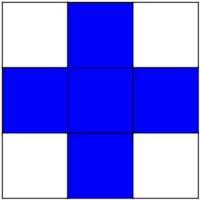

.. for doctests
   >>> import numpy as np
   >>> np.random.seed(0)
   >>> import matplotlib.pyplot as plt
   >>> plt.switch_backend("Agg")

.. _basic_image:

=======================================================
Image manipulation and processing using Numpy and Scipy
=======================================================

**Authors**: *Emmanuelle Gouillart, Gaël Varoquaux*

This section addresses basic image manipulation and processing using the
core scientific modules NumPy and SciPy. Some of the operations covered
by this tutorial may be useful for other kinds of multidimensional array
processing than image processing. In particular, the submodule
:mod:`scipy.ndimage` provides functions operating on n-dimensional NumPy
arrays.

.. seealso::

    For more advanced image processing and image-specific routines, see the
    tutorial :ref:`scikit_image`, dedicated to the :mod:`skimage` module.

.. topic::
    Image = 2-D numerical array

    (or 3-D: CT, MRI, 2D + time; 4-D, ...)

    Here, **image == Numpy array** ``np.array``

**Tools used in this tutorial**:

* ``numpy``: basic array manipulation

* ``scipy``: ``scipy.ndimage`` submodule dedicated to image processing
  (n-dimensional images). See the `documentation
  <http://docs.scipy.org/doc/scipy/reference/tutorial/ndimage.html>`_::

    >>> from scipy import ndimage

**Common tasks in image processing**:

* Input/Output, displaying images

* Basic manipulations: cropping, flipping, rotating, ...

* Image filtering: denoising, sharpening

* Image segmentation: labeling pixels corresponding to different objects

* Classification

* Feature extraction

* Registration

* ...

.. contents:: Chapters contents
   :local:
   :depth: 4

Opening and writing to image files
==================================

Writing an array to a file:

.. literalinclude:: examples/plot_face.py
   :lines: 8-

.. image:: examples/face.png
    :align: center
    :scale: 50

Creating a numpy array from an image file::

    >>> from scipy import misc
    >>> face = misc.face()
    >>> misc.imsave('face.png', face) # First we need to create the PNG file
    
    >>> face = misc.imread('face.png')
    >>> type(face)      # doctest: +ELLIPSIS
    <... 'numpy.ndarray'>
    >>> face.shape, face.dtype
    ((768, 1024, 3), dtype('uint8'))

dtype is uint8 for 8-bit images (0-255)

Opening raw files (camera, 3-D images) ::

    >>> face.tofile('face.raw') # Create raw file
    >>> face_from_raw = np.fromfile('face.raw', dtype=np.uint8)
    >>> face_from_raw.shape
    (2359296,)
    >>> face_from_raw.shape = (768, 1024, 3)

Need to know the shape and dtype of the image (how to separate data
bytes).

For large data, use ``np.memmap`` for memory mapping::

    >>> face_memmap = np.memmap('face.raw', dtype=np.uint8, shape=(768, 1024, 3))

(data are read from the file, and not loaded into memory)

Working on a list of image files ::

    >>> for i in range(10):
    ...     im = np.random.random_integers(0, 255, 10000).reshape((100, 100))
    ...     misc.imsave('random_%02d.png' % i, im)
    >>> from glob import glob
    >>> filelist = glob('random*.png')
    >>> filelist.sort()

Displaying images
=================

Use ``matplotlib`` and ``imshow`` to display an image inside a
``matplotlib figure``::

    >>> f = misc.face(gray=True)  # retrieve a grayscale image
    >>> import matplotlib.pyplot as plt
    >>> plt.imshow(f, cmap=plt.cm.gray)        # doctest: +ELLIPSIS
    <matplotlib.image.AxesImage object at 0x...>

Increase contrast by setting min and max values::

    >>> plt.imshow(f, cmap=plt.cm.gray, vmin=30, vmax=200)        # doctest: +ELLIPSIS
    <matplotlib.image.AxesImage object at 0x...>
    >>> # Remove axes and ticks
    >>> plt.axis('off')
    (-0.5, 1023.5, 767.5, -0.5)

Draw contour lines::

    >>> plt.contour(f, [50, 200])        # doctest: +ELLIPSIS
    <matplotlib.contour.QuadContourSet ...>

.. figure:: auto_examples/images/sphx_glr_plot_display_face_001.png
    :scale: 80
    :target: auto_examples/plot_display_face.html

.. only:: html

    [:ref:`Python source code <example_plot_display_face.py>`]

For fine inspection of intensity variations, use
``interpolation='nearest'``::

    >>> plt.imshow(f[320:340, 510:530], cmap=plt.cm.gray)        # doctest: +ELLIPSIS
    <matplotlib.image.AxesImage object at 0x...>
    >>> plt.imshow(f[320:340, 510:530], cmap=plt.cm.gray, interpolation='nearest')        # doctest: +ELLIPSIS
    <matplotlib.image.AxesImage object at 0x...>

.. figure:: auto_examples/images/sphx_glr_plot_interpolation_face_001.png
    :scale: 80
    :target: auto_examples/plot_interpolation_face.html

.. only:: html

    [:ref:`Python source code <example_plot_interpolation_face.py>`]

.. seealso:: 3-D visualization: Mayavi

    See :ref:`mayavi-label`.

	* Image plane widgets

	* Isosurfaces

	* ...

.. image:: ../../packages/3d_plotting/decorations.png
    :align: center
    :scale: 65

Basic manipulations
===================

Images are arrays: use the whole ``numpy`` machinery.

.. image:: axis_convention.png
    :align: center
    :scale: 65

::

    >>> face = misc.face(gray=True)
    >>> face[0, 40]
    127
    >>> # Slicing
    >>> face[10:13, 20:23]
    array([[141, 153, 145],
           [133, 134, 125],
           [ 96,  92,  94]], dtype=uint8)
    >>> face[100:120] = 255
    >>>
    >>> lx, ly = face.shape
    >>> X, Y = np.ogrid[0:lx, 0:ly]
    >>> mask = (X - lx / 2) ** 2 + (Y - ly / 2) ** 2 > lx * ly / 4
    >>> # Masks
    >>> face[mask] = 0
    >>> # Fancy indexing
    >>> face[range(400), range(400)] = 255

.. figure:: auto_examples/images/sphx_glr_plot_numpy_array_001.png
    :scale: 100
    :target: auto_examples/plot_numpy_array.html

.. only:: html

    [:ref:`Python source code <example_plot_numpy_array.py>`]

Statistical information
-----------------------

::

    >>> face = misc.face(gray=True)
    >>> face.mean()
    113.48026784261067
    >>> face.max(), face.min()
    (250, 0)

``np.histogram``

.. topic:: **Exercise**
    :class: green
    

    * Open as an array the ``scikit-image`` logo
      (http://scikit-image.org/_static/img/logo.png), or an
      image that you have on your computer.

    * Crop a meaningful part of the image, for example the python circle
      in the logo.

    * Display the image array using ``matplotlib``. Change the
      interpolation method and zoom to see the difference.

    * Transform your image to greyscale

    * Increase the contrast of the image by changing its minimum and
      maximum values. **Optional**: use ``scipy.stats.scoreatpercentile``
      (read the docstring!) to saturate 5% of the darkest pixels and 5%
      of the lightest pixels.

    * Save the array to two different file formats (png, jpg, tiff)

    .. image:: scikit_image_logo.png
        :align: center

Geometrical transformations
---------------------------
::

    >>> face = misc.face(gray=True)
    >>> lx, ly = face.shape
    >>> # Cropping
    >>> crop_face = face[lx / 4: - lx / 4, ly / 4: - ly / 4]
    >>> # up <-> down flip
    >>> flip_ud_face = np.flipud(face)
    >>> # rotation
    >>> rotate_face = ndimage.rotate(face, 45)
    >>> rotate_face_noreshape = ndimage.rotate(face, 45, reshape=False)

.. figure:: auto_examples/images/sphx_glr_plot_geom_face_001.png
    :scale: 65
    :target: auto_examples/plot_geom_face.html

.. only:: html

    [:ref:`Python source code <example_plot_geom_face.py>`]

Image filtering
===============

**Local filters**: replace the value of pixels by a function of the values of
neighboring pixels.

Neighbourhood: square (choose size), disk, or more complicated *structuring
element*.

.. figure:: kernels.png
    :align: center
    :scale: 90

Blurring/smoothing
------------------

**Gaussian filter** from ``scipy.ndimage``::

    >>> from scipy import misc
    >>> face = misc.face(gray=True)
    >>> blurred_face = ndimage.gaussian_filter(face, sigma=3)
    >>> very_blurred = ndimage.gaussian_filter(face, sigma=5)

**Uniform filter** ::

    >>> local_mean = ndimage.uniform_filter(face, size=11)

.. figure:: auto_examples/images/sphx_glr_plot_blur_001.png
    :scale: 90
    :target: auto_examples/plot_blur.html

.. only:: html

    [:ref:`Python source code <example_plot_blur.py>`]

Sharpening
----------

Sharpen a blurred image::

    >>> from scipy import misc
    >>> face = misc.face(gray=True).astype(float)
    >>> blurred_f = ndimage.gaussian_filter(face, 3)

increase the weight of edges by adding an approximation of the
Laplacian::

    >>> filter_blurred_f = ndimage.gaussian_filter(blurred_f, 1)
    >>> alpha = 30
    >>> sharpened = blurred_f + alpha * (blurred_f - filter_blurred_f)

.. figure:: auto_examples/images/sphx_glr_plot_sharpen_001.png
    :scale: 65
    :target: auto_examples/plot_sharpen.html

.. only:: html

    [:ref:`Python source code <example_plot_sharpen.py>`]

Denoising
---------

Noisy face::

    >>> from scipy import misc
    >>> f = misc.face(gray=True)
    >>> f = f[230:290, 220:320]
    >>> noisy = f + 0.4 * f.std() * np.random.random(f.shape)

A **Gaussian filter** smoothes the noise out... and the edges as well::

    >>> gauss_denoised = ndimage.gaussian_filter(noisy, 2)

Most local linear isotropic filters blur the image (``ndimage.uniform_filter``)

A **median filter** preserves better the edges::

    >>> med_denoised = ndimage.median_filter(noisy, 3)

.. figure:: auto_examples/images/sphx_glr_plot_face_denoise_001.png
    :scale: 60
    :target: auto_examples/plot_face_denoise.html

.. only:: html

    [:ref:`Python source code <example_plot_face_denoise.py>`]

Median filter: better result for straight boundaries (**low curvature**)::

    >>> im = np.zeros((20, 20))
    >>> im[5:-5, 5:-5] = 1
    >>> im = ndimage.distance_transform_bf(im)
    >>> im_noise = im + 0.2 * np.random.randn(*im.shape)
    >>> im_med = ndimage.median_filter(im_noise, 3)

.. figure:: auto_examples/images/sphx_glr_plot_denoising_001.png
    :scale: 50
    :target: auto_examples/plot_denoising.html

.. only:: html

    [:ref:`Python source code <example_plot_denoising.py>`]

Other rank filter: ``ndimage.maximum_filter``,
``ndimage.percentile_filter``

Other local non-linear filters: Wiener (``scipy.signal.wiener``), etc.

**Non-local filters**

.. topic:: **Exercise: denoising**
    :class: green
    
    * Create a binary image (of 0s and 1s) with several objects (circles,
      ellipses, squares, or random shapes).

    * Add some noise (e.g., 20% of noise)

    * Try two different denoising methods for denoising the image:
      gaussian filtering and median filtering.

    * Compare the histograms of the two different denoised images.
      Which one is the closest to the histogram of the original (noise-free)
      image?

.. seealso::

    More denoising filters are available in :mod:`skimage.denoising`,
    see the :ref:`scikit_image` tutorial.

Mathematical morphology
-----------------------

See `wikipedia <https://en.wikipedia.org/wiki/Mathematical_morphology>`_
for a definition of mathematical morphology.

Probe an image with a simple shape (a **structuring element**), and
modify this image according to how the shape locally fits or misses the
image.

**Structuring element**::

    >>> el = ndimage.generate_binary_structure(2, 1)
    >>> el
    array([[False,  True, False],
           [ True,  True,  True],
           [False,  True, False]], dtype=bool)
    >>> el.astype(np.int)
    array([[0, 1, 0],
           [1, 1, 1],
           [0, 1, 0]])

**Erosion** = minimum filter. Replace the value of a pixel by the minimal value covered by the structuring element.::

    >>> a = np.zeros((7,7), dtype=np.int)
    >>> a[1:6, 2:5] = 1
    >>> a
    array([[0, 0, 0, 0, 0, 0, 0],
           [0, 0, 1, 1, 1, 0, 0],
           [0, 0, 1, 1, 1, 0, 0],
           [0, 0, 1, 1, 1, 0, 0],
           [0, 0, 1, 1, 1, 0, 0],
           [0, 0, 1, 1, 1, 0, 0],
           [0, 0, 0, 0, 0, 0, 0]])
    >>> ndimage.binary_erosion(a).astype(a.dtype)
    array([[0, 0, 0, 0, 0, 0, 0],
           [0, 0, 0, 0, 0, 0, 0],
           [0, 0, 0, 1, 0, 0, 0],
           [0, 0, 0, 1, 0, 0, 0],
           [0, 0, 0, 1, 0, 0, 0],
           [0, 0, 0, 0, 0, 0, 0],
           [0, 0, 0, 0, 0, 0, 0]])
    >>> #Erosion removes objects smaller than the structure
    >>> ndimage.binary_erosion(a, structure=np.ones((5,5))).astype(a.dtype)
    array([[0, 0, 0, 0, 0, 0, 0],
           [0, 0, 0, 0, 0, 0, 0],
           [0, 0, 0, 0, 0, 0, 0],
           [0, 0, 0, 0, 0, 0, 0],
           [0, 0, 0, 0, 0, 0, 0],
           [0, 0, 0, 0, 0, 0, 0],
           [0, 0, 0, 0, 0, 0, 0]])

.. image:: morpho_mat.png
    :align: center

**Dilation**: maximum filter::

    >>> a = np.zeros((5, 5))
    >>> a[2, 2] = 1
    >>> a
    array([[ 0.,  0.,  0.,  0.,  0.],
           [ 0.,  0.,  0.,  0.,  0.],
           [ 0.,  0.,  1.,  0.,  0.],
           [ 0.,  0.,  0.,  0.,  0.],
           [ 0.,  0.,  0.,  0.,  0.]])
    >>> ndimage.binary_dilation(a).astype(a.dtype)
    array([[ 0.,  0.,  0.,  0.,  0.],
           [ 0.,  0.,  1.,  0.,  0.],
           [ 0.,  1.,  1.,  1.,  0.],
           [ 0.,  0.,  1.,  0.,  0.],
           [ 0.,  0.,  0.,  0.,  0.]])

Also works for grey-valued images::

    >>> np.random.seed(2)
    >>> im = np.zeros((64, 64))
    >>> x, y = (63*np.random.random((2, 8))).astype(np.int)
    >>> im[x, y] = np.arange(8)

    >>> bigger_points = ndimage.grey_dilation(im, size=(5, 5), structure=np.ones((5, 5)))

    >>> square = np.zeros((16, 16))
    >>> square[4:-4, 4:-4] = 1
    >>> dist = ndimage.distance_transform_bf(square)
    >>> dilate_dist = ndimage.grey_dilation(dist, size=(3, 3), \
    ...         structure=np.ones((3, 3)))

.. figure:: auto_examples/images/sphx_glr_plot_greyscale_dilation_001.png
    :scale: 40
    :target: auto_examples/plot_greyscale_dilation.html

.. only:: html

    [:ref:`Python source code <example_plot_greyscale_dilation.py>`]

**Opening**: erosion + dilation::

    >>> a = np.zeros((5,5), dtype=np.int)
    >>> a[1:4, 1:4] = 1; a[4, 4] = 1
    >>> a
    array([[0, 0, 0, 0, 0],
           [0, 1, 1, 1, 0],
           [0, 1, 1, 1, 0],
           [0, 1, 1, 1, 0],
           [0, 0, 0, 0, 1]])
    >>> # Opening removes small objects
    >>> ndimage.binary_opening(a, structure=np.ones((3,3))).astype(np.int)
    array([[0, 0, 0, 0, 0],
           [0, 1, 1, 1, 0],
           [0, 1, 1, 1, 0],
           [0, 1, 1, 1, 0],
           [0, 0, 0, 0, 0]])
    >>> # Opening can also smooth corners
    >>> ndimage.binary_opening(a).astype(np.int)
    array([[0, 0, 0, 0, 0],
           [0, 0, 1, 0, 0],
           [0, 1, 1, 1, 0],
           [0, 0, 1, 0, 0],
           [0, 0, 0, 0, 0]])

**Application**: remove noise::

    >>> square = np.zeros((32, 32))
    >>> square[10:-10, 10:-10] = 1
    >>> np.random.seed(2)
    >>> x, y = (32*np.random.random((2, 20))).astype(np.int)
    >>> square[x, y] = 1

    >>> open_square = ndimage.binary_opening(square)

    >>> eroded_square = ndimage.binary_erosion(square)
    >>> reconstruction = ndimage.binary_propagation(eroded_square, mask=square)

.. figure:: auto_examples/images/sphx_glr_plot_propagation_001.png
    :scale: 40
    :target: auto_examples/plot_propagation.html

.. only:: html

    [:ref:`Python source code <example_plot_propagation.py>`]

**Closing**: dilation + erosion

Many other mathematical morphology operations: hit and miss transform, tophat,
etc.

Feature extraction
==================

Edge detection
--------------

Synthetic data::

    >>> im = np.zeros((256, 256))
    >>> im[64:-64, 64:-64] = 1
    >>>
    >>> im = ndimage.rotate(im, 15, mode='constant')
    >>> im = ndimage.gaussian_filter(im, 8)

Use a **gradient operator** (**Sobel**) to find high intensity variations::

    >>> sx = ndimage.sobel(im, axis=0, mode='constant')
    >>> sy = ndimage.sobel(im, axis=1, mode='constant')
    >>> sob = np.hypot(sx, sy)

.. figure:: auto_examples/images/sphx_glr_plot_find_edges_001.png
    :scale: 40
    :target: auto_examples/plot_find_edges.html

.. only:: html

    [:ref:`Python source code <example_plot_find_edges.py>`]

Segmentation
------------

* **Histogram-based** segmentation (no spatial information)

::

    >>> n = 10
    >>> l = 256
    >>> im = np.zeros((l, l))
    >>> np.random.seed(1)
    >>> points = l*np.random.random((2, n**2))
    >>> im[(points[0]).astype(np.int), (points[1]).astype(np.int)] = 1
    >>> im = ndimage.gaussian_filter(im, sigma=l/(4.*n))

    >>> mask = (im > im.mean()).astype(np.float)
    >>> mask += 0.1 * im
    >>> img = mask + 0.2*np.random.randn(*mask.shape)

    >>> hist, bin_edges = np.histogram(img, bins=60)
    >>> bin_centers = 0.5*(bin_edges[:-1] + bin_edges[1:])

    >>> binary_img = img > 0.5

.. figure:: auto_examples/images/sphx_glr_plot_histo_segmentation_001.png
    :scale: 65
    :target: auto_examples/plot_histo_segmentation.html

.. only:: html

    [:ref:`Python source code <example_plot_histo_segmentation.py>`]

Use mathematical morphology to clean up the result::

    >>> # Remove small white regions
    >>> open_img = ndimage.binary_opening(binary_img)
    >>> # Remove small black hole
    >>> close_img = ndimage.binary_closing(open_img)

.. figure:: auto_examples/images/sphx_glr_plot_clean_morpho_001.png
    :scale: 65
    :target: auto_examples/plot_clean_morpho.html

.. only:: html

    [:ref:`Python source code <example_plot_clean_morpho.py>`]

.. topic:: **Exercise**
    :class: green

    Check that reconstruction operations (erosion + propagation) produce a
    better result than opening/closing::

	>>> eroded_img = ndimage.binary_erosion(binary_img)
	>>> reconstruct_img = ndimage.binary_propagation(eroded_img, mask=binary_img)
	>>> tmp = np.logical_not(reconstruct_img)
	>>> eroded_tmp = ndimage.binary_erosion(tmp)
	>>> reconstruct_final = np.logical_not(ndimage.binary_propagation(eroded_tmp, mask=tmp))
	>>> np.abs(mask - close_img).mean() # doctest: +ELLIPSIS
	0.00727836...
	>>> np.abs(mask - reconstruct_final).mean() # doctest: +ELLIPSIS
	0.00059502...

.. topic:: **Exercise**
    :class: green

    Check how a first denoising step (e.g. with a median filter)
    modifies the histogram, and check that the resulting histogram-based
    segmentation is more accurate.

.. seealso::

    More advanced segmentation algorithms are found in the
    ``scikit-image``: see :ref:`scikit_image`.

.. seealso::

    Other Scientific Packages provide algorithms that can be useful for
    image processing. In this example, we use the spectral clustering 
    function of the ``scikit-learn`` in order to segment glued objects.

    ::

        >>> from sklearn.feature_extraction import image
        >>> from sklearn.cluster import spectral_clustering

        >>> l = 100
        >>> x, y = np.indices((l, l))

        >>> center1 = (28, 24)
        >>> center2 = (40, 50)
        >>> center3 = (67, 58)
        >>> center4 = (24, 70)
        >>> radius1, radius2, radius3, radius4 = 16, 14, 15, 14

        >>> circle1 = (x - center1[0])**2 + (y - center1[1])**2 < radius1**2
        >>> circle2 = (x - center2[0])**2 + (y - center2[1])**2 < radius2**2
        >>> circle3 = (x - center3[0])**2 + (y - center3[1])**2 < radius3**2
        >>> circle4 = (x - center4[0])**2 + (y - center4[1])**2 < radius4**2

        >>> # 4 circles
        >>> img = circle1 + circle2 + circle3 + circle4
        >>> mask = img.astype(bool)
        >>> img = img.astype(float)

        >>> img += 1 + 0.2*np.random.randn(*img.shape)
        >>> # Convert the image into a graph with the value of the gradient on
        >>> # the edges.
        >>> graph = image.img_to_graph(img, mask=mask)

        >>> # Take a decreasing function of the gradient: we take it weakly
        >>> # dependant from the gradient the segmentation is close to a voronoi
        >>> graph.data = np.exp(-graph.data/graph.data.std())

        >>> labels = spectral_clustering(graph, n_clusters=4, eigen_solver='arpack')
        >>> label_im = -np.ones(mask.shape)
        >>> label_im[mask] = labels

    .. image:: image_spectral_clustering.png
        :align: center

Measuring objects properties: ``ndimage.measurements``
========================================================

Synthetic data::

    >>> n = 10
    >>> l = 256
    >>> im = np.zeros((l, l))
    >>> points = l*np.random.random((2, n**2))
    >>> im[(points[0]).astype(np.int), (points[1]).astype(np.int)] = 1
    >>> im = ndimage.gaussian_filter(im, sigma=l/(4.*n))
    >>> mask = im > im.mean()

* **Analysis of connected components**

Label connected components: ``ndimage.label``::

    >>> label_im, nb_labels = ndimage.label(mask)
    >>> nb_labels # how many regions?
    16
    >>> plt.imshow(label_im)        # doctest: +ELLIPSIS
    <matplotlib.image.AxesImage object at 0x...>

.. figure:: auto_examples/images/sphx_glr_plot_synthetic_data_001.png
    :scale: 90
    :target: auto_examples/plot_synthetic_data.html

.. only:: html

    [:ref:`Python source code <example_plot_synthetic_data.py>`]

Compute size, mean_value, etc. of each region::

    >>> sizes = ndimage.sum(mask, label_im, range(nb_labels + 1))
    >>> mean_vals = ndimage.sum(im, label_im, range(1, nb_labels + 1))

Clean up small connect components::

    >>> mask_size = sizes < 1000
    >>> remove_pixel = mask_size[label_im]
    >>> remove_pixel.shape
    (256, 256)
    >>> label_im[remove_pixel] = 0
    >>> plt.imshow(label_im)        # doctest: +ELLIPSIS
    <matplotlib.image.AxesImage object at 0x...>

Now reassign labels with ``np.searchsorted``::

    >>> labels = np.unique(label_im)
    >>> label_im = np.searchsorted(labels, label_im)

.. figure:: auto_examples/images/sphx_glr_plot_measure_data_001.png
    :scale: 90
    :target: auto_examples/plot_measure_data.html

.. only:: html

    [:ref:`Python source code <example_plot_measure_data.py>`]

Find region of interest enclosing object::

    >>> slice_x, slice_y = ndimage.find_objects(label_im==4)[0]
    >>> roi = im[slice_x, slice_y]
    >>> plt.imshow(roi)     # doctest: +ELLIPSIS
    <matplotlib.image.AxesImage object at 0x...>

.. figure:: auto_examples/images/sphx_glr_plot_find_object_001.png
    :scale: 130
    :target: auto_examples/plot_find_object.html

.. only:: html

    [:ref:`Python source code <example_plot_find_object.py>`]

Other spatial measures: ``ndimage.center_of_mass``,
``ndimage.maximum_position``, etc.

Can be used outside the limited scope of segmentation applications.

Example: block mean::

    >>> from scipy import misc
    >>> f = misc.face(gray=True)
    >>> sx, sy = f.shape
    >>> X, Y = np.ogrid[0:sx, 0:sy]
    >>> regions = (sy//6) * (X//4) + (Y//6)  # note that we use broadcasting
    >>> block_mean = ndimage.mean(f, labels=regions, index=np.arange(1,
    ...     regions.max() +1))
    >>> block_mean.shape = (sx // 4, sy // 6)

.. figure:: auto_examples/images/sphx_glr_plot_block_mean_001.png
    :scale: 70
    :target: auto_examples/plot_block_mean.html

.. only:: html

    [:ref:`Python source code <example_plot_block_mean.py>`]

When regions are regular blocks, it is more efficient to use stride
tricks (:ref:`stride-manipulation-label`).

Non-regularly-spaced blocks: radial mean::

    >>> sx, sy = f.shape
    >>> X, Y = np.ogrid[0:sx, 0:sy]
    >>> r = np.hypot(X - sx/2, Y - sy/2)
    >>> rbin = (20* r/r.max()).astype(np.int)
    >>> radial_mean = ndimage.mean(f, labels=rbin, index=np.arange(1, rbin.max() +1))

.. figure:: auto_examples/images/sphx_glr_plot_radial_mean_001.png
    :scale: 70
    :target: auto_examples/plot_radial_mean.html

.. only:: html

    [:ref:`Python source code <example_plot_radial_mean.py>`]

* **Other measures**

Correlation function, Fourier/wavelet spectrum, etc.

One example with mathematical morphology: `granulometry
<https://en.wikipedia.org/wiki/Granulometry_%28morphology%29>`_

::

    >>> def disk_structure(n):
    ...     struct = np.zeros((2 * n + 1, 2 * n + 1))
    ...     x, y = np.indices((2 * n + 1, 2 * n + 1))
    ...     mask = (x - n)**2 + (y - n)**2 <= n**2
    ...     struct[mask] = 1
    ...     return struct.astype(np.bool)
    ...
    >>>
    >>> def granulometry(data, sizes=None):
    ...     s = max(data.shape)
    ...     if sizes == None:
    ...         sizes = range(1, s/2, 2)
    ...     granulo = [ndimage.binary_opening(data, \
    ...         structure=disk_structure(n)).sum() for n in sizes]
    ...     return granulo
    ...
    >>>
    >>> np.random.seed(1)
    >>> n = 10
    >>> l = 256
    >>> im = np.zeros((l, l))
    >>> points = l*np.random.random((2, n**2))
    >>> im[(points[0]).astype(np.int), (points[1]).astype(np.int)] = 1
    >>> im = ndimage.gaussian_filter(im, sigma=l/(4.*n))
    >>>
    >>> mask = im > im.mean()
    >>>
    >>> granulo = granulometry(mask, sizes=np.arange(2, 19, 4))

.. figure:: auto_examples/images/sphx_glr_plot_granulo_001.png
    :scale: 100
    :target: auto_examples/plot_granulo.html

.. only:: html

    [:ref:`Python source code <example_plot_granulo.py>`]

|

.. seealso:: More on image-processing:

   * The chapter on :ref:`Scikit-image <scikit_image>`
   
   * Other, more powerful and complete modules: `OpenCV
     <https://opencv-python-tutroals.readthedocs.org/en/latest>`_
     (Python bindings), `CellProfiler <http://www.cellprofiler.org>`_,
     `ITK <http://www.itk.org/>`_ with Python bindings

