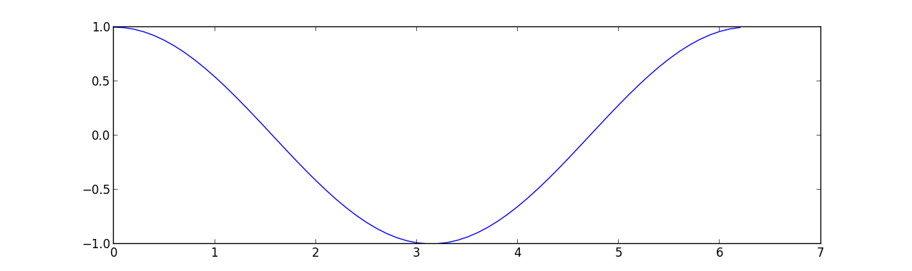

==================
Interfacing with C
==================

:author: Valentin Haenel

.. TODO::

   * Download links
   * Timing?
   * Additional documentation
   * What about overflow?

.. topic:: Foreword

This chapter contains an *introduction* to the many different routes for making
your native code (primarliy ``C/C++``) available from Python, a process
commonly referred to *wrapping*. The goal of this chapter is to give you a
flavour of what technologies exist and what their respective merits and
shortcomings are, so that you can select the appropriate one for your specific
needs. In any case, once you do start wrapping, you almost certainly will want
to consult the respective documentation for your selected technique.

.. contents:: Chapters contents
   :local:
   :depth: 1

Introduction
============

This chapter covers the following techniques:

* `Python-C-Api <http://docs.python.org/2/c-api/>`_
* `Ctypes <http://docs.python.org/2/library/ctypes.html>`_
* `SWIG (Simplified Wrapper and Interface Generator) <http://www.swig.org/>`_
* `Cython <http://cython.org/>`_

These four techniques are perhaps the most well known ones, of which Cython is
probably the most advanced one and the one you should consider using first. The
others are also important, if you want to understand the wrapping problem from
different angles. Having said that, there are other alternatives out there,
but having understood the basics of the ones above, you will be in a position
to evaluate the technique of your choice to see if it fits your needs.

The following criteria may be useful when evaluating a technology:

* Are additional libraries required?
* Is the code autogenerated?
* Does it need to be compiled?
* Is there good support for interacting with Numpy arrays?
* Does it support C++?

Before you set out, you should consider your use case. When interfacing with
native code, there are usually two use-cases that come up:

* Existing code in C/C++ that needs to be leveraged, either because it already
  exists, or because it is faster.
* Python code too slow, push inner loops to native code

Each technology is demonstrated by wrapping the ``cos`` function from
``math.h``. While this is a mostly a trivial example, it should serve us well
to demonstrate the basics of the wrapping solution. Since each technique also
includes some form of Numpy support, this is also demonstrated using an
example where the cosine is computed on some kind of array.

Last but not least, two small warnings:

* All of these techniques may crash (segmentation fault) the Python
  interpreter, which is (usually) due to bugs in the C code.
* All the examples have been done on Linux, they *should* be possible on other
  operating systems.
* You will need a C compiler for most of the examples.

Python-C-Api
============

The `Python-C-API <http://docs.python.org/2/c-api/>`_ is the backbone of the
standard Python interpreter (a.k.a *CPython*). Using this API it is possible to
write Python extension module in C and C++. Obviously, these extension modules
can, by virtue of language compatibility, call any function written in C or
C++.

When using the Python-C-API, one usually writes much boilerplate code, first to
parse the arguments that were given to a function, and later to construct the
return type.

**Advantages**

* Requires no additional libraries
* Lots of low-level control
* Entirely usable from C++

**Disadvantages**

* May requires a substantial amount of effort
* Much overhead in the code
* Must be compiled
* High maintenance cost
* No forward compatibility across Python versions as C-Api changes

.. note::

   The Python-C-Api example here serves mainly for didactic reasons. Many of
   the other techniques actually depend on this, so it is good to have a
   high-level understanding of how it works. In 99% of the use-cases you will
   be better off, using an alternative technique.

Example
-------

The following C-extension module, make the ``cos`` function from the standard
math library available to Python:

.. literalinclude:: python_c_api/cos_module.c
   :language: c

As you can see, there is much boilerplate, both to «massage» the arguments and
return types into place and for the module initialisation. Although some of
this is amortised, as the extension grows, the boilerplate required for each
function(s) remains.

The standard python build system ``distutils`` supports compiling C-extensions
from a ``setup.py``, which is rather convenient:

.. literalinclude:: python_c_api/setup.py
   :language: python

This can be compiled:

.. sourcecode:: console

    $ cd advanced/interfacing_with_c/python_c_api

    $ ls
    cos_module.c  setup.py

    $ python setup.py build_ext --inplace
    running build_ext
    building 'cos_module' extension
    creating build
    creating build/temp.linux-x86_64-2.7
    gcc -pthread -fno-strict-aliasing -g -O2 -DNDEBUG -g -fwrapv -O3 -Wall -Wstrict-prototypes -fPIC -I/home/esc/anaconda/include/python2.7 -c cos_module.c -o build/temp.linux-x86_64-2.7/cos_module.o
    gcc -pthread -shared build/temp.linux-x86_64-2.7/cos_module.o -L/home/esc/anaconda/lib -lpython2.7 -o /home/esc/git-working/scipy-lecture-notes/advanced/interfacing_with_c/python_c_api/cos_module.so

    $ ls
    build/  cos_module.c  cos_module.so  setup.py

* ``build_ext`` is to build extension modules
* ``--inplace`` will output the compiled extension module into the current directory

The file ``cos_module.so`` contains the compiled extension, which we can now load in the IPython interpreter:

.. sourcecode:: ipython

    In [1]: import cos_module

    In [2]: cos_module?
    Type:       module
    String Form:<module 'cos_module' from 'cos_module.so'>
    File:       /home/esc/git-working/scipy-lecture-notes/advanced/interfacing_with_c/python_c_api/cos_module.so
    Docstring:  <no docstring>

    In [3]: dir(cos_module)
    Out[3]: ['__doc__', '__file__', '__name__', '__package__', 'cos_func']

    In [4]: cos_module.cos_func(1.0)
    Out[4]: 0.5403023058681398

    In [5]: cos_module.cos_func(0.0)
    Out[5]: 1.0

    In [6]: cos_module.cos_func(3.14159265359)
    Out[7]: -1.0

Now let's see how robust this is:

.. sourcecode:: ipython

    In [10]: cos_module.cos_func('foo')
    ---------------------------------------------------------------------------
    TypeError                                 Traceback (most recent call last)
    <ipython-input-10-11bee483665d> in <module>()
    ----> 1 cos_module.cos_func('foo')

    TypeError: a float is required

Numpy Support
-------------

Analog to the Python-C-API, Numpy, which is itself implemented as a
C-extension, comes with the `Numpy-C-API
<http://docs.scipy.org/doc/numpy/reference/c-api.html>`_. This API can be used
to create and manipulate Numpy arrays from C, when writing a custom
C-extension. See also: :ref:`advanced_numpy`_.

The following example shows how to pass Numpy arrays as arguments to functions
and how to iterate over Numpy arrays using the (old) Numpy-C-Api. It simply
takes an array as argument applies the cosine function from the ``math.h`` and
returns a resulting new array.

.. literalinclude:: numpy_c_api/cos_module_np.c
   :language: c

To compile this we can use distutils again. However we need to be sure to
include the Numpy headers by using :func:`numpy.get_include`.

.. literalinclude:: numpy_c_api/setup.py
   :language: python

To convince ourselves if this does actually works, we run the following test
script:

.. literalinclude:: numpy_c_api/test_cos_module_np.py
   :language: numpy

And this should result in the following figure:

Ctypes
======

`Ctypes <http://docs.python.org/2/library/ctypes.html>`_ is a *foreign
function library* for Python. It provides C compatible data types, and allows
calling functions in DLLs or shared libraries. It can be used to wrap these
libraries in pure Python.

**Advantages**

* Part of the Python standard library
* Does not need to be compiled
* Wrapping code entirely in Python

**Disadvantages**

* Requires code to be wrapped to be available as a shared library
  (roughly speaking ``*.dll`` in Windows ``*.so`` in Linux and ``*.dylib`` in Mac OSX.)
* No good support for C++

Example
-------

As advertised, the wrapper code is in pure Python.

.. literalinclude:: ctypes/cos_module.py
   :language: python

* Finding and loading the library may vary depending on your operating system,
  check `the documentation
  <http://docs.python.org/2/library/ctypes.html#loading-dynamic-link-libraries>`_
  for details
* This may be somewhat deceptive, since the math library exists in compiled
  form on the system already. If you were to wrap a in-house library, you would
  have to compile it first, which may or may not require some additional effort.

We may now use this, as before:

.. sourcecode:: ipython

    In [1]: import cos_module

    In [2]: cos_module?
    Type:       module
    String Form:<module 'cos_module' from 'cos_module.py'>
    File:       /home/esc/git-working/scipy-lecture-notes/advanced/interfacing_with_c/ctypes/cos_module.py
    Docstring:  <no docstring>

    In [3]: dir(cos_module)
    Out[3]:
    ['__builtins__',
     '__doc__',
     '__file__',
     '__name__',
     '__package__',
     'cos_func',
     'ctypes',
     'find_library',
     'libm']

    In [4]: cos_module.cos_func(1.0)
    Out[4]: 0.5403023058681398

    In [5]: cos_module.cos_func(0.0)
    Out[5]: 1.0

    In [6]: cos_module.cos_func(3.14159265359)
    Out[6]: -1.0

As with the previous example, this code is somewhat robust, although the error
message is not quite as helpful, since it does not tell us what the type should be.

.. sourcecode:: ipython

    In [7]: cos_module.cos_func('foo')
    ---------------------------------------------------------------------------
    ArgumentError                             Traceback (most recent call last)
    <ipython-input-7-11bee483665d> in <module>()
    ----> 1 cos_module.cos_func('foo')

    /home/esc/git-working/scipy-lecture-notes/advanced/interfacing_with_c/ctypes/cos_module.py in cos_func(arg)
         12 def cos_func(arg):
         13     ''' Wrapper for cos from math.h '''
    ---> 14     return libm.cos(arg)

    ArgumentError: argument 1: <type 'exceptions.TypeError'>: wrong type

Numpy Support
-------------

Numpy contains some support for interfacing with ctypes. In particular there is
support for exporting certain attributes of a Numpy array as ctypes data-types
and there are functions to convert from C arrays to Numpy arrays and back.

.. XXX Should use :mod: and :class:

For more information, consult the corresponding section in the `Numpy Cookbook
<http://www.scipy.org/Cookbook/Ctypes>`_ and the API documentation for
`numpy.ndarray.ctypes <http://docs.scipy.org/doc/numpy/reference/generated/numpy.ndarray.ctypes.html>`_
and `numpy.ctypeslib <http://docs.scipy.org/doc/numpy/reference/routines.ctypeslib.html>`_.

For the following example, let's consider a C function in a library that takes
an input and an output array, computes the cosine of the input array and
stores the result in the output_array.

The library consists of the following header file (although this is not
strictly needed for this example, we list it for completeness):

.. literalinclude:: ctypes_numpy/cos_doubles.h
   :language: c

The function implementation resides in the following C source file:

.. literalinclude:: ctypes_numpy/cos_doubles.c
   :language: c

And since the library is pure C, we can't use ``distutils`` to compile it, but
must use a combination of ``make`` and ``gcc``:

.. literalinclude:: ctypes_numpy/makefile
   :language: make

We can then compile this (on Linux) into the shared library
``libcos_doubles.so``:

.. sourcecode:: console

   $ ls
   cos_doubles.c  cos_doubles.h  cos_doubles.py  makefile  test_cos_doubles.py
   $ make
   gcc -c -fPIC cos_doubles.c -o cos_doubles.o
   gcc -shared -Wl,-soname,libcos_doubles.so -o libcos_doubles.so cos_doubles.o
   $ ls
   cos_doubles.c  cos_doubles.o   libcos_doubles.so*  test_cos_doubles.py
   cos_doubles.h  cos_doubles.py  makefile

Now we can proceed to wrap this library via ctypes with direct support for
(certain kinds of) Numpy arrays:

.. literalinclude:: ctypes_numpy/cos_doubles.py
   :language: numpy

* Note the inherent limitation of contiguous single dimensional Numpy arrays,
  since the C functions requires this kind of buffer.
* Also note that the output array must be preallocated, for example with
  :func:`numpy.zeros` and the function will write into it's buffer.
* Although the original signature of the ``cos_doubles`` function is ``ARRAY,
  ARRAY, int`` the final ``cos_doubles_func`` takes only two Numpy arrays as
  arguments.

And, as before, we convince ourselves that it worked:

.. literalinclude:: ctypes_numpy/test_cos_doubles.py
   :language: numpy

.. image:: ctypes_numpy/test_cos_doubles.png
   :scale: 50

SWIG
====

`SWIG <http://www.swig.org/>`_, the Simplified Wrapper Interface Generator,
is a software development tool that connects programs written in C and C++
with a variety of high-level programming languages, including Python. The
important thing with SWIG is, that it can autogenerate the wrapper code for you.
While this is an advantage in terms of development time, it can also be a
burden. The generated file tend to be quite large and may not be too human
readable and the multiple levels of indirection which are a result of
the wrapping process, may be a bit tricky to understand.

.. note::

    The autogenerated C code uses the Python-C-Api.

**Advantages**

* Can automatically wrap entire libraries given the headers
* Works nicely with C++

**Disadvantages**

* Autogenerates enormous files
* Hard to debug if something goes wrong
* Steep learning curve

Example
-------

Let's imagine that our ``cos`` function lives in a ``cos_module`` which has
been written in ``c`` and consists of the source file ``cos_module.c``:

.. literalinclude:: swig/cos_module.c
    :language: c

and the header file ``cos_module.h``:

.. literalinclude:: swig/cos_module.h
    :language: c

And our goal is to expose the ``cos_func`` to Python. To achieve this with
SWIG, we must write an *interface file* which contains the instructions for SWIG.

.. literalinclude:: swig/cos_module.i
    :language: c

As you can see, not too much code is needed here. For this simple example it is
enough to simply include the header file in the interface file, to expose the
function to Python. However, SWIG does allow for more fine grained
inclusion/exclusion of functions found in header files, check the documentation
for details.

Generating the compiled wrappers is a two stage process:

#. Run the ``swig``  executable on the interface file to generate the files
   ``cos_module_wrap.c``, which is the source file for the autogenerated Python
   C-extension and ``cos_module.py``, which is the autogenerated pure python
   module.

#. Compile the ``cos_module_wrap.c`` into the ``_cos_module.so``. Luckily,
   ``distutils`` knows how to handle SWIG interface files, so that our
   ``setup.py`` is simply:

.. literalinclude:: swig/setup.py
    :language: python

.. sourcecode:: console

    $ cd advanced/interfacing_with_c/swig

    $ ls
    cos_module.c  cos_module.h  cos_module.i  setup.py

    $ python setup.py build_ext --inplace
    running build_ext
    building '_cos_module' extension
    swigging cos_module.i to cos_module_wrap.c
    swig -python -o cos_module_wrap.c cos_module.i
    creating build
    creating build/temp.linux-x86_64-2.7
    gcc -pthread -fno-strict-aliasing -g -O2 -DNDEBUG -g -fwrapv -O3 -Wall -Wstrict-prototypes -fPIC -I/home/esc/anaconda/include/python2.7 -c cos_module.c -o build/temp.linux-x86_64-2.7/cos_module.o
    gcc -pthread -fno-strict-aliasing -g -O2 -DNDEBUG -g -fwrapv -O3 -Wall -Wstrict-prototypes -fPIC -I/home/esc/anaconda/include/python2.7 -c cos_module_wrap.c -o build/temp.linux-x86_64-2.7/cos_module_wrap.o
    gcc -pthread -shared build/temp.linux-x86_64-2.7/cos_module.o build/temp.linux-x86_64-2.7/cos_module_wrap.o -L/home/esc/anaconda/lib -lpython2.7 -o /home/esc/git-working/scipy-lecture-notes/advanced/interfacing_with_c/swig/_cos_module.so

    $ ls
    build/  cos_module.c  cos_module.h  cos_module.i  cos_module.py  _cos_module.so*  cos_module_wrap.c  setup.py

We can now load and execute the ``cos_module`` as we have done in the previous examples:

.. sourcecode:: ipython

    In [1]: import cos_module

    In [2]: cos_module?
    Type:       module
    String Form:<module 'cos_module' from 'cos_module.py'>
    File:       /home/esc/git-working/scipy-lecture-notes/advanced/interfacing_with_c/swig/cos_module.py
    Docstring:  <no docstring>

    In [3]: dir(cos_module)
    Out[3]:
    ['__builtins__',
     '__doc__',
     '__file__',
     '__name__',
     '__package__',
     '_cos_module',
     '_newclass',
     '_object',
     '_swig_getattr',
     '_swig_property',
     '_swig_repr',
     '_swig_setattr',
     '_swig_setattr_nondynamic',
     'cos_func']

    In [4]: cos_module.cos_func(1.0)
    Out[4]: 0.5403023058681398

    In [5]: cos_module.cos_func(0.0)
    Out[5]: 1.0

    In [6]: cos_module.cos_func(3.14159265359)
    Out[6]: -1.0

Again we test for robustness, and we see that we get a better error message
(although, strictly speaking in Python there is no ``double`` type):

.. sourcecode:: ipython

    In [7]: cos_module.cos_func('foo')
    ---------------------------------------------------------------------------
    TypeError                                 Traceback (most recent call last)
    <ipython-input-7-11bee483665d> in <module>()
    ----> 1 cos_module.cos_func('foo')

    TypeError: in method 'cos_func', argument 1 of type 'double'

Numpy Support
-------------

Numpy provides `support for SWIG
<http://docs.scipy.org/doc/numpy/reference/swig.html>`_ with the ``numpy.i``
file. This interface file defines various so-called *typemaps* which support
conversion between Numpy arrays and C-Arrays. In the following example we will
take a quick look at how such typemaps work in practice.

We have the same ``cos_doubles`` function as in the ctypes example:

.. literalinclude:: swig_numpy/cos_doubles.h
   :language: c

.. literalinclude:: swig_numpy/cos_doubles.c
   :language: c

This is wrapped as ``cos_doubles_func`` using the following SWIG interface
file:

.. literalinclude:: swig_numpy/cos_doubles.i
   :language: c

* To use the Numpy typemaps, we need include the ``numpy.i`` file.
* Observe the call to ``import_array()`` which we encountered already in the
  Numpy-C-API example.
* Since the type maps only support the signature ``ARRAY, SIZE`` we need to
  wrap the ``cos_doubles`` as ``cos_doubles_func`` which takes two arrays
  including sizes as input.
* As opposed to the simple SWIG example, we don't include the ``cos_doubles.h``
  header, There is nothing there that we wish to expose to Python since we
  expose the functionality through ``cos_doubles_func``.

And, as before we can use distutils to wrap this:

.. literalinclude:: swig_numpy/setup.py
   :language: python

As previously, we need to use ``include_dirs`` to specify the location.

.. sourcecode:: console

    $ ls
    cos_doubles.c  cos_doubles.h  cos_doubles.i  numpy.i  setup.py  test_cos_doubles.py
    $ python setup.py build_ext -i
    running build_ext
    building '_cos_doubles' extension
    swigging cos_doubles.i to cos_doubles_wrap.c
    swig -python -o cos_doubles_wrap.c cos_doubles.i
    cos_doubles.i:24: Warning(490): Fragment 'NumPy_Backward_Compatibility' not found.
    cos_doubles.i:24: Warning(490): Fragment 'NumPy_Backward_Compatibility' not found.
    cos_doubles.i:24: Warning(490): Fragment 'NumPy_Backward_Compatibility' not found.
    creating build
    creating build/temp.linux-x86_64-2.7
    gcc -pthread -fno-strict-aliasing -g -O2 -DNDEBUG -g -fwrapv -O3 -Wall -Wstrict-prototypes -fPIC -I/home/esc/anaconda/lib/python2.7/site-packages/numpy/core/include -I/home/esc/anaconda/include/python2.7 -c cos_doubles.c -o build/temp.linux-x86_64-2.7/cos_doubles.o
    gcc -pthread -fno-strict-aliasing -g -O2 -DNDEBUG -g -fwrapv -O3 -Wall -Wstrict-prototypes -fPIC -I/home/esc/anaconda/lib/python2.7/site-packages/numpy/core/include -I/home/esc/anaconda/include/python2.7 -c cos_doubles_wrap.c -o build/temp.linux-x86_64-2.7/cos_doubles_wrap.o
    In file included from /home/esc/anaconda/lib/python2.7/site-packages/numpy/core/include/numpy/ndarraytypes.h:1722,
                     from /home/esc/anaconda/lib/python2.7/site-packages/numpy/core/include/numpy/ndarrayobject.h:17,
                     from /home/esc/anaconda/lib/python2.7/site-packages/numpy/core/include/numpy/arrayobject.h:15,
                     from cos_doubles_wrap.c:2706:
    /home/esc/anaconda/lib/python2.7/site-packages/numpy/core/include/numpy/npy_deprecated_api.h:11:2: warning: #warning "Using deprecated NumPy API, disable it by #defining NPY_NO_DEPRECATED_API NPY_1_7_API_VERSION"
    gcc -pthread -shared build/temp.linux-x86_64-2.7/cos_doubles.o build/temp.linux-x86_64-2.7/cos_doubles_wrap.o -L/home/esc/anaconda/lib -lpython2.7 -o /home/esc/git-working/scipy-lecture-notes/advanced/interfacing_with_c/swig_numpy/_cos_doubles.so
    $ ls
    build/         cos_doubles.h  cos_doubles.py    cos_doubles_wrap.c  setup.py
    cos_doubles.c  cos_doubles.i  _cos_doubles.so*  numpy.i             test_cos_doubles.py

And, as before, we convince ourselves that it worked:

.. literalinclude:: swig_numpy/test_cos_doubles.py
   :language: numpy

.. image:: swig_numpy/test_cos_doubles.png
   :scale: 50

Cython
======

`Cython <http://cython.org/>`_ is both a Python-like language for writing
C-extensions and an advanced compiler for this language. The Cython *language*
is a superset of Python, which comes with additional constructs that allow you
call C functions and annotate variables and class attributes with c types. In
this sense one could also call it a *Python with types*.

In addition to the basic use case of wrapping native code, Cython supports an
additional use-case, namely interactive optimization. Basically, one starts out
with a pure-Python script and incrementally adds Cython types to the bottleneck
code to optimize only those code paths that really matter.

In this sense it is quite similar to SWIG, since the code can be autogenerated
but in a sense it also quite similar to ctypes since the wrapping code can 
(almost) be written in Python.

While others solutions that autogenerate code can be quite difficult to debug
(for example SWIG) Cython comes with an extension to the GNU debugger that
helps debug Python, Cython and C code.

.. note::

    The autogenerated C code uses the Python-C-Api.

**Advantages**

* Python like language for writing C-extensions
* Autogenerated code
* Supports incremental optimization
* Includes a GNU debugger extension
* Support for C++ (Since version 0.13)

**Disadvantages**

* Must be compiled
* Requires an additional library ( but only at build time, at this problem can be
  overcome by shipping the generated C files)

Example
-------

The main Cython code for our ``cos_module`` is contained in the file
``cos_module.pyx``:

.. literalinclude:: cython/cos_module.pyx
    :language: cython

Note the additional keywords such as ``cdef`` and ``extern``. Also the
``cos_func`` is then pure Python.

Again we can use the standard ``distutils`` module, but this time we need some
additional pieces from the ``Cython.Distutils``:

.. literalinclude:: cython/setup.py

Compiling this:

.. sourcecode:: console

    $ cd advanced/interfacing_with_c/cython
    $ ls
    cos_module.pyx  setup.py
    $ python setup.py build_ext --inplace
    running build_ext
    cythoning cos_module.pyx to cos_module.c
    building 'cos_module' extension
    creating build
    creating build/temp.linux-x86_64-2.7
    gcc -pthread -fno-strict-aliasing -g -O2 -DNDEBUG -g -fwrapv -O3 -Wall -Wstrict-prototypes -fPIC -I/home/esc/anaconda/include/python2.7 -c cos_module.c -o build/temp.linux-x86_64-2.7/cos_module.o
    gcc -pthread -shared build/temp.linux-x86_64-2.7/cos_module.o -L/home/esc/anaconda/lib -lpython2.7 -o /home/esc/git-working/scipy-lecture-notes/advanced/interfacing_with_c/cython/cos_module.so
    $ ls
    build/  cos_module.c  cos_module.pyx  cos_module.so*  setup.py

And running it:

.. sourcecode:: ipython

    In [1]: import cos_module

    In [2]: cos_module?
    Type:       module
    String Form:<module 'cos_module' from 'cos_module.so'>
    File:       /home/esc/git-working/scipy-lecture-notes/advanced/interfacing_with_c/cython/cos_module.so
    Docstring:  <no docstring>

    In [3]: dir(cos_module)
    Out[3]:
    ['__builtins__',
     '__doc__',
     '__file__',
     '__name__',
     '__package__',
     '__test__',
     'cos_func']

    In [4]: cos_module.cos_func(1.0)
    Out[4]: 0.5403023058681398

    In [5]: cos_module.cos_func(0.0)
    Out[5]: 1.0

    In [6]: cos_module.cos_func(3.14159265359)
    Out[6]: -1.0

And, testing a little for robustness, we can see that we get good error messages:

.. sourcecode:: ipython

    In [7]: cos_module.cos_func('foo')
    ---------------------------------------------------------------------------
    TypeError                                 Traceback (most recent call last)
    <ipython-input-7-11bee483665d> in <module>()
    ----> 1 cos_module.cos_func('foo')

    /home/esc/git-working/scipy-lecture-notes/advanced/interfacing_with_c/cython/cos_module.so in cos_module.cos_func (cos_module.c:506)()

    TypeError: a float is required

Additionally, it is worth noting that ``Cython`` ships with complete
declarations for the C math library, which simplifies the code above to become:

.. literalinclude:: cython_simple/cos_module.pyx
    :language: cython

In this case the ``cimport`` statement is used to import the ``cos`` function.

Numpy Support
-------------

Cython has support for Numpy via the ``numpy.pyx`` file which allows you to add
the Numpy array type to your Cython code. I.e. like specifying that variable
``i`` is of type ``int``, you can specify that variable ``a`` is of type
``numpy.ndarray`` with a given ``dtype``. Also certain optimizations such as
bounds checking are supported. Look at the corresponding section in the `Cython
documentation <http://docs.cython.org/src/tutorial/numpy.html>`_. In case you
want to pass Numpy arrays as C arrays to your Cython wrapped C functions, there
is a section about this in the `Cython wiki
<http://wiki.cython.org/tutorials/NumpyPointerToC>`_.

In the following example, we will show how to wrap the familiar ``cos_doubles``
function using Cython.

.. literalinclude:: cython_numpy/cos_doubles.h
   :language: c

.. literalinclude:: cython_numpy/cos_doubles.c
   :language: c

This is wrapped as ``cos_doubles_func`` using the following Cython code:

.. literalinclude:: cython_numpy/_cos_doubles.pyx
   :language: cython

And can be compiled using ``distutils``:

.. literalinclude:: cython_numpy/setup.py
   :language: python

* As with the previous compiled Numpy examples, we need the ``include_dirs`` option.

.. sourcecode:: console

    $ ls
    cos_doubles.c  cos_doubles.h  _cos_doubles.pyx  setup.py  test_cos_doubles.py
    $ python setup.py build_ext -i
    running build_ext
    cythoning _cos_doubles.pyx to _cos_doubles.c
    building 'cos_doubles' extension
    creating build
    creating build/temp.linux-x86_64-2.7
    gcc -pthread -fno-strict-aliasing -g -O2 -DNDEBUG -g -fwrapv -O3 -Wall -Wstrict-prototypes -fPIC -I/home/esc/anaconda/lib/python2.7/site-packages/numpy/core/include -I/home/esc/anaconda/include/python2.7 -c _cos_doubles.c -o build/temp.linux-x86_64-2.7/_cos_doubles.o
    In file included from /home/esc/anaconda/lib/python2.7/site-packages/numpy/core/include/numpy/ndarraytypes.h:1722,
                     from /home/esc/anaconda/lib/python2.7/site-packages/numpy/core/include/numpy/ndarrayobject.h:17,
                     from /home/esc/anaconda/lib/python2.7/site-packages/numpy/core/include/numpy/arrayobject.h:15,
                     from _cos_doubles.c:253:
    /home/esc/anaconda/lib/python2.7/site-packages/numpy/core/include/numpy/npy_deprecated_api.h:11:2: warning: #warning "Using deprecated NumPy API, disable it by #defining NPY_NO_DEPRECATED_API NPY_1_7_API_VERSION"
    /home/esc/anaconda/lib/python2.7/site-packages/numpy/core/include/numpy/__ufunc_api.h:236: warning: ‘_import_umath’ defined but not used
    gcc -pthread -fno-strict-aliasing -g -O2 -DNDEBUG -g -fwrapv -O3 -Wall -Wstrict-prototypes -fPIC -I/home/esc/anaconda/lib/python2.7/site-packages/numpy/core/include -I/home/esc/anaconda/include/python2.7 -c cos_doubles.c -o build/temp.linux-x86_64-2.7/cos_doubles.o
    gcc -pthread -shared build/temp.linux-x86_64-2.7/_cos_doubles.o build/temp.linux-x86_64-2.7/cos_doubles.o -L/home/esc/anaconda/lib -lpython2.7 -o /home/esc/git-working/scipy-lecture-notes/advanced/interfacing_with_c/cython_numpy/cos_doubles.so
    $ ls
    build/  _cos_doubles.c  cos_doubles.c  cos_doubles.h  _cos_doubles.pyx  cos_doubles.so*  setup.py  test_cos_doubles.py

And, as before, we convince ourselves that it worked:

.. literalinclude:: cython_numpy/test_cos_doubles.py
   :language: numpy

.. image:: cython_numpy/test_cos_doubles.png
   :scale: 50

Summary
=======

In this section four different techniques for interfacing with native code
have been presented. The table below roughly summarizes some of the aspects of
the techniques.

============ =============== ========= ============= =============
x            Part of CPython Compiled  Autogenerated Numpy Support
============ =============== ========= ============= =============
Python-C-Api ``True``        ``True``  ``False``     ``True``
Ctypes       ``True``        ``False`` ``False``     ``True``
Swig         ``False``       ``True``  ``True``      ``True``
Cython       ``False``       ``True``  ``True``      ``True``
============ =============== ========= ============= =============

Of all three presented techniques, Cython is the most modern and advanced. In
particular, the ability to optimize code incrementally by adding types to your
Python code is unique.

Further Reading and References
==============================

* `Gaël Varoquaux's blog post about avoiding data copies
  <http://gael-varoquaux.info/blog/?p=157>`_ provides some insight on how to
  handle memory management cleverly. If you ever run into issues with large
  datasets, this is a reference to come back to for some inspiration.

Exercises
=========

Since this is a brand new section, the exercises are considered more as
pointers as to what to look at next, so pick the ones that you find more
interesting. If you have good ideas for exercises, please let us know!

#. Download the source code for each example and compile and run them on your
   machine.
#. Make trivial changes to each example and convince yourself that this works. (
   E.g. change ``cos`` for ``sin``.)
#. Most of the examples, especially the ones involving Numpy may still be
   fragile and respond badly to input errors. Look for ways to crash the
   examples, figure what the problem is and devise a potential solution.
   Here are some ideas:

   #. Numerical overflow.
   #. Input and output arrays that have different lengths.
   #. Multidimensional array.
   #. Empty array
   #. Arrays with non-``double`` types

#. Use the ``%timeit`` IPython magic to measure the execution time of the
   various solutions

Python-C-API
------------

#. Modify the Numpy example such that the function takes two input arguments, where
   the second is the preallocated output array, making it similar to the other Numpy examples.
#. Modify the example such that the function only takes a single input array
   and modifies this in place.
#. Try to fix the example to use the new `Numpy iterator protocol
   <http://docs.scipy.org/doc/numpy/reference/c-api.iterator.html>`_. If you
   manage to obtain a working solution, please submit a pull-request on github.
#. You may have noticed, that the Numpy-C-API example is the only Numpy example
   that does not wrap ``cos_doubles`` but instead applies the ``cos`` function
   directly to the elements of the Numpy array. Does this have any advantages
   over the other techniques.
#. Can you wrap ``cos_doubles`` using only the Numpy-C-API. You may need to
   ensure that the arrays have the correct type, are one dimensional and
   contiguous in memory.

Ctypes
------

#. Modify the Numpy example such that ``cos_doubles_func`` handles the preallocation for
   you, thus making it more like the Numpy-C-API example.

SWIG
----

#. Look at the code that SWIG autogenerates, how much of it do you
   understand?
#. Modify the Numpy example such that ``cos_doubles_func`` handles the preallocation for
   you, thus making it more like the Numpy-C-API example.
#. Modify the ``cos_doubles``  C function so that it returns an allocated array.
   Can you wrap this using SWIG typemaps? If not, why not? Is there a
   workaround for this specific situation? (Hint: you know the size of the
   output array, so it may be possible to construct a Numpy array from the
   returned ``double *``.)

Cython
------

#. Look at the code that Cython autogenartes. Take a closer look at some of the
   comments that Cython inserts. What do you see?
#. Look at the section `Working with Numpy
   <http://docs.cython.org/src/tutorial/numpy.html>`_ from the Cython
   documentation  to learn how to incrementally optimize a pure python script that uses Numpy.
#. Modify the Numpy example such that ``cos_doubles_func`` handles the preallocation for
   you, thus making it more like the Numpy-C-API example.
