========================================
scikit-learn: machine learning in Python
========================================

:author: Fabian Pedregosa, Gael Varoquaux

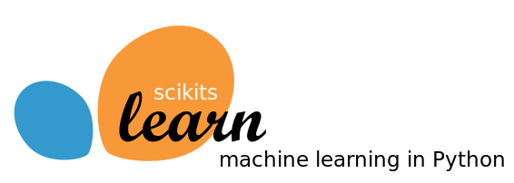

.. topic:: Prerequisites

    * Numpy, Scipy
    * IPython
    * matplotlib
    * scikit-learn (http://scikit-learn.org)

.. contents:: Chapters contents
   :local:
   :depth: 2

.. warning::

   As of version 0.9 (released in September 2011), the import path for
   scikit-learn has changed from `scikits.learn` to `sklearn`

..
  For doctesting, to avoid having figures poping up
  
  >>> import matplotlib
  >>> matplotlib.use('svg')
  >>> import numpy as np
  >>> np.random.seed(0)

Loading an example dataset
==========================

.. raw:: html

    

.. raw:: html

    

First we will load some data to play with. The data we will use is a
very simple flower database known as the Iris dataset.

We have 150 observations of the iris flower specifying some
measurements: sepal length, sepal width, petal length and petal width
together with its subtype: *Iris setosa*, *Iris versicolor*, *Iris
virginica*.

.. For now, a dataset is just a matrix of floating-point numbers,
.. together with a class value.

To load the dataset into a Python object:

::

  >>> from sklearn import datasets
  >>> iris = datasets.load_iris()

This data is stored in the ``.data`` member, which
is a ``(n_samples, n_features)`` array.

    >>> iris.data.shape
    (150, 4)

The class of each observation is stored in the ``.target`` attribute of the
dataset. This is an integer 1D array of length ``n_samples``:

    >>> iris.target.shape
    (150,)
    >>> import numpy as np
    >>> np.unique(iris.target)
    array([0, 1, 2])

.. topic:: An example of reshaping data: the digits dataset

    .. image:: digits_first_image.png
        :scale: 50
        :align: right

    The digits dataset consists of 1797 images, where each one is an 8x8
    pixel image representing a hand-written digit ::

        >>> digits = datasets.load_digits()
        >>> digits.images.shape
        (1797, 8, 8)
        >>> import pylab as pl
        >>> pl.imshow(digits.images[0], cmap=pl.cm.gray_r) #doctest: +ELLIPSIS
        <matplotlib.image.AxesImage object at ...>

    To use this dataset with the scikit, we transform each 8x8 image
    into a vector of length 64 ::

        >>> data = digits.images.reshape((digits.images.shape[0], -1))

Learning and Predicting
+++++++++++++++++++++++

Now that we've got some data, we would like to learn from it and
predict on new one. In ``scikit-learn``, we learn from existing
data by creating an ``estimator`` and calling its ``fit(X, Y)`` method.

    >>> from sklearn import svm
    >>> clf = svm.LinearSVC()
    >>> clf.fit(iris.data, iris.target) # learn from the data # doctest: +ELLIPSIS
    LinearSVC(...)

Once we have learned from the data, we can use our model to predict the
most likely outcome on unseen data:

    >>> clf.predict([[ 5.0,  3.6,  1.3,  0.25]])
    array([0], dtype=int32)

.. note:: 
   
    We can access the parameters of the model via its attributes ending
    with an underscore:

        >>> clf.coef_   #doctest: +ELLIPSIS
        array([[ 0...]])

Classification
==============

k-Nearest neighbors classifier
++++++++++++++++++++++++++++++

The simplest possible classifier is the nearest neighbor: given a new
observation, take the label of the training samples closest to it
in *n*-dimensional space, where *n* is the number of *features*
in each sample.

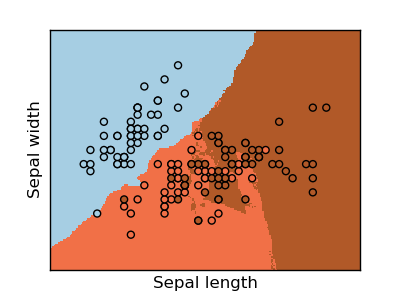

The k-nearest neighbors classifier internally uses an algorithm
based on ball trees to represent the samples it is trained on.

**KNN (k-nearest neighbors) classification example**:

::

    >>> # Create and fit a nearest-neighbor classifier
    >>> from sklearn import neighbors
    >>> knn = neighbors.KNeighborsClassifier()
    >>> knn.fit(iris.data, iris.target) # doctest: +ELLIPSIS
    KNeighborsClassifier(...)
    >>> knn.predict([[0.1, 0.2, 0.3, 0.4]])
    array([0])

.. topic:: Training set and testing set

   When experimenting with learning algorithms, it is important not to
   test the prediction of an estimator on the data used to fit the
   estimator. Indeed, with the kNN estimator, we would always get perfect
   prediction on the training set. ::

       >>> perm = np.random.permutation(iris.target.size)
       >>> iris.data = iris.data[perm]
       >>> iris.target = iris.target[perm]
       >>> knn.fit(iris.data[:100], iris.target[:100]) # doctest: +ELLIPSIS
       KNeighborsClassifier(...)
       >>> knn.score(iris.data[100:], iris.target[100:]) # doctest: +ELLIPSIS
       0.95999...

   Bonus question: why did we use a random permutation?

Support vector machines (SVMs) for classification
+++++++++++++++++++++++++++++++++++++++++++++++++

Linear Support Vector Machines
------------------------------

SVMs try to construct a hyperplane maximizing the margin between the two
classes. It selects a subset of the input, called the support vectors,
which are the observations closest to the separating hyperplane.

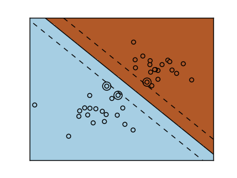

.. Regularization is set by the `C` parameter: with small `C`
.. give (regularized problem) the margin is computed only on the
.. observation close to the separating plane; with large `C` all the
.. observations are used.

::

    >>> from sklearn import svm
    >>> svc = svm.SVC(kernel='linear')
    >>> svc.fit(iris.data, iris.target) # doctest: +ELLIPSIS
    SVC(...)

There are several support vector machine implementations in ``scikit-learn``.
The most commonly used ones are ``svm.SVC``, ``svm.NuSVC`` and ``svm.LinearSVC``;
"SVC" stands for Support Vector Classifier (there also exist SVMs for regression,
which are called "SVR" in ``scikit-learn``).

.. topic:: **Excercise**
   :class: green

   Train an ``svm.SVC`` on the digits dataset. Leave out the
   last 10% and test prediction performance on these observations.

Using kernels
--------------

Classes are not always separable by a hyperplane, so it would be
desirable to have a decision function that is not linear but that may
be for instance polynomial or exponential:

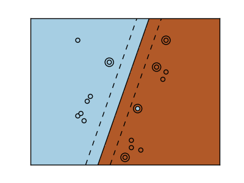

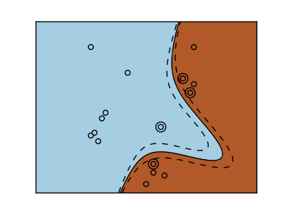

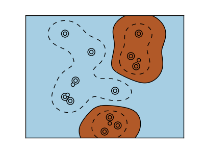

.. rst-class:: centered

  .. list-table::

     *

       - **Linear kernel**

       - **Polynomial kernel**

       - **RBF kernel (Radial Basis Function)**

     *

       - |svm_kernel_linear|

       - |svm_kernel_poly|

       - |svm_kernel_rbf|

     *

       - ::

            >>> svc = svm.SVC(kernel='linear')

       - ::

            >>> svc = svm.SVC(kernel='poly',
            ...               degree=3)
            >>> # degree: polynomial degree

       - ::

            >>> svc = svm.SVC(kernel='rbf')
            >>> # gamma: inverse of size of
            >>> # radial kernel

.. topic:: **Exercise**
   :class: green

   Which of the kernels noted above has a better prediction
   performance on the digits dataset?

   .. toctree::

        digits_classification_exercise

Clustering: grouping observations together
==========================================

Given the iris dataset, if we knew that there were 3 types of iris,
but did not have access to their labels, we could try **unsupervised
learning**: we could **cluster** the observations into several groups
by some criterion.

K-means clustering
++++++++++++++++++

The simplest clustering algorithm is k-means. This divides a set into
*k* clusters, assigning each observation to a cluster so as to minimize
the distance of that observation (in *n*-dimensional space) to the cluster's
mean; the means are then recomputed. This operation is run iteratively until
the clusters converge, for a maximum for ``max_iter`` rounds.

(An alternative implementation of k-means is available in SciPy's ``cluster``
package. The ``scikit-learn`` implementation differs from that by offering an
object API and several additional features, including smart initialization.)

::

    >>> from sklearn import cluster, datasets
    >>> iris = datasets.load_iris()
    >>> k_means = cluster.KMeans(k=3)
    >>> k_means.fit(iris.data) # doctest: +ELLIPSIS
    KMeans(copy_x=True, init='k-means++', k=3, ...
    >>> print k_means.labels_[::10]
    [1 1 1 1 1 0 0 0 0 0 2 2 2 2 2]
    >>> print iris.target[::10]
    [0 0 0 0 0 1 1 1 1 1 2 2 2 2 2]

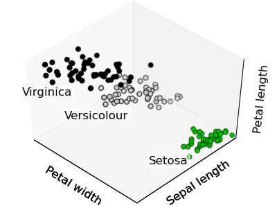

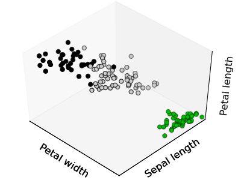

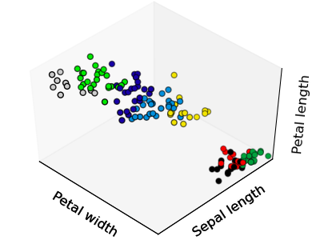

.. list-table::
    :class: centered

    *
        - |cluster_iris_truth|

        - |cluster_iris_kmeans|

        - |k_means_iris_8|

    *
        - **Ground truth**

        - **K-means (3 clusters)**

        - **K-means (8 clusters)**

.. |lena| image:: lena.png
   :scale: 50

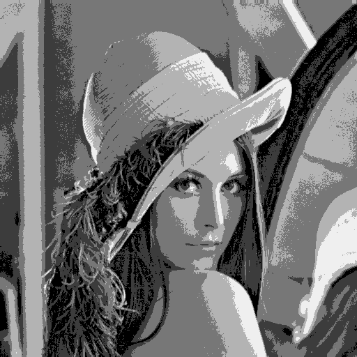

.. topic:: **Application to Image Compression**

    Clustering can be seen as a way of choosing a small number of
    observations from the information. For instance, this can be used
    to posterize an image (conversion of a continuous gradation of
    tone to several regions of fewer tones)::

     >>> from scipy import misc
     >>> lena = misc.lena().astype(np.float32)
     >>> X = lena.reshape((-1, 1)) # We need an (n_sample, n_feature) array
     >>> k_means = cluster.KMeans(n_clusters=5)
     >>> k_means.fit(X) # doctest: +ELLIPSIS
     KMeans(...)
     >>> values = k_means.cluster_centers_.squeeze()
     >>> labels = k_means.labels_
     >>> lena_compressed = np.choose(labels, values)
     >>> lena_compressed.shape = lena.shape

    .. list-table::
      :class: centered

      *
        - |lena|

        - |lena_compressed|

      *

        - Raw image

        - K-means quantization

Dimension Reduction with Principal Component Analysis
=====================================================

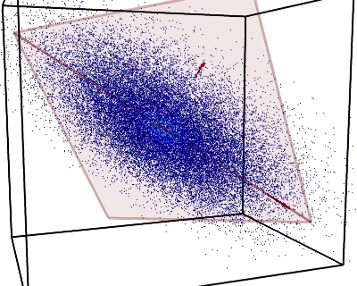

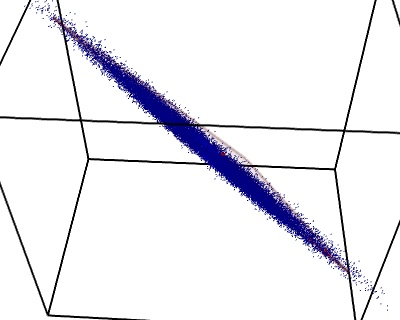

.. rst-class:: centered

   |pca_3d_axis| |pca_3d_aligned|

The cloud of points spanned by the observations above is very flat in
one direction, so that one feature can almost be exactly computed
using the 2 other. PCA finds the directions in which the data is not
*flat* and it can reduce the dimensionality of the data by projecting
on a subspace.

.. warning::

    Depending on your version of scikit-learn PCA will be in module
    ``decomposition`` or ``pca``.

::

    >>> from sklearn import decomposition
    >>> pca = decomposition.PCA(n_components=2)
    >>> pca.fit(iris.data)
    PCA(copy=True, n_components=2, whiten=False)
    >>> X = pca.transform(iris.data)

Now we can visualize the (transformed) iris dataset::

    >>> import pylab as pl
    >>> pl.scatter(X[:, 0], X[:, 1], c=iris.target) # doctest: +ELLIPSIS
    <matplotlib.collections...Collection object at ...>

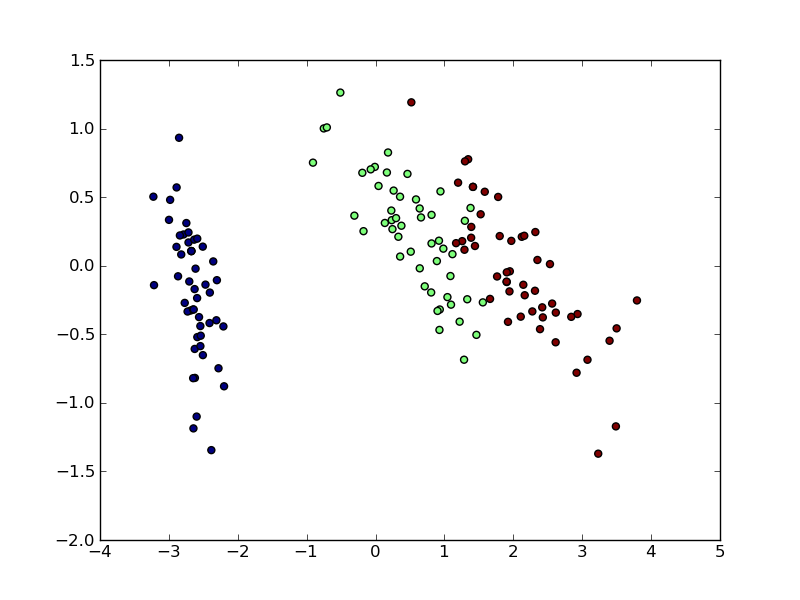

PCA is not just useful for visualization of high dimensional
datasets. It can also be used as a preprocessing step to help speed up
supervised methods that are not efficient with high
dimensions.

Putting it all together: face recognition
=========================================

An example showcasing face recognition using Principal Component
Analysis for dimension reduction and Support Vector Machines for
classification.

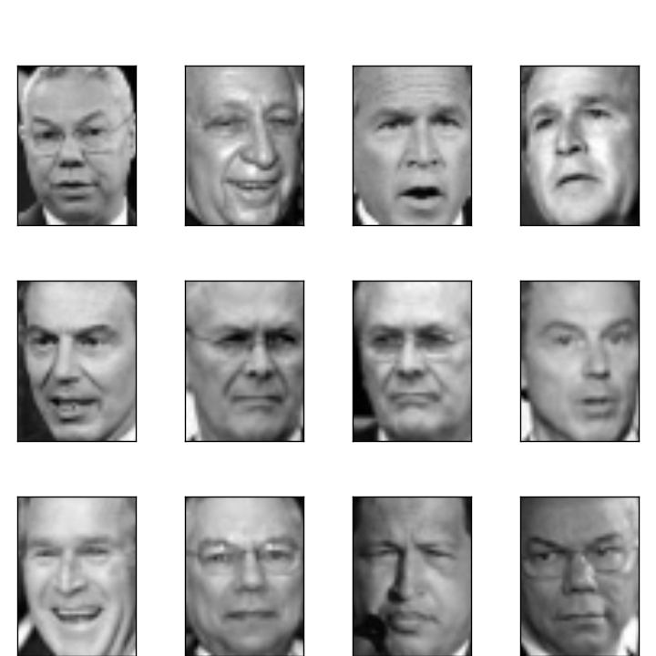

.. sourcecode:: python

    """
    Stripped-down version of the face recognition example by Olivier Grisel
    
    http://scikit-learn.org/dev/auto_examples/applications/face_recognition.html
    
    ## original shape of images: 50, 37
    """
    import numpy as np
    import pylab as pl
    from sklearn import cross_val, datasets, decomposition, svm
    
    # ..
    # .. load data ..
    lfw_people = datasets.fetch_lfw_people(min_faces_per_person=70, resize=0.4)
    perm = np.random.permutation(lfw_people.target.size)
    lfw_people.data = lfw_people.data[perm]
    lfw_people.target = lfw_people.target[perm]
    faces = np.reshape(lfw_people.data, (lfw_people.target.shape[0], -1))
    train, test = iter(cross_val.StratifiedKFold(lfw_people.target, k=4)).next()
    X_train, X_test = faces[train], faces[test]
    y_train, y_test = lfw_people.target[train], lfw_people.target[test]
    
    # ..
    # .. dimension reduction ..
    pca = decomposition.RandomizedPCA(n_components=150, whiten=True)
    pca.fit(X_train)
    X_train_pca = pca.transform(X_train)
    X_test_pca = pca.transform(X_test)
    
    # ..
    # .. classification ..
    clf = svm.SVC(C=5., gamma=0.001)
    clf.fit(X_train_pca, y_train)

    # ..
    # .. predict on new images ..
    for i in range(10):
        print lfw_people.target_names[clf.predict(X_test_pca[i])[0]]
        _ = pl.imshow(X_test[i].reshape(50, 37), cmap=pl.cm.gray)
        _ = raw_input()
    

.. only:: html
   
    Full code: :download:`faces.py`

Linear model: from regression to sparsity
==========================================

.. topic:: Diabetes dataset

    The diabetes dataset consists of 10 physiological variables (age,
    sex, weight, blood pressure) measure on 442 patients, and an
    indication of disease progression after one year::

        >>> diabetes = datasets.load_diabetes()
        >>> diabetes_X_train = diabetes.data[:-20]
        >>> diabetes_X_test  = diabetes.data[-20:]
        >>> diabetes_y_train = diabetes.target[:-20]
        >>> diabetes_y_test  = diabetes.target[-20:]
    
    The task at hand is to predict disease prediction from physiological
    variables. 

Sparse models
+++++++++++++

To improve the conditioning of the problem (uninformative variables,
mitigate the curse of dimensionality, as a feature selection
preprocessing, etc.), it would be interesting to select only the
informative features and set non-informative ones to 0. This
penalization approach, called **Lasso**, can set some coefficients to
zero.  Such methods are called **sparse method**, and sparsity can be
seen as an application of Occam's razor: prefer simpler models to
complex ones.

:: 

    >>> from sklearn import linear_model
    >>> regr = linear_model.Lasso(alpha=.3)
    >>> regr.fit(diabetes_X_train, diabetes_y_train) # doctest: +ELLIPSIS
    Lasso(...)
    >>> regr.coef_ # very sparse coefficients
    array([   0.        ,   -0.        ,  497.34075682,  199.17441034,
             -0.        ,   -0.        , -118.89291545,    0.        ,
            430.9379595 ,    0.        ])
    >>> regr.score(diabetes_X_test, diabetes_y_test) # doctest: +ELLIPSIS
    0.5510835453...

being the score very similar to linear regression (Least Squares)::

    >>> lin = linear_model.LinearRegression()
    >>> lin.fit(diabetes_X_train, diabetes_y_train) # doctest: +ELLIPSIS
    LinearRegression(...)
    >>> lin.score(diabetes_X_test, diabetes_y_test) # doctest: +ELLIPSIS
    0.5850753022...

.. topic:: **Different algorithms for a same problem**

    Different algorithms can be used to solve the same mathematical
    problem. For instance the `Lasso` object in the `sklearn`
    solves the lasso regression using a *coordinate descent* method, that
    is efficient on large datasets. However, the `sklearn` also
    provides the `LassoLARS` object, using the *LARS* which is very
    efficient for problems in which the weight vector estimated is very
    sparse, that is problems with very few observations.

Model selection: choosing estimators and their parameters
=========================================================

Grid-search and cross-validated estimators
++++++++++++++++++++++++++++++++++++++++++

Grid-search
-----------

The scikit-learn provides an object that, given data, computes the score
during the fit of an estimator on a parameter grid and chooses the
parameters to maximize the cross-validation score. This object takes an
estimator during the construction and exposes an estimator API::

    >>> from sklearn import svm, grid_search
    >>> gammas = np.logspace(-6, -1, 10)
    >>> svc = svm.SVC()
    >>> clf = grid_search.GridSearchCV(estimator=svc, param_grid=dict(gamma=gammas), 
    ...                    n_jobs=-1)
    >>> clf.fit(digits.data[:1000], digits.target[:1000]) # doctest: +ELLIPSIS
    GridSearchCV(cv=None,
           estimator=SVC(C=1.0, ...
    >>> clf.best_score
    0.98899798001594419
    >>> clf.best_estimator.gamma
    0.00059948425031894088

By default the `GridSearchCV` uses a 3-fold cross-validation. However, if
it detects that a classifier is passed, rather than a regressor, it uses
a stratified 3-fold.

Cross-validated estimators
--------------------------

Cross-validation to set a parameter can be done more efficiently on an
algorithm-by-algorithm basis. This is why, for certain estimators, the
scikit-learn exposes "CV" estimators, that set their parameter
automatically by cross-validation::

    >>> from sklearn import linear_model, datasets
    >>> lasso = linear_model.LassoCV()
    >>> diabetes = datasets.load_diabetes()
    >>> X_diabetes = diabetes.data
    >>> y_diabetes = diabetes.target
    >>> lasso.fit(X_diabetes, y_diabetes)
    LassoCV(alphas=array([ 2.14804,  2.00327, ...,  0.0023 ,  0.00215]),
        copy_X=True, cv=None, eps=0.001, fit_intercept=True, max_iter=1000,
        n_alphas=100, normalize=False, precompute='auto', tol=0.0001,
        verbose=False)
    >>> # The estimator chose automatically its lambda:
    >>> lasso.alpha # doctest: +ELLIPSIS
    0.013...

These estimators are called similarly to their counterparts, with 'CV'
appended to their name.

.. topic:: **Exercise**
   :class: green

   On the diabetes dataset, find the optimal regularization parameter
   alpha.

 

