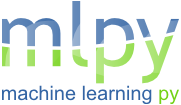
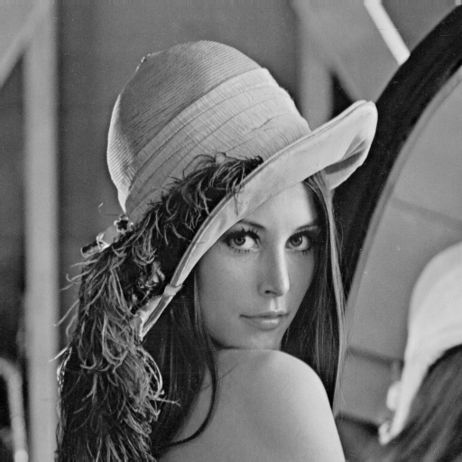
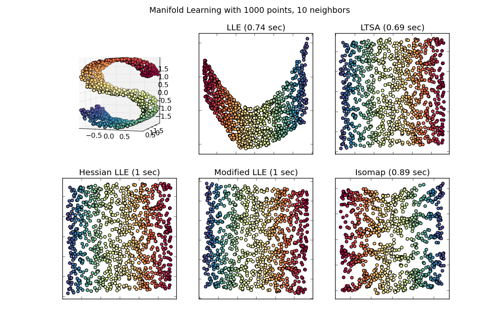
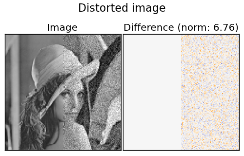
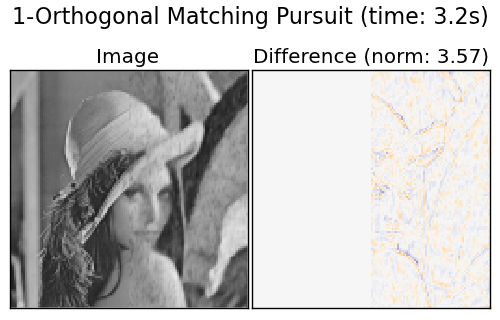
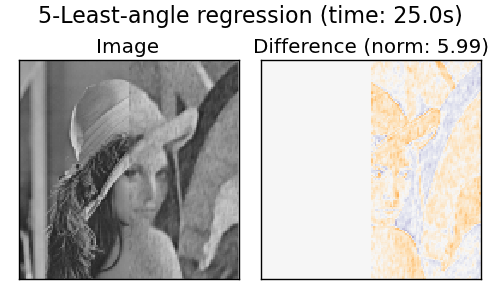

========================================
scikit-learn: machine learning in Python
========================================

Machine learning is a rapidly-growing field with several machine
learning frameworks available for Python.

.. image:: scikit-learn-logo.png
   :scale: 40

.. topic:: Prerequisites

    * Numpy, Scipy
    * IPython
    * matplotlib
    * scikit-learn (http://scikit-learn.sourceforge.net)

.. contents:: Chapters contents
   :depth: 2

Loading an example dataset
==========================

.. raw:: html

    

.. image:: images/Virginia_Iris.png
   :align: right
   :alt: Photo of Iris Virginia

.. raw:: html

    

First we will load some data to play with. The data we will use is a
very simple flower database known as the Iris dataset.

We have 150 observations of the iris flower specifying some of its
characteristics: sepal length, sepal width, petal length and petal
width together with its subtype: Iris Setosa, Iris Versicolour, Iris
Virginica.

.. for now, a dataset is just a matrix of floating-point numbers,
.. (together with a class value).

To load the dataset into a Python object:

::

  >>> from scikits.learn import datasets
  >>> iris = datasets.load_iris()

This data is stored in the ``.data`` member, which
is a ``(n_samples, n_features)`` array.

    >>> iris.data.shape
    (150, 4)

It is made of 150 observations of irises, each described by the 4
features mentioned earlier.

The information about the class of each observation is stored in the
target attribute of the dataset. This is an integer 1D array of length
``n_samples``:

    >>> iris.target.shape
    (150,)
    >>> import numpy as np
    >>> np.unique(iris.target)
    [0, 1, 2]

.. topic:: An example of reshaping data: the digits dataset

    .. image:: digits_first_image.png
        :scale: 50
        :align: right

    The digits dataset is made of 1797 images, where each one is a 8x8
    pixel image representing a hand-written digits ::

        >>> digits = datasets.load_digits()
        >>> digits.images.shape
        (1797, 8, 8)
        >>> import pylab as pl
        >>> pl.imshow(digits.images[0], cmap=pl.cm.gray_r) #doctest: +ELLIPSIS
        <matplotlib.image.AxesImage object at ...>

    To use this dataset with the scikit, we transform each 8x8 image in a
    feature vector of length 64 ::

        >>> data = digits.images.reshape((digits.images.shape[0], -1))

Learning and Predicting
+++++++++++++++++++++++

Now that we've got some data, we would like to learn from the data and
predict on new one. In ``scikit-learn``, we learn from existing
data by creating an ``estimator`` and calling its ``fit(X, Y)`` method.

    >>> from scikits.learn import svm
    >>> clf = svm.LinearSVC()
    >>> clf.fit(iris.data, iris.target) # learn form the data

Once we have learned from the data, we can access the parameters of
the model:

    >>> clf.coef_
    ...

And it can be used to predict the most likely outcome on unseen data:

    >>> clf.predict([[ 5.0,  3.6,  1.3,  0.25]])
    array([0], dtype=int32)

Supervised learning
===================

k-Nearest neighbors classifier
++++++++++++++++++++++++++++++

The simplest possible classifier is the nearest neighbor: given a new
observation, take the label of the closest learned observation.

**KNN (k nearest neighbors) classification example**:

.. image:: iris_knn.png
   :scale: 90
   :align: right

::

    >>> # Create and fit a nearest-neighbor classifier
    >>> from scikits.learn import neighbors
    >>> knn = neighbors.NeighborsClassifier()
    >>> knn.fit(iris.data, iris.target)
    NeighborsClassifier(n_neighbors=5, leaf_size=20, algorithm='auto')
    >>> knn.predict([[0.1, 0.2, 0.3, 0.4]])
    array([0])

.. topic:: Training set and testing set

   When experimenting with learning algorithm, it is important not to
   test the prediction of an estimator on the data used to fit the
   estimator.

Support vector machines (SVMs) for classification
+++++++++++++++++++++++++++++++++++++++++++++++++

Linear Support Vector Machines
------------------------------

SVMs try to build a plane maximizing the margin between the two
classes. It selects a subset of the input, called the support vectors,
which are the observations closest to the separating plane.

.. image:: svm_margin.png
   :align: center
   :scale: 80

.. Regularization is set by the `C` parameter: with small `C`
.. give (regularized problem) the margin is computed only on the
.. observation close to the separating plane; with large `C` all the
.. observations are used.

::

    >>> from scikits.learn import svm
    >>> svc = svm.SVC(kernel='linear')
    >>> svc.fit(iris.data, iris.target)
    SVC(kernel='linear', C=1.0, probability=False, degree=3, coef0=0.0, tol=0.001,
      shrinking=True, gamma=0.0)

There are several support vector machine implementations in
scikit-learn. The most used ones are ``svm.SVC``, ``svm.NuSVC`` and ``svm.LinearSVC``. 

.. topic:: **Excercise**
   :class: green

   Try classifying the digits dataset with ``svm.SVC``. Leave out the
   last 10% and test prediction performance on these observations.

Using kernels
--------------

Classes are not always separable by a hyper-plane, thus it would be
desirable to a build decision function that is not linear but that may
be for instance polynomial or exponential:

.. |svm_kernel_linear| image:: svm_kernel_linear.png
   :scale: 65

.. |svm_kernel_poly| image:: svm_kernel_poly.png
   :scale: 65

.. |svm_kernel_rbf| image:: svm_kernel_rbf.png
   :scale: 65

.. rst-class:: centered

  .. list-table::

     *

       - **Linear kernel**

       - **Polynomial kernel**

       - **RBF kernel (Radial Basis Function)**

     *

       - |svm_kernel_linear|

       - |svm_kernel_poly|

       - |svm_kernel_rbf|

     *

       - ::

            >>> svc = svm.SVC(kernel='linear')

       - ::

            >>> svc = svm.SVC(kernel='poly',
            ...               degree=3)
            >>> # degree: polynomial degree

       - ::

            >>> svc = svm.SVC(kernel='rbf')
            >>> # gamma: inverse of size of
            >>> # radial kernel

.. topic:: **Exercise**
   :class: green

   Which of the kernels noted above has a better prediction
   performance on the digits dataset ?

   .. toctree::

        digits_classification_excercise

Clustering: grouping observations together
==========================================

Given the iris dataset, if we knew that there were 3 types of iris,
but did not have access to their labels: we could try a **clustering
task**: split the observations into groups called *clusters*.

K-means clustering
++++++++++++++++++

The simplest clustering algorithm is the k-means.

::

    >>> from scikits.learn import cluster, datasets
    >>> iris = datasets.load_iris()
    >>> k_means = cluster.KMeans(k=3)
    >>> k_means.fit(iris.data) # doctest: +ELLIPSIS
    KMeans(verbose=0, k=3, max_iter=300, init='k-means++',...
    >>> print k_means.labels_[::10]
    [1 1 1 1 1 0 0 0 0 0 2 2 2 2 2]
    >>> print iris.target[::10]
    [0 0 0 0 0 1 1 1 1 1 2 2 2 2 2]

.. |cluster_iris_truth| image:: cluster_iris_truth.png
   :scale: 77

.. |cluster_iris_kmeans| image:: k_means_iris_3.png
    :scale: 80

.. |k_means_iris_8| image:: k_means_iris_8.png
   :scale: 77

.. list-table::
    :class: centered

    *
        - |cluster_iris_truth|

        - |cluster_iris_kmeans|

        - |k_means_iris_8|

    *
        - **Ground truth**

        - **K-means (3 clusters)**

        - **K-means (8 clusters)**

.. |lena_regular| image:: lena_regular.png
   :scale: 50

.. |lena_compressed| image:: lena_compressed.png
   :scale: 50

.. topic:: **Application example: vector quantization**

    Clustering can be seen as a way of choosing a small number of
    observations to compress the information, a problem sometimes
    known as vector quantization. For instance, this can be used to
    posterize an image (conversion of a continuous gradation of tone to several
    regions of fewer tones)::

    >>> import scipy as sp
    >>> lena = sp.lena()
    >>> X = lena.reshape((-1, 1)) # We need an (n_sample, n_feature) array
    >>> k_means = cluster.KMeans(k=5, n_init=1)
    >>> k_means.fit(X)
    >>> values = k_means.cluster_centers_.squeeze()
    >>> labels = k_means.labels_
    >>> lena_compressed = np.choose(labels, values)
    >>> lena_compressed.shape = lena.shape

    .. list-table::
      :class: centered

      *
        - |lena|

        - |lena_compressed|

      *

        - Raw image

        - K-means quantization

Dimension reduction with Principal Component Analysis
+++++++++++++++++++++++++++++++++++++++++++++++++++++

Principal component analysis select the successive components that
explain the maximum variance in the signal.

.. |pca_3d_axis| image:: pca_3d_axis.jpg
   :scale: 70

.. |pca_3d_aligned| image:: pca_3d_aligned.jpg
   :scale: 70

.. rst-class:: centered

   |pca_3d_axis| |pca_3d_aligned|

The point cloud spanned by the observations above is very flat in one
direction: one of the 3 univariate features can almost be exactly
computed using the 2 other. PCA finds the directions in which the data is
not *flat*

When used to *transform* data, PCA can reduce the dimensionality of the
data by projecting on a principal subspace.

.. warning::

    Depending on your version of scikit-learn PCA will be in module
    ``decomposition`` or ``pca``.

>>> from scikits.learn import decomposition
>>> pca = decomposition.PCA(n_components=2)
>>> pca.fit(iris.data)
PCA(copy=True, n_components=2, whiten=False)
>>> X = pca.transform(iris.data)

Now we can visualize the (transformed) iris dataset!

>>> import pylab as pl
>>> pl.scatter(X[:, 0], X[:, 1], c=iris.target)
>>> pl.show()

.. image:: pca_iris.png
   :scale: 50
   :align: center

PCA is not just useful for visualization of high dimensional
datasets. It can also be used as a preprocessing step to help speed up
supervised methods that are not computationally efficient with high
dimensions.

Putting it all together : face recognition with Support Vector Machines
=======================================================================

An example showcasing face recognition using Principal Component
Analysis for dimension reduction and Support Vector Machines for
classification.

.. image:: faces.png
   :align: center
   :scale: 50

::

    >>> # load the faces dataset
    >>> import numpy as np
    >>> from scikits.learn import cross_val, datasets, decomposition, svm
    >>> lfw_people = datasets.fetch_lfw_people(min_faces_per_person=70, resize=0.4)
    >>> faces = np.reshape(lfw_people.data, (lfw_people.target.shape[0], -1))
    >>> train, test = iter(cross_val.StratifiedKFold(lfw_people.target, k=4)).next()
    >>> X_train, X_test = faces[train], faces[test]
    >>> y_train, y_test = lfw_people.target[train], lfw_people.target[test]

Full code: :download:`faces.py`

Available in the next release ...
=================================

Manifold learning
+++++++++++++++++

Manifold learning is an approach to nonlinear dimensionality
reduction. Algorithms for this task are based on the idea that the
dimensionality of many data sets is only artificially high.

Non-negative matrix factorization
+++++++++++++++++++++++++++++++++

Image denoising using dictionary learning. An example comparing the
effect of reconstructing noisy fragments of Lena using online
dictionary learning and various transform methods.

 
