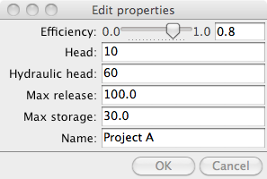
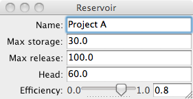
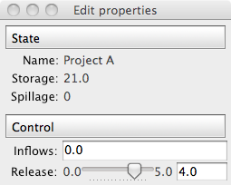

======
Traits
======

:author: Didrik Pinte

The Traits project allows you to simply add validation, initialization, delegation, notification and a graphical user interface to Python object attributes. In this tutorial we will explore the Traits toolset and learn how to dramatically reduce the amount of boilerplate code you write, do rapid GUI application development, and understand the ideas which underly other parts of the Enthought Tool Suite.

Traits and the Enthought Tool Suite are open source projects licensed under a BSD-style license.

.. topic:: Intended Audience

    Intermediate to advanced Python programmers

.. topic:: Requirements

    * Python 2.6 or 2.7 (www.python.org)
    * Either wxPython (http://www.wxpython.org/) or PyQt (http://www.riverbankcomputing.co.uk/software/pyqt/intro)
    * Numpy and Scipy (http://www.scipy.org)
    * Enthought Tool Suite 3.x or higher (http://code.enthought.com/projects)
    * All required software can be obtained by installing the EPD Free (http://www.enthought.com/products/epd.php)

.. contents:: Tutorial content
   :local:
   :depth: 2

Introduction 
============

The Enthought Tool Suite enable the construction of sophisticated application frameworks for data analysis, 2D plotting and 3D visualization. These powerful, reusable components are released under liberal BSD-style licenses.

The main packages are:

    * Traits - component based approach to build our applications.
    * Kiva - 2D primitives supporting path based rendering, affine transforms,
      alpha blending and more.
    * Enable - object based 2D drawing canvas.
    * Chaco - plotting toolkit for building complex interactive 2D plots.
    * Mayavi - 3D visualization of scientific data based on VTK.
    * Envisage - application plugin framework for building scriptable and
      extensible applications

In this tutorial, we will focus on Traits.

Example 
=======

Throughout this tutorial, we will use an example based on a water resource
management simple case. We will try to model a dam and reservoir system. The
reservoir and the dams do have a set of parameters :

    * Name
    * Minimal and maximal capacity of the reservoir [hm3]
    * Height and length of the dam [m]
    * Catchment area [km2]
    * Hydraulic head [m]
    * Power of the turbines [MW]
    * Minimal and maximal release [m3/s]
    * Efficiency of the turbines

The reservoir has a known behaviour. One part is related to the energy
production based on the water released. A simple formula for approximating electric power production at a hydroelectric plant is :math:`P = \rho hrgk`, where:

    * :math:`P` is Power in watts,
    * :math:`\rho` is the density of water (~1000 kg/m3),
    * :math:`h` is height in meters,
    * :math:`r` is flow rate in cubic meters per second,
    * :math:`g` is acceleration due to gravity of 9.8 m/s2,
    * :math:`k` is a coefficient of efficiency ranging from 0 to 1. 
      
Annual electric energy production depends on the available water supply. In some installations the water flow rate can vary by a factor of 10:1 over the course of a year.

The second part of the behaviour is the state of the storage that depends on
controlled and uncontrolled parameters :

    :math:`storage_{t+1} = storage_t + inflows - release - spillage - irrigation`

.. warning:: 

    The data used in this tutorial are not real and might even not have sense
    in the reality.

What are Traits
===============

A trait is a type definition that can be used for normal Python object attributes, giving the attributes some additional characteristics:

    * Standardization:
        * Initialization
        * Validation
        * Deferral
    * Notification
    * Visualization
    * Documentation

A class can freely mix trait-based attributes with normal Python attributes, or can opt to allow the use of only a fixed or open set of trait attributes within the class. Trait attributes defined by a class are automatically inherited by any subclass derived from the class.

The common way of creating a traits class is by extending from the
**HasTraits** base class and defining class traits :

::

    from traits.api import HasTraits, Str, Float

    class Reservoir(HasTraits):
        
        name = Str
        max_storage = Float

.. warning:: For Traits 3.x users

    If using Traits 3.x, you need to adapt the namespace of the traits
    packages:

        * traits.api should be enthought.traits.api 
        * traitsui.api should be enthought.traits.ui.api 

Using a traits class like that is as simple as any other Python class. Note
that the trait value are passed using keyword arguments:

::

    reservoir = Reservoir(name='Lac de Vouglans', max_storage=605)

Initialisation
--------------

All the traits do have a default value that initialise the variables. For
example, the basic python types do have the following trait equivalents:

==============  ====================== ======================
Trait           Python Type            Built-in Default Value
==============  ====================== ======================
Bool            Boolean                False
Complex         Complex number         0+0j
Float           Floating point number  0.0
Int             Plain integer          0
Long            Long integer           0L
Str             String                 ''
Unicode         Unicode                u''
==============  ====================== ======================

A number of other predefined trait type do exist : Array, Enum, Range, Event,
Dict, List, Color, Set, Expression, Code, Callable, Type, Tuple, etc.

Custom default values can be defined in the code:

::

    from traits.api import HasTraits, Str, Float

    class Reservoir(HasTraits):
        
        name = Str
        max_storage = Float(100)

    reservoir = Reservoir(name='Lac de Vouglans')

.. note:: Complex initialisation

    When a complex initialisation is required for a trait, a _XXX_default magic
    method can be implemented. It will be lazily called when trying to access
    the XXX trait. For example::

        def _name_default(self):
            """ Complex initialisation of the reservoir name. """

            return 'Undefined'

Validation
----------

Every trait does validation when the user tries to set its content: 

::

    reservoir = Reservoir(name='Lac de Vouglans', max_storage=605)

    reservoir.max_storage = '230'
    ---------------------------------------------------------------------------
    TraitError                                Traceback (most recent call last)
    /Users/dpinte/projects/scipy-lecture-notes/advanced/traits/<ipython-input-7-979bdff9974a> in <module>()
    ----> 1 reservoir.max_storage = '230'

    /Users/dpinte/projects/ets/traits/traits/trait_handlers.pyc in error(self, object, name, value)
        166         """
        167         raise TraitError( object, name, self.full_info( object, name, value ),
    --> 168                           value )
        169 
        170     def arg_error ( self, method, arg_num, object, name, value ):

    TraitError: The 'max_storage' trait of a Reservoir instance must be a float, but a value of '23' <type 'str'> was specified.

Documentation
-------------

By essence, all the traits do provide documentation about the model itself. The
declarative approach to the creation of classes makes it self-descriptive:

::

    from traits.api import HasTraits, Str, Float

    class Reservoir(HasTraits):
        
        name = Str
        max_storage = Float(100)

The **desc** metadata of the traits can be used to provide a more descriptive
information about the trait :

::

    from traits.api import HasTraits, Str, Float

    class Reservoir(HasTraits):
        
        name = Str
        max_storage = Float(100, desc='Maximal storage [hm3]')

Let's now define the complete reservoir class:

.. include:: reservoir.py
    :literal:

Visualisation
-------------

The Traits library is also aware of user interfaces and can pop up a default
view for the Reservoir class::

    reservoir1 = Reservoir()
    reservoir1.edit_traits()

TraitsUI simplifies the way user interfaces are created. Every trait on a
HasTraits class has a default editor that will manage the way the trait is
rendered to the screen (e.g. the Range trait is displayed as a slider, etc.).

In the very same vein as the Traits declarative way of creating classes,
TraitsUI provides a declarative interface to build user interfaces code:

.. include:: reservoir_simple_view.py
    :literal:

Deferral
--------

Being able to defer the definition of a trait and its value to another object
is a powerful feature of Traits.

.. include:: reservoir_state.py
   :literal:

A special trait allows to manage events and trigger function calls using the
magic **_xxxx_fired** method:

.. include:: reservoir_state_event.py
   :literal:

Dependency between objects can be made automatic using the trait **Property**.
The **depends_on** attribute expresses the dependency between the property and
other traits. When the other traits gets changed, the property is invalidated.
Again, Traits uses magic method names for the property : 
    
    * _get_XXX for the getter of the XXX Property trait
    * _set_XXX for the setter of the XXX Property trait

.. include:: reservoir_state_property.py
   :literal:

.. note:: Caching property

    Heavy computation or long running computation might be a problem when
    accessing a property where the inputs have not changed. The
    @cached_property decorator can be used to cache the value and only
    recompute them once invalidated.

Let's extend the TraitsUI introduction with the ReservoirState example:

.. include:: reservoir_state_property_view.py
    :literal:

Some use cases need the delegation mechanism to be broken by the user when
setting the value of the trait. The **PrototypeFrom** trait implements this
behaviour. 

.. include:: reservoir_turbine_prototype_from.py
    :literal:

Notification
------------

Traits implements a Listener pattern. For each trait a list of static and
dynamic listeners can be fed with callbacks. When the trait does change, all
the listeners are called.

Static listeners are defined using the _XXX_changed magic methods:

.. include:: reservoir_state_static_listener.py
    :literal:

The static trait notification signatures can be:

    * def _release_changed(self):
        pass
    * def _release_changed(self, new):
        pass
    * def _release_changed(self, old, new):
        pass
    * def _release_changed(self, name, old, new
        pass

.. note:: Listening to all the changes

    To listen to all the changes on a HasTraits class, the magic
    **_any_trait_changed** method can be implemented.

In many situations, you do not know in advance what type of listeners need to
be activated. Traits offers the ability to register listeners on the fly with
the dynamic listeners

.. include:: reservoir_state_dynamic_listener.py
    :literal:

The dynamic trait notification signatures are not the same as the static ones : 
    
    * def wake_up_watchman():
        pass
    * def wake_up_watchman(new):
        pass
    * def wake_up_watchman(name, new):
        pass
    * def wake_up_watchman(object, name, new):
        pass
    * def wake_up_watchman(object, name, old, new):
        pass

Removing a dynamic listener can be done by:
    * calling the remove_trait_listener method on the trait with the listener
      method as argument,
    * calling the on_trait_change method with listener method and the keyword
      remove=True,
    * deleting the instance that holds the listener.

Listeners can also be added to classes using the **on_trait_change** decorator:

.. include:: reservoir_state_property_ontraitchange.py
    :literal:

The patterns supported by the on_trait_change method and decorator are
powerful. The reader should look at the docstring of HasTraits.on_trait_change
for the details.

Some more advanced traits
-------------------------

The following example demonstrate the usage of the Enum and List traits :

.. include:: reservoir_with_irrigation.py
    :literal:

Trait listeners can be used to listen to changes in the content of the list to
e.g. keep track of the total crop surface on linked to a given reservoir.

.. include:: reservoir_with_irrigation_listener.py
    :literal:

The next example shows how the Array trait can be used to feed a specialised
TraitsUI Item, the ChacoPlotItem:

.. include:: reservoir_evolution.py
    :literal:

.. image:: reservoir_evolution.png
    :align: center

References
==========

    * ETS repositories: http://github.com/enthought
    * Traits manual: http://github.enthought.com/traits/traits_user_manual/index.html
    * Traits UI manual: http://github.enthought.com/traitsui/traitsui_user_manual/index.html 

    * Mailing list : enthought-dev@enthought.com
