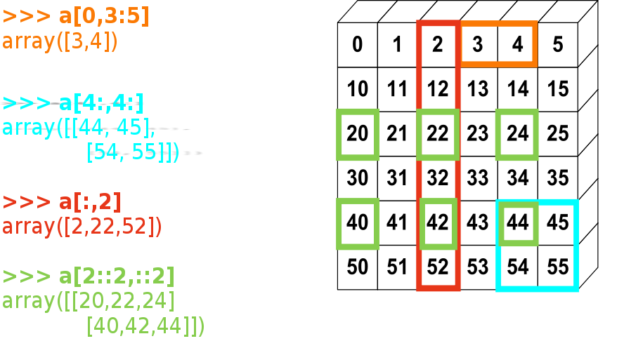
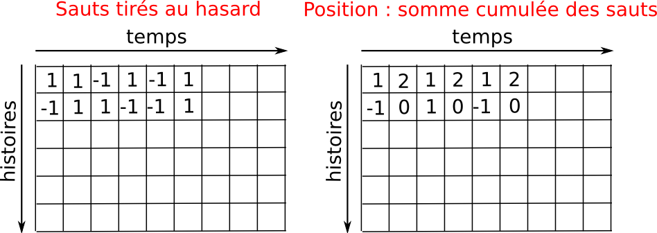
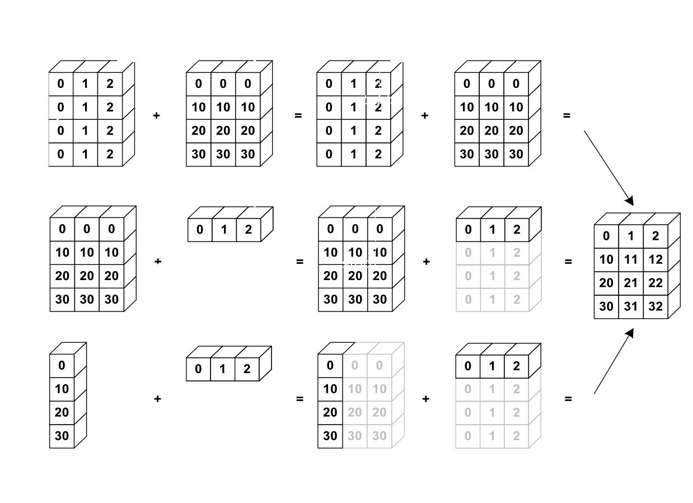

Comment créer et manipuler les données numériques : autour de Numpy
=======================================================================

.. topic:: Le tableau : l'outil de base du calcul scientifique

    .. image:: simple_histo.jpg
       :align: right 

    Manipulation fréquente d'**ensembles ordonnés discrets** :
 
    * temps discrétisé d'une expérience/simulation

    * signal enregistré par un appareil de mesure

    * pixels d'une image, ...

    Le module **Numpy** permet de 

    * créer d'un coup ces ensembles de données

    * réaliser des opérations en "batch" sur les tableaux de données (pas
      de boucle sur les éléments).

    Tableau de données := ``numpy.ndarray``

La création de tableaux de données Numpy
-------------------------------------------

Un petit exemple pour commencer::

    >>> import numpy as np
    >>> a = np.array([0, 1, 2])
    >>> a
    array([0, 1, 2])
    >>> print a
    [0 1 2]
    >>> b = np.array([[0., 1.], [2., 3.]])
    >>> b
    array([[ 0.,  1.],
           [ 2.,  3.]])

Dans la pratique, on rentre rarement les éléments un par un...

    * Valeurs espacées régulièrement::

        >>> import numpy as np
        >>> a = np.arange(10) # de 0 a n-1
        >>> a
        array([0, 1, 2, 3, 4, 5, 6, 7, 8, 9])
        >>> b = np.arange(1., 9., 2) # syntaxe : debut, fin, saut
        >>> b
        array([ 1.,  3.,  5.,  7.])

      ou encore, en spécifiant le nombre de points::

        >>> c = np.linspace(0, 1, 6)
        >>> c
        array([ 0. ,  0.2,  0.4,  0.6,  0.8,  1. ])
        >>> d = np.linspace(0, 1, 5, endpoint=False)
        >>> d
        array([ 0. ,  0.2,  0.4,  0.6,  0.8])

    * Constructeurs pour des tableaux classiques::

        >>> a = np.ones((3,3))
        >>> a
        array([[ 1.,  1.,  1.],
               [ 1.,  1.,  1.],
               [ 1.,  1.,  1.]])
        >>> a.dtype
        dtype('float64')
        >>> b = np.ones(5, dtype=np.int)
        >>> b
        array([1, 1, 1, 1, 1])
        >>> c = np.zeros((2,2))
        >>> c
        array([[ 0.,  0.],
               [ 0.,  0.]])
        >>> d = np.eye(3)
        >>> d
        array([[ 1.,  0.,  0.],
               [ 0.,  1.,  0.],
               [ 0.,  0.,  1.]])


La représentation graphique des données : matplotlib et mayavi
---------------------------------------------------------------

Maintenant que nous avons nos premiers tableaux de données, nous allons
les visualiser. **Matplotlib** est un package de plot 2-D, on importe ces
fonctions de la manière suivante ::

    >>> import pylab
    >>> # ou
    >>> from pylab import * # pour tout importer dans le namespace
 
    
Si vous avec lancé Ipython avec python(x,y), ou avec l'option ``ipython
-pylab`` (sous linux), toutes les fonctions/objets de pylab ont déjà été
importées, comme si on avait fait ``from pylab import *``. Dans la suite
on suppose qu'on a fait ``from pylab import *`` ou lancé ``ipython
-pylab``: on n'écrira donc pas ``pylab.fonction()`` mais directement
``fonction``. 

**Tracé de courbes 1-D**

.. sourcecode:: ipython

    In [6]: a = np.arange(20)
    In [7]: plot(a, a**2) # line plot
    Out[7]: [<matplotlib.lines.Line2D object at 0x95abd0c>]
    In [8]: plot(a, a**2, 'o') # symboles ronds
    Out[8]: [<matplotlib.lines.Line2D object at 0x95b1c8c>]
    In [9]: clf() # clear figure
    In [10]: loglog(a, a**2)
    Out[10]: [<matplotlib.lines.Line2D object at 0x95abf6c>]
    In [11]: xlabel('x') # un peu petit
    Out[11]: <matplotlib.text.Text object at 0x98923ec>
    In [12]: xlabel('x', fontsize=26) # plus gros
    Out[12]: <matplotlib.text.Text object at 0x98923ec>
    In [13]: ylabel('y')
    Out[13]: <matplotlib.text.Text object at 0x9892b8c>
    In [14]: grid()
    In [15]: axvline(2)
    Out[15]: <matplotlib.lines.Line2D object at 0x9b633cc>

.. image:: plot.png
   :align: center 
   

**Tableaux 2-D** (images par exemple)   

.. sourcecode:: ipython

    In [48]: # Tableaux 30x30 de nombres aleatoires entre 0 et 1
    In [49]: image = np.random.rand(30,30) 
    In [50]: imshow(image)
    Out[50]: <matplotlib.image.AxesImage object at 0x9e954ac>
    In [51]: gray()
    In [52]: hot()
    In [53]: imshow(image, cmap=cm.gray)
    Out[53]: <matplotlib.image.AxesImage object at 0xa23972c>
    In [54]: axis('off') # on enleve les ticks et les labels    
    In [55]: imshow(image, cmap=cm.gray, interpolation='nearest')
    In [55]: imshow(image, cmap=cm.gray, vmin=0.2, vmax=0.8)

.. image:: imshows.png
   :align: center

Il y a bien d'autres fonctionnalités dans matplotlib : choix de couleurs
ou des tailles de marqueurs, fontes latex, inserts à l'intérieur d'une
figure, histogrammes, etc.

Pour aller plus loin :

    * la documentation de matplotlib
      http://matplotlib.sourceforge.net/contents.html

    * une gallerie d'exemples accompagnés du code source
      http://matplotlib.sourceforge.net/gallery.html

**Représentation en 3-D**

Pour la visualisation 3-D, on utilise un autre package : **Mayavi**. Un
exemple rapide : commencez par **relancer ipython** avec les options 
**ipython -pylab -wthread**

.. sourcecode:: ipython

    In [59]: from enthought.mayavi import mlab
    In [60]: mlab.figure()
    get fences failed: -1
    param: 6, val: 0
    Out[60]: <enthought.mayavi.core.scene.Scene object at 0xcb2677c>
    In [61]: mlab.surf(image)
    Out[61]: <enthought.mayavi.modules.surface.Surface object at 0xd0862fc>
    In [62]: mlab.axes()
    Out[62]: <enthought.mayavi.modules.axes.Axes object at 0xd07892c>

.. image:: surf.png
   :align: center

La fenêtre mayavi/mlab qui s'ouvre est interactive : en cliquant sur le
bouton gauche de la souris vous pouvez faire tourner l'image, on peut
zoomer avec la molette, etc.

.. image:: potential.jpg
   :align: center

Pour plus d'informations sur Mayavi :
http://code.enthought.com/projects/mayavi/docs/development/html/mayavi/index.html

Indexage 
----------

On peut accéder aux éléments des tableaux Numpy (indexer) d'une manière
similaire que pour les autres séquences Python (``list``, ``tuple``) ::

    >>> a = np.arange(10)
    >>> a
    array([0, 1, 2, 3, 4, 5, 6, 7, 8, 9])
    >>> a[0], a[2], a[-1]
    (0, 2, 9)

Attention ! L'indexage commence à partir de 0, comme pour les autres
séquences Python (et comme en C/C++). En Fortran ou Matlab, l'indexage
commence à 1.

Pour les tableaux multidimensionnels, l'indice d'un élément est donné par
un n-uplet d'entiers ::

    >>> a = np.diag(np.arange(5))
    >>> a
    array([[0, 0, 0, 0, 0],
           [0, 1, 0, 0, 0],
           [0, 0, 2, 0, 0],
           [0, 0, 0, 3, 0],
           [0, 0, 0, 0, 4]])
    >>> a[1,1]
    1
    >>> a[2,1] = 10 # troisième ligne, deuxième colonne
    >>> a
    array([[ 0,  0,  0,  0,  0],
           [ 0,  1,  0,  0,  0],
           [ 0, 10,  2,  0,  0],
           [ 0,  0,  0,  3,  0],
           [ 0,  0,  0,  0,  4]])
    >>> a[1]
    array([0, 1, 0, 0, 0])

A retenir :

* En 2-D, la première dimension correspond aux lignes, la seconde aux
  colonnes.
* Pour un tableau ``a`` à plus qu'une dimension,`a[0]` est interprété
  en prenant tous les éléments dans les dimensions non-spécifiés.  

Slicing (parcours régulier des éléments)
-----------------------------------------

Comme l'indexage, similaire au slicing des autres séquences Python::

    >>> a = np.arange(10)
    >>> a
    array([0, 1, 2, 3, 4, 5, 6, 7, 8, 9])
    >>> a[2:9:3] # [début:fin:pas]
    array([2, 5, 8])

Attention, le dernier indice n'est pas inclus ::

    >>> a[:4]
    array([0, 1, 2, 3])

``début:fin:pas`` est un objet ``slice``, qui représente l'ensemble d'indices
``range(début, fin, pas)``. On peut créer explicitement un ``slice`` ::

    >>> sl = slice(1, 9, 2)
    >>> a = np.arange(10)
    >>> b = 2*a + 1
    >>> a, b
    (array([0, 1, 2, 3, 4, 5, 6, 7, 8, 9]), array([ 1,  3,  5,  7,  9, 11, 13, 15, 17, 19]))
    >>> a[sl], b[sl]
    (array([1, 3, 5, 7]), array([ 3,  7, 11, 15]))

On n'est pas obligé de spécifier à la fois le début (indice 0 par
défaut), la fin (dernier indice par défaut) et le pas (1 par défaut)::

    >>> a[1:3]
    array([1, 2])
    >>> a[::2]
    array([0, 2, 4, 6, 8])
    >>> a[3:]
    array([3, 4, 5, 6, 7, 8, 9])

Et bien sûr, ça marche pour les tableaux à plusieurs dimensions::

    >>> a = np.eye(5)
    >>> a
    array([[ 1.,  0.,  0.,  0.,  0.],
           [ 0.,  1.,  0.,  0.,  0.],
           [ 0.,  0.,  1.,  0.,  0.],
           [ 0.,  0.,  0.,  1.,  0.],
           [ 0.,  0.,  0.,  0.,  1.]])
    >>> a[2:4,:3] #2è et 3è lignes, trois premières colonnes
    array([[ 0.,  0.,  1.],
           [ 0.,  0.,  0.]])

On peut changer la valeur de tous les éléments indexés par une slice de
façon très simple ::

    >>> a[:3,:3] = 4
    >>> a
    array([[ 4.,  4.,  4.,  0.,  0.],
           [ 4.,  4.,  4.,  0.,  0.],
           [ 4.,  4.,  4.,  0.,  0.],
           [ 0.,  0.,  0.,  1.,  0.],
           [ 0.,  0.,  0.,  0.,  1.]])

Une petite illustration en résumé de l'indexage et du slicing avec
Numpy...



Une opération de slicing crée une **vue** (**view**) du tableau
d'origine, c'est-à-dire une manière d'aller lire dans la mémoire. Le
tableau d'origine n'est donc pas copié. **Quand on modifie la vue, on
modife aussi le tableau d'origine.**::

    >>> a = np.arange(10)
    >>> a 
    array([0, 1, 2, 3, 4, 5, 6, 7, 8, 9])
    >>> b = a[::2]; b
    array([0, 2, 4, 6, 8])
    >>> b[0] = 12
    >>> b
    array([12,  2,  4,  6,  8])
    >>> a # a a été modifié aussi !
    array([12,  1,  2,  3,  4,  5,  6,  7,  8,  9])

Ce comportement peut surprendre au début... mais est bien pratique pour
gérer la mémoire de façon économe.


Manipuler la forme des tableaux
----------------------------------

On obtient la forme d'un tableau grâce à la méthode ``ndarray.shape`` qui
retourne un tuple des dimensions du tableau ::

    >>> a = np.arange(10)
    >>> a.shape
    (10,)
    >>> b = np.ones((3,4))
    >>> b.shape
    (3, 4)
    >>> b.shape[0] # on peut accéder aux élements du tuple b.shape
    3
    >>> # et on peut aussi faire
    >>> np.shape(b)
    (3, 4)
 
Par ailleurs on obtient la longueur de la première dimension avec
``np.alen`` (par analogie avec ``len`` pour une liste) et le nombre total
d'éléments avec ``ndarray.size``::

    >>> np.alen(b)
    3
    >>> b.size
    12

Il existe plusieurs fonctions Numpy qui permettent de créer un tableau de
taille différente à partir d'un tableau de départ.::

    >>> a = np.arange(36)
    >>> b = a.reshape((6, 6))
    >>> b
    array([[ 0,  1,  2,  3,  4,  5],
           [ 6,  7,  8,  9, 10, 11],
           [12, 13, 14, 15, 16, 17],
           [18, 19, 20, 21, 22, 23],
           [24, 25, 26, 27, 28, 29],
           [30, 31, 32, 33, 34, 35]])

``ndarray.reshape`` renvoie une vue, et pas une copie ::

    >>> b[0,0] = 10
    >>> a 
    array([10,  1,  2,  3,  4,  5,  6,  7,  8,  9, 10, 11, 12, 13, 14, 15, 16,
           17, 18, 19, 20, 21, 22, 23, 24, 25, 26, 27, 28, 29, 30, 31, 32, 33,
           34, 35])

On peut aussi créer un tableau avec un nombre d'éléments différents avec ``ndarray.resize``::

    >>> a = np.arange(36)
    >>> a.resize((4,2))
    >>> a
    array([[0, 1],
           [2, 3],
           [4, 5],
           [6, 7]])
    >>> b = np.arange(4)
    >>> b.resize(3, 2)
    >>> b
    array([[0, 1],
           [2, 3],
           [0, 0]])

Ou paver un grand tableau à partir d'un tableau plus petit ::

    >>> a = np.arange(4).reshape((2,2))
    >>> a
    array([[0, 1],
           [2, 3]])
    >>> np.tile(a, (2,3))
    array([[0, 1, 0, 1, 0, 1],
           [2, 3, 2, 3, 2, 3],
           [0, 1, 0, 1, 0, 1],
           [2, 3, 2, 3, 2, 3]])

Exercices : quelques gammes avec les tableaux numpy
------------------------------------------------------

Grâce aux divers constructeurs, à l'indexage et au slicing, et aux
opérations simples sur les tableaux (+/-/x/:), on peut facilement créer
des tableaux de grande taille correspondant à des motifs variés.

**Exemple** : comment créer le tableau::

    [[ 0  1  2  3  4]
     [ 5  6  7  8  9]
     [10 11 12 13  0]
     [15 16 17 18 19]
     [20 21 22 23 24]]

**Réponse**

::

    >>> a = np.arange(25).reshape((5,5))
    >>> a[2, 4] = 0

**Exercices** : créer les tableaux suivants de la manière la plus simple
possible (pas élément par élement) ::

    [[ 1.  1.  1.  1.]
     [ 1.  1.  1.  1.]
     [ 1.  1.  1.  2.]
     [ 1.  6.  1.  1.]]

    [[0 0 0 0 0]
     [2 0 0 0 0]
     [0 3 0 0 0]
     [0 0 4 0 0]
     [0 0 0 5 0]
     [0 0 0 0 6]]

**Réponses** :ref:`reponses1`

De "vraies données" : lire et écrire des tableaux dans des fichiers
--------------------------------------------------------------------

Bien souvent, nos expériences ou nos simulations écrivent leurs résultats
dans des fichiers. Il faut ensuite les charger dans Python sous la forme
de tableaux Numpy pour les manipuler. De même, on peut vouloir sauver les
tableaux qu'on a obtenus dans des fichiers.

**Aller dans le bon répertoire**


..
    >>> import os, os.path 
    >>> os.chdir('/home/gouillar/sandbox')

    
Pour se déplacer dans une arborescence de fichiers :

    * utiliser les fonctionnalités d'Ipython : ``cd``, ``pwd``,
      tab-completion.

.. sourcecode:: ipython

	In [1]: mkdir python_scripts

	In [2]: cd python_scripts/ 
	/home/gouillar/python_scripts

	In [3]: pwd
	Out[3]: '/home/gouillar/python_scripts'

	In [4]: ls

	In [5]: np.savetxt('integers.txt', np.arange(10))

	In [6]: ls
	integers.txt


.. 

    * modules os (routines système) et os.path (gestion des chemins) ::

	>>> import os, os.path  
	>>> current_dir = os.getcwd()
	>>> current_dir
	'/home/gouillar/sandbox'
	>>> data_dir = os.path.join(current_dir, 'data')
	>>> data_dir
	'/home/gouillar/sandbox/data'
	>>> if not(os.path.exists(data_dir)):
        ...     os.mkdir('data')
        ...     print "creation du repertoire 'data'"
        ...     
	>>> os.chdir(data_dir) # ou dans Ipython : cd data

On peut en fait se servir de Ipython comme d'un véritable shell grâce aux
fonctionnalités d'Ipython et au module ``os``.

**Ecrire un tableau de données dans un fichier**

::

    >>> a = np.arange(100)
    >>> a = a.reshape((10, 10))

         

* Ecriture dans un fichier texte (en ascii) ::

    >>> np.savetxt('data_a.txt', a)

* Ecriture dans un fichier en binaire (extension ``.npy``, format conseillé) ::

    >>> np.save('data_a.npy', a)

**Charger un tableau de données à partir d'un fichier**

* Lecture dans un fichier texte ::

    >>> b = np.loadtxt('data_a.txt')

* Lecture dans un fichier binaire ::

    >>> c = np.load('data_a.npy')

.. topic:: Pour lire les fichiers de données matlab

    ``scipy.io.loadmat`` : la structure matlab d'un fichier .mat est
    stockée dans un dictionnaire.

**Ouvrir et enregistrer des images : imsave et imread**

::

	>>> import scipy
	>>> from pylab import imread, imsave, savefig
	>>> lena = scipy.lena()
	>>> imsave('lena.png', lena, cmap=cm.gray)
	>>> lena_reloaded = imread('lena.png')
	>>> imshow(lena_reloaded, cmap=gray)
	<matplotlib.image.AxesImage object at 0x989e14c>
	>>> savefig('lena_figure.png')

.. image:: lena_figure.png
   :align: center
   :width: 500px

**Pour sélectionner un fichier dans une liste**

On va sauver chaque ligne de ``a`` dans un fichier différent ::

    >>> for i, l in enumerate(a):
    ...     print i, l
    ...     np.savetxt('ligne_'+str(i), l)
    ...     
    0 [0 1 2 3 4 5 6 7 8 9]
    1 [10 11 12 13 14 15 16 17 18 19]
    2 [20 21 22 23 24 25 26 27 28 29]
    3 [30 31 32 33 34 35 36 37 38 39]
    4 [40 41 42 43 44 45 46 47 48 49]
    5 [50 51 52 53 54 55 56 57 58 59]
    6 [60 61 62 63 64 65 66 67 68 69]
    7 [70 71 72 73 74 75 76 77 78 79]
    8 [80 81 82 83 84 85 86 87 88 89]
    9 [90 91 92 93 94 95 96 97 98 99]

Pour obtenir une liste de tous les fichiers commençant par ``ligne``, on
fait appel au module ``glob`` qui "gobe" tous les chemins correspondant à
un motif. Exemple ::

    >>> import glob
    >>> filelist = glob.glob('ligne*')
    >>> filelist
    ['ligne_0', 'ligne_1', 'ligne_2', 'ligne_3', 'ligne_4', 'ligne_5', 'ligne_6', 'ligne_7', 'ligne_8', 'ligne_9']
    >>> # attention la liste n'est pas toujours ordonnee
    >>> filelist.sort()
    >>> l2 = np.loadtxt(filelist[2])

Remarque : il est aussi possible de créer des tableaux à partir de
fichiers Excel/Calc, de fichiers hdf5, etc. (mais à l'aide de modules
supplémentaires non décrits ici : xlrd, pytables, etc.).

Opérations mathématiques et statistiques simples sur les tableaux
-------------------------------------------------------------------

Un certain nombre d'opérations sur les tableaux sont codées directement
dans numpy (et sont donc en général très efficaces)::

    >>> a = np.arange(10)
    >>> a.min() # ou np.min(a)
    0
    >>> a.max() # ou np.max(a)
    9
    >>> a.sum() # ou np.sum(a)
    45

Il est possible de réaliser l'opération le long d'un axe uniquement,
plutôt que sur tous les éléments ::

    >>> a = np.array([[1, 3], [9, 6]])
    >>> a
    array([[1, 3],
           [9, 6]])
    >>> a.mean(axis=0) # tableau contenant la moyenne de chaque colonne 
    array([ 5. ,  4.5])
    >>> a.mean(axis=1) # tableau contenant la moyenne de chaque ligne
    array([ 2. ,  7.5])

Il y en a encore bien d'autres opérations possibles : on en découvrira
quelques unes au fil de ce cours.

.. note::

    Les opérations arithmétiques sur les tableaux correspondent à des
    opérations élément par élément. En particulier, le produit n'est pas
    un produit matriciel (**contrairement à Matlab**) ! Le produit
    matriciel est fourni par ``np.dot``::

        >>> a = np.ones((2,2))
        >>> a*a
        array([[ 1.,  1.],
               [ 1.,  1.]])
        >>> np.dot(a,a)
        array([[ 2.,  2.],
               [ 2.,  2.]])

**Exemple** : simulation de diffusion avec un marcheur aléatoire

.. image:: random_walk.png
   :align: center 

Quelle est la distance typique d'un marcheur aléatoire à l'origine, après
t sauts à droite ou à gauche ?



::

    >>> nreal = 1000 # nombre de réalisations de la marche
    >>> tmax = 200 # temps sur lequel on suit le marcheur
    >>> # On tire au hasard tous les pas 1 ou -1 de la marche
    >>> walk = 2 * ( np.random.random_integers(0, 1, (nreal,tmax)) - 0.5 )
    >>> np.unique(walk) # Vérification : tous les pas font bien 1 ou -1
    array([-1.,  1.])
    >>> # On construit les marches en sommant ces pas au cours du temps
    >>> cumwalk = np.cumsum(walk, axis=1) # axis = 1 : dimension du temps
    >>> sq_distance = cumwalk**2
    >>> # On moyenne dans le sens des réalisations  
    >>> mean_sq_distance = np.mean(sq_distance, axis=0) 

.. sourcecode:: ipython

    In [39]: figure()
    In [40]: plot(mean_sq_distance)
    In [41]: figure()
    In [42]: plot(np.sqrt(mean_sq_distance))

.. image:: diffuse.png
   :align: center
   :width: 750px

On retrouve bien que la distance grandit comme la racine carrée du temps
!

**Exercice** : statistiques des femmes dans la recherche (données INSEE)

1. Récupérer les fichiers ``organismes.txt`` et ``pourcentage_femmes.txt``
   (clé USB du cours ou http://www.dakarlug.org/pat/scientifique/data/).

2. Créer un tableau ``data`` en ouvrant le fichier ``pourcentage_femmes.txt``
   avec ``np.loadtxt``. Quelle est la taille de ce tableau ? 

3. Les colonnes correspondent aux années 2006 à 2001. Créer un tableau
   ``annees`` (sans accent !) contenant les entiers correspondant à ces
   années.

4. Les différentes lignes correspondent à différents organismes de
   recherche dont les noms sont stockés dans le fichier
   ``organismes.txt``. Créer un tableau ``organisms`` en ouvrant ce
   fichier. **Attention** : comme ``np.loadtxt`` crée par défaut des tableaux
   de flottant, il faut lui préciser qu'on veut créer un tableau de
   strings : ``organisms = np.loadtxt('organismes.txt', dtype=str)``

5. Vérifier que le nombre de lignes de data est égal au nombre
   d'organismes.

6. Quel est le pourcentage maximal de femmes dans tous les organismes, 
   toutes années confondues ?

7. Créer un tableau contenant la moyenne temporelle du pourcentage de
   femmes pour chaque organisme (i.e., faire la moyenne de ``data`` suivant
   l'axe No 1).

8. Quel organisme avait le pourcentage de femmes le plus élevé en 2004 ?
   (Indice np.argmax). 

9. Représenter un histogramme du pourcentage de femmes dans les
    différents organismes en 2006 (indice : np.histogram, puis bar ou
    plot de matplotlib pour la visualisation).

**Réponses** :ref:`stat_recherche`

L'indexage avancé (fancy indexing)
-----------------------------------


On peut indexer des tableaux numpy avec des slices, mais aussi par des tableaux
de booléens (les **masques**) ou d'entiers : on appelle ces opérations plus
évoluées du *fancy indexing*. 

**Les masques** ::

    >>> np.random.seed(3)
    >>> a = np.random.random_integers(0, 20, 15)
    >>> a
    array([10,  3,  8,  0, 19, 10, 11,  9, 10,  6,  0, 20, 12,  7, 14])
    >>> (a%3 == 0)
    array([False,  True, False,  True, False, False, False,  True, False,
            True,  True, False,  True, False, False], dtype=bool)
    >>> mask = (a%3 == 0)
    >>> extract_from_a = a[mask] #on pourrait écrire directement a[a%3==0]
    >>> extract_from_a #on extrait un sous-tableau grâce au masque
    array([ 3,  0,  9,  6,  0, 12])

Extraire un sous-tableau avec un masque produit une copie de ce
sous-tableau, et non une vue ::

    >>> extract_from_a = -1
    >>> a
    array([10,  3,  8,  0, 19, 10, 11,  9, 10,  6,  0, 20, 12,  7, 14])

L'indexation grâce masques peut être très utile pour l'assignation d'une
nouvelle valeur à un sous-tableau :: 

    >>> a[mask] = 0 
    >>> a
    array([10,  0,  8,  0, 19, 10, 11,  0, 10,  0,  0, 20,  0,  7, 14])

**Indexer avec un tableau d'entiers** ::

    >>> a = np.arange(10)
    >>> a[::2] +=3 #pour ne pas avoir toujours le même np.arange(10)...
    >>> a
    array([ 3,  1,  5,  3,  7,  5,  9,  7, 11,  9])
    >>> a[[2, 5, 1, 8]] # ou a[np.array([2, 5, 1, 8])]
    array([ 5,  5,  1, 11])

On peut indexer avec des tableaux d'entiers où le même indice est répété
plusieurs fois ::

    >>> a[[2, 3, 2, 4, 2]]
    array([5, 3, 5, 7, 5])

On peut assigner de nouvelles valeurs avec ce type d'indexation ::

    >>> a[[9, 7]] = -10
    >>> a
    array([  3,   1,   5,   3,   7,   5,   9, -10,  11, -10])
    >>> a[[2, 3, 2, 4, 2]] +=1
    >>> a
    array([  3,   1,   6,   4,   8,   5,   9, -10,  11, -10])

Quand on crée un tableau en indexant avec un tableau d'entiers, le
nouveau tableau a la même forme que le tableau d'entiers ::

    >>> a = np.arange(10)
    >>> idx = np.array([[3, 4], [9, 7]])
    >>> a[idx]
    array([[3, 4],
           [9, 7]])
    >>> b = np.arange(10) 

    >>> a = np.arange(12).reshape(3,4)
    >>> a
    array([[ 0,  1,  2,  3],
           [ 4,  5,  6,  7],
           [ 8,  9, 10, 11]])
    >>> i = np.array( [ [0,1],                        
    ...              [1,2] ] )
    >>> j = np.array( [ [2,1],                     
    ...              [3,3] ] )
    >>> a[i,j]                                     
    array([[ 2,  5],
           [ 7, 11]])


.. image:: numpy_fancy_indexing.png
   :align: center

**Exercice** 

Reprenons nos données de statistiques du pourcentage de femmes dans la
recherche (tableaux ``data`` et ``organisms``)

1. Créer un tableau ``sup30`` de même taille que ``data`` valant 1 si la 
   valeur de ``data`` est supérieure à 30%, et 0 sinon.

2. Créez un tableau contenant l'organisme avec le pourcentage de femmes 
   le plus élévé de chaque année.

**Réponses** :ref:`stat_recherche`

Le broadcasting
------------------

Les opérations élémentaires sur les tableaux ``numpy`` (addition, etc.)
sont faites élément par élément et opèrent donc des tableaux
de même taille. Il est néanmoins possible de faire des opérations sur des
tableaux de taille différente si ``numpy``` arrive à transformer les
tableaux pour qu'ils aient tous la même taille : on appelle cette
transformation le **broadcasting** (jeu de mots intraduisible en
français).

L'image ci-dessous donne un exemple de 



ce qui donne dans Ipython::

    >>> a = np.arange(0, 40, 10)
    >>> b = np.arange(0, 3)
    >>> a = a.reshape((4,1)) #il faut transformer a en tableau "vertical"
    >>> a + b
    array([[ 0,  1,  2],
           [10, 11, 12],
           [20, 21, 22],
           [30, 31, 32]])

On a déjà utilisé le broadcasting sans le savoir ::

    >>> a = np.arange(20).reshape((4,5))
    >>> a
    array([[ 0,  1,  2,  3,  4],
           [ 5,  6,  7,  8,  9],
           [10, 11, 12, 13, 14],
           [15, 16, 17, 18, 19]])
    >>> a[0] = 1 # on égale deux tableaux de dimension 1 et 0
    >>> a[:3] = np.arange(1,6)
    >>> a
    array([[ 1,  2,  3,  4,  5],
           [ 1,  2,  3,  4,  5],
           [ 1,  2,  3,  4,  5],
           [15, 16, 17, 18, 19]])

On peut même utiliser en même temps le fancy indexing et le broadcasting
: reprenons un exemple déjà utilisé plus haut
::

    >>> a = np.arange(12).reshape(3,4)
    >>> a
    array([[ 0,  1,  2,  3],
           [ 4,  5,  6,  7],
           [ 8,  9, 10, 11]])
    >>> i = np.array( [ [0,1],                        
    ...              [1,2] ] )
    >>> a[i, 2] # même chose que a[i, 2*np.ones((2,2), dtype=int)]
    array([[ 2,  6],
           [ 6, 10]])
    
Le broadcasting peut sembler un peu magique, mais il est en fait assez
naturel de l'utiliser dès qu'on veut veut résoudre un problème où on
obtient en sortie un tableau avec plus de dimensions que les données en
entrée. 

**Exemple** : construisons un tableau de distances (en miles) entre
les villes de la route 66 : Chicago, Springfield, Saint-Louis, Tulsa,
Oklahoma City, Amarillo, Santa Fe, Albucquerque, Flagstaff et Los
Angeles. 

::

    >>> mileposts = np.array([0, 198, 303, 736, 871, 1175, 1475, 1544,
    ...				1913, 2448])
    >>> tableau_de_distances = np.abs(mileposts - mileposts[:,np.newaxis])
    >>> tableau_de_distances
    array([[   0,  198,  303,  736,  871, 1175, 1475, 1544, 1913, 2448],
           [ 198,    0,  105,  538,  673,  977, 1277, 1346, 1715, 2250],
           [ 303,  105,    0,  433,  568,  872, 1172, 1241, 1610, 2145],
           [ 736,  538,  433,    0,  135,  439,  739,  808, 1177, 1712],
           [ 871,  673,  568,  135,    0,  304,  604,  673, 1042, 1577],
           [1175,  977,  872,  439,  304,    0,  300,  369,  738, 1273],
           [1475, 1277, 1172,  739,  604,  300,    0,   69,  438,  973],
           [1544, 1346, 1241,  808,  673,  369,   69,    0,  369,  904],
           [1913, 1715, 1610, 1177, 1042,  738,  438,  369,    0,  535],
           [2448, 2250, 2145, 1712, 1577, 1273,  973,  904,  535,    0]])


.. image:: route66.png
   :align: center

.. warning:: Bonnes pratiques

    Sur l'exemple précédent, on peut noter quelques bonnes (et mauvaises)
    pratiques :

    * Donner des noms de variables explicites (pas besoin d'un
      commentaire pour expliquer ce qu'il y a dans la variable).   

    * Mettre des espaces après les virgules, autour des ``=``, etc. Un
      certain nombre de règles pour écrire du "beau" code (et surtout,
      utiliser les mêmes conventions que tout le monde !) sont données
      par le `Style Guide for Python Code
      <http://www.python.org/dev/peps/pep-0008>`_ et la page `Docstring
      Conventions <http://www.python.org/dev/peps/pep-0257>`_ (pour organiser
      les messages d'aide).

    * Sauf exception (ex : cours pour francophones ?), donner des noms de
      variables en anglais, et écrire les commentaires en anglais
      (imaginez récupérer un code commenté en russe...). 

Beaucoup de problèmes sur grille ou réseau peuvent aussi utiliser du
broadcasting. Par exemple, si on veut calculer la distance à l'origine
des points sur une grille 10x10, on peut faire ::

    >>> x, y = np.arange(5), np.arange(5)
    >>> distance = np.sqrt(x**2 + y[:, np.newaxis]**2)
    >>> distance
    array([[ 0.        ,  1.        ,  2.        ,  3.        ,  4.        ],
           [ 1.        ,  1.41421356,  2.23606798,  3.16227766,  4.12310563],
           [ 2.        ,  2.23606798,  2.82842712,  3.60555128,  4.47213595],
           [ 3.        ,  3.16227766,  3.60555128,  4.24264069,  5.        ],
           [ 4.        ,  4.12310563,  4.47213595,  5.        ,  5.65685425]])


On peut représenter les valeurs du tableau distance en niveau de couleurs
grâce à la fonction ``pylab.imshow`` (syntaxe :
``pylab.imshow(distance)``. voir l'aide pour plus d'options).

.. image:: distance.png
    :align: center

**Remarque** : la fonction ``numpy.ogrid`` permet de créer directement
les vecteurs x et y de l'exemple précédent avec deux "dimensions
significatives" différentes ::

    >>> x, y = np.ogrid[0:5, 0:5]
    >>> x, y
    (array([[0],
           [1],
           [2],
           [3],
           [4]]), array([[0, 1, 2, 3, 4]]))
    >>> x.shape, y.shape
    ((5, 1), (1, 5))
    >>> distance = np.sqrt(x**2 + y**2)

``np.ogrid`` est donc très utile dès qu'on a des calculs à faire sur un
réseau. ``np.mgrid`` fournit par contre directement des matrices pleines
d'indices pour les cas où on ne peut/veut pas profiter du broadcasting ::

    >>> x, y = np.mgrid[0:4, 0:4]
    >>> x
    array([[0, 0, 0, 0],
           [1, 1, 1, 1],
           [2, 2, 2, 2],
           [3, 3, 3, 3]])
    >>> y
    array([[0, 1, 2, 3],
           [0, 1, 2, 3],
           [0, 1, 2, 3],
           [0, 1, 2, 3]])

 
 
Exercice de synthèse : un médaillon pour Lena
-----------------------------------------------

Nous allons faire quelques manipulations sur les tableaux numpy en partant de
la célébre image de Lena (http://www.cs.cmu.edu/~chuck/lennapg/). ``scipy`` fournit un tableau 2D de l'image de Lena avec la fonction ``scipy.lena`` ::

    >>> import scipy
    >>> lena = scipy.lena()

Voici quelques images que nous allons obtenir grâce à nos manipulations :
utiliser différentes colormaps, recadrer l'image, modifier certaines
parties de l'image.

.. image:: lenas.png
   :align: center

* Utilisons la fonction imshow de pylab pour afficher l'image de Lena.

.. sourcecode:: ipython
    
    In [3]: import pylab 
    In [4]: lena = scipy.lena()
    In [5]: pylab.imshow(lena)

* Lena s'affiche alors en fausses couleurs, il faut spécifier une
  colormap pour qu'elle s'affiche en niveaux de gris.

.. sourcecode:: ipython

    In [6]: pylab.imshow(lena, pl.cm.gray)
    In [7]: # ou
    In [8]: gray()

* Créez un tableau où le cadrage de Lena est plus serré : enlevez par
  exemple 30 pixels de tous les côtés de l'image. Affichez ce nouveau
  tableau avec ``imshow`` pour vérifier.

.. sourcecode:: ipython

    In [9]: crop_lena = lena[30:-30,30:-30]

* On veut maintenant entourer le visage de Lena d'un médaillon noir. Pour
  cela, il faut

    * créer un masque correspondant aux pixels qu'on veut mettre en noir.
      Le masque est défini par la condition ``(y-256)**2 + (x-256)**2``
      
.. sourcecode:: ipython

    In [15]: y, x = np.ogrid[0:512,0:512] # les indices x et y des pixels 
    In [16]: y.shape, x.shape
    Out[16]: ((512, 1), (1, 512))
    In [17]: centerx, centery = (256, 256) # centre de l'image
    In [18]: mask = ((y - centery)**2 + (x - centerx)**2)> 230**2

puis

    * affecter la valeur 0 aux pixels de l'image correspondant au masque.
      La syntaxe pour cela est extrêmement simple et intuitive :

.. sourcecode:: ipython

    In [19]: lena[mask]=0
    In [20]: imshow(lena)
    Out[20]: <matplotlib.image.AxesImage object at 0xa36534c>

* Question subsidiaire : recopier toutes les instructions de cet exercice
  dans un script ``medaillon_lena.py`` puis exécuter ce script dans
  Ipython avec ``%run medaillon_lena.py``.    

.. topic:: Conclusion : que faut-il savoir faire sur les tableaux numpy pour démarrer ?

    * Savoir créer des tableaux : ``array``, ``arange``, ``ones``,
      ``zeros``.

    * Connaître la forme du tableau avec ``array.shape``, puis faire du
      slicing pour obtenir différentes vues du tableau : ``array[::2]``,
      etc. Changer la forme du tableau avec ``reshape``.

    * Obtenir une partie des éléments d'un tableau et/ou en modifier la
      valeur grâce aux masques ::
	
	>>> a[a<0] = 0

    * Savoir faire quelques opérations sur les tableaux comme trouver le
      max ou la moyenne (``array.max()``, ``array.mean()``). Pas la peine 
      de tout retenir, mais avoir le réflexe de chercher dans la doc 
      (voir :ref:`aide`) !! 

    * Pour une utilisation plus avancée : maîtriser l'indexation avec des
      tableaux d'indices entiers, et le broadcasting. Connaître plus de
      fonctions de numpy permettant de réaliser des opérations sur les
      tableaux.  
