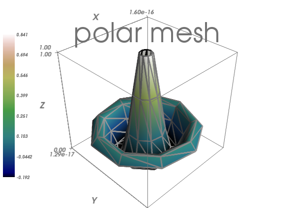

Figures and decorations
=======================

Figure management
-----------------

.. only:: latex

    Here is a list of functions useful to control the current figure

================================ ==============================================================
================================ ==============================================================
Get the current figure:		  `mlab.gcf()`
-------------------------------- --------------------------------------------------------------
Clear the current figure:	  `mlab.clf()`
-------------------------------- --------------------------------------------------------------
Set the current figure:		  `mlab.figure(1, bgcolor=(1, 1, 1), fgcolor=(0.5, 0.5, 0.5)`
-------------------------------- --------------------------------------------------------------
Save figure to image file:	  `mlab.savefig('foo.png', size=(300, 300))`
-------------------------------- --------------------------------------------------------------
Change the view:		  mlab.view(azimuth=45, elevation=54, distance=1.)
================================ ==============================================================

Changing plot properties
-------------------------

.. only:: latex

    In general, many properties of the various objects on the figure can
    be changed. If these visualization are created via `mlab` functions, 
    the easiest way to change them is to use the keyword arguments of
    these functions, as described in the docstrings.

.. topic:: **Example docstring:** `mlab.mesh`

    Plots a surface using grid-spaced data supplied as 2D arrays.
    
    **Function signatures**::
    
        mesh(x, y, z, ...)
    
    x, y, z are 2D arrays, all of the same shape, giving the positions of
    the vertices of the surface. The connectivity between these points is
    implied by the connectivity on the arrays.
    
    For simple structures (such as orthogonal grids) prefer the surf function,
    as it will create more efficient data structures.
    
    **Keyword arguments:**
    
        :color: the color of the vtk object. Overides the colormap,
                if any, when specified. This is specified as a
                triplet of float ranging from 0 to 1, eg (1, 1,
                1) for white.
                
        :colormap: type of colormap to use.
                   
        :extent: [xmin, xmax, ymin, ymax, zmin, zmax]
                 Default is the x, y, z arrays extents. Use
                 this to change the extent of the object
                 created.
                 
        :figure: Figure to populate.
                 
        :line_width:  The with of the lines, if any used. Must be a float.
                     Default: 2.0
                     
        :mask: boolean mask array to suppress some data points.
               
        :mask_points: If supplied, only one out of 'mask_points' data point is
                      displayed. This option is usefull to reduce the number
                      of points displayed on large datasets Must be an integer
                      or None.
                      
        :mode: the mode of the glyphs. Must be '2darrow' or '2dcircle' or
               '2dcross' or '2ddash' or '2ddiamond' or '2dhooked_arrow' or
               '2dsquare' or '2dthick_arrow' or '2dthick_cross' or
               '2dtriangle' or '2dvertex' or 'arrow' or 'cone' or 'cube' or
               'cylinder' or 'point' or 'sphere'. Default: sphere
               
        :name: the name of the vtk object created.

        :representation: the representation type used for the surface. Must be
                         'surface' or 'wireframe' or 'points' or 'mesh' or
                         'fancymesh'. Default: surface
                         
        :resolution: The resolution of the glyph created. For spheres, for
                     instance, this is the number of divisions along theta and
                     phi. Must be an integer. Default: 8
                     
        :scalars: optional scalar data.
                  
        :scale_factor: scale factor of the glyphs used to represent
                       the vertices, in fancy_mesh mode. Must be a float.
                       Default: 0.05
                       
        :scale_mode: the scaling mode for the glyphs
                     ('vector', 'scalar', or 'none').
                     
        :transparent: make the opacity of the actor depend on the
                      scalar.
                      
        :tube_radius: radius of the tubes used to represent the
                      lines, in mesh mode. If None, simple lines are used.
                      
        :tube_sides: number of sides of the tubes used to
                     represent the lines. Must be an integer. Default: 6
                     
        :vmax: vmax is used to scale the colormap
               If None, the max of the data will be used
               
        :vmin: vmin is used to scale the colormap
               If None, the min of the data will be used
    

Example:

.. sourcecode:: ipython

    In [1]: import numpy as np

    In [2]: r, theta = np.mgrid[0:10, -np.pi:np.pi:10j]

    In [3]: x = r*np.cos(theta)

    In [4]: y = r*np.sin(theta)

    In [5]: z = np.sin(r)/r

    In [6]: from enthought.mayavi import mlab

    In [7]: mlab.mesh(x, y, z, colormap='gist_earth', extent=[0, 1, 0, 1, 0, 1])
    Out[7]: <enthought.mayavi.modules.surface.Surface object at 0xde6f08c>

    In [8]: mlab.mesh(x, y, z, extent=[0, 1, 0, 1, 0, 1], 
       ...: representation='wireframe', line_width=1, color=(0.5, 0.5, 0.5))
    Out[8]: <enthought.mayavi.modules.surface.Surface object at 0xdd6a71c>

.. image:: polar_mesh.png
    :align: center
    :scale: 70

Decorations
-----------------

.. only:: latex

    Different items can be added to the figure to carry extra
    information, such as a colorbar or a title.

.. sourcecode:: ipython

    In [9]: mlab.colorbar(Out[7], orientation='vertical')
    Out[9]: <tvtk_classes.scalar_bar_actor.ScalarBarActor object at 0xd897f8c>

    In [10]: mlab.title('polar mesh')
    Out[10]: <enthought.mayavi.modules.text.Text object at 0xd8ed38c>

    In [11]: mlab.outline(Out[7])
    Out[11]: <enthought.mayavi.modules.outline.Outline object at 0xdd21b6c>

    In [12]: mlab.axes(Out[7])
    Out[12]: <enthought.mayavi.modules.axes.Axes object at 0xd2e4bcc>

.. warning:: 

    **extent:** If we specified extents for a plotting object,  
    `mlab.outline' and `mlab.axes` don't get them by default.

