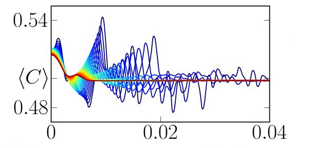
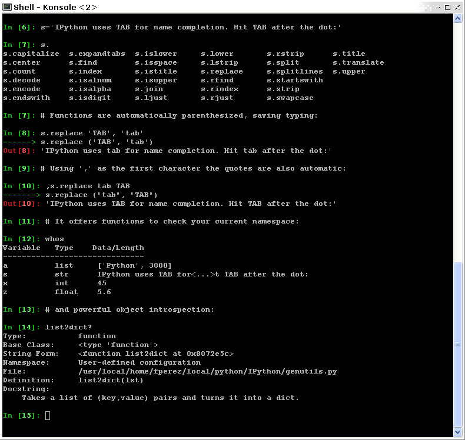

Python scientific computing ecosystem
======================================

**Authors**: *Fernando Perez, Emmanuelle Gouillart, Gaël Varoquaux,
Valentin Haenel*

Why Python?
------------

The scientist's needs
.......................

* Get data (simulation, experiment control),

* Manipulate and process data,

* Visualize results, quickly to understand, but also with high quality
  figures, for reports or publications.

Python's strengths
..................

* **Batteries included** Rich collection of already existing **bricks**
  of classic numerical methods, plotting or data processing tools. We
  don't want to re-program the plotting of a curve, a Fourier transform
  or a fitting algorithm. Don't reinvent the wheel!

* **Easy to learn** Most scientists are not payed as programmers, neither
  have they been trained so. They need to be able to draw a curve, smooth
  a signal, do a Fourier transform in a few minutes.

* **Easy communication** To keep code alive within a lab or a company
  it should be as readable as a book by collaborators, students, or
  maybe customers. Python syntax is simple, avoiding strange symbols or
  lengthy routine specifications that would divert the reader from
  mathematical or scientific understanding of the code.

* **Efficient code** Python numerical modules are computationally
  efficient. But needless to say that a very fast code becomes useless if
  too much time is spent writing it. Python aims for quick development
  times and quick execution times.

* **Universal** Python is a language used for many different problems.
  Learning Python avoids learning a new software for each new problem.

How does Python compare to other solutions?
............................................

Compiled languages: C, C++, Fortran...
~~~~~~~~~~~~~~~~~~~~~~~~~~~~~~~~~~~~~~~

:Pros:

  * Very fast. For heavy computations, it's difficult to outperform these
    languages.

:Cons:

  * Painful usage: no interactivity during development, mandatory
    compilation steps, verbose syntax, manual memory management. These
    are **difficult languages** for non programmers.

Matlab scripting language
~~~~~~~~~~~~~~~~~~~~~~~~~

:Pros:

  * Very rich collection of libraries with numerous algorithms, for many
    different domains. Fast execution because these libraries are often written
    in a compiled language.

  * Pleasant development environment: comprehensive and help, integrated
    editor, etc.

  * Commercial support is available.

:Cons:

  * Base language is quite poor and can become restrictive for advanced users.

  * Not free.

Julia
~~~~~~~

:Pros:

  * Fast code, yet interactive and simple.

  * Easily connects to Python or C.

:Cons:

  * Ecosystem limited to numerical computing.

  * Still young.

Other scripting languages: Scilab, Octave, R, IDL, etc.
~~~~~~~~~~~~~~~~~~~~~~~~~~~~~~~~~~~~~~~~~~~~~~~~~~~~~~~~~~~~~

:Pros:

  * Open-source, free, or at least cheaper than Matlab.

  * Some features can be very advanced (statistics in R, etc.)

:Cons:

  * Fewer available algorithms than in Matlab, and the language
    is not more advanced.

  * Some software are dedicated to one domain. Ex: Gnuplot to draw
    curves. These programs are very powerful, but they are restricted to
    a single type of usage, such as plotting.

Python
~~~~~~

:Pros:

  * Very rich scientific computing libraries

  * Well thought out language, allowing to write very readable and well
    structured code: we "code what we think".

  * Many libraries beyond scientific computing (web server,
    serial port access, etc.)

  * Free and open-source software, widely spread, with a vibrant community.

  * A variety of powerful environments to work in, such as
    `IPython <http://ipython.readthedocs.io/en/stable/>`__,
    `Spyder <https://pythonhosted.org/spyder>`__,
    `Jupyter notebooks <http://jupyter.org/>`__,
    `Pycharm <https://www.jetbrains.com/pycharm>`__

:Cons:

  * Not all the algorithms that can be found in more specialized
    software or toolboxes.

The Scientific Python ecosystem
--------------------------------

Unlike Matlab, or R, Python does not come with a pre-bundled set
of modules for scientific computing. Below are the basic building blocks
that can be combined to obtain a scientific computing environment:

|

**Python**, a generic and modern computing language

* The language: flow control, data types (``string``, ``int``),
  data collections (lists, dictionaries), etc.

* Modules of the standard library: string processing, file
  management, simple network protocols.

* A large number of specialized modules or applications written in
  Python: web framework, etc. ... and scientific
  computing.

* Development tools (automatic testing, documentation generation)

.. seealso::
   
   :ref:`chapter on Python language <python_language_chapter>`

|

**Core numeric libraries**

* **Numpy**: numerical computing with powerful **numerical arrays**
  objects, and routines to manipulate them. http://www.numpy.org/

  .. seealso::
     
     :ref:`chapter on numpy <numpy>`

* **Scipy** : high-level numerical routines.
  Optimization, regression, interpolation, etc http://www.scipy.org/

  .. seealso::
     
    :ref:`chapter on scipy <scipy>`

* **Matplotlib** : 2-D visualization, "publication-ready" plots
  http://matplotlib.org/

  .. seealso::
     
    :ref:`chapter on matplotlib <matplotlib>`

|

**Advanced interactive environments**:

* **IPython**, an advanced **Python console** http://ipython.org/

* **Jupyter**, **notebooks** in the browser http://jupyter.org/

|clear-floats|

.. image:: example_surface_from_irregular_data.jpg
      :scale: 60
      :align: right

|

**Domain-specific packages**,

* **Mayavi** for :ref:`3-D visualization <mayavi-label>`

* **pandas, statsmodels, seaborn** for :ref:`statistics <statistics>`

* **sympy** for :ref:`symbolic computing <sympy>`

* **scikit-image** for :ref:`image processing <scikit_image>`

* **scikit-learn** for :ref:`machine learning <scikit-learn_chapter>`

and much more packages not documented in the scipy lectures.

.. seealso::
   
   :ref:`chapters on advanced topics <advanced_topics_part>`

   :ref:`chapters on packages and applications <applications_part>`

|clear-floats|

..
    >>> import numpy as np
    >>> np.random.seed(4)

Before starting: Installing a working environment
--------------------------------------------------
Python comes in many flavors, and there are many ways to install it.
However, we recommend to install a scientific-computing distribution,
that comes readily with optimized versions of scientific modules.

**Under Linux**

If you have a recent distribution, most of the tools are probably
packaged, and it is recommended to use your package manager.

**Other systems**

There are several fully-featured Scientific Python distributions:

.. hlist::
  :columns: 3

  * `Anaconda <https://www.continuum.io/downloads>`_
  * `EPD <https://store.enthought.com/downloads>`_
  * `WinPython <https://winpython.github.io>`_

.. topic:: **Python 3 or Python 2?**

   In 2008, Python 3 was released. It is a major evolution of the
   language that made a few changes. Some old scientific code does not
   yet run under Python 3. However, this is infrequent and Python 3 comes
   with many benefits. We advise that you install Python 3.

The workflow: interactive environments and text editors
----------------------------------------------------------

**Interactive work to test and understand algorithms:** In this section, we
describe a workflow combining interactive work and consolidation.

Python is a general-purpose language. As such, there is not one blessed
environment to work in, and not only one way of using it. Although
this makes it harder for beginners to find their way, it makes it
possible for Python to be used for programs, in web servers, or
embedded devices.

Interactive work
.................

We recommend an interactive work with the `IPython
<http://ipython.org>`__ console, or its offspring, the `Jupyter notebook
<http://jupyter.readthedocs.io/en/latest/content-quickstart.html>`_. They
are handy to explore and understand algorithms.

.. sidebar:: Under the notebook

   To execute code, press "shift enter"

Start `ipython`:

.. sourcecode:: ipython

    In [1]: print('Hello world')
    Hello world

Getting help by using the **?** operator after an object:

.. sourcecode:: ipython

    In [2]: print?
    Type:		builtin_function_or_method
    Base Class:	        <type 'builtin_function_or_method'>
    String Form:	<built-in function print>
    Namespace:	        Python builtin
    Docstring:
	print(value, ..., sep=' ', end='\n', file=sys.stdout)

	Prints the values to a stream, or to sys.stdout by default.
	Optional keyword arguments:
	file: a file-like object (stream); defaults to the current sys.stdout.
	sep:  string inserted between values, default a space.
	end:  string appended after the last value, default a newline.

.. seealso:: 

    * IPython user manual: http://ipython.org/ipython-doc/dev/index.html

    * Jupyter Notebook QuickStart:
      http://jupyter.readthedocs.io/en/latest/content-quickstart.html

Elaboration of the work in an editor
..........................................

As you move forward, it will be important to not only work interactively,
but also to create and reuse Python files. For this, a powerful code editor
will get you far. Here are several good easy-to-use editors:

  * `Spyder <https://pythonhosted.org/spyder/>`_: integrates an IPython
    console, a debugger, a profiler...
  * `PyCharm <https://www.jetbrains.com/pycharm>`_: integrates an IPython
    console, notebooks, a debugger... (freely available,
    but commercial)
  * `Atom <https://atom.io>`_

Some of these are shipped by the various scientific Python distributions,
and you can find them in the menus.

As an exercise, create a file `my_file.py` in a code editor, and add the
following lines::

    s = 'Hello world'
    print(s)

Now, you can run it in IPython console or a notebook and explore the
resulting variables:

.. sourcecode:: ipython

    In [1]: %run my_file.py
    Hello world

    In [2]: s
    Out[2]: 'Hello world'

    In [3]: %whos
    Variable   Type    Data/Info
    ----------------------------
    s          str     Hello world

.. topic:: **From a script to functions**

    While it is tempting to work only with scripts, that is a file full
    of instructions following each other, do plan to progressively evolve
    the script to a set of functions:

    * A script is not reusable, functions are.

    * Thinking in terms of functions helps breaking the problem in small
      blocks.

IPython and Jupyter Tips and Tricks
....................................

The user manuals contain a wealth of information. Here we give a quick
introduction to four useful features: *history*, *tab completion*, *magic
functions*, and *aliases*.

|

**Command history** Like a UNIX shell, the IPython console supports
command history. Type *up* and *down* to navigate previously typed
commands:

.. sourcecode:: ipython

    In [1]: x = 10

    In [2]: <UP>

    In [2]: x = 10

|

**Tab completion** Tab completion, is a convenient way to explore the
structure of any object you’re dealing with. Simply type object_name.<TAB> to
view the object’s attributes. Besides Python objects and keywords, tab
completion also works on file and directory names.*

.. sourcecode:: ipython

    In [1]: x = 10

    In [2]: x.<TAB>
    x.bit_length   x.denominator  x.imag         x.real         
    x.conjugate    x.from_bytes   x.numerator    x.to_bytes     

|

**Magic functions**
The console and the notebooks support so-called *magic* functions by prefixing a command with the
``%`` character. For example, the ``run`` and ``whos`` functions from the
previous section are magic functions. Note that, the setting ``automagic``,
which is enabled by default, allows you to omit the preceding ``%`` sign. Thus,
you can just type the magic function and it will work.

Other useful magic functions are:

* ``%cd`` to change the current directory.

  .. sourcecode:: ipython

    In [1]: cd /tmp
    /tmp

* ``%cpaste`` allows you to paste code, especially code from websites which has
  been prefixed with the standard Python prompt (e.g. ``>>>``) or with an ipython
  prompt, (e.g. ``in [3]``):

  .. sourcecode:: ipython

    In [2]: %cpaste
    Pasting code; enter '--' alone on the line to stop or use Ctrl-D.
    :>>> for i in range(3):
    :...     print(i)
    :--
    0
    1
    2

* ``%timeit`` allows you to time the execution of short snippets using the
  ``timeit`` module from the standard library:

  .. sourcecode:: ipython

      In [3]: %timeit x = 10
      10000000 loops, best of 3: 39 ns per loop

  .. seealso:: :ref:`Chapter on optimizing code <optimizing_code_chapter>`

* ``%debug`` allows you to enter post-mortem debugging. That is to say, if the
  code you try to execute, raises an exception, using ``%debug`` will enter the
  debugger at the point where the exception was thrown.

  .. sourcecode:: ipython

    In [4]: x === 10
      File "<ipython-input-6-12fd421b5f28>", line 1
        x === 10
            ^
    SyntaxError: invalid syntax

    In [5]: %debug
    > /.../IPython/core/compilerop.py (87)ast_parse()
         86         and are passed to the built-in compile function."""
    ---> 87         return compile(source, filename, symbol, self.flags | PyCF_ONLY_AST, 1)
         88

    ipdb>locals()
    {'source': u'x === 10\n', 'symbol': 'exec', 'self':
    <IPython.core.compilerop.CachingCompiler instance at 0x2ad8ef0>,
    'filename': '<ipython-input-6-12fd421b5f28>'}

  .. seealso:: :ref:`Chapter on debugging <debugging_chapter>`

|

**Aliases**
Furthermore IPython ships with various *aliases* which emulate common UNIX
command line tools such as ``ls`` to list files, ``cp`` to copy files and ``rm`` to
remove files (a full list of aliases is shown when typing ``alias``).

.. topic:: **Getting help**

    * The built-in cheat-sheet is accessible via the ``%quickref`` magic
      function.

    * A list of all available magic functions is shown when typing ``%magic``.

.. :vim:spell:

