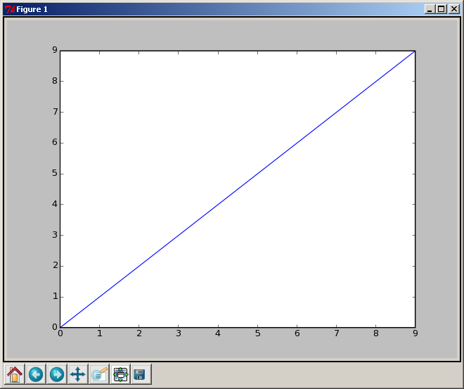
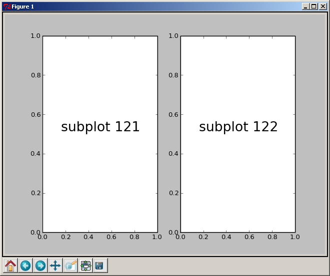
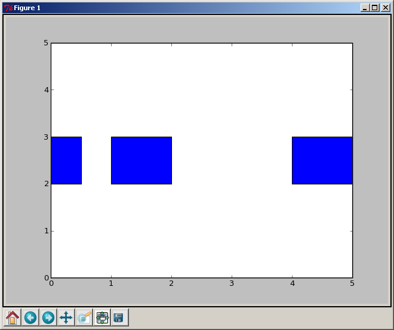
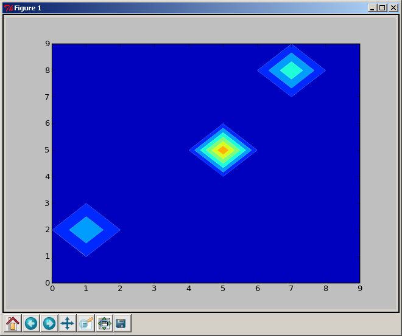
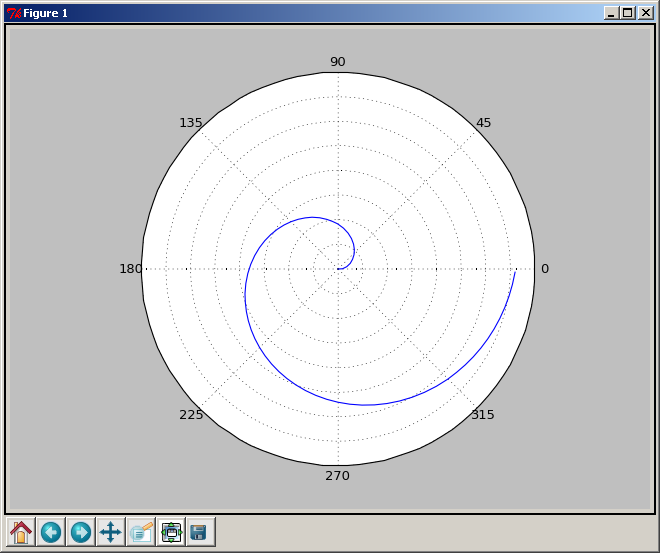
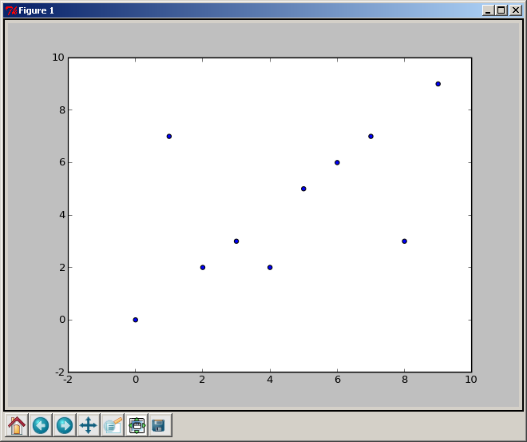

.. _matplotlib:

Matplotlib
==========

:author: Mike Müller

Introduction
------------

``matplotlib`` is probably the single most used Python package
for 2D-graphics. It provides both a very quick way to visualize
data from Python and publication-quality figures in many formats.
We are going to explore matplotlib in interactive mode covering
most common cases. We also look at the class library which is provided
with an object-oriented interface.

IPython and the pylab mode
---------------------------

IPython
........

`IPython <http://ipython.org/>`_ is an enhanced interactive Python shell
that has lots of interesting features including named inputs and outputs,
access to shell commands, improved debugging and many more. When we start
it with the command line argument ``-pylab`` (``--pylab`` since IPython
version 0.12), it allows interactive ``matplotlib`` sessions that has
Matlab/Mathematica-like functionality.

pylab
.......

``pylab`` provides a procedural interface to the ``matplotlib``
object-oriented plotting library. It is modeled closely
after Matlab(TM). Therefore, the majority of plotting
commands in ``pylab`` has Matlab(TM) analogs with similar arguments.
Important commands are explained with interactive examples.

Simple Plots
-------------

Let's start an interactive session::

    $ ipython -pylab

This brings us to the IPython prompt:

.. code-block:: python

    IPython 0.8.1 -- An enhanced Interactive Python.
    ?       -> Introduction to IPython's features.
    %magic  -> Information about IPython's 'magic' % functions.
    help    -> Python's own help system.
    object? -> Details about 'object'. ?object also works, ?? prints more.
    
    Welcome to pylab, a matplotlib-based Python environment.
    For more information, type 'help(pylab)'.

.. code-block:: python
        
    In [1]:

Now we can make our first, really simple plot:

.. code-block:: python

    In [1]: plot(range(10))
    Out[1]: [<matplotlib.lines.Line2D instance at 0x01AA26E8>]

    In [2]:

The numbers form 0 through 9 are plotted:

Now we can interactively add features to or plot:

.. code-block:: python

    In [2]: xlabel('measured')
    Out[2]: <matplotlib.text.Text instance at 0x01A9D210>

    In [3]: ylabel('calculated')
    Out[3]: <matplotlib.text.Text instance at 0x01A9D918>

    In [4]: title('Measured vs. calculated')
    Out[4]: <matplotlib.text.Text instance at 0x01A9DF80>

    In [5]: grid(True)

    In [6]:

We get a reference to our plot:

.. code-block:: python

    In [6]: my_plot = gca()

and to our line we plotted, which is the first in the plot:

.. code-block:: python
    
    In [7]: line = my_plot.lines[0]

Now we can set properties using ``set_something`` methods:

.. code-block:: python

    In [8]: line.set_marker('o')

or the ``setp`` function:

.. code-block:: python

    In [9]: setp(line, color='g')
    Out[9]: [None]

To apply the new properties we need to redraw the screen:

.. code-block:: python

    In [10]: draw()

We can also add several lines to one plot:

.. code-block:: python  

    In [1]: x = arange(100)

    In [2]: linear = arange(100)

    In [3]: square = [v * v for v in arange(0, 10, 0.1)]

    In [4]: lines = plot(x, linear, x, square)
    
Let's add a legend:

.. code-block:: python

    In [5]: legend(('linear', 'square'))
    Out[5]: <matplotlib.legend.Legend instance at 0x01BBC170>

This does not look particularly nice. We would rather like to have
it at the left. So we clean the old graph:

.. code-block:: python

    In [6]: clf()

and print it anew providing new line styles (a green dotted
line with crosses for the linear and a red dashed line with
circles for the square graph):

.. code-block:: python

    In [7]: lines = plot(x, linear, 'g:+', x, square, 'r--o')

Now we add the legend at the upper left corner:

.. code-block:: python

    In [8]: l = legend(('linear', 'square'), loc='upper left')

The result looks like this:

.. image:: figures/legend.png
    :width: 50%

Exercises
+++++++++

1) Plot a simple graph of a sinus function in the range 0 to 3
   with a step size of 0.01.

2) Make the line red. Add diamond-shaped markers with size of 5.

3) Add a legend and a grid to the plot.

Properties
----------

So far we have used properties for the lines.
There are three possibilities to set them:

1) as keyword arguments at creation time:
``plot(x, linear, 'g:+', x, square, 'r--o')``.

2) with the function ``setp``: ``setp(line, color='g')``.

3) using the ``set_something`` methods: ``line.set_marker('o')``

Lines have several properties as shown in the following table:

=============== =====================================================================
Property        Value
=============== =====================================================================
alpha           alpha transparency on 0-1 scale
antialiased     True or False - use antialised rendering
color           matplotlib color arg
data_clipping   whether to use numeric to clip data
label           string optionally used for legend
linestyle       one of ``-`` ``:`` ``-.`` ``-``
linewidth       float, the line width in points
marker          one of ``+`` ``,`` ``o`` ``.`` ``s`` ``v`` ``x`` ``>`` ``<``, etc
markeredgewidth line width around the marker symbol
markeredgecolor edge color if a marker is used
markerfacecolor face color if a marker is used
markersize      size of the marker in points
=============== =====================================================================

There are many line styles that can be specified with symbols:

=========== ======================================
Symbol      Description
=========== ======================================
 ``-``      solid line
 ``--``     dashed line
 ``-.``     dash-dot line
 ``:``      dotted line
 ``.``      points
 ``,``      pixels
 ``o``      circle symbols
 ``^``      triangle up symbols
 ``v``      triangle down symbols
 ``<``      triangle left symbols
 ``>``      triangle right symbols
 ``s``      square symbols
 ``+``      plus symbols
 ``x``      cross symbols
 ``D``      diamond symbols
 ``d``      thin diamond symbols
 ``1``      tripod down symbols
 ``2``      tripod up symbols
 ``3``      tripod left symbols
 ``4``      tripod right symbols
 ``h``      hexagon symbols
 ``H``      rotated hexagon symbols
 ``p``      pentagon symbols
 ``|``      vertical line symbols
 ``_``      horizontal line symbols
 ``steps``  use gnuplot style 'steps' # kwarg only
=========== ======================================
 
Colors can be given in many ways: one-letter abbreviations, gray scale
intensity from 0 to 1, RGB in hex and tuple format as well as
any legal html color name.

The one-letter abbreviations are very handy for quick work.
With following you can get quite a few things done:

============ =========
Abbreviation Color
============ =========
    b        blue
    g        green
    r        red
    c        cyan
    m        magenta
    y        yellow
    k        black
    w        white
============ =========

Other objects also have properties. The following table list
the text properties:

==================== ========================================================== 
Property             Value
==================== ==========================================================
alpha                alpha transparency on 0-1 scale
color                matplotlib color arg
family               set the font family, eg sans-serif, cursive, fantasy
fontangle            the font slant, one of normal, italic, oblique
horizontalalignment  left, right or center
multialignment       left, right or center only for multiline strings
name                 font name, eg, Sans, Courier, Helvetica
position             x,y location
variant              font variant, eg normal, small-caps
rotation             angle in degrees for rotated text
size                 fontsize in points, eg, 8, 10, 12
style                font style, one of normal, italic, oblique
text                 set the text string itself
verticalalignment    top, bottom or center
weight               font weight, e.g. normal, bold, heavy, light
==================== ==========================================================

Exercise
++++++++

1) Apply different line styles to a plot. Change line color and
   thickness as well as the size and the kind of the marker.
   Experiment with different styles.

Text
----

We've already used some commands to add text to our figure: ``xlabel``
``ylabel``, and ``title``.

There are two functions to put text at a defined position.
``text`` adds the text with data coordinates:

.. code-block:: python

    In [2]: plot(arange(10))
    In [3]: t1 = text(5, 5, 'Text in the middle')

``figtext`` uses figure coordinates form 0 to 1:

.. code-block:: python   

    In [4]: t2 = figtext(0.8, 0.8, 'Upper right text')

.. image:: figures/text.png
    :width: 50%
    
``matplotlib`` supports TeX mathematical expression. So ``r'$\pi$'``
will show up as:

.. math::

     \pi

If you want to get more control over where the text goes, you
use annotations:

.. code-block:: python

    In [4]: ax = gca()
    In [5]: ax.annotate('Here is something special', xy = (1, 1))

We will write the text at the position (1, 1) in terms of data.
There are many optional arguments that help to customize
the position of the text.  The arguments ``textcoords`` and
``xycoords`` specifies what ``x`` and ``y`` mean: 

==================== ===================================================
argument             coordinate system
==================== ===================================================
figure points        points from the lower left corner of the figure
figure pixels        pixels from the lower left corner of the figure
figure fraction      0,0 is lower left of figure and 1,1 is upper, right
axes points          points from lower left corner of axes
axes pixels          pixels from lower left corner of axes
axes fraction        0,1 is lower left of axes and 1,1 is upper right
data                 use the axes data coordinate system
==================== ===================================================

If we do not supply ``xycoords``, the text will be written at ``xy``.

Furthermore, we can use an arrow whose appearance can also be described
in detail:

.. code-block:: python

    In [14]: plot(arange(10))
    Out[14]: [<matplotlib.lines.Line2D instance at 0x01BB15D0>]

    In [15]: ax = gca()

    In [16]: ax.annotate('Here is something special', xy = (2, 1), xytext=(1,5))
    Out[16]: <matplotlib.text.Annotation instance at 0x01BB1648>

    In [17]: ax.annotate('Here is something special', xy = (2, 1), xytext=(1,5),
       ....: arrowprops={'facecolor': 'r'})
    

Exercise
++++++++

1) Annotate a line at two places with text. Use green and red arrows
   and align it according to ``figure points`` and ``data``.

Ticks
-----

Where and What
++++++++++++++

Well formatted ticks are an important part of publishing-ready
figures. ``matplotlib`` provides a totally configurable system
for ticks. There are tick locators to specify where ticks
should appear and tick formatters to make ticks look like the way you want.
Major and minor ticks can be located and formatted independently from
each other. Per default minor ticks are not shown, i.e. there is only
an empty list for them because it is as ``NullLocator`` (see below).

Tick Locators
+++++++++++++

There are several locators for different kind of requirements:

=============== ===============================================================
Class           Description
=============== ===============================================================
NullLocator     no ticks
IndexLocator    locator for index plots (e.g. where ``x = range(len(y)``)
LinearLocator   evenly spaced ticks from min to max
LogLocator      logarithmically ticks from min to max
MultipleLocator ticks and range are a multiple of base; either integer or float
AutoLocator     choose a MultipleLocator and dynamically reassign
=============== ===============================================================

All of these locators derive from the base class ``matplotlib.ticker.Locator``.
You can make your own locator deriving from it.

Handling dates as ticks can be especially tricky. Therefore, ``matplotlib``
provides special locators in ``matplotlib.dates``:

======================= ===========================================
Class                   Description
======================= ===========================================
MinuteLocator           locate minutes
HourLocator             locate hours
DayLocator              locate specified days of the month
WeekdayLocator          locate days of the week, e.g. MO, TU
MonthLocator            locate months, e.g. 10 for October
YearLocator             locate years that are multiples of base
RRuleLocator            locate using a matplotlib.dates.rrule
======================= ===========================================

Tick Formatters
+++++++++++++++

Similarly to locators, there are formatters:

======================= =============================================
Class                   Description
======================= =============================================
NullFormatter           no labels on the ticks
FixedFormatter          set the strings manually for the labels
FuncFormatter           user defined function sets the labels
FormatStrFormatter      use a sprintf format string
IndexFormatter          cycle through fixed strings by tick position
ScalarFormatter         default formatter for scalars;
                        autopick the fmt string
LogFormatter            formatter for log axes
DateFormatter           use an strftime string to format the date
======================= =============================================

All of these formatters derive from the base class ``matplotlib.ticker.Formatter``.
You can make your own formatter deriving from it.

Now we set our major locator to 2 and the minor locator
to 1. We also format the numbers as decimals using the
``FormatStrFormatter``:

.. code-block:: python

    In [5]: major_locator = MultipleLocator(2)

    In [6]: major_formatter = FormatStrFormatter('%5.2f')

    In [7]: minor_locator = MultipleLocator(1)

    In [8]: ax.xaxis.set_major_locator(major_locator)

    In [9]: ax.xaxis.set_minor_locator(minor_locator)

    In [10]: ax.xaxis.set_major_formatter(major_formatter)

    In [10]: draw()

After we redraw the figure our x axis should look like this:

.. raw:: pdf

     Spacer 0 10

.. image:: figures/ticks.png
    :width: 50%

Exercises
+++++++++

1) Plot a graph with dates for one year with daily
   values at the x axis using the built-in module ``datetime``.

2) Format the dates in such a way that only the first day
   of the month is shown.

3) Display the dates with and without the year. Show the month
   as number and as first three letters of the month name.

Figures, Subplots, and Axes
---------------------------

The Hierarchy
+++++++++++++

So far we have used implicit figure and axes creation.
This is handy for fast plots. We can have more control over
the display using ``figure``, ``subplot``, and ``axes`` explicitly.
A ``figure`` in ``matplotlib`` means the whole window in the
user interface. Within this ``figure`` there can be subplots.
While ``subplot`` positions the plots in a regular grid, ``axes``
allows free placement within the ``figure``. Both can
be useful depending on your intention.
We've already work with figures and subplots without explicitly
calling them.  When we call ``plot`` ``matplotlib`` calls ``gca()`` to
get the current axes and ``gca`` in turn calls ``gcf()`` to
get the current figure. If there is none it calls ``figure()``
to make one, strictly speaking, to make a ``subplot(111)``.
Let's look at the details.

Figures
++++++++

A ``figure`` is  the windows in the GUI that has "Figure #" as
title. Figures are numbered starting from 1 as opposed to the
normal Python way starting from 0. This is clearly MATLAB-style.
There are several parameters that determine how the figure
looks like:

==============    ======================= ============================================
Argument          Default                 Description
==============    ======================= ============================================
``num``           ``1``                    number of figure
``figsize``       ``figure.figsize``       figure size in in inches (width, height)
``dpi``           ``figure.dpi``           resolution in dots per inch
``facecolor``     ``figure.facecolor``     color of the drawing background
``edgecolor``     ``figure.edgecolor``     color of edge around the drawing background
``frameon``       ``True``                 draw figure frame or not
==============    ======================= ============================================

The defaults can be specified in the resource file and
will be used most of the time. Only the number of the figure
is frequently changed.

When you work with the GUI you can close a figure by clicking on the
x in the upper right corner. But you can close a figure
programmatically by calling ``close``. Depending on the argument it closes
(1) the current figure (no argument), (2) a specific figure (figure number or figure
instance as argument), or (3) all figures (``all`` as argument).

As with other objects, you can set figure properties also ``setp``
or with the ``set_something`` methods.

Subplots
++++++++

With ``subplot`` you can arrange plots in regular grid. You need to
specify the number of rows and columns and the number of the plot.

A plot with two rows and one column is created with
``subplot(211)`` and ``subplot(212)``. The result looks like this:

.. raw:: pdf

     Spacer 0 10

.. image:: figures/subplots_horizontal.png
    :width: 25%

If you want two plots side by side, you create one row and two columns
with ``subplot(121)`` and ``subplot(112)``. The result looks like this:

.. raw:: pdf

     Spacer 0 10

You can arrange as many figures as you want. A two-by-two arrangement can
be created with ``subplot(221)``,  ``subplot(222)``, ``subplot(223)``, and
``subplot(224)``. The result looks like this:

.. raw:: pdf

     Spacer 0 10

.. image:: figures/subplots_four.png
    :width: 25%

Frequently, you don't want all subplots to have ticks or labels.
You can set the ``xticklabels`` or the ``yticklabels`` to an empty
list (``[]``). Every subplot defines the methods ``'is_first_row``,
``is_first_col``, ``is_last_row``, ``is_last_col``. These can help to
set ticks and labels only for the outer pots.

Axes
++++

Axes are very similar to subplots but allow placement of plots
at any location in the figure.  So if we want to put a smaller
plot inside a bigger one we do so with ``axes``:

.. code-block:: python

    In [22]: plot(x)
    Out[22]: [<matplotlib.lines.Line2D instance at 0x02C9CE90>]

    In [23]: a = axes([0.2, 0.5, 0.25, 0.25])

    In [24]: plot(x)

The result looks like this:

.. image:: figures/axes.png
    :width: 25%

Exercises
+++++++++

1) Draw two figures, one 5 by 5, one 10 by 10 inches.

2) Add four subplots to one figure. Add labels and ticks only to
   the outermost axes.

3) Place a small plot in one bigger plot.

Other Types of Plots
--------------------

Many More
+++++++++
So far we have used only line plots. ``matplotlib`` offers many more types
of plots. We will have a brief look at some of them. All functions have many
optional arguments that are not shown here.

Bar Charts
++++++++++

The function ``bar`` creates a new bar chart:

.. code-block:: python

    bar([1, 2, 3], [4, 3, 7])

Now we have three bars starting at 1, 2, and 3 with height of
4, 3, 7 respectively:

.. raw:: pdf

     Spacer 0 10

.. image:: figures/bar.png
            :width: 25%

The default column width is 0.8. It can be changed with
common methods by setting ``width``. As it can be ``color`` and
``bottom``, we can also set an error bar with ``yerr`` or ``xerr``.

Horizontal Bar Charts
+++++++++++++++++++++

The function ``barh`` creates an vertical bar chart.
Using the same data:

.. code-block:: python

    barh([1, 2, 3], [4, 3, 7])

We get:

.. raw:: pdf

     Spacer 0 10

.. image:: figures/barh.png
            :width: 25%

Broken Horizontal Bar Charts
++++++++++++++++++++++++++++

We can also have discontinuous vertical bars with ``broken_barh``.
We specify start and width of the range in y-direction and all
start-width pairs in x-direction:

.. code-block:: python

    yrange = (2, 1)
    xranges = ([0, 0.5], [1, 1], [4, 1])
    broken_barh(xranges, yrange)

We changes the extension of the y-axis to make plot look nicer:

.. code-block:: python

    ax = gca()
    ax.set_ylim(0, 5)
    (0, 5)
    draw()
    

and get this: 

.. raw:: pdf

     Spacer 0 10

Box and Whisker Plots
+++++++++++++++++++++

We can draw box and whisker plots:

.. code-block:: python

         boxplot((arange(2, 10), arange(1, 5)))

We want to have the whiskers well within the plot and therefore
increase the y axis:

.. code-block:: python

         ax = gca()
         ax.set_ylim(0, 12)
         draw()

Our plot looks like this:

.. image:: figures/boxplot.png
            :width: 25%

The range of the whiskers can be determined with the
argument ``whis``, which defaults to 1.5. The range of
the whiskers is between the most extreme data point
within ``whis*(75%-25%)`` of the data.

Contour Plots
+++++++++++++

We can also do contour plots. We define arrays for the
x and y coordinates:

.. code-block:: python

    x = y = arange(10)

and also a 2D array for z:

.. code-block:: python

    z = ones((10, 10))
    z[5,5] = 7
    z[2,1] = 3
    z[8,7] = 4
    z
    array([[ 1.,  1.,  1.,  1.,  1.,  1.,  1.,  1.,  1.,  1.],
           [ 1.,  1.,  1.,  1.,  1.,  1.,  1.,  1.,  1.,  1.],
           [ 1.,  3.,  1.,  1.,  1.,  1.,  1.,  1.,  1.,  1.],
           [ 1.,  1.,  1.,  1.,  1.,  1.,  1.,  1.,  1.,  1.],
           [ 1.,  1.,  1.,  1.,  1.,  1.,  1.,  1.,  1.,  1.],
           [ 1.,  1.,  1.,  1.,  1.,  7.,  1.,  1.,  1.,  1.],
           [ 1.,  1.,  1.,  1.,  1.,  1.,  1.,  1.,  1.,  1.],
           [ 1.,  1.,  1.,  1.,  1.,  1.,  1.,  1.,  1.,  1.],
           [ 1.,  1.,  1.,  1.,  1.,  1.,  1.,  4.,  1.,  1.],
           [ 1.,  1.,  1.,  1.,  1.,  1.,  1.,  1.,  1.,  1.]])
        
Now we can make a simple contour plot:

.. code-block:: python

    contour(x, x, z)

Our plot looks like this:

.. image:: figures/contour.png
            :width: 25%

We can also fill the area. We just use numbers form 0 to 9 for
the values ``v``:

.. code-block:: python

    v = x
    contourf(x, x, z, v)

Now our plot area is filled:

Histograms
+++++++++++

We can make histograms. Let's get some normally distributed
random numbers from ``numpy``:

.. code-block:: python

    import numpy as N
    r_numbers = N.random.normal(size= 1000)

Now we make a simple histogram:

.. code-block:: python
    
    hist(r_numbers)

With 100 numbers our figure looks pretty good:

.. raw:: pdf

     Spacer 0 10

.. image:: figures/hist.png
            :width: 25%

Loglog Plots
++++++++++++

Plots with logarithmic scales are easy:

.. code-block:: python

    loglog(arange(1000))

We set the mayor and minor grid:

.. code-block:: python
    
    grid(True)
    grid(True, which='minor')
    
Now we have loglog plot:

.. image:: figures/loglog.png
            :width: 25%

If we want only one axis with a logarithmic scale we can
use ``semilogx`` or ``semilogy``.

Pie Charts
++++++++++

Pie charts can also be created with a few lines:

.. code-block:: python

    data = [500, 700, 300]
    labels = ['cats', 'dogs', 'other']
    pie(data, labels=labels)
    
The result looks as expected:

.. image:: figures/pie.png
            :width: 25%

Polar Plots
+++++++++++

Polar plots are also possible. Let's define our ``r`` from
0 to 360 and our ``theta`` from 0 to 360 degrees. We need to
convert them to radians:

.. code-block:: python

        r = arange(360)
        theta = r / (180/pi)

Now plot in polar coordinates:

.. code-block:: python
    
    polar(theta, r)

We get a nice spiral:

Arrow Plots
++++++++++++

Plotting arrows in 2D plane can be achieved with ``quiver``.
We define the x and y coordinates of the arrow shafts:

.. code-block:: python

    x = y = arange(10)

The x and y components of the arrows are specified as 2D arrays:

.. code-block:: python

    u = ones((10, 10))
    v = ones((10, 10))
    u[4, 4] = 3
    v[1, 1] = -1

Now we can plot the arrows:

.. code-block:: python

    quiver(x, y, u, v)

All arrows point to the upper right, except two. The one
at the location (4, 4) has 3 units in x-direction and the
other at location (1, 1) has -1 unit in y direction:

.. raw:: pdf

     Spacer 0 10

.. image:: figures/quiver.png
            :width: 25%
         
Scatter Plots
+++++++++++++

Scatter plots print x vs. y diagrams. We define ``x`` and ``y``
and make some point in ``y`` random:

.. code-block:: python

    x = arange(10)
    y = arange(10)
    y[1] = 7
    y[4] = 2
    y[8] = 3

Now make a scatter plot::
    
    scatter(x, y)

The three different values for ``y`` break out of the line:

.. raw:: pdf

     Spacer 0 10

         

Sparsity Pattern Plots
++++++++++++++++++++++

Working with sparse matrices, it is often of interest as
how the matrix looks like in terms of sparsity.
We take an identity matrix as an example:

.. code-block:: python

    i = identity(10)
    i
    array([[1, 0, 0, 0, 0, 0, 0, 0, 0, 0],
           [0, 1, 0, 0, 0, 0, 0, 0, 0, 0],
           [0, 0, 1, 0, 0, 0, 0, 0, 0, 0],
           [0, 0, 0, 1, 0, 0, 0, 0, 0, 0],
           [0, 0, 0, 0, 1, 0, 0, 0, 0, 0],
           [0, 0, 0, 0, 0, 1, 0, 0, 0, 0],
           [0, 0, 0, 0, 0, 0, 1, 0, 0, 0],
           [0, 0, 0, 0, 0, 0, 0, 1, 0, 0],
           [0, 0, 0, 0, 0, 0, 0, 0, 1, 0],
           [0, 0, 0, 0, 0, 0, 0, 0, 0, 1]])

Now we look at it more visually:

.. code-block:: python

    spy(i)

.. image:: figures/spy.png
            :width: 25%

Stem Plots
++++++++++

Stem plots vertical lines at the given x location up to
the specified y location. Let's reuse ``x`` and ``y``
from our scatter (see above):

.. code-block:: python

    stem(x, y)

.. image:: figures/stem.png
            :width: 25%

Date Plots
++++++++++

There is a function for creating date plots.
Let's define 10 dates starting at January 1st 2000
at 15.day intervals:

.. code-block:: python

    import datetime
    d1 = datetime.datetime(2000, 1, 1)
    delta = datetime.timedelta(15)
    dates = [d1 + x * delta for x in range(1
    dates
    [datetime.datetime(2000, 1, 1, 0, 0),
     datetime.datetime(2000, 1, 16, 0, 0),
     datetime.datetime(2000, 1, 31, 0, 0),
     datetime.datetime(2000, 2, 15, 0, 0),
     datetime.datetime(2000, 3, 1, 0, 0),
     datetime.datetime(2000, 3, 16, 0, 0),
     datetime.datetime(2000, 3, 31, 0, 0),
     datetime.datetime(2000, 4, 15, 0, 0),
     datetime.datetime(2000, 4, 30, 0, 0),
     datetime.datetime(2000, 5, 15, 0, 0)]

We reuse our data from the scatter plot (see above):

.. code-block:: python

    y
    array([0, 7, 2, 3, 2, 5, 6, 7, 3, 9])
     
Now we can plot the dates at the x axis:

.. code-block:: python

    plot_date(dates, y)

.. image:: figures/date.png
            :width: 25%

The Class Library
-----------------

So far we have used the ``pylab`` interface only. As the name
suggests it is just wrapper around the class library. All ``pylab``
commands can be invoked via the class library using an object-oriented
approach.

The Figure Class
++++++++++++++++

The class ``Figure`` lives in the module ``matplotlib.figure``.
Its constructor takes these arguments:

.. code-block:: python

    figsize=None, dpi=None, facecolor=None, edgecolor=None,
    linewidth=1.0, frameon=True, subplotpars=None

Comparing this with the arguments of ``figure`` in ``pylab`` shows
significant overlap:

.. code-block:: python

    num=None, figsize=None, dpi=None, facecolor=None
    edgecolor=None, frameon=True

``Figure`` provides lots of methods, many of them have equivalents in
``pylab``. The methods ``add_axes`` and ``add_subplot`` are called if new
axes or subplot are created with ``axes`` or ``subplot`` in ``pylab``.
Also the method ``gca`` maps directly to ``pylab`` as do ``legend``,
``text`` and many others.

There are also several ``set_something`` method such as ``set_facecolor`` or
``set_edgecolor`` that will be called through ``pylab`` to set properties of
the figure. ``Figure`` also implements ``get_something`` methods
such as ``get_axes`` or ``get_facecolor`` to get properties of the figure.

The Classes Axes and Subplot
++++++++++++++++++++++++++++

In the class  ``Axes`` we find most of the figure elements such as
``Axis``, ``Tick``, ``Line2D``, or ``Text``. It also sets the coordinate
system. The class ``Subplot`` inherits from ``Axes`` and adds some
more functionality to arrange the plots in a grid.

Analogous to ``Figure``, it has methods to get and set properties
and methods already encountered as functions in ``pylab`` such as
``annotate``. In addition, ``Axes`` has methods for all types of plots
shown in the previous section.

Other Classes
+++++++++++++

Other classes such as ``text``, ``Legend`` or ``Ticker`` are setup very
similarly. They can be understood mostly by comparing to the ``pylab``
interface.

Example
+++++++

Let's look at an example for using the object-oriented API:

.. literalinclude:: matplotlib_examples/oo.py

.. .. code-block:: python
    :include: matplotlib_examples/oo.py

Since we are not in the interactive pylab-mode, we
need to import the class ``Figure`` explicitly (``#1``).

We set the size of our figure to be 8 by 5 inches (``#2``).
Now we initialize a new figure (``#3``) and add a subplot
to the figure (``#4``). The ``111`` says one plot at
position 1, 1 just as in MATLAB. We create a new plot with
the numbers from 0 to 9 and at the same time get a reference
to our line (``#5``). We can add several things to our plot.
So we set a title and labels for the x and y axis (``#6``).

We also want to see the grid (``#7``) and would like to have
little filled circles as markers (``#8``).

There are many different backends for rendering our figure.
We use the Anti-Grain Geometry toolkit (http://www.antigrain.com)
to render our figure. First, we import the backend (``#9``), then
we create a new canvas that renders our figure (``#10``).
We save our figure in a png-file with a resolution of 80 dpi (``#11``).

We can use several GUI toolkits directly. So we import Tkinter (``#12``)
as well as the corresponding backend (``#13``).
Now we have to do some basic GUI programming work. We make a root
object for our GUI (``#14``) and feed it together with our figure to
the backend to get our canvas (``15``). We call the show method (``#16``),
pack our widget (``#17``), and call the Tkinter mainloop to start
the application (``#18``). You should see GUI window with the figure
on your screen. After closing the screen, the next part, the script, will
be executed.

We would like to create a screen display just as we would use
``pylab``. Therefore we import a helper (``#19``) and ``pylab``
itself (``#20``). We create a normal figure with ``pylab` (``21``)
and get the corresponding figure manager (``#22``). Now let's set
our figure we created above to be the current figure (``#23``)
and let ``pylab`` show the result (``#24``).
The lower part of the figure might be cover by the toolbar.
If so, please adjust the ``figsize`` for ``pylab`` accordingly.

Exercises
+++++++++

1) Use the object-oriented API of matplotlib to create a png-file
   with a plot of two lines, one linear and square with a legend in it.

