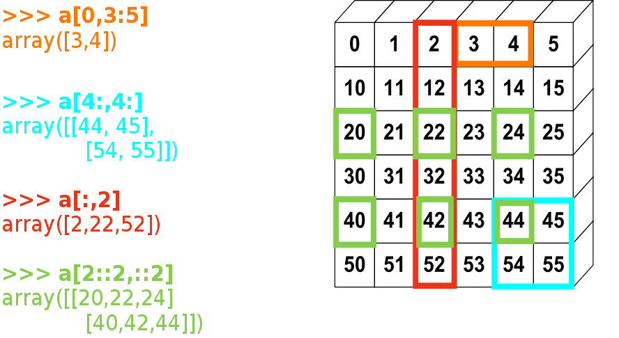
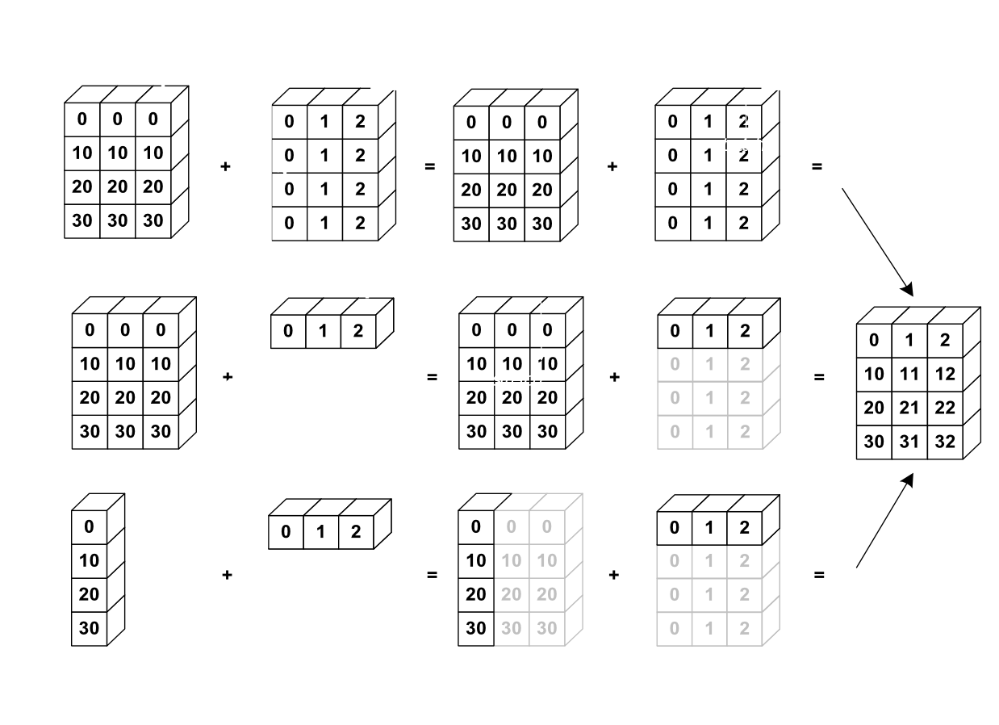
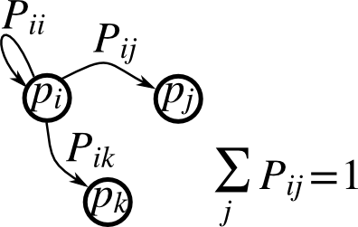

***********************************************
NumPy: creating and manipulating numerical data
***********************************************

:authors: Emmanuelle Gouillart, Didrik Pinte, Gaël Varoquaux, and Pauli Virtanen

.. contents:: Chapters contents
   :local:
   :depth: 4

.. currentmodule:: numpy

The numpy array object
=======================

What are Numpy and numpy arrays
--------------------------------

**Python** has:

    - built-in: lists, integers, floating point

    - for numerics --- more is needed (efficiency, convenience)

**Numpy** is:

    - extension package to Python for multidimensional arrays

    - closer to hardware (efficiency)

    - designed for scientific computation (convenience)

.. topic:: For example:

    An array containing ---

    * discretized time of an experiment/simulation

    * signal recorded by a measurement device

    * pixels of an image

    * ...

    ::    

     >>> import numpy as np
     >>> a = np.array([0, 1, 2, 3])
     >>> a
     array([0, 1, 2, 3])

.. extension package to Python to support multidimensional arrays

.. diagram, import conventions

.. scope of this tutorial: drill in features of array manipulation in
   Python, and try to give some indication on how to get things done
   in good style

.. a fixed number of elements (cf. certain exceptions)
.. each element of same size and type
.. efficiency vs. Python lists

Reference documentation
-----------------------

- On the web: http://docs.scipy.org/

- Interactive help:

  .. code-block:: python

     >>> help(np.array)
     array(object, dtype=None, copy=True, order=None, subok=False, ndmin=0)

     Create an array.

     Parameters
     ----------
     object : array_like
     ...

     Examples
     --------
     >>> np.array([1, 2, 3])
     array([1, 2, 3])
     ...

- Looking for something:

  >>> np.lookfor('create array')
  Search results for 'create array'
  ---------------------------------
  numpy.array
      Create an array.
  numpy.memmap
      Create a memory-map to an array stored in a *binary* file on disk.
  ...

  >>> help(np.lookfor)
  ...

.. the import convention, reminder on python imports
.. where to find the documentation
.. using help(np.argsort), using lookfor('sort array')

Creating arrays
---------------

1-D::

    >>> a = np.array([0, 1, 2, 3])
    >>> a
    array([0, 1, 2, 3])
    >>> a.ndim
    1
    >>> a.shape
    (4,)
    >>> len(a)
    4

2-D, 3-D, ...

.. code-block:: python

    >>> b = np.array([[0, 1, 2], [3, 4, 5]])    # 2 x 3 array
    >>> b
    array([[ 0,  1,  2],
           [ 3,  4,  5]])
    >>> b.ndim
    2
    >>> b.shape
    (2, 3)
    >>> len(b)     # returns the size of the first dimension
    2

    >>> c = np.array([[[1], [2]], [[3], [4]]])
    >>> c
    array([[[1],
            [2]],

           [[3],
            [4]]])
    >>> c.shape
    (2, 2, 1)

In practice, we rarely enter items one by one...

    * Evenly spaced::

        >>> import numpy as np
        >>> a = np.arange(10) # 0 .. n-1  (!)
        >>> a
        array([0, 1, 2, 3, 4, 5, 6, 7, 8, 9])
        >>> b = np.arange(1, 9, 2) # start, end (exlusive), step
        >>> b
        array([1, 3, 5, 7])

      or by number of points::

        >>> c = np.linspace(0, 1, 6)   # start, end, num-points
        >>> c
        array([ 0. ,  0.2,  0.4,  0.6,  0.8,  1. ])
        >>> d = np.linspace(0, 1, 5, endpoint=False)
        >>> d
        array([ 0. ,  0.2,  0.4,  0.6,  0.8])

    * Common arrays::

        >>> a = np.ones((3, 3))  # reminder: (3, 3) is a tuple
        >>> a
        array([[ 1.,  1.,  1.],
               [ 1.,  1.,  1.],
               [ 1.,  1.,  1.]])
        >>> b = np.zeros((2, 2))
        >>> b
        array([[ 0.,  0.],
               [ 0.,  0.]])
        >>> c = np.eye(3)
        >>> c
        array([[ 1.,  0.,  0.],
               [ 0.,  1.,  0.],
               [ 0.,  0.,  1.]])
	>>> d = np.diag(np.array([1, 2, 3, 4, 5]))
        >>> d
        array([[1, 0, 0, 0, 0],
               [0, 2, 0, 0, 0],
               [0, 0, 3, 0, 0],
               [0, 0, 0, 4, 0],
               [0, 0, 0, 0, 5]])

    * Random numbers (Mersenne Twister PRNG)::

        >>> a = np.random.rand(4)              # uniform in [0, 1]
        >>> a
	array([ 0.58597729,  0.86110455,  0.9401114 ,  0.54264348])

        >>> b = np.random.randn(4)             # gaussian
        >>> b
	array([-2.56844807,  0.06798064, -0.36823781,  0.86966886])

	>>> c = np.random.rand(3, 3)
        >>> c
        array([[ 0.31976645,  0.64807526,  0.74770801],
               [ 0.8280203 ,  0.8669403 ,  0.07663683],
               [ 0.11527489,  0.11494884,  0.13503285]])

        >>> d = np.random.zipf(1.5, size=(2, 8))  # Zipf distribution (s=1.5)
        >>> d
        array([[5290,    1,    6,    9,    1,    1,    1,    2],
               [   1,    5,    1,   13,    1,    1,    2,    1]])

        >>> np.random.seed(1234)                  # Setting the random seed
        >>> np.random.rand(3)
	array([ 0.19151945,  0.62210877,  0.43772774])
        >>> np.random.seed(1234)
        >>> np.random.rand(5)
	array([ 0.19151945,  0.62210877,  0.43772774,  0.78535858,  0.77997581])

.. array() constructor

.. empty, zeros, arange, linspace

.. EXE: construct 1 2 3 4 5
.. EXE: construct -5, -4, -3, -2, -1
.. EXE: construct 2 4 6 8
.. EXE: look what is in an empty() array
.. EXE: construct 15 equispaced numbers in range [0, 10]

Basic data types
----------------

You probably noted the ``1`` and ``1.`` above. These are different
data types:

>>> a = np.array([1, 2, 3])
>>> a.dtype
dtype('int64')

>>> b = np.array([1., 2., 3.])
>>> b.dtype
dtype('float64')

Much of the time you don't necessarily need to care, but remember they
are there.

-----------------------------

You can also choose which one you want:

>>> c = np.array([1, 2, 3], dtype=float)
>>> c.dtype
dtype('float64')

The **default** data type is floating point:

>>> a = np.ones((3, 3))
>>> a.dtype
dtype('float64')
>>> b = np.linspace(0, 1, 6)
>>> b.dtype
dtype('float64')

There are also other types:

>>> d = np.array([1+2j, 3+4j, 5+6*1j])
>>> d.dtype
dtype('complex128')

>>> e = np.array([True, False, False, True])
>>> e.dtype
dtype('bool')

>>> f = np.array(['Bonjour', 'Hello', 'Hallo', 'Terve', 'Hej'])
>>> f.dtype
dtype('S7')         # <--- strings containing max. 7 letters

.. integer types, floating point types, complex numbers
.. mention: int32, int64 vs. int
.. mention: float32, float64 vs. float
.. mention: astype

.. EXE: study zeros(shape).dtype
.. EXE: study array([1, 2, 3]).dtype
.. EXE: study array([1, 2, 3.]).dtype
.. EXE: study array([1+2j, 2, 3]).dtype
.. EXE: study array([1, 2, 3]).dtype
.. EXE: truncate a float array to an integer one
.. EXE: round a float array to an integer one

Basic visualization
-------------------

Now that we have our first data arrays, we are going to visualize them.

**Matplotlib** is a 2D plotting package. We can import its functions as below::

    >>> import matplotlib.pyplot as plt  # the tidy way
    >>> # ... or ...
    >>> from matplotlib.pyplot import *  # imports everything in the namespace

If you launched Ipython with python(x,y), or with ``ipython -pylab``
(under Linux), both of the above commands have been run.  In the
remainder of this tutorial, we assume you have run

    >>> import matplotlib.pyplot as plt

or are using ``ipython -pylab`` which does it automatically.

**1D plotting**

>>> x = np.linspace(0, 3, 20)
>>> y = np.linspace(0, 9, 20)
>>> plt.plot(x, y)       # line plot
>>> plt.plot(x, y, 'o')  # dot plot
>>> plt.show()           # <-- shows the plot (not needed with Ipython)

.. plot:: pyplots/numpy_intro_1.py

**2D arrays** (such as images)

>>> image = np.random.rand(30, 30)
>>> plt.imshow(image)
>>> plt.gray()
>>> plt.show()

>>> plt.pcolor(image)
>>> plt.hot()
>>> plt.colorbar()
>>> plt.show()

.. plot:: pyplots/numpy_intro_2.py

.. seealso:: More in the :ref:`matplotlib chapter <matplotlib>`

**3D plotting**

For 3D visualization, we can use another package: **Mayavi**. A quick example:
start with **relaunching iPython** with these options:
**ipython -pylab -wthread**  (or **ipython --pylab=wx** in IPython >= 0.10).

.. image:: surf.png
   :align: right
   :scale: 60

.. sourcecode:: ipython

    In [59]: from enthought.mayavi import mlab
    In [60]: mlab.figure()
    get fences failed: -1
    param: 6, val: 0
    Out[60]: <enthought.mayavi.core.scene.Scene object at 0xcb2677c>
    In [61]: mlab.surf(image)
    Out[61]: <enthought.mayavi.modules.surface.Surface object at 0xd0862fc>
    In [62]: mlab.axes()
    Out[62]: <enthought.mayavi.modules.axes.Axes object at 0xd07892c>

The mayavi/mlab window that opens is interactive : by clicking on the left mouse button
you can rotate the image, zoom with the mouse wheel, etc.

For more information on Mayavi :
http://github.enthought.com/mayavi/mayavi

.. seealso:: More in the :ref:`Mayavi chapter <mayavi-label>`

Indexing and slicing
--------------------

.. XXX: rewrite

The items of an array can be accessed and assigned to the same way as
other Python sequences (``list``, ``tuple``) ::

    >>> a = np.arange(10)
    >>> a
    array([0, 1, 2, 3, 4, 5, 6, 7, 8, 9])
    >>> a[0], a[2], a[-1]
    (0, 2, 9)

.. warning::

   Indices begin at 0, like other Python sequences (and C/C++).
   In contrast, in Fortran or Matlab, indices begin at 1.

For multidimensional arrays, indexes are tuples of integers::

    >>> a = np.diag(np.arange(5))
    >>> a
    array([[0, 0, 0, 0, 0],
           [0, 1, 0, 0, 0],
           [0, 0, 2, 0, 0],
           [0, 0, 0, 3, 0],
           [0, 0, 0, 0, 4]])
    >>> a[1,1]
    1
    >>> a[2,1] = 10 # third line, second column
    >>> a
    array([[ 0,  0,  0,  0,  0],
           [ 0,  1,  0,  0,  0],
           [ 0, 10,  2,  0,  0],
           [ 0,  0,  0,  3,  0],
           [ 0,  0,  0,  0,  4]])
    >>> a[1]
    array([0, 1, 0, 0, 0])

Note that:

* In 2D, the first dimension corresponds to rows, the second to columns.
* for multidimensional ``a``,`a[0]` is interpreted by
  taking all elements in the unspecified dimensions.

.. rubric:: Slicing

Arrays, like other Python sequences can also be sliced::

    >>> a = np.arange(10)
    >>> a
    array([0, 1, 2, 3, 4, 5, 6, 7, 8, 9])
    >>> a[2:9:3] # [start:end:step]
    array([2, 5, 8])

Note that the last index is not included!::

    >>> a[:4]
    array([0, 1, 2, 3])

``start:end:step`` is a ``slice`` object which represents the set of indexes
``range(start, end, step)``. A ``slice`` can be explicitly created::

    >>> sl = slice(1, 9, 2)
    >>> a = np.arange(10)
    >>> b = np.arange(1, 20, 2)
    >>> a, b
    (array([0, 1, 2, 3, 4, 5, 6, 7, 8, 9]), array([ 1,  3,  5,  7,  9, 11, 13, 15, 17, 19]))
    >>> a[sl], b[sl]
    (array([1, 3, 5, 7]), array([ 3,  7, 11, 15]))

All three slice components are not required: by default, `start` is 0, `end` is the
last and `step` is 1::

    >>> a[1:3]
    array([1, 2])
    >>> a[::2]
    array([0, 2, 4, 6, 8])
    >>> a[3:]
    array([3, 4, 5, 6, 7, 8, 9])

Of course, it works with multidimensional arrays::

    >>> a = np.eye(5)
    >>> a
    array([[ 1.,  0.,  0.,  0.,  0.],
           [ 0.,  1.,  0.,  0.,  0.],
           [ 0.,  0.,  1.,  0.,  0.],
           [ 0.,  0.,  0.,  1.,  0.],
           [ 0.,  0.,  0.,  0.,  1.]])
    >>> a[2:4,:3] # 3rd and 4th rows, 3 first columns
    array([[ 0.,  0.,  1.],
           [ 0.,  0.,  0.]])

All elements specified by a slice can be easily modified::

    >>> a[:3,:3] = 4
    >>> a
    array([[ 4.,  4.,  4.,  0.,  0.],
           [ 4.,  4.,  4.,  0.,  0.],
           [ 4.,  4.,  4.,  0.,  0.],
           [ 0.,  0.,  0.,  1.,  0.],
           [ 0.,  0.,  0.,  0.,  1.]])

A small illustrated summary of Numpy indexing and slicing...

Copies and views
----------------

A slicing operation creates a **view** on the original array, which is
just a way of accessing array data. Thus the original array is not
copied in memory.

**When modifying the view, the original array is modified as well**::

    >>> a = np.arange(10)
    >>> a
    array([0, 1, 2, 3, 4, 5, 6, 7, 8, 9])
    >>> b = a[::2]; b
    array([0, 2, 4, 6, 8])
    >>> b[0] = 12
    >>> b
    array([12,  2,  4,  6,  8])
    >>> a   # (!)
    array([12,  1,  2,  3,  4,  5,  6,  7,  8,  9])

    >>> a = np.arange(10)
    >>> b = a[::2].copy()  # force a copy
    >>> b[0] = 12
    >>> a
    array([0, 1, 2, 3, 4, 5, 6, 7, 8, 9])

This behavior can be surprising at first sight... but it allows to save both
memory and time.

.. indices begin at 0  (as in Python)
.. indexing elements
.. slices: a[i:j:k] syntax, and a[slice(i, j, k)]
.. indexing multidimensional arrays
.. assignment with slices

.. EXE: [1, 2, 3, 4, 5] -> [1, 2, 3]
.. EXE: [1, 2, 3, 4, 5] -> [4, 5]
.. EXE: [1, 2, 3, 4, 5] -> [1, 3, 5]
.. EXE: [1, 2, 3, 4, 5] -> [2, 4]
.. EXE: create an array [1, 1, 1, 1, 0, 0, 0]
.. EXE: create an array [0, 0, 0, 0, 1, 1, 1]
.. EXE: create an array [0, 1, 0, 1, 0, 1, 0]
.. EXE: create an array [1, 0, 1, 0, 1, 0, 1]
.. EXE: create an array [1, 0, 2, 0, 3, 0, 4]
.. CHA: archimedean sieve

Data files
----------

.. rubric:: Text files

Example: ``populations.txt``::

    1900	30e3	4e3	51300
    1901	47.2e3	6.1e3	48200
    1902	70.2e3	9.8e3	41500
    ...

>>> data = np.loadtxt('populations.txt')    # if in current directory
>>> data
array([[  1900.,  30000.,   4000.,  51300.],
       [  1901.,  47200.,   6100.,  48200.],
       [  1902.,  70200.,   9800.,  41500.],
...

>>> np.savetxt('pop2.txt', data)
>>> data2 = np.loadtxt('pop2.txt')

.. note:: If you have a complicated text file, what you can try are:

   - ``np.genfromtxt``

   - Using Python's I/O functions and e.g. regexps for parsing
     (Python is quite well suited for this)

.. topic:: Navigating the filesystem in Python shells

   *Ipython*

   .. sourcecode:: ipython

       In [1]: pwd      # show current directory
       '/home/user/stuff/2011-numpy-tutorial'
       In [2]: cd ex
       '/home/user/stuff/2011-numpy-tutorial/ex'
       In [3]: ls
       populations.txt	species.txt

   *Python* (here's yet one reason to use Ipython for interactive use :)

   >>> import os
   >>> os.getcwd()
   '/home/user/stuff/2011-numpy-tutorial'
   >>> os.chdir('ex')
   >>> os.getcwd()
   '/home/user/stuff/2011-numpy-tutorial/ex'
   >>> os.listdir('.')
   ['populations.txt',
    'species.txt',
    ...

.. rubric:: Images

>>> img = plt.imread('../../data/elephant.png')
>>> img.shape, img.dtype
((200, 300, 3), dtype('float32'))
>>> plt.imshow(img)
>>> plt.savefig('plot.png')
>>> plt.show()

>>> plt.imsave('red_elephant', img[:,:,0], cmap=plt.cm.gray)

This saved only one channel (of RGB)

>>> plt.imshow(plt.imread('red_elephant.png'))
>>> plt.show()

Other libraries:

>>> from scipy.misc import imsave
>>> imsave('tiny_elephant.png', img[::6,::6])
>>> plt.imshow(plt.imread('tiny_elephant.png'), interpolation='nearest')
>>> plt.show()

.. plot:: pyplots/numpy_intro_3.py

.. .. rubric:: Raw binary data
..
.. Avoid this -- often not portable, does not save data type or array
.. shape, etc.:
..
.. >>> data.tofile('pop.dat')
.. >>> np.fromfile('foo.dat', dtype=float)
.. array([  1900.,  30000.,   4000.,  51300.,   1901.,  47200.,   6100.,
.. ...

.. rubric:: Numpy's own format

>>> np.save('pop.npy', data)
>>> data3 = np.load('pop.npy')

.. rubric:: Well-known (& more obscure) file formats

* HDF5: `h5py <http://code.google.com/p/h5py/>`__, `PyTables <http://pytables.org>`__
* NetCDF: ``scipy.io.netcdf_file``, `netcdf4-python <http://code.google.com/p/netcdf4-python/>`__, ...
* Matlab: ``scipy.io.loadmat``, ``scipy.io.savemat``
* MatrixMarket: ``scipy.io.mmread``, ``scipy.io.mmread``

... if somebody uses it, there's probably also a Python library for it.

.. loadtxt, savez, load, fromfile, tofile

.. real life: point to HDF5, NetCDF, etc.

.. EXE: use loadtxt to load a data file
.. EXE: use savez and load to save data in binary format
.. EXE: use tofile and fromfile to put and get binary data bytes in/from a file
   follow-up: .view()
.. EXE: parsing text files -- Python can do this reasonably well natively!
   throw in the mix some random text file to be parsed (eg. PPM)
.. EXE: advanced: read the data in a PPM file

Summary & Exercises
-------------------

* Creating arrays: ``array``, ``linspace``, ``arange``, ``zeros``, ``ones``, ``rand``

* Data types: integers, floats, complex floats, and strings

* Simple plotting with Matplotlib: ``plot(x, y)``

* Indexing, slicing, and assignment into arrays --- slicing creates views

* Reading data from files: ``loadtxt``, ``savetxt``, et al.

--------------------------------------------------------

.. rubric:: Worked example: Prime number sieve

.. image:: prime-sieve.png

Compute prime numbers in 0--99, with a sieve

* Construct a shape (100,) boolean array ``is_prime``,
  filled with True in the beginning:

  >>> is_prime = np.ones((100,), dtype=bool)

* Cross out 0 and 1 which are not primes

  >>> is_prime[:2] = 0

* For each integer ``j`` starting from 2, cross out its higher multiples

  >>> N_max = int(np.sqrt(len(is_prime)))
  >>> for j in range(2, N_max):
  ...     is_prime[2*j::j] = False

* Skim through ``help(np.nonzero)``, and print the prime numbers

* Follow-up:

  - Move the above code into a script file named ``prime_sieve.py``

  - Run it to check it works

  - Convert the simple sieve to `the sieve of Eratosthenes
    <http://en.wikipedia.org/wiki/Sieve_of_Eratosthenes>`__:

    1. Skip `j` which are already known to not be primes

    2. The first number to cross out is :math:`j^2`

.. topic:: Reminder -- Python scripts:

   A very basic script file contains::

       import numpy as np
       import matplotlib.pyplot as plt  # <- if you use it

       # any numpy-using commands follow

       a = np.array([1, 2, 3, 4])
       print a

   Run on command line::

       python my_script_1_2.py

   Or, in Python shell::

       In [10]: %run my_script_1_2.py

       >>> execfile('2_2_data_statistics.py')

--------------------------------------------------------

.. rubric:: Exercise 1.1: Certain arrays

Create the following arrays (with correct data types)::

    [[ 1  1  1  1]
     [ 1  1  1  1]
     [ 1  1  1  2]
     [ 1  6  1  1]]

    [[0. 0. 0. 0. 0.]
     [2. 0. 0. 0. 0.]
     [0. 3. 0. 0. 0.]
     [0. 0. 4. 0. 0.]
     [0. 0. 0. 5. 0.]
     [0. 0. 0. 0. 6.]]

Par on course: 3 statements for each (53 & 54 characters)

--------------------------------------------------------

.. rubric:: Exercise 1.2: Text data files

Write a Python script that loads data from ``populations.txt`` and
drop the last column and the first 5 rows. Save the smaller dataset to
``pop2.txt``.

--------------------------------------------------------

.. rubric:: Exercise 1.3: Tiling

Skim through the documentation for ``np.tile``, and use this function
to construct the array::

    [[4 3 4 3 4 3]
     [2 1 2 1 2 1]
     [4 3 4 3 4 3]
     [2 1 2 1 2 1]]

Numerical operations on arrays
=================================

Elementwise operations
----------------------

With scalars:

>>> a = np.array([1, 2, 3, 4])
>>> a + 1
array([2, 3, 4, 5])
>>> 2**a
array([ 2,  4,  8, 16])

All arithmetic operates elementwise:

>>> b = np.ones(4) + 1
>>> a - b
array([-1.,  0.,  1.,  2.])
>>> a * b
array([ 2.,  4.,  6.,  8.])

>>> j = np.arange(5)
>>> 2**(j + 1) - j
array([ 2,  3,  6, 13, 28])

.. warning:: **... including multiplication**

>>> c = np.ones((3, 3))
>>> c * c                   # NOT matrix multiplication!
array([[ 1.,  1.,  1.],
       [ 1.,  1.,  1.],
       [ 1.,  1.,  1.]])

.. note::

   Matrix multiplication:

   >>> c.dot(c)
   array([[ 3.,  3.,  3.],
          [ 3.,  3.,  3.],
          [ 3.,  3.,  3.]])

Comparisons:

>>> a = np.array([1, 2, 3, 4])
>>> b = np.array([4, 2, 2, 4])
>>> a == b
array([False,  True, False,  True], dtype=bool)
>>> a > b
array([False, False,  True, False], dtype=bool)

Logical operations:

>>> a = np.array([1, 1, 0, 0], dtype=bool)
>>> b = np.array([1, 0, 1, 0], dtype=bool)
>>> a | b
array([ True,  True,  True, False], dtype=bool)
>>> a & b
array([ True, False, False, False], dtype=bool)

.. note::

   For arrays: "``&``" and "``|``" for logical operations, not
   "``and``" and "``or``".

Shape mismatches:

>>> a
array([1, 2, 3, 4])
>>> a + np.array([1, 2])
Traceback (most recent call last):
  File "<stdin>", line 1, in <module>
ValueError: shape mismatch: objects cannot be broadcast to a single shape

**'Broadcast'?** We'll return to that later.

.. arithmetic is 'vectorized'

.. logical operations are also 'vectorized'

.. EXE: generate array [2**0, 2**1, 2**2, 2**3, 2**4]
.. EXE: generate array a_j = 2^(3*j) - j
.. EXE: subtract two arrays of the same shape
.. EXE: try to subtract two arrays of non-matching shape
.. EXE: generate a mask indicating which elements are 1

Basic linear algebra
--------------------

Matrix multiplication:

>>> a = np.triu(np.ones((3, 3)), 1)   # see help(np.triu)
>>> a
array([[ 0.,  1.,  1.],
       [ 0.,  0.,  1.],
       [ 0.,  0.,  0.]])
>>> b = np.diag([1, 2, 3])
>>> a.dot(b)
array([[ 0.,  2.,  3.],
       [ 0.,  0.,  3.],
       [ 0.,  0.,  0.]])
>>> np.dot(a, a)
array([[0, 0, 1],
       [0, 0, 0],
       [0, 0, 0]])

Transpose:

>>> a.T
array([[ 0.,  0.,  0.],
       [ 1.,  0.,  0.],
       [ 1.,  1.,  0.]])

Inverses and linear equation systems:

>>> A = a + b
>>> A
array([[ 1.,  1.,  1.],
       [ 0.,  2.,  1.],
       [ 0.,  0.,  3.]])
>>> B = np.linalg.inv(A)
>>> B.dot(A)
array([[ 1.,  0.,  0.],
       [ 0.,  1.,  0.],
       [ 0.,  0.,  1.]])

>>> x = np.linalg.solve(A, [1, 2, 3])
>>> x
array([-0.5,  0.5,  1. ])
>>> A.dot(x)
array([ 1.,  2.,  3.])

Eigenvalues:

>>> np.linalg.eigvals(A)
array([ 1.,  2.,  3.])

... and so on, see ``help(np.linalg)``

.. A.dot(B)    [or np.dot(A, B)]

.. transposes

.. linear algebra: np.linalg -- least squares, eigenvalues

.. EXE: compute a product of two matrices
.. EXE: solve a linear equation system
.. EXE: compute a pseudoinverse
.. EXE: write a routine to verify that a matrix is Hermitian
.. EXE: compare the computed pseudoinverse with what lstsq gives

Basic reductions
----------------

Computing sums:

>>> x = np.array([1, 2, 3, 4])
>>> np.sum(x)
10
>>> x.sum()
10

Sum by rows and by columns:

.. image:: reductions.png

>>> x = np.array([[1, 1], [2, 2]])
>>> x
array([[1, 1],
       [2, 2]])
>>> x.sum(axis=0)   # columns (first dimension)
array([3, 3])
>>> x[:,0].sum(), x[:,1].sum()
(3, 3)
>>> x.sum(axis=1)   # rows (second dimension)
array([2, 4])
>>> x[0,:].sum(), x[1,:].sum()
(2, 4)

Same idea in higher dimensions:

>>> x = np.random.rand(2, 2, 2)
>>> x.sum(axis=2)[0,1]
1.1600112273698793
>>> x[0,1,:].sum()
1.1600112273698793

**Other reductions** --- works the same way (and take ``axis=``)

- Statistics:

  >>> x = np.array([1, 2, 3, 1])
  >>> y = np.array([[1, 2, 3], [5, 6, 1]])
  >>> x.mean()
  1.75
  >>> np.median(x)
  1.5
  >>> np.median(y, axis=-1) # last axis
  array([ 2.,  5.])

  >>> x.std()          # full population standard dev.
  0.82915619758884995
  >>> x.std(ddof=1)    # sample std (with N-1 in divisor)
  0.9574271077563381

- Extrema:

  >>> x = np.array([1, 3, 2])
  >>> x.min()
  1
  >>> x.max()
  3

  >>> x.argmin()  # index of minimum
  0
  >>> x.argmax()  # index of maximum
  1

- Logical operations:

  >>> np.all([True, True, False])
  False
  >>> np.any([True, True, False])
  True

  .. note::

     Can be used for array comparisons:

     >>> a = np.zeros((100, 100))
     >>> np.any(a != 0)
     False
     >>> np.all(a == a)
     True

     >>> a = np.array([1, 2, 3, 2])
     >>> b = np.array([2, 2, 3, 2])
     >>> c = np.array([6, 4, 4, 5])
     >>> ((a <= b) & (b <= c)).all()
     True

- ... and many more (best to learn as you go).

.. topic:: Example: data statistics

  Data in ``populations.txt`` describes the populations
  of hares and lynxes (and carrots) in northern Canada during 20 years.

  We can first plot the data:

  >>> data = np.loadtxt('../../data/populations.txt')
  >>> year, hares, lynxes, carrots = data.T  # trick: columns to variables

  >>> plt.axes([0.2, 0.1, 0.5, 0.8])
  >>> plt.plot(year, hares, year, lynxes, year, carrots)
  >>> plt.legend(('Hare', 'Lynx', 'Carrot'), loc=(1.05, 0.5))
  >>> plt.show()

  .. plot:: pyplots/numpy_intro_4.py

  The mean populations over time:

  >>> populations = data[:,1:]
  >>> populations.mean(axis=0)
  array([ 34080.95238095,  20166.66666667,  42400.        ])

  The sample standard deviations:

  >>> populations.std(axis=0, ddof=1)
  array([ 21413.98185877,  16655.99991995,   3404.55577132])

  Which species has the highest population each year?

  >>> np.argmax(populations, axis=1)
  array([2, 2, 0, 0, 1, 1, 2, 2, 2, 2, 2, 2, 0, 0, 0, 1, 2, 2, 2, 2, 2])

.. topic:: Example: diffusion simulation using a random walk algorithm

  .. image:: random_walk.png
     :align: center

  What is the typical distance from the origin of a random walker after
  ``t`` left or right jumps?

  .. image:: random_walk_schema.png
     :align: center

  >>> n_stories = 1000 # number of walkers
  >>> t_max = 200      # time during which we follow the walker

  We randomly choose all the steps 1 or -1 of the walk

  >>> t = np.arange(t_max)
  >>> steps = 2 * np.random.random_integers(0, 1, (n_stories, t_max)) - 1
  >>> np.unique(steps) # Verification: all steps are 1 or -1
  array([-1,  1])

  We build the walks by summing steps along the time

  >>> positions = np.cumsum(steps, axis=1) # axis = 1: dimension of time
  >>> sq_distance = positions**2

  We get the mean in the axis of the stories

  >>> mean_sq_distance = np.mean(sq_distance, axis=0)

  Plot the results:

  >>> plt.figure(figsize=(4, 3))
  >>> plt.plot(t, np.sqrt(mean_sq_distance), 'g.', t, np.sqrt(t), 'y-')
  >>> plt.xlabel(r"$t$")
  >>> plt.ylabel(r"$\sqrt{\langle (\delta x)^2 \rangle}$")
  >>> plt.show()

  .. plot:: pyplots/numpy_intro_5.py

The RMS distance grows as the square root of the time!

.. arithmetic: sum/prod/mean/std

.. extrema: min/max

.. logical: all/any

.. the axis argument

.. EXE: verify if all elements in an array are equal to 1
.. EXE: verify if any elements in an array are equal to 1
.. EXE: load data with loadtxt from a file, and compute its basic statistics

.. CHA: implement mean and std using only sum()

Broadcasting
------------

* Basic operations on ``numpy`` arrays (addition, etc.) are elementwise

* This works on arrays of the same size.

    | **Nevertheless**, It's also possible to do operations on arrays of different
    | sizes if *Numpy* can transform these arrays so that they all have
    | the same size: this conversion is called **broadcasting**.

The image below gives an example of broadcasting:

Let's verify::

    >>> a = np.tile(np.arange(0, 40, 10), (3, 1)).T
    >>> a
    array([[ 0,  0,  0],
           [10, 10, 10],
           [20, 20, 20],
           [30, 30, 30]])
    >>> b = np.array([0, 1, 2])
    >>> a + b
    array([[ 0,  1,  2],
           [10, 11, 12],
           [20, 21, 22],
           [30, 31, 32]])

An useful trick:

    >>> a = np.arange(0, 40, 10)
    >>> a.shape
    (4,)
    >>> a = a[:, np.newaxis]  # adds a new axis -> 2D array
    >>> a.shape
    (4, 1)
    >>> a
    array([[ 0],
           [10],
           [20],
           [30]])
    >>> a + b
    array([[ 0,  1,  2],
           [10, 11, 12],
           [20, 21, 22],
           [30, 31, 32]])

We have already used broadcasting without knowing it!::

    >>> a = np.ones((4, 5))
    >>> a[0] = 2  # we assign an array of dimension 0 to an array of dimension 1
    array([[ 2.,  2.,  2.,  2.,  2.],
           [ 1.,  1.,  1.,  1.,  1.],
           [ 1.,  1.,  1.,  1.,  1.],
           [ 1.,  1.,  1.,  1.,  1.]])

Broadcasting seems a bit magical, but it is actually quite natural to use it
when we want to solve a problem whose output data is an array with more
dimensions than input data.

.. topic:: Example

  Let's construct an array of distances (in miles) between cities of
  Route 66: Chicago, Springfield, Saint-Louis, Tulsa, Oklahoma City,
  Amarillo, Santa Fe, Albuquerque, Flagstaff and Los Angeles.

  ::

      >>> mileposts = np.array([0, 198, 303, 736, 871, 1175, 1475, 1544,
      ...        1913, 2448])
      >>> distance_array = np.abs(mileposts - mileposts[:, np.newaxis])
      >>> distance_array
      array([[   0,  198,  303,  736,  871, 1175, 1475, 1544, 1913, 2448],
             [ 198,    0,  105,  538,  673,  977, 1277, 1346, 1715, 2250],
             [ 303,  105,    0,  433,  568,  872, 1172, 1241, 1610, 2145],
             [ 736,  538,  433,    0,  135,  439,  739,  808, 1177, 1712],
             [ 871,  673,  568,  135,    0,  304,  604,  673, 1042, 1577],
             [1175,  977,  872,  439,  304,    0,  300,  369,  738, 1273],
             [1475, 1277, 1172,  739,  604,  300,    0,   69,  438,  973],
             [1544, 1346, 1241,  808,  673,  369,   69,    0,  369,  904],
             [1913, 1715, 1610, 1177, 1042,  738,  438,  369,    0,  535],
             [2448, 2250, 2145, 1712, 1577, 1273,  973,  904,  535,    0]])

  .. image:: route66.png
     :align: center
     :scale: 60

.. topic:: Good practices

    * Explicit variable names (no need of a comment to explain what is in
      the variable)

    * Style: spaces after commas, around ``=``, etc.

      A certain number of rules for writing "beautiful" code (and, more
      importantly, using the same conventions as everybody else!) are
      given in the `Style Guide for Python Code
      <http://www.python.org/dev/peps/pep-0008>`_ and the `Docstring
      Conventions <http://www.python.org/dev/peps/pep-0257>`_ page (to
      manage help strings).

    * Except some rare cases, variable names and comments in English.

A lot of grid-based or network-based problems can also use
broadcasting. For instance, if we want to compute the distance from
the origin of points on a 10x10 grid, we can do:

 >>> x, y = np.arange(5), np.arange(5)
 >>> distance = np.sqrt(x ** 2 + y[:, np.newaxis] ** 2)
 >>> distance
 array([[ 0.        ,  1.        ,  2.        ,  3.        ,  4.        ],
        [ 1.        ,  1.41421356,  2.23606798,  3.16227766,  4.12310563],
        [ 2.        ,  2.23606798,  2.82842712,  3.60555128,  4.47213595],
        [ 3.        ,  3.16227766,  3.60555128,  4.24264069,  5.        ],
        [ 4.        ,  4.12310563,  4.47213595,  5.        ,  5.65685425]])

 Or in color:

 >>> plt.pcolor(distance)
 >>> plt.colorbar()
 >>> plt.axis('equal')
 >>> plt.show()  # <-- again, not needed in interactive Python

.. plot:: pyplots/numpy_intro_6.py

**Remark** : the ``numpy.ogrid`` function allows to directly create vectors x
and y of the previous example, with two "significant dimensions"::

    >>> x, y = np.ogrid[0:5, 0:5]
    >>> x, y
    (array([[0],
           [1],
           [2],
           [3],
           [4]]), array([[0, 1, 2, 3, 4]]))
    >>> x.shape, y.shape
    ((5, 1), (1, 5))
    >>> distance = np.sqrt(x ** 2 + y ** 2)

So, ``np.ogrid`` is very useful as soon as we have to handle computations on a
grid. On the other hand, ``np.mgrid`` directly provides matrices full of
indices for cases where we can't (or don't want to) benefit from broadcasting::

    >>> x, y = np.mgrid[0:4, 0:4]
    >>> x
    array([[0, 0, 0, 0],
           [1, 1, 1, 1],
           [2, 2, 2, 2],
           [3, 3, 3, 3]])
    >>> y
    array([[0, 1, 2, 3],
           [0, 1, 2, 3],
           [0, 1, 2, 3],
           [0, 1, 2, 3]])

However, in practice, this is rarely needed!

.. rules

.. some usage examples: scalars, 1-d matrix products

.. newaxis

.. EXE: add 1-d array to a scalar
.. EXE: add 1-d array to a 2-d array
.. EXE: multiply matrix from the right with a diagonal array
.. CHA: constructing grids -- meshgrid using only newaxis

Array shape manipulation
------------------------

.. rubric:: Flattening

>>> a = np.array([[1, 2, 3], [4, 5, 6]])
>>> a.ravel()
array([1, 2, 3, 4, 5, 6])
>>> a.T
array([[1, 4],
       [2, 5],
       [3, 6]])
>>> a.T.ravel()
array([1, 4, 2, 5, 3, 6])

Higher dimensions: last dimensions ravel out "first".

.. rubric:: Reshaping

The inverse operation to flattening:

>>> a.shape
(2, 3)
>>> b = a.ravel()
>>> b.reshape((2, 3))
array([[1, 2, 3],
       [4, 5, 6]])

Creating an array with a different shape, from another array:

>>> a = np.arange(36)
>>> b = a.reshape((6, 6))
>>> b
array([[ 0,  1,  2,  3,  4,  5],
       [ 6,  7,  8,  9, 10, 11],
       [12, 13, 14, 15, 16, 17],
       [18, 19, 20, 21, 22, 23],
       [24, 25, 26, 27, 28, 29],
       [30, 31, 32, 33, 34, 35]])

Or,

>>> b = a.reshape((6, -1))    # unspecified (-1) value is inferred

.. rubric:: Copies or views

``ndarray.reshape`` **may** return a view (cf ``help(np.reshape)``)),
not a copy:

>>> b[0,0] = 99
>>> a
array([99,  1,  2,  3,  4,  5,  6,  7,  8,  9, 10, 11, 12, 13, 14, 15, 16,
       17, 18, 19, 20, 21, 22, 23, 24, 25, 26, 27, 28, 29, 30, 31, 32, 33,
       34, 35])

Beware!

>>> a = np.zeros((3,2))
>>> b = a.T.reshape(3*2)
>>> b[0] = 9
>>> a
array([[ 0.,  0.],
       [ 0.,  0.],
       [ 0.,  0.]])

To understand, see "Under the hood" below.

.. rubric:: Dimension shuffling

>>> a = np.arange(4*3*2).reshape(4, 3, 2)
>>> a.shape
(4, 3, 2)
>>> a[0,2,1]
5
>>> b = a.transpose(1, 2, 0)
>>> b.shape
(3, 2, 4)
>>> b[2,1,0]
5

Also creates a view:

>>> b[2,1,0] = -1
>>> a[0,2,1]
-1

.. rubric:: Resizing

Size of an array can be changed with ``ndarray.resize``:

>>> a = np.arange(4)
>>> a.resize((8,))
>>> a
array([0, 1, 2, 3, 0, 0, 0, 0])

However, it must not be referred to somewhere else:

>>> b = a
>>> a.resize((4,))
...
ValueError: cannot resize an array references or is referenced
by another array in this way.  Use the resize function

.. rubric:: Some examples of real-world use cases

.. topic:: Case 2.a: Calling (legacy) Fortran code

   Shape-preserving functions with elementwise non-Python
   routines. For instance, Fortran

   .. sourcecode:: fortran

      ! 2_a_fortran_module.f90
      subroutine some_function(n, a, b)
        integer :: n
        double precision, dimension(n), intent(in) :: a
        double precision, dimension(n), intent(out) :: b
        b = a + 1
      end subroutine some_function

   ``f2py -c -m fortran_module 2_a_fortran_module.f90``

   .. sourcecode:: python

       import numpy as np
       import fortran_module

       def some_function(input):
           """
	   Call a Fortran routine, and preserve input shape
	   """
           input = np.asarray(input)
	   # fortran_module.some_function() takes 1-D arrays!
           output = fortran_module.some_function(input.ravel())
	   return output.reshape(input.shape)

       print some_function(np.array([1, 2, 3]))
       print some_function(np.array([[1, 2], [3, 4]]))

       # ->
       # [ 2.  3.  4.]
       # [[ 2.  3.]
       #  [ 4.  5.]]

.. topic:: Case 2.b: Block matrices and vectors (and tensors)

   Vector space: quantum level :math:`\otimes` spin

   .. math::

      \check{\psi}
      =
      \begin{pmatrix}
      \hat{\psi}_1 \\ \hat{\psi}_2
      \end{pmatrix}
      \,,
      \qquad
      \hat{\psi}_{1} =
      \begin{pmatrix}
        \psi_{1\uparrow} \\ \psi_{1\downarrow}
      \end{pmatrix}
      \qquad
      \hat{\psi}_{2} =
      \begin{pmatrix}
        \psi_{2\uparrow} \\ \psi_{2\downarrow}
      \end{pmatrix}

   In short: for **block matrices and vectors**, it can be useful
   to preserve the **block structure**.

   In Numpy:

   >>> psi = np.zeros((2, 2))   # dimensions: level, spin
   >>> psi[0,1] # <-- psi_{1,downarrow}

   Linear operators on such block vectors have similar block structure:

   .. math::

      \check{H} = \begin{pmatrix}
      \hat{h}_{11} & \hat{V} \\
      \hat{V}^\dagger & \hat{h}_{22} \\
      \end{pmatrix}
      \,,
      \qquad
      \hat{h}_{11}
      =
      \begin{pmatrix}
      \epsilon_{1,\uparrow}
      & 0
      \\
      0 & \epsilon_{1,\downarrow}
      \end{pmatrix}
      \,,
      \qquad
      \ldots

   >>> H = np.zeros((2, 2, 2, 2)) # dimensions: level1, level2, spin1, spin2
   >>> h_11 = H[0,0,:,:]
   >>> V = H[0,1]

   Doing the matrix product: get rid of the block structure, do the
   4x4 matrix product, then put it back

   .. math::

      \check{H}\check{\psi}

   >>> def mdot(operator, psi):
   ...     return operator.transpose(0, 2, 1, 3).reshape(4, 4).dot(
   ...                psi.reshape(4)).reshape(2, 2)

   I.e., reorder dimensions first to ``level1, spin1, level2, spin2``
   and then reshape => correct matrix product.

   .. seealso: ``help(np.tensordot)``

.. resizing: how to do it, and *when* is it possible (not always!)

.. reshaping (demo using an image?)

.. dimension shuffling

.. when to use: some pre-made algorithm (e.g. in Fortran) accepts only
   1-D data, but you'd like to vectorize it

.. EXE: load data incrementally from a file, by appending to a resizing array
.. EXE: vectorize a pre-made routine that only accepts 1-D data
.. EXE: manipulating matrix direct product spaces back and forth (give an example from physics -- spin index and orbital indices)
.. EXE: shuffling dimensions when writing a general vectorized function
.. CHA: the mathematical 'vec' operation

Fancy indexing
--------------

Numpy arrays can be indexed with slices, but also with boolean or
integer arrays (**masks**). This method is called *fancy indexing*.

.. rubric:: Masks

>>> np.random.seed(3)
>>> a = np.random.random_integers(0, 20, 15)
>>> a
array([10,  3,  8,  0, 19, 10, 11,  9, 10,  6,  0, 20, 12,  7, 14])
>>> (a % 3 == 0)
array([False,  True, False,  True, False, False, False,  True, False,
        True,  True, False,  True, False, False], dtype=bool)
>>> mask = (a % 3 == 0)
>>> extract_from_a = a[mask] # or,  a[a%3==0]
>>> extract_from_a           # extract a sub-array with the mask
array([ 3,  0,  9,  6,  0, 12])

Extracting a sub-array using a mask produces a copy of this sub-array, not a
view like slicing::

    >>> extract_from_a[0] = -1
    >>> a
    array([10,  3,  8,  0, 19, 10, 11,  9, 10,  6,  0, 20, 12,  7, 14])

Indexing with a mask can be very useful to assign a new value to a sub-array::

    >>> a[a % 3 == 0] = -1
    >>> a
    array([10, -1,  8, -1, 19, 10, 11, -1, 10, -1, -1, 20, -1,  7, 14])

.. rubric:: Indexing with an array of integers

>>> a = np.arange(10)
>>> a[::2] += 3 # to avoid having always the same np.arange(10)...
>>> a
array([ 3,  1,  5,  3,  7,  5,  9,  7, 11,  9])
>>> a[[2, 5, 1, 8]] # or, a[np.array([2, 5, 1, 8])]
array([ 5,  5,  1, 11])

Indexing can be done with an array of integers, where the same index is repeated
several time::

    >>> a[[2, 3, 2, 4, 2]]  # note: [2, 3, 2, 4, 2] is a Python list
    array([5, 3, 5, 7, 5])

New values can be assigned with this kind of indexing::

    >>> a[[9, 7]] = -10
    >>> a
    array([  3,   1,   5,   3,   7,   5,   9, -10,  11, -10])
    >>> a[[2, 3, 2, 4, 2]] += 1
    >>> a
    array([  3,   1,   6,   4,   8,   5,   9, -10,  11, -10])

When a new array is created by indexing with an array of integers, the new array
has the same shape than the array of integers::

    >>> a = np.arange(10)
    >>> idx = np.array([[3, 4], [9, 7]])
    >>> a[idx]
    array([[3, 4],
           [9, 7]])
    >>> b = np.arange(10)

    >>> a = np.arange(12).reshape(3, 4)
    >>> a
    array([[ 0,  1,  2,  3],
           [ 4,  5,  6,  7],
           [ 8,  9, 10, 11]])
    >>> i = np.array([0, 1, 1, 2])
    >>> j = np.array([2, 1, 3, 3])
    >>> a[i, j]
    array([ 2,  5,  7, 11])

    >>> i = np.array([[0, 1], [1, 2]])
    >>> j = np.array([[2, 1], [3, 3]])
    >>> i
    array([[0, 1],
           [1, 2]])
    >>> j
    array([[2, 1],
           [3, 3]])
    >>> a[i, j]
    array([[ 2,  5],
           [ 7, 11]])

.. image:: numpy_fancy_indexing.png
   :align: center

We can even use fancy indexing and broadcasting at the same time::

    >>> a = np.arange(12).reshape(3,4)
    >>> a
    array([[ 0,  1,  2,  3],
           [ 4,  5,  6,  7],
           [ 8,  9, 10, 11]])
    >>> i = np.array([[0, 1], [1, 2]])
    >>> a[i, 2] # same as a[i, 2*np.ones((2,2), dtype=int)]
    array([[ 2,  6],
           [ 6, 10]])

Sorting data
------------

Sorting along an axis:

>>> a = np.array([[4, 3, 5], [1, 2, 1]])
>>> b = np.sort(a, axis=1)
>>> b
array([[3, 4, 5],
       [1, 1, 2]])

.. note:: Sorts each row separately!

In-place sort:

>>> a.sort(axis=1)
>>> a
array([[3, 4, 5],
       [1, 1, 2]])

Sorting with fancy indexing:

>>> a = np.array([4, 3, 1, 2])
>>> j = np.argsort(a)
array([2, 3, 1, 0])
>>> a[j]
array([1, 2, 3, 4])

Finding minima and maxima:

>>> a = np.array([4, 3, 1, 2])
>>> j_max = np.argmax(a)
>>> j_min = np.argmin(a)
>>> j_max, j_min
(0, 2)

Summary & Exercises
-------------------

* Arithmetic etc. are elementwise operations
* Basic linear algebra, ``.dot()``
* Reductions: ``sum(axis=1)``, ``std()``, ``all()``, ``any()``
* Broadcasting: ``a = np.arange(4); a[:,np.newaxis] + a[np.newaxis,:]``
* Shape manipulation: ``a.ravel()``, ``a.reshape(2, 2)``
* Fancy indexing: ``a[a > 3]``, ``a[[2, 3]]``
* Sorting data: ``.sort()``, ``np.sort``, ``np.argsort``, ``np.argmax``

----------------------------------

.. rubric:: Worked example: Framing Lena

Let's do some manipulations on numpy arrays by starting with the
famous image of Lena
(http://www.cs.cmu.edu/~chuck/lennapg/). ``scipy`` provides a 2D array
of this image with the ``scipy.lena`` function::

    >>> import scipy
    >>> lena = scipy.lena()

Here are a few images we will be able to obtain with our manipulations:
use different colormaps, crop the image, change some parts of the image.

.. image:: lenas.png
   :align: center

* Let's use the imshow function of pylab to display the image.

  .. sourcecode:: ipython

      In [3]: import pylab as plt
      In [4]: lena = scipy.lena()
      In [5]: plt.imshow(lena)

* Lena is then displayed in false colors. A colormap must be specified for her
  to be displayed in grey.

  .. sourcecode:: ipython

      In [6]: plt.imshow(lena, plt.cm.gray)
      In [7]: # or,
      In [7]: plt.gray()

* Create an array of the image with a narrower centering : for example,
  remove 30 pixels from all the borders of the image. To check the result,
  display this new array with ``imshow``.

  .. sourcecode:: ipython

      In [9]: crop_lena = lena[30:-30,30:-30]

* We will now frame Lena's face with a black locket. For this, we need to

    * create a mask corresponding to the pixels we want to be black.
      The mask is defined by this condition ``(y-256)**2 + (x-256)**2``

    .. sourcecode:: ipython

        In [15]: y, x = np.ogrid[0:512,0:512] # x and y indices of pixels
        In [16]: y.shape, x.shape
        Out[16]: ((512, 1), (1, 512))
        In [17]: centerx, centery = (256, 256) # center of the image
        In [18]: mask = ((y - centery)**2 + (x - centerx)**2) > 230**2 # circle

  then

    * assign the value 0 to the pixels of the image corresponding to the mask.
      The syntax is extremely simple and intuitive:

    .. sourcecode:: ipython

        In [19]: lena[mask] = 0
        In [20]: plt.imshow(lena)
        Out[20]: <matplotlib.image.AxesImage object at 0xa36534c>

* Follow-up: copy all instructions of this exercise in a script called
  ``lena_locket.py`` then execute this script in IPython with ``%run
  lena_locket.py``.

  Change the circle to an ellipsoid.

----------------------------------

.. rubric:: Exercise 2.1: Matrix manipulations

1. Form the 2-D array (without typing it in explicitly)::

       1  6 11
       2  7 12
       3  8 13
       4  9 14
       5 10 15

   and generate a new array containing its 2nd and 4th rows.

2. Divide each column of the array

   >>> a = np.arange(25).reshape(5, 5)

   elementwise with the array ``b = np.array([1., 5, 10, 15, 20])``.
   (Hint: ``np.newaxis``).

3. Harder one: Generate a 10 x 3 array of random numbers (in range [0,1]).
   For each row, pick the number closest to 0.5.

   - Use ``abs`` and ``argsort`` to find the column ``j`` closest for each row.

   - Use fancy indexing to extract the numbers.  (Hint: ``a[i,j]`` --
     the array ``i`` must contain the row numbers corresponding to stuff in
     ``j``.)

----------------------------------

.. rubric:: Exercise 2.2: Data statistics

The data in ``populations.txt`` describes the populations
of hares and lynxes (and carrots) in northern Canada during 20 years:

>>> data = np.loadtxt('../../data/populations.txt')
>>> year, hares, lynxes, carrots = data.T  # trick: columns to variables

>>> plt.axes([0.2, 0.1, 0.5, 0.8])
>>> plt.plot(year, hares, year, lynxes, year, carrots)
>>> plt.legend(('Hare', 'Lynx', 'Carrot'), loc=(1.05, 0.5))
>>> plt.show()

.. plot:: pyplots/numpy_intro_7.py

Computes and print, based on the data in ``populations.txt``...

1. The mean and std of the populations of each species for the years
   in the period.

2. Which year each species had the largest population.

3. Which species has the largest population for each year.
   (Hint: ``argsort`` & fancy indexing of
   ``np.array(['H', 'L', 'C'])``)

4. Which years any of the populations is above 50000.
   (Hint: comparisons and ``np.any``)

5. The top 2 years for each species when they had the lowest
   populations. (Hint: ``argsort``, fancy indexing)

6. Compare (plot) the change in hare population (see
   ``help(np.gradient)``) and the number of lynxes. Check correlation
   (see ``help(np.corrcoef)``).

... all without for-loops.

----------------------------------

.. rubric:: Exercise 2.3: Crude integral approximations

Write a function ``f(a, b, c)`` that returns :math:`a^b - c`.  Form
a 24x12x6 array containing its values in parameter ranges ``[0,1] x
[0,1] x [0,1]``.

Approximate the 3-d integral

.. math:: \int_0^1\int_0^1\int_0^1(a^b-c)da\,db\,dc

over this volume with the mean.  The exact result is: :math:`\ln 2 -
\frac{1}{2}\approx0.1931\ldots` --- what is your relative error?

(Hints: use elementwise operations and broadcasting.
You can make ``np.ogrid`` give a number of points in given range
with ``np.ogrid[0:1:20j]``.)

.. topic:: Reminder -- Python functions

   ::

       def f(a, b, c):
           return some_result

----------------------------------

.. rubric:: Exercise 2.4: Mandelbrot set

.. plot:: intro/numpy/solutions/2_4_mandelbrot.py
   :include-source: 0

Write a script that computes the Mandelbrot fractal. The Mandelbrot
iteration::

    N_max = 50
    some_threshold = 50

    c = x + 1j*y

    for j in xrange(N_max):
        z = z**2 + c

Point (x, y) belongs to the Mandelbrot set if :math:`|c|` <  ``some_threshold``.

Do this computation by:

1. Construct a grid of c = x + 1j*y values in range [-2, 1] x [-1.5, 1.5]

2. Do the iteration

3. Form the 2-d boolean mask indicating which points are in the set

4. Save the result to an image with:

   >>> import matplotlib.pyplot as plt
   >>> plt.imshow(mask.T, extent=[-2, 1, -1.5, 1.5])
   >>> plt.gray()
   >>> plt.savefig('mandelbrot.png')

----------------------------------

.. rubric:: Exercise 2.5: Markov chain

Markov chain transition matrix ``P``, and probability distribution on
the states ``p``::

1. ``0 <= P[i,j] <= 1``: probability to go from state ``i`` to state ``j``

2. Transition rule: :math:`p_{new} = P^T p_{old}`

3. ``all(sum(P, axis=1) == 1)``, ``p.sum() == 1``: normalization

Write a script that works with 5 states, and:

- Constructs a random matrix, and normalizes each row so that it
  is a transition matrix.

- Starts from a random (normalized) probability distribution
  ``p`` and takes 50 steps => ``p_50``

- Computes the stationary distribution: the eigenvector of ``P.T``
  with eigenvalue 1 (numerically: closest to 1) => ``p_stationary``

  Remember to normalize the eigenvector --- I didn't...

- Checks if ``p_50`` and ``p_stationary`` are equal to tolerance 1e-5

Toolbox: ``np.random.rand``, ``.dot()``, ``np.linalg.eig``,
reductions, ``abs()``, ``argmin``, comparisons, ``all``,
``np.linalg.norm``, etc.

Conclusions
-----------

.. rubric:: What do you need to know to get started?

* Know how to create arrays : ``array``, ``arange``, ``ones``,
  ``zeros``.

* Know the shape of the array with ``array.shape``, then use slicing
  to obtain different views of the array: ``array[::2]``,
  etc. Adjust the shape of the array using ``reshape`` or flatten it
  with ``ravel``.

* Obtain a subset of the elements of an array and/or modify their values
  with masks::

  >>> a[a < 0] = 0

* Know miscellaneous operations on arrays, such as finding the mean or max
  (``array.max()``, ``array.mean()``). No need to retain everything, but
  have the reflex to search in the documentation (online docs,
  ``help()``, ``lookfor()``)!!

* For advanced use: master the indexing with arrays of integers, as well as
  broadcasting. Know more Numpy functions to handle various array
  operations.

Moving on
============

.. XXX: maybe some of this should go to the advanced chapter

More data types
---------------

.. rubric:: Casting

"Bigger" type wins in mixed-type operations:

>>> np.array([1, 2, 3]) + 1.5
array([ 2.5,  3.5,  4.5])

Assignment never changes the type!

>>> a = np.array([1, 2, 3])
>>> a.dtype
dtype('int64')
>>> a[0] = 1.9     # <-- float is truncated to integer
>>> a
array([1, 2, 3])

Forced casts:

>>> a = np.array([1.7, 1.2, 1.6])
>>> b = a.astype(int)  # <-- truncates to integer
>>> b
array([1, 1, 1])

Rounding:

>>> a = np.array([1.7, 1.2, 1.6])
>>> b = np.around(a)
>>> b                    # still floating-point
array([ 2.,  1.,  2.])
>>> c = np.around(a).astype(int)
>>> c
array([2, 1, 2])

.. rubric:: Different data type sizes

Integers (signed):

===================  =============================
:class:`int8`        8 bits
:class:`int16`       16 bits
:class:`int32`       32 bits (same as :class:`int` on 32-bit platform)
:class:`int64`       64 bits (same as :class:`int` on 64-bit platform)
===================  =============================

>>> np.array([1], dtype=int).dtype
dtype('int64')
>>> np.iinfo(np.int32).max, 2**31 - 1
(2147483647, 2147483647)
>>> np.iinfo(np.int64).max, 2**63 - 1
(9223372036854775807, 9223372036854775807L)

Unsigned integers:

===================  =============================
:class:`uint8`       8 bits
:class:`uint16`      16 bits
:class:`uint32`      32 bits
:class:`uint64`      64 bits
===================  =============================

>>> np.iinfo(np.uint32).max, 2**32 - 1
(2147483647, 2147483647)
>>> np.iinfo(np.uint64).max, 2**64 - 1
(9223372036854775807, 9223372036854775807L)

Floating-point numbers:

===================  =============================
:class:`float16`     16 bits
:class:`float32`     32 bits
:class:`float64`     64 bits (same as :class:`float`)
:class:`float96`     96 bits, platform-dependent (same as :class:`np.longdouble`)
:class:`float128`    128 bits, platform-dependent (same as :class:`np.longdouble`)
===================  =============================

>>> np.finfo(np.float32).eps
1.1920929e-07
>>>  np.finfo(np.float64).eps
2.2204460492503131e-16

>>> np.float32(1e-8) + np.float32(1) == 1
True
>>> np.float64(1e-8) + np.float64(1) == 1
False

Complex floating-point numbers:

===================  =============================
:class:`complex64`   two 32-bit floats
:class:`complex128`  two 64-bit floats
:class:`complex192`  two 96-bit floats, platform-dependent
:class:`complex256`  two 128-bit floats, platform-dependent
===================  =============================

.. topic:: Smaller data types

   If you don't know you need special data types, then you probably don't.

   Comparison on using ``float32`` instead of ``float64``:

   - Half the size in memory and on disk
   - Half the memory bandwidth required (may be a bit faster in some operations)

     .. sourcecode:: ipython

        In [1]: a = np.zeros((1e6,), dtype=np.float64)

        In [2]: b = np.zeros((1e6,), dtype=np.float32)

        In [3]: %timeit a*a
        1000 loops, best of 3: 1.78 ms per loop

        In [4]: %timeit b*b
        1000 loops, best of 3: 1.07 ms per loop

   - But: bigger rounding errors --- sometimes in surprising places
     (i.e., don't use them unless you really need them)

Structured data types
---------------------

.. rubric:: Composite data types

====================================  ==
``sensor_code`` (4-character string)
``position`` (float)
``value`` (float)
====================================  ==

>>> samples = np.zeros((6,), dtype=[('sensor_code', 'S4'),
...                                 ('position', float), ('value', float)])
>>> samples.ndim
1
>>> samples.shape
(6,)
>>> samples.dtype.names
('sensor_code', 'position', 'value')

>>> samples[:] = [('ALFA', 1, 0.35), ('BETA', 1, 0.11), ('TAU', 1, 0.39),
...               ('ALFA', 1.5, 0.35), ('ALFA', 2.1, 0.11), ('TAU', 1.2, 0.39)]
>>> samples
array([('ALFA', 1.0, 0.35), ('BETA', 1.0, 0.11), ('TAU', 1.0, 0.39),
       ('ALFA', 1.5, 0.35), ('ALFA', 2.1, 0.11), ('TAU', 1.2, 0.39)],
      dtype=[('sensor_code', '|S4'), ('position', '<f8'), ('value', '<f8')])

Field access works by indexing with field names:

>>> samples['sensor_code']
array(['ALFA', 'BETA', 'TAU', 'ALFA', 'ALFA', 'TAU'],
      dtype='|S4')
>>> samples['value']
array([ 0.35,  0.11,  0.39,  0.35,  0.11,  0.39])
>>> samples[0]
('ALFA', 1.0, 0.35)

>>> samples[0]['sensor_code'] = 'TAU'
>>> samples[0]
('TAU', 1.0, 0.35)

Multiple fields at once:

>>> samples[['position', 'value']]
array([(1.0, 0.35), (1.0, 0.11), (1.0, 0.39), (1.5, 0.35), (2.1, 0.11),
       (1.2, 0.39)],
      dtype=[('position', '<f8'), ('value', '<f8')])

Fancy indexing works, as usually:

>>> samples[samples['sensor_code'] == 'ALFA']
array([('ALFA', 1.0, 0.35), ('ALFA', 1.5, 0.35), ('ALFA', 2.1, 0.11)],
      dtype=[('sensor_code', '|S4'), ('position', '<f8'), ('value', '<f8')])

.. note:: There are a bunch of other syntaxes for constructing structured
   arrays, see `here <http://docs.scipy.org/doc/numpy/user/basics.rec.html>`__
   and `here <http://docs.scipy.org/doc/numpy/reference/arrays.dtypes.html#specifying-and-constructing-data-types>`__.

Fourier transforms
------------------

Numpy contains 1-D, 2-D, and N-D fast discrete Fourier transform routines,
which compute:

.. math::
   A_k =  \sum_{m=0}^{n-1} a_m \exp\left\{-2\pi i{mk \over n}\right\}
   \qquad k = 0,\ldots,n-1.

Full details of what for you can use such standard routines is beyond
this tutorial. Neverheless, there they are, if you need them:

>>> a = np.exp(2j*np.pi*np.arange(10))
>>> fa = np.fft.fft(a)
>>> np.set_printoptions(suppress=True) # print small number as 0
>>> fa
array([ 10.-0.j,   0.+0.j,   0.+0.j,   0.+0.j,   0.+0.j,   0.+0.j,
        -0.+0.j,  -0.+0.j,  -0.+0.j,  -0.+0.j])

>>> a = np.exp(2j*np.pi*np.arange(3))
>>> b = a[:,np.newaxis] + a[np.newaxis,:]
>>> np.fft.fftn(b)
array([[ 18.-0.j,   0.+0.j,  -0.+0.j],
       [  0.+0.j,   0.+0.j,   0.+0.j],
       [ -0.+0.j,   0.+0.j,   0.+0.j]])

See ``help(np.fft)`` and ``help(np.fft.fft)`` for more.  These
functions in general take the ``axes`` argument, and you can
additionally specify padding etc.

.. rubric:: Worked example: Crude periodicity finding

.. plot:: intro/numpy/solutions/4_a_periodicity.py

.. rubric:: Worked example: Gaussian image blur

Convolution:

.. math::

   f_1(t) = \int dt'\, K(t-t') f_0(t')

.. math::

   \tilde{f}_1(\omega) = \tilde{K}(\omega) \tilde{f}_0(\omega)

.. plot:: intro/numpy/solutions/4_b_image_blur.py

Masked arrays
-------------

Masked arrays are arrays that may have missing or invalid entries.

For example, suppose we have an array where the fourth entry is invalid:

>>> x = np.array([1, 2, 3, -99, 5])

One way to describe this is to create a masked array:

>>> mx = ma.masked_array(x, mask=[0, 0, 0, 1, 0])
>>> mx
masked_array(data = [1 2 3 -- 5],
             mask = [False False False  True False],
       fill_value = 999999)

Masked mean ignores masked data:

>>> mx.mean()
2.75
>>> np.mean(mx)
2.75

.. warning:: Not all Numpy functions respect masks, for instance
   ``np.dot``, so check the return types.

The ``masked_array`` returns a **view** to the original array:

>>> mx[1] = 9
>>> x
array([  1,   9,   3, -99,   5])

.. rubric:: The mask

You can modify the mask by assigning::

    >>> mx[1] = np.ma.masked
    >>> mx
    masked_array(data = [1 -- 3 -- 5],
                mask = [False  True False  True False],
        fill_value = 999999)

The mask is cleared on assignment::

    >>> mx[1] = 9
    >>> mx
    masked_array(data = [1 9 3 -- 5],
                mask = [False False False  True False],
        fill_value = 999999)

The mask is also available directly::

    >>> mx.mask
    array([False, False, False,  True, False], dtype=bool)

The masked entries can be filled with a given value to get an usual
array back::

    >>> x2 = mx.filled(-1)
    >>> x2
    array([ 1,  9,  3, -1,  5])

The mask can also be cleared::

    >>> mx.mask = np.ma.nomask
    >>> mx
    masked_array(data = [1 9 3 -99 5],
                mask = [False False False False False],
        fill_value = 999999)

.. rubric:: Domain-aware functions

The masked array package also contains domain-aware functions::

    >>> np.ma.log(np.array([1, 2, -1, -2, 3, -5]))
    masked_array(data = [0.0 0.69314718056 -- -- 1.09861228867 --],
                mask = [False False  True  True False  True],
        fill_value = 1e+20)

.. note::

   Streamlined and more seamless support for dealing with missing data
   in arrays is making its way into Numpy 1.7.  Stay tuned!

.. topic:: Example: Masked statistics

   Canadian rangers were distracted when counting hares and lynxes in
   1903-1910 and 1917-1918, and got the numbers are wrong. (Carrot
   farmers stayed alert, though.)  Compute the mean populations over
   time, ignoring the invalid numbers.

   >>> data = np.loadtxt('../../data/populations.txt')
   >>> populations = np.ma.masked_array(data[:,1:])
   >>> year = data[:,0]

   >>> bad_years = (((year >= 1903) & (year <= 1910))
   ...            | ((year >= 1917) & (year <= 1918)))
   >>> populations[bad_years,0] = np.ma.masked
   >>> populations[bad_years,1] = np.ma.masked

   >>> populations.mean(axis=0)
   masked_array(data = [40472.7272727 18627.2727273 42400.0],
                mask = [False False False],
         fill_value = 1e+20)
   >>> populations.std(axis=0)
   masked_array(data = [21087.656489 15625.7998142 3322.50622558],
                mask = [False False False],
          fill_value = 1e+20)

   Note that Matplotlib knows about masked arrays:

   >>> plt.plot(year, populations, 'o-')
   >>> plt.show()

   .. plot:: pyplots/numpy_intro_8.py

Polynomials
-----------

Numpy also contains polynomials in different bases:

For example, :math:`3x^2 + 2x - 1`

>>> p = np.poly1d([3, 2, -1])
>>> p(0)
-1
>>> p.roots
array([-1.        ,  0.33333333])
>>> p.order
2

>>> x = np.linspace(0, 1, 20)
>>> y = np.cos(x) + 0.3*np.random.rand(20)
>>> p = np.poly1d(np.polyfit(x, y, 3))

>>> t = np.linspace(0, 1, 200)
>>> plt.plot(x, y, 'o', t, p(t), '-')
>>> plt.show()

.. plot:: pyplots/numpy_intro_9.py

See http://docs.scipy.org/doc/numpy/reference/routines.polynomials.poly1d.html
for more.

.. rubric:: More polynomials (with more bases)

Numpy also has a more sophisticated polynomial interface, which supports
e.g. the Chebyshev basis.

:math:`3x^2 + 2x - 1`

>>> p = np.polynomial.Polynomial([-1, 2, 3]) # coefs in different order!
>>> p(0)
-1.0
>>> p.roots()
array([-1.        ,  0.33333333])
>>> p.order
2

Example using polynomials in Chebyshev basis, for polynomials in
range ``[-1, 1]``:

>>> x = np.linspace(-1, 1, 2000)
>>> y = np.cos(x) + 0.3*np.random.rand(2000)
>>> p = np.polynomial.Chebyshev.fit(x, y, 90)

>>> t = np.linspace(-1, 1, 200)
>>> plt.plot(x, y, 'r.')
>>> plt.plot(t, p(t), 'k-', lw=3)
>>> plt.show()

.. plot:: pyplots/numpy_intro_10.py

The Chebyshev polynomials have some advantages in interpolation.

Summary & Exercises
-------------------

- There is a number of data types with different precisions.
  In some special cases you may need to care about this.

- Structured arrays contain data of a composite type.  Lumping pieces
  of data together this way has various possible uses.

- Fourier transform routines are under ``np.fft``

- Masked arrays can be used for missing data

- Polynomials are available in various bases

Under the hood
=================

It's...
-------

**ndarray** =

    block of memory + indexing scheme + data type descriptor

    - raw data
    - how to locate an element
    - how to interpret an element

.. image:: threefundamental.png

Block of memory
---------------

>>> x = np.array([1, 2, 3, 4], dtype=np.int32)
>>> x.data
<read-write buffer for 0xa37bfd8, size 16, offset 0 at 0xa4eabe0>
>>> str(x.data)
'\x01\x00\x00\x00\x02\x00\x00\x00\x03\x00\x00\x00\x04\x00\x00\x00'

Memory address of the data:

>>> x.__array_interface__['data'][0]
159755776

Reminder: two :class:`ndarrays <ndarray>` may share the same memory:

>>> x = np.array([1,2,3,4])
>>> y = x[:]
>>> x[0] = 9
>>> y
array([9, 2, 3, 4])
>>> y.base is x
True

Memory does not need to be owned by an :class:`ndarray`:

>>> x = '\x01\x02\x03\x04'
>>> y = np.frombuffer(x, dtype=np.int8)
>>> y
array([1, 2, 3, 4], dtype=int8)
>>> y.data
<read-only buffer for 0xa588ba8, size 4, offset 0 at 0xa55cd60>
>>> y.base is x
True

>>> y.flags
  C_CONTIGUOUS : True
  F_CONTIGUOUS : True
  OWNDATA : False
  WRITEABLE : False
  ALIGNED : True
  UPDATEIFCOPY : False

The ``owndata`` and ``writeable`` flags indicate status of the memory
block.

Indexing scheme: strides
------------------------

**The question**

  >>> x = np.array([[1, 2, 3],
		    [4, 5, 6],
		    [7, 8, 9]], dtype=np.int8)
  >>> str(x.data)
  '\x01\x02\x03\x04\x05\x06\x07\x08\x09'

  At which byte in ``x.data`` does the item ``x[1,2]`` begin?

**The answer** (in Numpy)

  - **strides**: the number of bytes to jump to find the next element
  - 1 stride per dimension

  >>> x.strides
  (3, 1)
  >>> byte_offset = 3*1 + 1*2   # to find x[1,2]
  >>> x.data[byte_offset]
  '\x06'
  >>> x[1,2]
  6

  - simple, **flexible**

.. rubric:: C and Fortran order

>>> x = np.array([[1, 2, 3],
                  [4, 5, 6],
		  [7, 8, 9]], dtype=np.int16, order='C')
>>> x.strides
(6, 2)
>>> str(x.data)
'\x01\x00\x02\x00\x03\x00\x04\x00\x05\x00\x06\x00\x07\x00\x08\x00\t\x00'

* Need to jump 6 bytes to find the next row
* Need to jump 2 bytes to find the next column

>>> y = np.array(x, order='F')
>>> y.strides
(2, 6)
>>> str(y.data)
'\x01\x00\x04\x00\x07\x00\x02\x00\x05\x00\x08\x00\x03\x00\x06\x00\t\x00'

* Need to jump 2 bytes to find the next row
* Need to jump 6 bytes to find the next column

- Similarly to higher dimensions:

  - C: last dimensions vary fastest (= smaller strides)
  - F: first dimensions vary fastest

  .. math::

     \mathrm{shape} &= (d_1, d_2, ..., d_n)
     \\
     \mathrm{strides} &= (s_1, s_2, ..., s_n)
     \\
     s_j^C &= d_{j+1} d_{j+2} ... d_{n} \times \mathrm{itemsize}
     \\
     s_j^F &= d_{1} d_{2} ... d_{j-1} \times \mathrm{itemsize}

.. rubric:: Slicing

- *Everything* can be represented by changing only ``shape``, ``strides``,
  and possibly adjusting the ``data`` pointer!
- Never makes copies of the data

>>> x = np.array([1, 2, 3, 4, 5, 6], dtype=np.int32)
>>> y = x[::-1]
>>> y
array([6, 5, 4, 3, 2, 1])
>>> y.strides
(-4,)

>>> y = x[2:]
>>> y.__array_interface__['data'][0] - x.__array_interface__['data'][0]
8

>>> x = np.zeros((10, 10, 10), dtype=np.float)
>>> x.strides
(800, 80, 8)
>>> x[::2,::3,::4].strides
(1600, 240, 32)

- Similarly, transposes never make copies (it just swaps strides)

>>> x = np.zeros((10, 10, 10), dtype=np.float)
>>> x.strides
(800, 80, 8)
>>> x.T.strides
(8, 80, 800)

.. rubric:: Reshaping

But: not all reshaping operations can be represented by playing with
strides.

>>> a = np.arange(6, dtype=np.int8).reshape(3, 2)
>>> b = a.T
>>> b.strides
(1, 2)

So far, so good. However:

>>> str(a.data)
'\x00\x01\x02\x03\x04\x05'
>>> b
array([[0, 2, 4],
       [1, 3, 5]], dtype=int8)
>>> c = b.reshape(3*2)
>>> c
array([0, 2, 4, 1, 3, 5], dtype=int8)

Here, there is no way to represent the array ``c`` given one stride
and the block of memory for ``a``. Therefore, the ``reshape``
operation needs to make a copy here.

Summary
-------

- Numpy array: block of memory + indexing scheme + data type description

- Indexing: strides

  ``byte_position = np.sum(arr.strides * indices)``

- Various tricks can you do by playing with the strides (stuff for an
  advanced tutorial it is)
