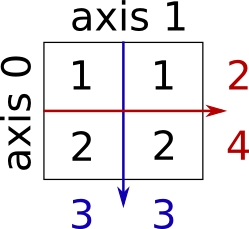

..  For doctests
     
    >>> import numpy as np
    >>> np.random.seed(0)

.. currentmodule:: numpy

Numerical operations on arrays
=================================

.. contents:: Section contents
    :local:
    :depth: 1

Elementwise operations
----------------------

With scalars:

>>> a = np.array([1, 2, 3, 4])
>>> a + 1
array([2, 3, 4, 5])
>>> 2**a
array([ 2,  4,  8, 16])

All arithmetic operates elementwise:

>>> b = np.ones(4) + 1
>>> a - b
array([-1.,  0.,  1.,  2.])
>>> a * b
array([ 2.,  4.,  6.,  8.])

>>> j = np.arange(5)
>>> 2**(j + 1) - j
array([ 2,  3,  6, 13, 28])

.. warning:: **Array multiplication is not matrix multiplication:**

    >>> c = np.ones((3, 3))
    >>> c * c                   # NOT matrix multiplication!
    array([[ 1.,  1.,  1.],
           [ 1.,  1.,  1.],
           [ 1.,  1.,  1.]])

.. note:: **Matrix multiplication:**

   >>> c.dot(c)
   array([[ 3.,  3.,  3.],
          [ 3.,  3.,  3.],
          [ 3.,  3.,  3.]])

Comparisons::

    >>> a = np.array([1, 2, 3, 4])
    >>> b = np.array([4, 2, 2, 4])
    >>> a == b
    array([False,  True, False,  True], dtype=bool)
    >>> a > b
    array([False, False,  True, False], dtype=bool)

Logical operations::

    >>> a = np.array([1, 1, 0, 0], dtype=bool)
    >>> b = np.array([1, 0, 1, 0], dtype=bool)
    >>> np.logical_or(a, b)
    array([ True,  True,  True, False], dtype=bool)
    >>> np.logical_and(a, b)
    array([ True, False, False, False], dtype=bool)

.. note::

   For arrays: "``np.logical_and``" and "``np.logical_or``" for logical
   operations, not "``and``" and "``or``".

Shape mismatches::

    >>> a = np.arange(4)
    >>> a
    array([0, 1, 2, 3])
    >>> a + np.array([1, 2])    # doctest: +SKIP
    Traceback (most recent call last):
    File "<stdin>", line 1, in <module>
    ValueError: shape mismatch: objects cannot be broadcast to a single shape

**'Broadcast'?** We'll return to that :ref:`later <broadcasting>`.

**Transposition**::

    >>> a = np.triu(np.ones((3, 3)), 1)   # see help(np.triu)
    >>> a
    array([[ 0.,  1.,  1.],
           [ 0.,  0.,  1.],
           [ 0.,  0.,  0.]])
    >>> a.T
    array([[ 0.,  0.,  0.],
           [ 1.,  0.,  0.],
           [ 1.,  1.,  0.]])

.. note:: **Linear algebra**

    The sub-module `np.linalg` implements basic linear algebra, such as
    eigenvalue decomposition, solving linear systems... However, it is
    not garantied to be compiled using efficient routines, and thus we
    recommend to use `scipy.linalg`, as detailed in section
    :ref:`scipy_linalg`

.. topic:: Exercice
    :class: green

    Generate arrays `[2**0, 2**1, 2**2, 2**3, 2**4]` and 
    `a_j = 2^(3*j) - j`

Basic reductions
----------------

Computing sums:

>>> x = np.array([1, 2, 3, 4])
>>> np.sum(x)
10
>>> x.sum()
10

Sum by rows and by columns::

    >>> x = np.array([[1, 1], [2, 2]])
    >>> x
    array([[1, 1],
           [2, 2]])
    >>> x.sum(axis=0)   # columns (first dimension)
    array([3, 3])
    >>> x[:, 0].sum(), x[:, 1].sum()
    (3, 3)
    >>> x.sum(axis=1)   # rows (second dimension)
    array([2, 4])
    >>> x[0, :].sum(), x[1, :].sum()
    (2, 4)

Same idea in higher dimensions::

    >>> x = np.random.rand(2, 2, 2)
    >>> x.sum(axis=2)[0, 1]     # doctest: +ELLIPSIS
    1.14764...
    >>> x[0, 1, :].sum()     # doctest: +ELLIPSIS
    1.14764...

**Other reductions** --- works the same way (and take ``axis=``)

- Statistics:

  >>> x = np.array([1, 2, 3, 1])
  >>> y = np.array([[1, 2, 3], [5, 6, 1]])
  >>> x.mean()
  1.75
  >>> np.median(x)
  1.5
  >>> np.median(y, axis=-1) # last axis
  array([ 2.,  5.])

  >>> x.std()          # full population standard dev.
  0.82915619758884995

- Extrema:

  >>> x = np.array([1, 3, 2])
  >>> x.min()
  1
  >>> x.max()
  3

  >>> x.argmin()  # index of minimum
  0
  >>> x.argmax()  # index of maximum
  1

- Logical operations:

  >>> np.all([True, True, False])
  False
  >>> np.any([True, True, False])
  True

  .. note::

     Can be used for array comparisons:

     >>> a = np.zeros((100, 100))
     >>> np.any(a != 0)
     False
     >>> np.all(a == a)
     True

     >>> a = np.array([1, 2, 3, 2])
     >>> b = np.array([2, 2, 3, 2])
     >>> c = np.array([6, 4, 4, 5])
     >>> ((a <= b) & (b <= c)).all()
     True

- ... and many more (best to learn as you go).

.. topic:: Example: data statistics

  Data in :download:`populations.txt <../../data/populations.txt>`
  describes the populations of hares and lynxes (and carrots) in northern
  Canada during 20 years.

  We can first plot the data::

    >>> data = np.loadtxt('data/populations.txt')
    >>> year, hares, lynxes, carrots = data.T  # trick: columns to variables

    >>> from matplotlib import pyplot as plt
    >>> plt.axes([0.2, 0.1, 0.5, 0.8]) # doctest: +ELLIPSIS
    <matplotlib.axes.Axes object at ...>
    >>> plt.plot(year, hares, year, lynxes, year, carrots) # doctest: +ELLIPSIS
    [<matplotlib.lines.Line2D object at ...>, ...]
    >>> plt.legend(('Hare', 'Lynx', 'Carrot'), loc=(1.05, 0.5)) # doctest: +ELLIPSIS
    <matplotlib.legend.Legend object at ...>

  .. plot:: pyplots/numpy_intro_4.py

  The mean populations over time::

    >>> populations = data[:, 1:]
    >>> populations.mean(axis=0)
    array([ 34080.95238095,  20166.66666667,  42400.        ])

  The sample standard deviations::

    >>> populations.std(axis=0)
    array([ 20897.90645809,  16254.59153691,   3322.50622558])

  Which species has the highest population each year?

  >>> np.argmax(populations, axis=1)
  array([2, 2, 0, 0, 1, 1, 2, 2, 2, 2, 2, 2, 0, 0, 0, 1, 2, 2, 2, 2, 2])

.. topic:: Example: diffusion simulation using a random walk algorithm

  .. image:: random_walk.png
     :align: center

  What is the typical distance from the origin of a random walker after
  ``t`` left or right jumps?

  .. only:: latex

    .. image:: random_walk_schema.png
        :align: center

  .. only:: html

    .. image:: random_walk_schema.png
        :align: center
        :width: 100%

  >>> n_stories = 1000 # number of walkers
  >>> t_max = 200      # time during which we follow the walker

  We randomly choose all the steps 1 or -1 of the walk::

   >>> t = np.arange(t_max)
   >>> steps = 2 * np.random.random_integers(0, 1, (n_stories, t_max)) - 1
   >>> np.unique(steps) # Verification: all steps are 1 or -1
   array([-1,  1])

  We build the walks by summing steps along the time::

   >>> positions = np.cumsum(steps, axis=1) # axis = 1: dimension of time
   >>> sq_distance = positions**2

  We get the mean in the axis of the stories::

   >>> mean_sq_distance = np.mean(sq_distance, axis=0)

  Plot the results::

   >>> plt.figure(figsize=(4, 3)) # doctest: +ELLIPSIS
   <matplotlib.figure.Figure object at ...>
   >>> plt.plot(t, np.sqrt(mean_sq_distance), 'g.', t, np.sqrt(t), 'y-') # doctest: +ELLIPSIS
   [<matplotlib.lines.Line2D object at ...>, <matplotlib.lines.Line2D object at ...>]
   >>> plt.xlabel(r"$t$") # doctest: +ELLIPSIS
   <matplotlib.text.Text object at ...>
   >>> plt.ylabel(r"$\sqrt{\langle (\delta x)^2 \rangle}$") # doctest: +ELLIPSIS
   <matplotlib.text.Text object at ...>
  

  .. plot:: pyplots/numpy_intro_5.py

The RMS distance grows as the square root of the time!

.. arithmetic: sum/prod/mean/std

.. extrema: min/max

.. logical: all/any

.. the axis argument

.. EXE: verify if all elements in an array are equal to 1
.. EXE: verify if any elements in an array are equal to 1
.. EXE: load data with loadtxt from a file, and compute its basic statistics

.. CHA: implement mean and std using only sum()

.. _broadcasting:

Broadcasting
------------

* Basic operations on ``numpy`` arrays (addition, etc.) are elementwise

* This works on arrays of the same size.

    | **Nevertheless**, It's also possible to do operations on arrays of different
    | sizes if *Numpy* can transform these arrays so that they all have
    | the same size: this conversion is called **broadcasting**.

The image below gives an example of broadcasting:

.. only:: latex

    .. image:: numpy_broadcasting.png
        :align: center

.. only:: html

    .. image:: numpy_broadcasting.png
        :align: center
        :width: 100%

Let's verify::

    >>> a = np.tile(np.arange(0, 40, 10), (3, 1)).T
    >>> a
    array([[ 0,  0,  0],
           [10, 10, 10],
           [20, 20, 20],
           [30, 30, 30]])
    >>> b = np.array([0, 1, 2])
    >>> a + b
    array([[ 0,  1,  2],
           [10, 11, 12],
           [20, 21, 22],
           [30, 31, 32]])

An useful trick:

    >>> a = np.arange(0, 40, 10)
    >>> a.shape
    (4,)
    >>> a = a[:, np.newaxis]  # adds a new axis -> 2D array
    >>> a.shape
    (4, 1)
    >>> a
    array([[ 0],
           [10],
           [20],
           [30]])
    >>> a + b
    array([[ 0,  1,  2],
           [10, 11, 12],
           [20, 21, 22],
           [30, 31, 32]])

We have already used broadcasting without knowing it!::

    >>> a = np.ones((4, 5))
    >>> a[0] = 2  # we assign an array of dimension 0 to an array of dimension 1
    >>> a
    array([[ 2.,  2.,  2.,  2.,  2.],
           [ 1.,  1.,  1.,  1.,  1.],
           [ 1.,  1.,  1.,  1.,  1.],
           [ 1.,  1.,  1.,  1.,  1.]])

Broadcasting seems a bit magical, but it is actually quite natural to use it
when we want to solve a problem whose output data is an array with more
dimensions than input data.

.. topic:: Example

  Let's construct an array of distances (in miles) between cities of
  Route 66: Chicago, Springfield, Saint-Louis, Tulsa, Oklahoma City,
  Amarillo, Santa Fe, Albuquerque, Flagstaff and Los Angeles.

  ::

      >>> mileposts = np.array([0, 198, 303, 736, 871, 1175, 1475, 1544,
      ...        1913, 2448])
      >>> distance_array = np.abs(mileposts - mileposts[:, np.newaxis])
      >>> distance_array
      array([[   0,  198,  303,  736,  871, 1175, 1475, 1544, 1913, 2448],
             [ 198,    0,  105,  538,  673,  977, 1277, 1346, 1715, 2250],
             [ 303,  105,    0,  433,  568,  872, 1172, 1241, 1610, 2145],
             [ 736,  538,  433,    0,  135,  439,  739,  808, 1177, 1712],
             [ 871,  673,  568,  135,    0,  304,  604,  673, 1042, 1577],
             [1175,  977,  872,  439,  304,    0,  300,  369,  738, 1273],
             [1475, 1277, 1172,  739,  604,  300,    0,   69,  438,  973],
             [1544, 1346, 1241,  808,  673,  369,   69,    0,  369,  904],
             [1913, 1715, 1610, 1177, 1042,  738,  438,  369,    0,  535],
             [2448, 2250, 2145, 1712, 1577, 1273,  973,  904,  535,    0]])

  .. image:: route66.png
     :align: center
     :scale: 60

A lot of grid-based or network-based problems can also use
broadcasting. For instance, if we want to compute the distance from
the origin of points on a 10x10 grid, we can do::

    >>> x, y = np.arange(5), np.arange(5)
    >>> distance = np.sqrt(x ** 2 + y[:, np.newaxis] ** 2)
    >>> distance
    array([[ 0.        ,  1.        ,  2.        ,  3.        ,  4.        ],
           [ 1.        ,  1.41421356,  2.23606798,  3.16227766,  4.12310563],
           [ 2.        ,  2.23606798,  2.82842712,  3.60555128,  4.47213595],
           [ 3.        ,  3.16227766,  3.60555128,  4.24264069,  5.        ],
           [ 4.        ,  4.12310563,  4.47213595,  5.        ,  5.65685425]])

 Or in color::

    >>> plt.pcolor(distance)    # doctest: +ELLIPSIS
    <matplotlib.collections.PolyCollection object at ...>
    >>> plt.colorbar()    # doctest: +ELLIPSIS
    <matplotlib.colorbar.Colorbar instance at ...>
    >>> plt.axis('equal')
    (0.0, 200.0, 0.0, 16.0)

.. plot:: pyplots/numpy_intro_6.py

**Remark** : the ``numpy.ogrid`` function allows to directly create vectors x
and y of the previous example, with two "significant dimensions"::

    >>> x, y = np.ogrid[0:5, 0:5]
    >>> x, y
    (array([[0],
           [1],
           [2],
           [3],
           [4]]), array([[0, 1, 2, 3, 4]]))
    >>> x.shape, y.shape
    ((5, 1), (1, 5))
    >>> distance = np.sqrt(x ** 2 + y ** 2)

So, ``np.ogrid`` is very useful as soon as we have to handle computations on a
grid. On the other hand, ``np.mgrid`` directly provides matrices full of
indices for cases where we can't (or don't want to) benefit from broadcasting::

    >>> x, y = np.mgrid[0:4, 0:4]
    >>> x
    array([[0, 0, 0, 0],
           [1, 1, 1, 1],
           [2, 2, 2, 2],
           [3, 3, 3, 3]])
    >>> y
    array([[0, 1, 2, 3],
           [0, 1, 2, 3],
           [0, 1, 2, 3],
           [0, 1, 2, 3]])

However, in practice, this is rarely needed!

.. rules

.. some usage examples: scalars, 1-d matrix products

.. newaxis

.. EXE: add 1-d array to a scalar
.. EXE: add 1-d array to a 2-d array
.. EXE: multiply matrix from the right with a diagonal array
.. CHA: constructing grids -- meshgrid using only newaxis

Array shape manipulation
------------------------

Flattening
...........

>>> a = np.array([[1, 2, 3], [4, 5, 6]])
>>> a.ravel()
array([1, 2, 3, 4, 5, 6])
>>> a.T
array([[1, 4],
       [2, 5],
       [3, 6]])
>>> a.T.ravel()
array([1, 4, 2, 5, 3, 6])

Higher dimensions: last dimensions ravel out "first".

Reshaping
.........

The inverse operation to flattening::

    >>> a.shape
    (2, 3)
    >>> b = a.ravel()
    >>> b.reshape((2, 3))
    array([[1, 2, 3],
           [4, 5, 6]])

Creating an array with a different shape, from another array::

    >>> a = np.arange(36)
    >>> b = a.reshape((6, 6))
    >>> b
    array([[ 0,  1,  2,  3,  4,  5],
           [ 6,  7,  8,  9, 10, 11],
           [12, 13, 14, 15, 16, 17],
           [18, 19, 20, 21, 22, 23],
           [24, 25, 26, 27, 28, 29],
           [30, 31, 32, 33, 34, 35]])

Or, ::

    >>> b = a.reshape((6, -1))    # unspecified (-1) value is inferred

Views and copies
................

``ndarray.reshape`` **may** return a view (cf ``help(np.reshape)``)),
not a copy:

>>> b[0, 0] = 99
>>> a
array([99,  1,  2,  3,  4,  5,  6,  7,  8,  9, 10, 11, 12, 13, 14, 15, 16,
       17, 18, 19, 20, 21, 22, 23, 24, 25, 26, 27, 28, 29, 30, 31, 32, 33,
       34, 35])

Beware: reshape may also return a copy!

>>> a = np.zeros((3, 2))
>>> b = a.T.reshape(3*2)
>>> b[0] = 9
>>> a
array([[ 0.,  0.],
       [ 0.,  0.],
       [ 0.,  0.]])

To understand, see the section on :ref:`the memory layout of an array <memory_layout>` below.

Dimension shuffling
....................

>>> a = np.arange(4*3*2).reshape(4, 3, 2)
>>> a.shape
(4, 3, 2)
>>> a[0, 2, 1]
5
>>> b = a.transpose(1, 2, 0)
>>> b.shape
(3, 2, 4)
>>> b[2, 1, 0]
5

Also creates a view::

    >>> b[2, 1, 0] = -1
    >>> a[0, 2, 1]
    -1

Resizing
.........

Size of an array can be changed with ``ndarray.resize``::

    >>> a = np.arange(4)
    >>> a.resize((8,))
    >>> a
    array([0, 1, 2, 3, 0, 0, 0, 0])

However, it must not be referred to somewhere else::

    >>> b = a
    >>> a.resize((4,))   # doctest: +SKIP
    ...
    ValueError: cannot resize an array references or is referenced
    by another array in this way.  Use the resize function

Some examples of real-world use cases
......................................

.. topic:: Case 2.a: Calling (legacy) Fortran code

   Shape-preserving functions with elementwise non-Python
   routines. For instance, Fortran

   .. sourcecode:: fortran

      ! 2_a_fortran_module.f90
      subroutine some_function(n, a, b)
        integer :: n
        double precision, dimension(n), intent(in) :: a
        double precision, dimension(n), intent(out) :: b
        b = a + 1
      end subroutine some_function

   We can use f2py to wrap this fortran code in Python: 
   ``f2py -c -m fortran_module 2_a_fortran_module.f90``

   .. sourcecode:: python

       import numpy as np
       import fortran_module

       def some_function(input):
           """
	   Call a Fortran routine, and preserve input shape
	   """
           input = np.asarray(input)
	   # fortran_module.some_function() takes 1-D arrays!
           output = fortran_module.some_function(input.ravel())
	   return output.reshape(input.shape)

       print some_function(np.array([1, 2, 3]))
       print some_function(np.array([[1, 2], [3, 4]]))

       # ->
       # [ 2.  3.  4.]
       # [[ 2.  3.]
       #  [ 4.  5.]]

.. topic:: Case 2.b: Block matrices and vectors (and tensors)

   Vector space: quantum level :math:`\otimes` spin

   .. math::

      \check{\psi}
      =
      \begin{pmatrix}
      \hat{\psi}_1 \\ \hat{\psi}_2
      \end{pmatrix}
      \,,
      \qquad
      \hat{\psi}_{1} =
      \begin{pmatrix}
        \psi_{1\uparrow} \\ \psi_{1\downarrow}
      \end{pmatrix}
      \qquad
      \hat{\psi}_{2} =
      \begin{pmatrix}
        \psi_{2\uparrow} \\ \psi_{2\downarrow}
      \end{pmatrix}

   In short: for **block matrices and vectors**, it can be useful
   to preserve the **block structure**.

   In Numpy::

    >>> psi = np.zeros((2, 2))   # dimensions: level, spin
    >>> psi[0, 1] # <-- psi_{1,downarrow}
    0.0

   Linear operators on such block vectors have similar block structure:

   .. math::

      \check{H} = \begin{pmatrix}
      \hat{h}_{11} & \hat{V} \\
      \hat{V}^\dagger & \hat{h}_{22} \\
      \end{pmatrix}
      \,,
      \qquad
      \hat{h}_{11}
      =
      \begin{pmatrix}
      \epsilon_{1,\uparrow}
      & 0
      \\
      0 & \epsilon_{1,\downarrow}
      \end{pmatrix}
      \,,
      \qquad
      \ldots

   >>> H = np.zeros((2, 2, 2, 2)) # dimensions: level1, level2, spin1, spin2
   >>> h_11 = H[0,0,:,:]
   >>> V = H[0,1]

   Doing the matrix product: get rid of the block structure, do the
   4x4 matrix product, then put it back

   .. math::

      \check{H}\check{\psi}

   >>> def mdot(operator, psi):
   ...     return operator.transpose(0, 2, 1, 3).reshape(4, 4).dot(
   ...                psi.reshape(4)).reshape(2, 2)

   I.e., reorder dimensions first to ``level1, spin1, level2, spin2``
   and then reshape => correct matrix product.

   .. seealso: ``help(np.tensordot)``

.. resizing: how to do it, and *when* is it possible (not always!)

.. reshaping (demo using an image?)

.. dimension shuffling

.. when to use: some pre-made algorithm (e.g. in Fortran) accepts only
   1-D data, but you'd like to vectorize it

.. EXE: load data incrementally from a file, by appending to a resizing array
.. EXE: vectorize a pre-made routine that only accepts 1-D data
.. EXE: manipulating matrix direct product spaces back and forth (give an example from physics -- spin index and orbital indices)
.. EXE: shuffling dimensions when writing a general vectorized function
.. CHA: the mathematical 'vec' operation

Sorting data
------------

Sorting along an axis::

    >>> a = np.array([[4, 3, 5], [1, 2, 1]])
    >>> b = np.sort(a, axis=1)
    >>> b
    array([[3, 4, 5],
           [1, 1, 2]])

.. note:: Sorts each row separately!

In-place sort::

    >>> a.sort(axis=1)
    >>> a
    array([[3, 4, 5],
           [1, 1, 2]])

Sorting with fancy indexing::

    >>> a = np.array([4, 3, 1, 2])
    >>> j = np.argsort(a)
    >>> j
    array([2, 3, 1, 0])
    >>> a[j]
    array([1, 2, 3, 4])

Finding minima and maxima::

    >>> a = np.array([4, 3, 1, 2])
    >>> j_max = np.argmax(a)
    >>> j_min = np.argmin(a)
    >>> j_max, j_min
    (0, 2)

.. XXX: need a frame for summaries
   
    * Arithmetic etc. are elementwise operations
    * Basic linear algebra, ``.dot()``
    * Reductions: ``sum(axis=1)``, ``std()``, ``all()``, ``any()``
    * Broadcasting: ``a = np.arange(4); a[:,np.newaxis] + a[np.newaxis,:]``
    * Shape manipulation: ``a.ravel()``, ``a.reshape(2, 2)``
    * Fancy indexing: ``a[a > 3]``, ``a[[2, 3]]``
    * Sorting data: ``.sort()``, ``np.sort``, ``np.argsort``, ``np.argmax``

Some exercices
----------------

.. topic:: Worked example: Framing Lena

    Let's do some manipulations on numpy arrays by starting with the
    famous image of Lena (http://www.cs.cmu.edu/~chuck/lennapg/).
    ``scipy`` provides a 2D array of this image with the ``scipy.lena``
    function::

        >>> from scipy import misc
        >>> lena = misc.lena()

    **Note:** In older versions of scipy, you will find lena under
    `scipy.lena()`

    Here are a few images we will be able to obtain with our manipulations:
    use different colormaps, crop the image, change some parts of the image.

    .. image:: lenas.png
        :align: center

    * Let's use the imshow function of pylab to display the image.

      .. sourcecode:: ipython

        In [3]: import pylab as plt
        In [4]: lena = misc.lena()
        In [5]: plt.imshow(lena)

    * Lena is then displayed in false colors. A colormap must be
      specified for her to be displayed in grey.

      .. sourcecode:: ipython

        In [6]: plt.imshow(lena, cmap=plt.cm.gray)

    * Create an array of the image with a narrower centering : for example,
      remove 30 pixels from all the borders of the image. To check the result,
      display this new array with ``imshow``.

      .. sourcecode:: ipython

        In [9]: crop_lena = lena[30:-30,30:-30]

    * We will now frame Lena's face with a black locket. For this, we
      need to create a mask corresponding to the pixels we want to be
      black. The mask is defined by this condition ``(y-256)**2 +
      (x-256)**2``

      .. sourcecode:: ipython

         In [15]: y, x = np.ogrid[0:512,0:512] # x and y indices of pixels
         In [16]: y.shape, x.shape
         Out[16]: ((512, 1), (1, 512))
         In [17]: centerx, centery = (256, 256) # center of the image
         In [18]: mask = ((y - centery)**2 + (x - centerx)**2) > 230**2 # circle

      then we assign the value 0 to the pixels of the image corresponding
      to the mask. The syntax is extremely simple and intuitive:

      .. sourcecode:: ipython

         In [19]: lena[mask] = 0
         In [20]: plt.imshow(lena)
         Out[20]: <matplotlib.image.AxesImage object at 0xa36534c>

    * Follow-up: copy all instructions of this exercise in a script called
      ``lena_locket.py`` then execute this script in IPython with ``%run
      lena_locket.py``.

      Change the circle to an ellipsoid.

.. topic:: Exercise: Array manipulations
    :class: green

    1. Form the 2-D array (without typing it in explicitly)::

        1  6 11
        2  7 12
        3  8 13
        4  9 14
        5 10 15

       and generate a new array containing its 2nd and 4th rows.

    2. Divide each column of the array::

        >>> a = np.arange(25).reshape(5, 5)

       elementwise with the array ``b = np.array([1., 5, 10, 15, 20])``.
       (Hint: ``np.newaxis``).

    3. Harder one: Generate a 10 x 3 array of random numbers (in range [0,1]).
       For each row, pick the number closest to 0.5.

       - Use ``abs`` and ``argsort`` to find the column ``j`` closest for
         each row.

       - Use fancy indexing to extract the numbers.  (Hint: ``a[i,j]`` --
         the array ``i`` must contain the row numbers corresponding to stuff in
         ``j``.)

.. topic:: Exercise: Data statistics
   :class: green

   The data in :download:`populations.txt <../../data/populations.txt>`::
   describes the populations of hares and lynxes (and carrots) in
   northern Canada during 20 years::

    >>> data = np.loadtxt('data/populations.txt')
    >>> year, hares, lynxes, carrots = data.T  # trick: columns to variables

    >>> plt.axes([0.2, 0.1, 0.5, 0.8]) # doctest: +ELLIPSIS
    <matplotlib.axes.Axes object at ...>
    >>> plt.plot(year, hares, year, lynxes, year, carrots) # doctest: +ELLIPSIS
    [<matplotlib.lines.Line2D object at ...>, ...]
    >>> plt.legend(('Hare', 'Lynx', 'Carrot'), loc=(1.05, 0.5)) # doctest: +ELLIPSIS
    <matplotlib.legend.Legend object at ...>

   .. plot:: pyplots/numpy_intro_7.py

   Computes and print, based on the data in ``populations.txt``...

   1. The mean and std of the populations of each species for the years
      in the period.

   2. Which year each species had the largest population.

   3. Which species has the largest population for each year.
      (Hint: ``argsort`` & fancy indexing of
      ``np.array(['H', 'L', 'C'])``)

   4. Which years any of the populations is above 50000.
      (Hint: comparisons and ``np.any``)

   5. The top 2 years for each species when they had the lowest
      populations. (Hint: ``argsort``, fancy indexing)

   6. Compare (plot) the change in hare population (see
      ``help(np.gradient)``) and the number of lynxes. Check correlation
      (see ``help(np.corrcoef)``).

   ... all without for-loops.

.. topic:: Exercise: Crude integral approximations
   :class: green

   Write a function ``f(a, b, c)`` that returns :math:`a^b - c`.  Form
   a 24x12x6 array containing its values in parameter ranges ``[0,1] x
   [0,1] x [0,1]``.

   Approximate the 3-d integral

   .. math:: \int_0^1\int_0^1\int_0^1(a^b-c)da\,db\,dc

   over this volume with the mean.  The exact result is: :math:`\ln 2 -
   \frac{1}{2}\approx0.1931\ldots` --- what is your relative error?

   (Hints: use elementwise operations and broadcasting.
   You can make ``np.ogrid`` give a number of points in given range
   with ``np.ogrid[0:1:20j]``.)

   **Reminder** Python functions::

       def f(a, b, c):
           return some_result

.. topic:: Exercise: Mandelbrot set
   :class: green

    .. plot:: intro/numpy/solutions/2_4_mandelbrot.py
        :include-source: 0

    Write a script that computes the Mandelbrot fractal. The Mandelbrot
    iteration::

        N_max = 50
        some_threshold = 50

        c = x + 1j*y

        for j in xrange(N_max):
            z = z**2 + c

    Point (x, y) belongs to the Mandelbrot set if :math:`|c|` <
    ``some_threshold``.

    Do this computation by:

    .. For doctests
       >>> mask = np.ones((3, 3))

    1. Construct a grid of c = x + 1j*y values in range [-2, 1] x [-1.5, 1.5]

    2. Do the iteration

    3. Form the 2-d boolean mask indicating which points are in the set

    4. Save the result to an image with::

        >>> import matplotlib.pyplot as plt
        >>> plt.imshow(mask.T, extent=[-2, 1, -1.5, 1.5]) # doctest: +ELLIPSIS
        <matplotlib.image.AxesImage object at ...>
        >>> plt.gray()
        >>> plt.savefig('mandelbrot.png')

.. topic:: Exercise: Markov chain
   :class: green

    .. image:: markov-chain.png

    Markov chain transition matrix ``P``, and probability distribution on
    the states ``p``::

    1. ``0 <= P[i,j] <= 1``: probability to go from state ``i`` to state ``j``

    2. Transition rule: :math:`p_{new} = P^T p_{old}`

    3. ``all(sum(P, axis=1) == 1)``, ``p.sum() == 1``: normalization

    Write a script that works with 5 states, and:

    - Constructs a random matrix, and normalizes each row so that it
      is a transition matrix.

    - Starts from a random (normalized) probability distribution
      ``p`` and takes 50 steps => ``p_50``

    - Computes the stationary distribution: the eigenvector of ``P.T``
      with eigenvalue 1 (numerically: closest to 1) => ``p_stationary``

    Remember to normalize the eigenvector --- I didn't...

    - Checks if ``p_50`` and ``p_stationary`` are equal to tolerance 1e-5

    Toolbox: ``np.random.rand``, ``.dot()``, ``np.linalg.eig``,
    reductions, ``abs()``, ``argmin``, comparisons, ``all``,
    ``np.linalg.norm``, etc.

Summary
--------

**What do you need to know to get started?**

* Know how to create arrays : ``array``, ``arange``, ``ones``,
  ``zeros``.

* Know the shape of the array with ``array.shape``, then use slicing
  to obtain different views of the array: ``array[::2]``,
  etc. Adjust the shape of the array using ``reshape`` or flatten it
  with ``ravel``.

* Obtain a subset of the elements of an array and/or modify their values
  with masks::

  >>> a[a < 0] = 0

* Know miscellaneous operations on arrays, such as finding the mean or max
  (``array.max()``, ``array.mean()``). No need to retain everything, but
  have the reflex to search in the documentation (online docs,
  ``help()``, ``lookfor()``)!!

* For advanced use: master the indexing with arrays of integers, as well as
  broadcasting. Know more Numpy functions to handle various array
  operations.

