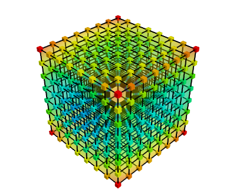
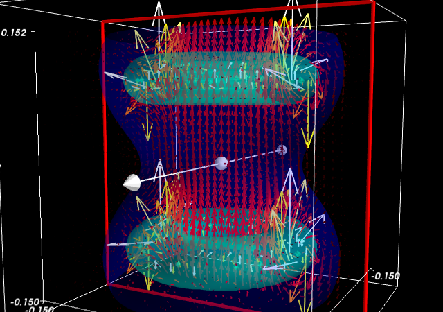

.. currentmodule:: mayavi

.. _mayavi-label:

========================
3D plotting with Mayavi
========================

.. only:: html

    .. image:: mayavi-logo.png
        :align: right

**Author**: *Gaël Varoquaux*

.. tip::
   
    `Mayavi <http://docs.enthought.com/mayavi/mayavi>`_ is an interactive
    3D plotting package. :ref:`matplotlib <matplotlib>` can also do
    simple 3D plotting, but Mayavi relies on a more powerful engine (
    `VTK <http://www.vtk.org/>`_ ) and is more suited to displaying large
    or complex data.

.. contents:: Chapters contents
    :local:
    :depth: 3

Mlab: the scripting interface
==============================

The :mod:`mayavi.mlab` module provides simple plotting functions to apply
to numpy arrays, similar to matplotlib or matlab's plotting interface.
Try using them in IPython, by starting IPython with the switch
``--gui=wx``.

3D plotting functions
----------------------

Points
......

.. image:: examples/points3d.png
    :align: right
    :scale: 50

.. hint::

   Points in 3D, represented with markers (or "glyphs") and optionaly
   different sizes.
 
.. literalinclude:: examples/generate_figures.py
    :start-after: ### begin points3d example
    :end-before: ### end points3d example

Lines
......

.. image:: examples/plot3d.png
    :align: right
    :scale: 50

.. hint::

   A line connecting points in 3D, with optional thickness and varying
   color.

.. literalinclude:: examples/generate_figures.py
    :start-after: ### begin plot3d example
    :end-before: ### end plot3d example

Elevation surface
.................

.. image:: examples/surf.png
    :align: right
    :scale: 50

.. hint::

   A surface given by its elevation, coded as a 2D array

.. literalinclude:: examples/generate_figures.py
    :start-after: ### begin surf example
    :end-before: ### end surf example

Arbitrary regular mesh
.......................

.. image:: examples/mesh.png
    :align: right
    :scale: 50

.. hint::

   A surface mesh given by x, y, z positions of its node points

.. literalinclude:: examples/generate_figures.py
    :start-after: ### begin mesh example
    :end-before: ### end mesh example

.. note:: 

    A surface is defined by points **connected** to form triangles or
    polygones. In :func:`mayavi.mlab.surf` and :func:`mayavi.mlab.mesh`,
    the connectivity is implicity given by the layout of the arrays. See also
    :func:`mayavi.mlab.triangular_mesh`.

**Our data is often more than points and values: it needs some
connectivity information**

.. _mayavi-voldata-label: 

Volumetric data
................

.. image:: examples/contour3d.png
    :align: right
    :scale: 50

.. hint::

   If your data is *dense* in 3D, it is more difficult to display. One
   option is to take iso-contours of the data.

.. literalinclude:: examples/generate_figures.py
    :start-after: ### begin contour3d example
    :end-before: ### end contour3d example

**This function works with a regular orthogonal grid:** the `value` array
is a 3D array that gives the shape of the grid.

Figures and decorations
-------------------------

Figure management
..................

.. tip::

    Here is a list of functions useful to control the current figure

================================ ==============================================================
Get the current figure:		  `mlab.gcf()`
-------------------------------- --------------------------------------------------------------
Clear the current figure:	  `mlab.clf()`
-------------------------------- --------------------------------------------------------------
Set the current figure:		  `mlab.figure(1, bgcolor=(1, 1, 1), fgcolor=(0.5, 0.5, 0.5)`
-------------------------------- --------------------------------------------------------------
Save figure to image file:	  `mlab.savefig('foo.png', size=(300, 300))`
-------------------------------- --------------------------------------------------------------
Change the view:		  mlab.view(azimuth=45, elevation=54, distance=1.)
================================ ==============================================================

Changing plot properties
.........................

.. tip:: 

    In general, many properties of the various objects on the figure can
    be changed. If these visualization are created via `mlab` functions, 
    the easiest way to change them is to use the keyword arguments of
    these functions, as described in the docstrings.

.. topic:: **Example docstring:** `mlab.mesh`

    Plots a surface using grid-spaced data supplied as 2D arrays.
    
    **Function signatures**::
    
        mesh(x, y, z, ...)
    
    x, y, z are 2D arrays, all of the same shape, giving the positions of
    the vertices of the surface. The connectivity between these points is
    implied by the connectivity on the arrays.
    
    For simple structures (such as orthogonal grids) prefer the surf function,
    as it will create more efficient data structures.
    
    **Keyword arguments:**
    
        :color: the color of the vtk object. Overides the colormap,
                if any, when specified. This is specified as a
                triplet of float ranging from 0 to 1, eg (1, 1,
                1) for white.
                
        :colormap: type of colormap to use.
                   
        :extent: [xmin, xmax, ymin, ymax, zmin, zmax]
                 Default is the x, y, z arrays extents. Use
                 this to change the extent of the object
                 created.
                 
        :figure: Figure to populate.
                 
        :line_width:  The with of the lines, if any used. Must be a float.
                     Default: 2.0
                     
        :mask: boolean mask array to suppress some data points.
               
        :mask_points: If supplied, only one out of 'mask_points' data point is
                      displayed. This option is usefull to reduce the number
                      of points displayed on large datasets Must be an integer
                      or None.
                      
        :mode: the mode of the glyphs. Must be '2darrow' or '2dcircle' or
               '2dcross' or '2ddash' or '2ddiamond' or '2dhooked_arrow' or
               '2dsquare' or '2dthick_arrow' or '2dthick_cross' or
               '2dtriangle' or '2dvertex' or 'arrow' or 'cone' or 'cube' or
               'cylinder' or 'point' or 'sphere'. Default: sphere
               
        :name: the name of the vtk object created.

        :representation: the representation type used for the surface. Must be
                         'surface' or 'wireframe' or 'points' or 'mesh' or
                         'fancymesh'. Default: surface
                         
        :resolution: The resolution of the glyph created. For spheres, for
                     instance, this is the number of divisions along theta and
                     phi. Must be an integer. Default: 8
                     
        :scalars: optional scalar data.
                  
        :scale_factor: scale factor of the glyphs used to represent
                       the vertices, in fancy_mesh mode. Must be a float.
                       Default: 0.05
                       
        :scale_mode: the scaling mode for the glyphs
                     ('vector', 'scalar', or 'none').
                     
        :transparent: make the opacity of the actor depend on the
                      scalar.
                      
        :tube_radius: radius of the tubes used to represent the
                      lines, in mesh mode. If None, simple lines are used.
                      
        :tube_sides: number of sides of the tubes used to
                     represent the lines. Must be an integer. Default: 6
                     
        :vmax: vmax is used to scale the colormap
               If None, the max of the data will be used
               
        :vmin: vmin is used to scale the colormap
               If None, the min of the data will be used
    

.. image:: polar_mesh.png
    :align: right
    :scale: 90

**Example:**

.. sourcecode:: ipython

    In [1]: import numpy as np

    In [2]: r, theta = np.mgrid[0:10, -np.pi:np.pi:10j]

    In [3]: x = r * np.cos(theta)

    In [4]: y = r * np.sin(theta)

    In [5]: z = np.sin(r)/r

    In [6]: from mayavi import mlab

    In [7]: mlab.mesh(x, y, z, colormap='gist_earth', extent=[0, 1, 0, 1, 0, 1])
    Out[7]: <mayavi.modules.surface.Surface object at 0xde6f08c>

    In [8]: mlab.mesh(x, y, z, extent=[0, 1, 0, 1, 0, 1], 
       ...: representation='wireframe', line_width=1, color=(0.5, 0.5, 0.5))
    Out[8]: <mayavi.modules.surface.Surface object at 0xdd6a71c>

Decorations
............

.. tip::

    Different items can be added to the figure to carry extra
    information, such as a colorbar or a title.

.. sourcecode:: ipython

    In [9]: mlab.colorbar(Out[7], orientation='vertical')
    Out[9]: <tvtk_classes.scalar_bar_actor.ScalarBarActor object at 0xd897f8c>

    In [10]: mlab.title('polar mesh')
    Out[10]: <enthought.mayavi.modules.text.Text object at 0xd8ed38c>

    In [11]: mlab.outline(Out[7])
    Out[11]: <enthought.mayavi.modules.outline.Outline object at 0xdd21b6c>

    In [12]: mlab.axes(Out[7])
    Out[12]: <enthought.mayavi.modules.axes.Axes object at 0xd2e4bcc>

.. image:: decorations.png
    :align: center
    :scale: 80

.. warning:: 

    **extent:** If we specified extents for a plotting object,  
    `mlab.outline' and `mlab.axes` don't get them by default.

Interactive work
=================

.. tip:: 

    The quickest way to create beautiful visualization with Mayavi is
    probably to interactively tweak the various settings.

The "pipeline dialog"
----------------------

Click on the 'Mayavi' button in the scene, and you can control properties
of objects with dialogs.

.. image:: pipeline.png
    :align: center
    :scale: 70

* Set the background of the figure in the `Mayavi Scene` node
* Set the colormap in the `Colors and legends` node
* Right click on the node to add modules or filters

The script recording button
-----------------------------

To find out what code can be used to program these changes, click on the 
red button as you modify those properties, and it will generate the
corresponding lines of code.

Slicing and dicing data: sources, modules and filters
=======================================================

An example: inspecting magnetic fields
--------------------------------------

Suppose we are simulating the magnetic field generated by Helmholtz coils.
The :download:`examples/compute_field.py` script does this computation
and gives you a `B` array, that is (3 x n), where the first axis is the
direction of the field (Bx, By, Bz), and the second axis the index number
of the point. Arrays `X`, `Y` and `Z` give the positions of these data
points.

.. topic:: **Excercise**
    :class: green

    Visualize this field. Your goal is to make sure that the simulation
    code is correct.

.. topic:: **Suggestions**

   * If you compute the norm of the vector field, you can apply an
     isosurface to it.

   * using :func:`mayavi.mlab.quiver3d` you can plot vectors. You can
     also use the 'masking' options (in the GUI) to make the plot a bit
     less dense.

Different views on data: sources and modules
---------------------------------------------

.. tip::
   
    As we see above, it may be desirable to look at the same data in
    different ways.

Mayavi visualization are created by loading the data in a ``data
source`` and then displayed on the screen using ``modules``.

This can be seen by looking at the "pipeline" view. By right-clicking on
the nodes of the pipeline, you can add new modules.

.. topic:: Quiz
    :class: green

    Why is it not possible to add a `VectorCutPlane` to the vectors
    created by :func:`mayavi.mlab.quiver3d`?

Different sources: scatters and fields
.......................................

.. tip::

   Data comes in different descriptions.
   
   * A 3D block of regularly-spaced value is structured: it is easy to know
     how one measurement is related to another neighboring and how to
     continuously interpolate between these. We can call such data a
     **field**, borrowing from terminology used in physics, as it is
     continuously defined in space.

   * A set of data points measured at random positions in a random order
     gives rise to much more difficult and ill-posed interpolation
     problems: the data structure itself does not tell us what are the
     neighbors of a data point. We call such data a **scatter**.

.. |unstructured| image:: examples/viz_volume_unstructure.png
    :scale: 90

================================================= ==========================================
|structured|                                      |unstructured|                
================================================= ==========================================
Unstructured and unconnected data: a **scatter**  Structured and connected data: a **field**

mlab.points3d, mlab.quiver3d                      mlab.contour3d
================================================= ==========================================

Data sources corresponding to **scatters** can be created with
:func:`mayavi.mlab.pipeline.scalar_scatter` or
:func:`mayavi.mlab.pipeline.vector_scatter`; **field** data sources can be
created with :func:`mlab.pipeline.scalar_field` or
:func:`mlab.pipeline.vector_field`.

.. topic:: Exercice:
    :class: green

    1. Create a contour (for instance of the magnetic field norm) by
       using one of those functions and adding the right *module* by
       clicking on the GUI dialog.

    2. Create the right source to apply a 'vector_cut_plane' and
       reproduce the picture of the magnetic field shown previously.

    Note that one of the difficulties is providing the data in the right
    form (number of arrays, shape) to the functions. This is often the
    case with real-life data.

.. seealso::

   Sources are described in details in the `Mayavi manual
   <http://docs.enthought.com/mayavi/mayavi/data.html>`_.

Transforming data: filters
...........................

If you create a *vector field*, you may want to visualize the
iso-contours of its magnitude. But the isosurface module can only be
applied to scalar data, and not vector data. We can use a *filter*,
``ExtractVectorNorm`` to add this scalar value to the vector field.

    Filters apply a transformation to data, and can be added between
    sources and modules

.. topic:: Excercice
   :class: green

   Using the GUI, add the ExtractVectorNorm filter to display
   iso-contours of the field magnitude.

``mlab.pipeline``: the scripting layer
.......................................

The ``mlab`` scripting layer builds pipelines for you. You can reproduce
these pipelines programmatically with the ``mlab.pipeline`` interface:
each step has a corresponding ``mlab.pipeline`` function (simply convert
the name of the step to lower-case underscore-separated:
ExtractVectorNorm gives extract_vector_norm). This function takes as an
argument the node that it applies to, as well as optional parameters, and
returns the new node.

For example, iso-contours of the magnitude are coded as::

    mlab.pipeline.iso_surface(mlab.pipeline.extract_vector_norm(field),
                              contours=[0.1*Bmax, 0.4*Bmax],
                              opacity=0.5)

.. topic:: Excercice
   :class: green

   Using the mlab.pipeline interface, generate a complete visualization,
   with iso-contours of the field magnitude, and a vector cut plane.

   (click on the figure for a solution)

|clear-floats|

Animating the data
===================

.. tip::

   To make movies, or interactive application, you may want to change the
   data represented on a given visualization.

If you have built a visualization, using the ``mlab`` plotting functions,
or the ``mlab.pipeline`` function, we can update the data by assigning
new values to the ``mlab_source`` attributes

.. literalinclude:: examples/animate_data.py
    :start-after: # Create some simple data
    :end-before: # Start the event loop, if needed

.. seealso::

   More details in the `Mayavi documentation
   <http://docs.enthought.com/mayavi/mayavi/mlab.html#animating-the-data>`_

.. topic:: **Event loops**

   For the interaction with the user (for instance changing the view with
   the mouse), Mayavi needs some time to process these events. The for
   loop above prevents this. The Mayavi documentation details `a workaround
   <http://docs.enthought.com/mayavi/mayavi/tips.html#animating-a-visualization>`_

Making interactive dialogs
===========================

It is very simple to make interactive dialogs with Mayavi using the
Traits library (see the dedicated chapter :ref:`traits`).

A simple dialog
---------------

.. literalinclude:: examples/mlab_dialog.py
    :start-after: import numpy as np

.. tip::

   Let us read a bit the code above (:download:`examples/mlab_dialog.py`). 
   
   First, the ``curve`` function is used to compute the coordinate of the
   curve we want to plot.

   Second, the dialog is defined by an object inheriting from HasTraits,
   as it is done with :ref:`Traits <traits>`. The important point here
   is that a Mayavi scene is added as a specific Traits attribute
   (``Instance``). This is important for embedding it in the dialog.
   The view of this dialog is defined by the ``view`` attribute of the
   object. In the init of this object, we populate the 3D scene with a
   curve.

   Finally, the ``configure_traits`` method creates the dialog and starts
   the event loop.

.. seealso::

   There are a few things to be aware of when doing dialogs with Mayavi.
   Please read the `Mayavi documentation
   <http://docs.enthought.com/mayavi/mayavi/building_applications.html#custom-interactive-dialogs>`_

Making it interactive
----------------------

We can combine the :ref:`Traits events handler <traits_notification>`
with the ``mlab_source`` to modify the visualization with the dialog.

We will enable the user to vary the ``n_turns`` parameter in the definition
of the curve. For this, we need:

* to define an ``n_turns`` attribute on our visualization object, so that
  it can appear in the dialog. We use a ``Range`` type.

* to wire modification of this attribute to a recomputation of the curve.
  For this, we use the ``on_traits_change`` decorator.

.. image:: examples/mlab_interactive_dialog.png
   :scale: 70
   :align: right

.. literalinclude:: examples/mlab_interactive_dialog.py
    :start-after: # The class that contains the dialog

.. tip::

   Full code of the example: :download:`examples/mlab_dialog.py`. 

Putting it together
===================

.. topic:: Exercise
   :class: green

   Using the code from the magnetic field simulation, create a dialog
   that enable to move the 2 coils: change their parameters.

   Hint: to define a dialog entry for a vector of dimension 3 ::

    direction = Array(float, value=(0, 0, 1), cols=3, shape=(3,))

You can look at the :ref:`example_coil_application.py` to see a
full-blown application for coil design in 270 lines of code.

