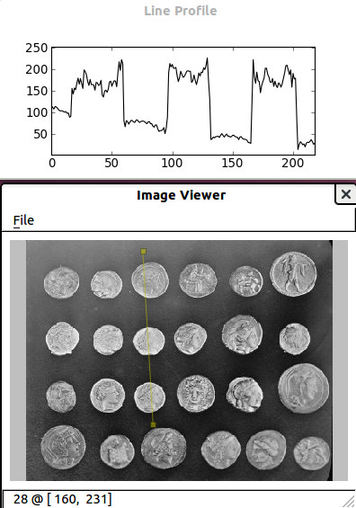

.. for doctests
   >>> import numpy as np
   >>> import scipy.misc
   >>> np.random.seed(0)
   >>> import matplotlib.pyplot as plt
   >>> plt.switch_backend("Agg")

.. _scikit_image:

==============================
Scikit-image: image processing
==============================

.. currentmodule:: skimage

**Author**: *Emmanuelle Gouillart*

`scikit-image <http://scikit-image.org/>`_ is a Python package dedicated
to image processing, and using natively NumPy arrays as image objects.
This chapter describes how to use ``scikit-image`` on various image
processing tasks, and insists on the link with other scientific Python
modules such as NumPy and SciPy.

.. seealso::

   For basic image manipulation, such as image cropping or simple
   filtering, a large number of simple operations can be realized with
   NumPy and SciPy only. See :ref:`basic_image`.

   Note that you should be familiar with the content of the previous
   chapter before reading the current one, as basic operations such as
   masking and labeling are a prerequisite.

.. contents:: Chapters contents
   :local:
   :depth: 2

Introduction and concepts
=========================

Images are NumPy's arrays ``np.ndarray``

:image:

    ``np.ndarray``

:pixels:

    array values: ``a[2, 3]``

:channels:

    array dimensions

:image encoding:

    ``dtype`` (``np.uint8``, ``np.uint16``, ``np.float``)

:filters:

    functions (``numpy``, ``skimage``, ``scipy``)

::
    
    >>> import numpy as np
    >>> check = np.zeros((9, 9))
    >>> check[::2, 1::2] = 1
    >>> check[1::2, ::2] = 1
    >>> import matplotlib.pyplot as plt
    >>> plt.imshow(check, cmap='gray', interpolation='nearest') # doctest: +SKIP

.. image:: auto_examples/images/sphx_glr_plot_check_001.png
    :scale: 60
    :target: auto_examples/plot_check.html
    :align: center

``scikit-image`` and the ``SciPy`` ecosystem
---------------------------------------------

Recent versions of ``scikit-image`` is packaged in most Scientific Python
distributions, such as Anaconda or Enthought Canopy. It is also packaged
for Ubuntu/Debian.

::

    >>> import skimage
    >>> from skimage import data  # most functions are in subpackages 

Most ``scikit-image`` functions take NumPy ``ndarrays`` as arguments ::

    >>> camera = data.camera()
    >>> camera.dtype
    dtype('uint8')
    >>> camera.shape
    (512, 512)
    >>> from skimage import restoration
    >>> filtered_camera = restoration.denoise_bilateral(camera)
    >>> type(filtered_camera)   # doctest: +SKIP
    <type 'numpy.ndarray'>

Other Python packages are available for image processing and work with
NumPy arrays:

 * :mod:`scipy.ndimage` : for nd-arrays. Basic
   filtering, mathematical morphology, regions properties

 * `Mahotas <http://luispedro.org/software/mahotas>`_

Also, powerful image processing libraries have Python bindings:

 * `OpenCV <https://opencv-python-tutroals.readthedocs.org/en/latest/>`_
   (computer vision)

 * `ITK <http://www.itk.org/itkindex.html>`_ (3D images and registration)

 * and many others

(but they are less Pythonic and NumPy friendly, to a variable extent).

What's to be found in scikit-image
-----------------------------------

* Website: http://scikit-image.org/

* Gallery of examples (as in
  `matplotlib <http://matplotlib.org/gallery.html>`_ or
  `scikit-learn <http://scikit-learn.org>`_):
  http://scikit-image.org/docs/stable/auto_examples/

Different kinds of functions, from boilerplate utility functions to
high-level recent algorithms.

 * Filters: functions transforming images into other images.

    * NumPy machinery

    * Common filtering algorithms

 * Data reduction functions: computation of image histogram, position of
   local maxima, of corners, etc.

 * Other actions: I/O, visualization, etc.

Input/output, data types and colorspaces
=========================================

I/O: :mod:`skimage.io` ::

    >>> from skimage import io

Reading from files: :func:`skimage.io.imread` ::

    >>> import os
    >>> filename = os.path.join(skimage.data_dir, 'camera.png')
    >>> camera = io.imread(filename)

.. image:: auto_examples/images/sphx_glr_plot_camera_001.png
    :width: 50%
    :target: auto_examples/plot_camera.html
    :align: center

Works with all data formats supported by the Python Imaging Library
(or any other I/O plugin provided to ``imread`` with the ``plugin``
keyword argument).

Also works with URL image paths::

    >>> logo = io.imread('http://scikit-image.org/_static/img/logo.png')

Saving to files::

    >>> io.imsave('local_logo.png', logo)

(``imsave`` also uses an external plugin such as PIL)

Data types
-----------

.. image:: auto_examples/images/sphx_glr_plot_camera_uint_001.png
    :align: right
    :width: 50%
    :target: auto_examples/plot_camera_uint.html

Image ndarrays can be represented either by integers (signed or unsigned) or
floats.

Careful with overflows with integer data types

::

    >>> camera = data.camera()
    >>> camera.dtype
    dtype('uint8')
    >>> camera_multiply = 3 * camera

Different integer sizes are possible: 8-, 16- or 32-bytes, signed or
unsigned.

.. warning::

    An important (if questionable) ``skimage`` **convention**: float images
    are supposed to lie in [-1, 1] (in order to have comparable contrast for
    all float images) ::

        >>> from skimage import img_as_float
        >>> camera_float = img_as_float(camera)
        >>> camera.max(), camera_float.max()
        (255, 1.0)

Some image processing routines need to work with float arrays, and may
hence output an array with a different type and the data range from the
input array ::

    >>> try:
    ...     from skimage import filters
    ... except ImportError:
    ...     from skimage import filter as filters
    >>> camera_sobel = filters.sobel(camera)
    >>> camera_sobel.max() # doctest: +SKIP 
    0.591502...

.. warning:: 

    In the example above, we use the ``filters`` submodule of scikit-image,
    that has been renamed from ``filter`` to ``filters`` between versions 0.10
    and 0.11, in order to avoid a collision with Python's built-in name ``filter``. 

Utility functions are provided in :mod:`skimage` to convert both the
dtype and the data range, following skimage's conventions:
``util.img_as_float``, ``util.img_as_ubyte``, etc.

See the `user guide
<http://scikit-image.org/docs/stable/user_guide/data_types.html>`_ for
more details.

Colorspaces
------------

Color images are of shape (N, M, 3) or (N, M, 4) (when an alpha channel
encodes transparency) ::

    >>> face = scipy.misc.face()
    >>> face.shape
    (768, 1024, 3)

Routines converting between different colorspaces (RGB, HSV, LAB etc.)
are available in :mod:`skimage.color` : ``color.rgb2hsv``, ``color.lab2rgb``,
etc. Check the docstring for the expected dtype (and data range) of input
images.

.. topic:: 3D images

    Most functions of ``skimage`` can take 3D images as input arguments.
    Check the docstring to know if a function can be used on 3D images
    (for example MRI or CT images).

.. topic:: Exercise
   :class: green

    Open a color image on your disk as a NumPy array.

    Find a skimage function computing the histogram of an image and
    plot the histogram of each color channel

    Convert the image to grayscale and plot its histogram.

Image preprocessing / enhancement
==================================

Goals: denoising, feature (edges) extraction, ...

Local filters
--------------

Local filters replace the value of pixels by a function of the
values of neighboring pixels. The function can be linear or non-linear.

Neighbourhood: square (choose size), disk, or more complicated
*structuring element*.

.. image:: ../../advanced/image_processing/kernels.png
    :width: 80%
    :align: center

Example : horizontal Sobel filter ::

    >>> text = data.text()
    >>> hsobel_text = filters.hsobel(text)

Uses the following linear kernel for computing horizontal gradients::

    1   2   1
    0   0   0
    -1  -2  -1

.. image:: auto_examples/images/sphx_glr_plot_sobel_001.png
    :width: 70%
    :target: auto_examples/plot_sobel.html
    :align: center

Non-local filters
-----------------

Non-local filters use a large region of the image (or all the image) to
transform the value of one pixel::

    >>> from skimage import exposure
    >>> camera = data.camera()
    >>> camera_equalized = exposure.equalize_hist(camera)

Enhances contrast in large almost uniform regions.

.. image:: auto_examples/images/sphx_glr_plot_equalize_hist_001.png
    :width: 70%
    :target: auto_examples/plot_equalize_hist.html
    :align: center

Mathematical morphology
-----------------------

See `wikipedia <https://en.wikipedia.org/wiki/Mathematical_morphology>`_
for an introduction on mathematical morphology.

Probe an image with a simple shape (a **structuring element**), and
modify this image according to how the shape locally fits or misses the
image.

Default structuring element: 4-connectivity of a pixel ::

    >>> from skimage import morphology
    >>> morphology.diamond(1)
    array([[0, 1, 0],
           [1, 1, 1],
           [0, 1, 0]], dtype=uint8)

.. image:: ../../advanced/image_processing/diamond_kernel.png
    :align: center

**Erosion** = minimum filter. Replace the value of a pixel by the minimal value covered by the structuring element.::

    >>> a = np.zeros((7,7), dtype=np.int)
    >>> a[1:6, 2:5] = 1
    >>> a
    array([[0, 0, 0, 0, 0, 0, 0],
           [0, 0, 1, 1, 1, 0, 0],
           [0, 0, 1, 1, 1, 0, 0],
           [0, 0, 1, 1, 1, 0, 0],
           [0, 0, 1, 1, 1, 0, 0],
           [0, 0, 1, 1, 1, 0, 0],
           [0, 0, 0, 0, 0, 0, 0]])
    >>> morphology.binary_erosion(a, morphology.diamond(1)).astype(np.uint8)
    array([[0, 0, 0, 0, 0, 0, 0],
           [0, 0, 0, 0, 0, 0, 0],
           [0, 0, 0, 1, 0, 0, 0],
           [0, 0, 0, 1, 0, 0, 0],
           [0, 0, 0, 1, 0, 0, 0],
           [0, 0, 0, 0, 0, 0, 0],
           [0, 0, 0, 0, 0, 0, 0]], dtype=uint8)
    >>> #Erosion removes objects smaller than the structure
    >>> morphology.binary_erosion(a, morphology.diamond(2)).astype(np.uint8)
    array([[0, 0, 0, 0, 0, 0, 0],
           [0, 0, 0, 0, 0, 0, 0],
           [0, 0, 0, 0, 0, 0, 0],
           [0, 0, 0, 0, 0, 0, 0],
           [0, 0, 0, 0, 0, 0, 0],
           [0, 0, 0, 0, 0, 0, 0],
           [0, 0, 0, 0, 0, 0, 0]], dtype=uint8)

**Dilation**: maximum filter::

    >>> a = np.zeros((5, 5))
    >>> a[2, 2] = 1
    >>> a
    array([[ 0.,  0.,  0.,  0.,  0.],
           [ 0.,  0.,  0.,  0.,  0.],
           [ 0.,  0.,  1.,  0.,  0.],
           [ 0.,  0.,  0.,  0.,  0.],
           [ 0.,  0.,  0.,  0.,  0.]])
    >>> morphology.binary_dilation(a, morphology.diamond(1)).astype(np.uint8)
    array([[0, 0, 0, 0, 0],
           [0, 0, 1, 0, 0],
           [0, 1, 1, 1, 0],
           [0, 0, 1, 0, 0],
           [0, 0, 0, 0, 0]], dtype=uint8)

**Opening**: erosion + dilation::

    >>> a = np.zeros((5,5), dtype=np.int)
    >>> a[1:4, 1:4] = 1; a[4, 4] = 1
    >>> a
    array([[0, 0, 0, 0, 0],
           [0, 1, 1, 1, 0],
           [0, 1, 1, 1, 0],
           [0, 1, 1, 1, 0],
           [0, 0, 0, 0, 1]])
    >>> morphology.binary_opening(a, morphology.diamond(1)).astype(np.uint8)
    array([[0, 0, 0, 0, 0],
           [0, 0, 1, 0, 0],
           [0, 1, 1, 1, 0],
           [0, 0, 1, 0, 0],
           [0, 0, 0, 0, 0]], dtype=uint8)

Opening removes small objects and smoothes corners.

.. topic:: Grayscale mathematical morphology

        Mathematical morphology operations are also available for
        (non-binary) grayscale images (int or float type). Erosion and dilation
        correspond to minimum (resp. maximum) filters.

Higher-level mathematical morphology are available: tophat,
skeletonization, etc.

.. seealso::

   Basic mathematical morphology is also implemented in
   :mod:`scipy.ndimage.morphology`. The ``scipy.ndimage`` implementation
   works on arbitrary-dimensional arrays.

---------------------

.. topic:: Example of filters comparison: image denoising

    ::

        >>> from skimage.morphology import disk
        >>> coins = data.coins()
        >>> coins_zoom = coins[10:80, 300:370]
        >>> median_coins = filters.rank.median(coins_zoom, disk(1))
        >>> from skimage import restoration
        >>> tv_coins = restoration.denoise_tv_chambolle(coins_zoom, weight=0.1)
        >>> gaussian_coins = filters.gaussian_filter(coins, sigma=2)

    .. image:: auto_examples/images/sphx_glr_plot_filter_coins_001.png
        :width: 99%
        :target: auto_examples/plot_filter_coins.html

Image segmentation
===================

Image segmentation is the attribution of different labels to different
regions of the image, for example in order to extract the pixels of an
object of interest.

Binary segmentation: foreground + background
---------------------------------------------

Histogram-based method: **Otsu thresholding**
~~~~~~~~~~~~~~~~~~~~~~~~~~~~~~~~~~~~~~~~~~~~~~

.. tip::

   The `Otsu method <https://en.wikipedia.org/wiki/Otsu%27s_method>`_ is a
   simple heuristic to find a threshold to separate the foreground from
   the background.

.. sidebar:: Earlier scikit-image versions

   :mod:`skimage.filters` is called :mod:`skimage.filter` in earlier
   versions of scikit-image

::

    from skimage import data
    from skimage import filters
    camera = data.camera()
    val = filters.threshold_otsu(camera)
    mask = camera < val

.. image:: auto_examples/images/sphx_glr_plot_threshold_001.png
    :width: 70%
    :target: auto_examples/plot_threshold.html
    :align: center

Labeling connected components of a discrete image
~~~~~~~~~~~~~~~~~~~~~~~~~~~~~~~~~~~~~~~~~~~~~~~~~~

.. tip::

   Once you have separated foreground objects, it is use to separate them
   from each other. For this, we can assign a different integer labels to
   each one.

Synthetic data::

    >>> n = 20
    >>> l = 256
    >>> im = np.zeros((l, l))
    >>> points = l * np.random.random((2, n ** 2))
    >>> im[(points[0]).astype(np.int), (points[1]).astype(np.int)] = 1
    >>> im = filters.gaussian_filter(im, sigma=l / (4. * n))
    >>> blobs = im > im.mean()

Label all connected components::

    >>> from skimage import measure
    >>> all_labels = measure.label(blobs)

Label only foreground connected components::

    >>> blobs_labels = measure.label(blobs, background=0)

.. image:: auto_examples/images/sphx_glr_plot_labels_001.png
    :width: 90%
    :target: auto_examples/plot_labels.html
    :align: center

.. seealso::

   :func:`scipy.ndimage.find_objects` is useful to return slices on
   object in an image.

Marker based methods
---------------------------------------------

If you have markers inside a set of regions, you can use these to segment
the regions.

*Watershed* segmentation
~~~~~~~~~~~~~~~~~~~~~~~~~~~

The Watershed (:func:`skimage.morphology.watershed`) is a region-growing
approach that fills "basins" in the image ::

    >>> from skimage.morphology import watershed
    >>> from skimage.feature import peak_local_max
    >>>
    >>> # Generate an initial image with two overlapping circles
    >>> x, y = np.indices((80, 80))
    >>> x1, y1, x2, y2 = 28, 28, 44, 52
    >>> r1, r2 = 16, 20
    >>> mask_circle1 = (x - x1) ** 2 + (y - y1) ** 2 < r1 ** 2
    >>> mask_circle2 = (x - x2) ** 2 + (y - y2) ** 2 < r2 ** 2
    >>> image = np.logical_or(mask_circle1, mask_circle2)
    >>> # Now we want to separate the two objects in image
    >>> # Generate the markers as local maxima of the distance
    >>> # to the background
    >>> from scipy import ndimage
    >>> distance = ndimage.distance_transform_edt(image)
    >>> local_maxi = peak_local_max(distance, indices=False, footprint=np.ones((3, 3)), labels=image)
    >>> markers = morphology.label(local_maxi)
    >>> labels_ws = watershed(-distance, markers, mask=image)

*Random walker* segmentation
~~~~~~~~~~~~~~~~~~~~~~~~~~~~~

The random walker algorithm (:func:`skimage.segmentation.random_walker`)
is similar to the Watershed, but with a more "probabilistic" approach. It
is based on the idea of the diffusion of labels in the image::

    >>> from skimage import segmentation
    >>> # Transform markers image so that 0-valued pixels are to
    >>> # be labelled, and -1-valued pixels represent background
    >>> markers[~image] = -1
    >>> labels_rw = segmentation.random_walker(image, markers)

.. image:: auto_examples/images/sphx_glr_plot_segmentations_001.png
    :width: 90%
    :target: auto_examples/plot_segmentations.html
    :align: center

.. topic:: Postprocessing label images

    ``skimage`` provides several utility functions that can be used on
    label images (ie images where different discrete values identify
    different regions). Functions names are often self-explaining:
    :func:`skimage.segmentation.clear_border`,
    :func:`skimage.segmentation.relabel_from_one`,
    :func:`skimage.morphology.remove_small_objects`, etc.

.. topic:: Exercise
   :class: green

   * Load the ``coins`` image from the ``data`` submodule.

   * Separate the coins from the background by testing several
     segmentation methods: Otsu thresholding, adaptive thresholding, and
     watershed or random walker segmentation.

   * If necessary, use a postprocessing function to improve the coins /
     background segmentation.

Measuring regions' properties
==============================

::

    >>> from skimage import measure

Example: compute the size and perimeter of the two segmented regions::

    >>> properties = measure.regionprops(labels_rw)
    >>> [prop.area for prop in properties]
    [770.0, 1168.0]
    >>> [prop.perimeter for prop in properties] # doctest: +ELLIPSIS
    [100.91..., 126.81...]

.. seealso::

   for some properties, functions are available as well in
   :mod:`scipy.ndimage.measurements` with a different API (a list is
   returned).

.. topic:: Exercise (continued)
   :class: green

    * Use the binary image of the coins and background from the previous
      exercise.

    * Compute an image of labels for the different coins.

    * Compute the size and eccentricity of all coins.

Data visualization and interaction
===================================

Meaningful visualizations are useful when testing a given processing
pipeline.

Some image processing operations::

    >>> coins = data.coins()
    >>> mask = coins > filters.threshold_otsu(coins)
    >>> clean_border = segmentation.clear_border(mask)

Visualize binary result::

    >>> plt.figure() # doctest: +ELLIPSIS
    <matplotlib.figure.Figure object at 0x...>
    >>> plt.imshow(clean_border, cmap='gray') # doctest: +ELLIPSIS
    <matplotlib.image.AxesImage object at 0x...>

Visualize contour ::

    >>> plt.figure() # doctest: +ELLIPSIS
    <matplotlib.figure.Figure object at 0x...>
    >>> plt.imshow(coins, cmap='gray') # doctest: +ELLIPSIS
    <matplotlib.image.AxesImage object at 0x...>
    >>> plt.contour(clean_border, [0.5]) # doctest: +ELLIPSIS
    <matplotlib.contour.QuadContourSet ...>

Use ``skimage`` dedicated utility function::

    >>> coins_edges = segmentation.mark_boundaries(coins, clean_border.astype(np.int))

.. image:: auto_examples/images/sphx_glr_plot_boundaries_001.png
    :width: 90%
    :target: auto_examples/plot_boundaries.html
    :align: center

**The (experimental) scikit-image viewer**

``skimage.viewer`` = matplotlib-based canvas for displaying images +
experimental Qt-based GUI-toolkit ::

    >>> from skimage import viewer
    >>> new_viewer = viewer.ImageViewer(coins) # doctest: +SKIP
    >>> new_viewer.show() # doctest: +SKIP

Useful for displaying pixel values.

For more interaction, plugins can be added to the viewer::

    >>> new_viewer = viewer.ImageViewer(coins) # doctest: +SKIP
    >>> from skimage.viewer.plugins import lineprofile
    >>> new_viewer += lineprofile.LineProfile() # doctest: +SKIP
    >>> new_viewer.show() # doctest: +SKIP

Feature extraction for computer vision
=======================================

Geometric or textural descriptor can be extracted from images in order to

* classify parts of the image (e.g. sky vs. buildings)

* match parts of different images (e.g. for object detection)

* and many other applications of
  `Computer Vision <https://en.wikipedia.org/wiki/Computer_vision>`_

::

    >>> from skimage import feature

Example: detecting corners using Harris detector ::

    from skimage.feature import corner_harris, corner_subpix, corner_peaks
    from skimage.transform import warp, AffineTransform

    tform = AffineTransform(scale=(1.3, 1.1), rotation=1, shear=0.7,
                            translation=(210, 50))
    image = warp(data.checkerboard(), tform.inverse, output_shape=(350, 350))

    coords = corner_peaks(corner_harris(image), min_distance=5)
    coords_subpix = corner_subpix(image, coords, window_size=13)

.. image:: auto_examples/images/sphx_glr_plot_features_001.png
    :width: 90%
    :target: auto_examples/plot_features.html
    :align: center

(this example is taken from the `plot_corner
<http://scikit-image.org/docs/stable/auto_examples/plot_corner.html>`_
example in scikit-image)

Points of interest such as corners can then be used to match objects in
different images, as described in the `plot_matching 
<http://scikit-image.org/docs/stable/auto_examples/plot_matching.html>`_
example of scikit-image.
