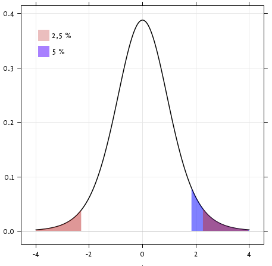

.. for doctests
    >>> import matplotlib.pyplot as plt
    >>> import numpy as np
    >>> import pandas
    >>> pandas.options.display.width = 0

.. also switch current directory from the root directory (where the tests
   are run) to be able to load the data
   >>> import os
   >>> os.chdir('packages/statistics')

.. _statistics:

=====================
Statistics in Python
=====================

**Author**: *Gaël Varoquaux*

.. topic:: **Requirements**

   * Standard scientific Python environment (NumPy, SciPy, matplotlib)

   * `Pandas <https://pandas.pydata.org/>`__

   * `Statsmodels <https://www.statsmodels.org/>`__

   * `Seaborn <https://seaborn.pydata.org>`__

   To install Python and these dependencies, we recommend that you
   download `Anaconda Python <https://www.anaconda.com/distribution/>`_ or,
   preferably, use the package manager if you are under Ubuntu or other linux.

.. seealso::

 * **Bayesian statistics in Python**:
   This chapter does not cover tools for Bayesian statistics. Of
   particular interest for Bayesian modelling is `PyMC
   <https://docs.pymc.io/>`_, which implements a probabilistic
   programming language in Python.

 * **Read a statistics book**:
   The `Think stats <https://greenteapress.com/wp/think-stats-2e>`_ book is
   available as free PDF or in print and is a great introduction to
   statistics.

|

.. tip::

    **Why Python for statistics?**

    R is a language dedicated to statistics. Python is a general-purpose
    language with statistics modules. R has more statistical analysis
    features than Python, and specialized syntaxes. However, when it
    comes to building complex analysis pipelines that mix statistics with
    e.g. image analysis, text mining, or control of a physical
    experiment, the richness of Python is an invaluable asset.

.. contents:: Contents
   :local:
   :depth: 2

.. tip::

    In this document, the Python inputs are represented with the sign
    ">>>".

    |

    **Disclaimer: Gender questions**

    Some of the examples of this tutorial are chosen around gender
    questions. The reason is that on such questions controlling the truth
    of a claim actually matters to many people.

Data representation and interaction
====================================

Data as a table
----------------

The setting that we consider for statistical analysis is that of multiple
*observations* or *samples* described by a set of different *attributes*
or *features*. The data can than be seen as a 2D table, or matrix, with
columns giving the different attributes of the data, and rows the
observations. For instance, the data contained in
:download:`examples/brain_size.csv`:

.. include:: examples/brain_size.csv
   :literal:
   :end-line: 6

The pandas data-frame
------------------------

.. tip::

    We will store and manipulate this data in a
    :class:`pandas.DataFrame`, from the `pandas
    <https://pandas.pydata.org>`__ module. It is the Python equivalent of
    the spreadsheet table. It is different from a 2D ``numpy`` array as it
    has named columns, can contain a mixture of different data types by
    column, and has elaborate selection and pivotal mechanisms.

Creating dataframes: reading data files or converting arrays
............................................................

.. sidebar:: **Separator**

   It is a CSV file, but the separator is ";"

**Reading from a CSV file:** Using the above CSV file that gives
observations of brain size and weight and IQ (Willerman et al. 1991), the
data are a mixture of numerical and categorical values::

    >>> import pandas
    >>> data = pandas.read_csv('examples/brain_size.csv', sep=';', na_values=".")
    >>> data
        Unnamed: 0  Gender  FSIQ  VIQ  PIQ  Weight  Height  MRI_Count
    0            1  Female   133  132  124   118.0    64.5     816932
    1            2    Male   140  150  124     NaN    72.5    1001121
    2            3    Male   139  123  150   143.0    73.3    1038437
    3            4    Male   133  129  128   172.0    68.8     965353
    4            5  Female   137  132  134   147.0    65.0     951545
    ...

.. warning:: **Missing values**

   The weight of the second individual is missing in the CSV file. If we
   don't specify the missing value (NA = not available) marker, we will
   not be able to do statistical analysis.

|

**Creating from arrays**: A :class:`pandas.DataFrame` can also be seen
as a dictionary of 1D 'series', eg arrays or lists. If we have 3
``numpy`` arrays::

    >>> import numpy as np
    >>> t = np.linspace(-6, 6, 20)
    >>> sin_t = np.sin(t)
    >>> cos_t = np.cos(t)

We can expose them as a :class:`pandas.DataFrame`::

    >>> pandas.DataFrame({'t': t, 'sin': sin_t, 'cos': cos_t})
               t       sin       cos
    0  -6.000000  0.279415  0.960170
    1  -5.368421  0.792419  0.609977
    2  -4.736842  0.999701  0.024451
    3  -4.105263  0.821291 -0.570509
    4  -3.473684  0.326021 -0.945363
    5  -2.842105 -0.295030 -0.955488
    6  -2.210526 -0.802257 -0.596979
    7  -1.578947 -0.999967 -0.008151
    8  -0.947368 -0.811882  0.583822
    ...

|

**Other inputs**: `pandas <https://pandas.pydata.org>`__ can input data from
SQL, excel files, or other formats. See the `pandas documentation
<https://pandas.pydata.org>`__.

|

Manipulating data
..................

`data` is a :class:`pandas.DataFrame`, that resembles R's dataframe::

    >>> data.shape    # 40 rows and 8 columns
    (40, 8)

    >>> data.columns  # It has columns
    Index(['Unnamed: 0', 'Gender', 'FSIQ', 'VIQ', 'PIQ', 'Weight', 'Height',
           'MRI_Count'],
          dtype='object')

    >>> print(data['Gender'])  # Columns can be addressed by name
    0     Female
    1       Male
    2       Male
    3       Male
    4     Female
    ...

    >>> # Simpler selector
    >>> data[data['Gender'] == 'Female']['VIQ'].mean()
    109.45

.. note:: For a quick view on a large dataframe, use its `describe`
    method: :meth:`pandas.DataFrame.describe`.

|

**groupby**: splitting a dataframe on values of categorical variables::

    >>> groupby_gender = data.groupby('Gender')
    >>> for gender, value in groupby_gender['VIQ']:
    ...     print((gender, value.mean()))
    ('Female', 109.45)
    ('Male', 115.25)

`groupby_gender` is a powerful object that exposes many
operations on the resulting group of dataframes::

    >>> groupby_gender.mean()
            Unnamed: 0   FSIQ     VIQ     PIQ      Weight     Height  MRI_Count
    Gender
    Female       19.65  111.9  109.45  110.45  137.200000  65.765000   862654.6
    Male         21.35  115.0  115.25  111.60  166.444444  71.431579   954855.4

.. tip::

    Use tab-completion on `groupby_gender` to find more.  Other common
    grouping functions are median, count (useful for checking to see the
    amount of missing values in different subsets) or sum.  Groupby
    evaluation is lazy, no work is done until an aggregation function is
    applied.

|

.. image:: auto_examples/images/sphx_glr_plot_pandas_001.png
   :target: auto_examples/plot_pandas.html
   :align: right
   :scale: 42

.. topic:: **Exercise**
    :class: green

    * What is the mean value for VIQ for the full population?
    * How many males/females were included in this study?

      **Hint** use 'tab completion' to find out the methods that can be
      called, instead of 'mean' in the above example.

    * What is the average value of MRI counts expressed in log units, for
      males and females?

.. note::

   `groupby_gender.boxplot` is used for the plots above (see `this
   example <auto_examples/plot_pandas.html>`_).

|

Plotting data
..............

.. currentmodule:: pandas

Pandas comes with some plotting tools (:mod:`pandas.plotting`, using
matplotlib behind the scene) to display statistics of the data in
dataframes:

**Scatter matrices**::

    >>> from pandas import plotting
    >>> plotting.scatter_matrix(data[['Weight', 'Height', 'MRI_Count']])
    array([[<Axes: xlabel='Weight', ylabel='Weight'>,
            <Axes: xlabel='Height', ylabel='Weight'>,
            <Axes: xlabel='MRI_Count', ylabel='Weight'>],
           [<Axes: xlabel='Weight', ylabel='Height'>,
            <Axes: xlabel='Height', ylabel='Height'>,
            <Axes: xlabel='MRI_Count', ylabel='Height'>],
           [<Axes: xlabel='Weight', ylabel='MRI_Count'>,
            <Axes: xlabel='Height', ylabel='MRI_Count'>,
            <Axes: xlabel='MRI_Count', ylabel='MRI_Count'>]], dtype=object)

.. image:: auto_examples/images/sphx_glr_plot_pandas_002.png
   :target: auto_examples/plot_pandas.html
   :scale: 70
   :align: center

::

    >>> plotting.scatter_matrix(data[['PIQ', 'VIQ', 'FSIQ']])
    array([[<Axes: xlabel='PIQ', ylabel='PIQ'>,
            <Axes: xlabel='VIQ', ylabel='PIQ'>,
            <Axes: xlabel='FSIQ', ylabel='PIQ'>],
           [<Axes: xlabel='PIQ', ylabel='VIQ'>,
            <Axes: xlabel='VIQ', ylabel='VIQ'>,
            <Axes: xlabel='FSIQ', ylabel='VIQ'>],
           [<Axes: xlabel='PIQ', ylabel='FSIQ'>,
            <Axes: xlabel='VIQ', ylabel='FSIQ'>,
            <Axes: xlabel='FSIQ', ylabel='FSIQ'>]], dtype=object)

.. sidebar:: **Two populations**

   The IQ metrics are bimodal, as if there are 2 sub-populations.

.. image:: auto_examples/images/sphx_glr_plot_pandas_003.png
   :target: auto_examples/plot_pandas.html
   :scale: 70
   :align: center

.. topic:: **Exercise**
    :class: green

    Plot the scatter matrix for males only, and for females only. Do you
    think that the 2 sub-populations correspond to gender?

Hypothesis testing: comparing two groups
==========================================

For simple `statistical tests
<https://en.wikipedia.org/wiki/Statistical_hypothesis_testing>`_, we will
use the :mod:`scipy.stats` sub-module of `SciPy
<https://docs.scipy.org/doc/>`_::

    >>> import scipy as sp

.. seealso::

   SciPy is a vast library. For a quick summary to the whole library, see
   the :ref:`scipy <scipy>` chapter.

Student's t-test: the simplest statistical test
------------------------------------------------

One-sample tests: testing the value of a population mean
........................................................

:func:`scipy.stats.ttest_1samp` tests the null hypothesis that the mean
of the population underlying the data is equal to a given value. It returns
the `T statistic <https://en.wikipedia.org/wiki/Student%27s_t-test>`_,
and the `p-value <https://en.wikipedia.org/wiki/P-value>`_ (see the
function's help)::

    >>> sp.stats.ttest_1samp(data['VIQ'], 0)
    TtestResult(statistic=30.088099970..., pvalue=1.32891964...e-28, df=39)

The p-value of :math:`10^-28` indicates that such an extreme value of the statistic
is unlikely to be observed under the null hypothesis. This may be taken as
evidence that the null hypothesis is false and that the population mean IQ
(VIQ measure) is not 0.

Technically, the p-value of the t-test is derived under the assumption that
the means of samples drawn from the population are normally distributed.
This condition is exactly satisfied when the population itself is normally
distributed; however, due to the central limit theorem, the condition is
nearly true for reasonably large samples drawn from populations that follow
a variety of non-normal distributions.

Nonetheless, if we are concerned that violation of the normality assumptions
will affect the conclusions of the test, we can use a `Wilcoxon signed-rank test
<https://en.wikipedia.org/wiki/Wilcoxon_signed-rank_test>`_, which relaxes
this assumption at the expense of test power::

    >>> sp.stats.wilcoxon(data['VIQ'])
    WilcoxonResult(statistic=0.0, pvalue=1.8189894...e-12)

Two-sample t-test: testing for difference across populations
............................................................

We have seen above that the mean VIQ in the male and female samples
were different. To test whether this difference is significant (and
suggests that there is a difference in population means), we perform
a two-sample t-test using :func:`scipy.stats.ttest_ind`::

    >>> female_viq = data[data['Gender'] == 'Female']['VIQ']
    >>> male_viq = data[data['Gender'] == 'Male']['VIQ']
    >>> sp.stats.ttest_ind(female_viq, male_viq)
    TtestResult(statistic=-0.77261617232..., pvalue=0.4445287677858..., df=38.0)

The corresponding non-parametric test is the `Mann–Whitney U
test <https://en.wikipedia.org/wiki/Mann%E2%80%93Whitney_U>`_,
:func:`scipy.stats.mannwhitneyu`.

    >>> sp.stats.mannwhitneyu(female_viq, male_viq)
    MannwhitneyuResult(statistic=164.5, pvalue=0.34228868687...)

Paired tests: repeated measurements on the same individuals
-----------------------------------------------------------

.. image:: auto_examples/images/sphx_glr_plot_paired_boxplots_001.png
   :target: auto_examples/plot_pandas.html
   :scale: 70
   :align: right

PIQ, VIQ, and FSIQ give three measures of IQ. Let us test whether FISQ
and PIQ are significantly different. We can use an "independent sample" test::

    >>> sp.stats.ttest_ind(data['FSIQ'], data['PIQ'])
    TtestResult(statistic=0.46563759638..., pvalue=0.64277250..., df=78.0)

The problem with this approach is that it ignores an important relationship
between observations: FSIQ and PIQ are measured on the same individuals.
Thus, the variance due to inter-subject variability is confounding, reducing
the power of the test. This variability can be removed using a "paired test"
or `"repeated measures test"
<https://en.wikipedia.org/wiki/Repeated_measures_design>`_::

    >>> sp.stats.ttest_rel(data['FSIQ'], data['PIQ'])
    TtestResult(statistic=1.784201940..., pvalue=0.082172638183..., df=39)

.. image:: auto_examples/images/sphx_glr_plot_paired_boxplots_002.png
   :target: auto_examples/plot_pandas.html
   :scale: 60
   :align: right

This is equivalent to a one-sample test on the differences between paired
observations::

    >>> sp.stats.ttest_1samp(data['FSIQ'] - data['PIQ'], 0)
    TtestResult(statistic=1.784201940..., pvalue=0.082172638..., df=39)

Accordingly, we can perform a nonparametric version of the test with
``wilcoxon``.

    >>> sp.stats.wilcoxon(data['FSIQ'], data['PIQ'], method="approx")
    WilcoxonResult(statistic=274.5, pvalue=0.106594927135...)

.. topic:: **Exercise**
   :class: green

   * Test the difference between weights in males and females.

   * Use non parametric statistics to test the difference between VIQ in
     males and females.

   **Conclusion**: we find that the data does not support the hypothesis
   that males and females have different VIQ.

|

Linear models, multiple factors, and analysis of variance
==========================================================

"formulas" to specify statistical models in Python
--------------------------------------------------

A simple linear regression
...........................

.. image:: auto_examples/images/sphx_glr_plot_regression_001.png
   :target: auto_examples/plot_regression.html
   :scale: 60
   :align: right

Given two set of observations, `x` and `y`, we want to test the
hypothesis that `y` is a linear function of `x`. In other terms:

    :math:`y = x * \textit{coef} + \textit{intercept} + e`

where `e` is observation noise. We will use the `statsmodels
<https://www.statsmodels.org/>`_ module to:

#. Fit a linear model. We will use the simplest strategy, `ordinary least
   squares <https://en.wikipedia.org/wiki/Ordinary_least_squares>`_ (OLS).

#. Test that `coef` is non zero.

|

First, we generate simulated data according to the model::

    >>> import numpy as np
    >>> x = np.linspace(-5, 5, 20)
    >>> rng = np.random.default_rng(27446968)
    >>> # normal distributed noise
    >>> y = -5 + 3*x + 4 * rng.normal(size=x.shape)
    >>> # Create a data frame containing all the relevant variables
    >>> data = pandas.DataFrame({'x': x, 'y': y})

.. sidebar:: **"formulas" for statistics in Python**

   `See the statsmodels documentation
   <https://www.statsmodels.org/stable/example_formulas.html>`_

|

Then we specify an OLS model and fit it::

    >>> from statsmodels.formula.api import ols
    >>> model = ols("y ~ x", data).fit()

We can inspect the various statistics derived from the fit::

    >>> print(model.summary()) # doctest: +REPORT_UDIFF
                                OLS Regression Results
    ==============================================================================
    Dep. Variable:                      y   R-squared:                       0.901
    Model:                            OLS   Adj. R-squared:                  0.896
    Method:                 Least Squares   F-statistic:                     164.5
    Date:                             ...   Prob (F-statistic):           1.72e-10
    Time:                             ...   Log-Likelihood:                -51.758
    No. Observations:                  20   AIC:                             107.5
    Df Residuals:                      18   BIC:                             109.5
    Df Model:                           1
    Covariance Type:            nonrobust
    ==============================================================================
                     coef    std err          t      P>|t|      [0.025      0.975]
    ------------------------------------------------------------------------------
    Intercept     -4.2948      0.759     -5.661      0.000      -5.889      -2.701
    x              3.2060      0.250     12.825      0.000       2.681       3.731
    ==============================================================================
    Omnibus:                        1.218   Durbin-Watson:                   1.796
    Prob(Omnibus):                  0.544   Jarque-Bera (JB):                0.999
    Skew:                           0.503   Prob(JB):                        0.607
    Kurtosis:                       2.568   Cond. No.                         3.03
    ==============================================================================
    <BLANKLINE>
    Notes:
    [1] Standard Errors assume that the covariance matrix of the errors is correctly specified.

.. topic:: Terminology:

    Statsmodels uses a statistical terminology: the `y` variable in
    statsmodels is called 'endogenous' while the `x` variable is called
    exogenous.  This is discussed in more detail `here
    <https://www.statsmodels.org/devel/endog_exog.html>`_.

    To simplify, `y` (endogenous) is the value you are trying to predict,
    while `x` (exogenous) represents the features you are using to make
    the prediction.

.. topic:: **Exercise**
   :class: green

   Retrieve the estimated parameters from the model above. **Hint**:
   use tab-completion to find the relevant attribute.

|

Categorical variables: comparing groups or multiple categories
...............................................................

Let us go back the data on brain size::

    >>> data = pandas.read_csv('examples/brain_size.csv', sep=';', na_values=".")

We can write a comparison between IQ of male and female using a linear
model::

     >>> model = ols("VIQ ~ Gender + 1", data).fit()
     >>> print(model.summary()) # doctest: +REPORT_UDIFF
                                 OLS Regression Results
     ==============================================================================
     Dep. Variable:                    VIQ   R-squared:                       0.015
     Model:                            OLS   Adj. R-squared:                 -0.010
     Method:                 Least Squares   F-statistic:                    0.5969
     Date:                             ...   Prob (F-statistic):              0.445
     Time:                             ...   Log-Likelihood:                -182.42
     No. Observations:                  40   AIC:                             368.8
     Df Residuals:                      38   BIC:                             372.2
     Df Model:                           1
     Covariance Type:            nonrobust
     ==================================================================================
                          coef    std err          t      P>|t|      [0.025      0.975]
     ----------------------------------------------------------------------------------
     Intercept        109.4500      5.308     20.619      0.000      98.704     120.196
     Gender[T.Male]     5.8000      7.507      0.773      0.445      -9.397      20.997
     ==============================================================================
     Omnibus:                       26.188   Durbin-Watson:                   1.709
     Prob(Omnibus):                  0.000   Jarque-Bera (JB):                3.703
     Skew:                           0.010   Prob(JB):                        0.157
     Kurtosis:                       1.510   Cond. No.                         2.62
     ==============================================================================
     <BLANKLINE>
     Notes:
     [1] Standard Errors assume that the covariance matrix of the errors is correctly specified.

.. topic:: **Tips on specifying model**

   **Forcing categorical**: the 'Gender' is automatically detected as a
   categorical variable, and thus each of its different values are
   treated as different entities.

   An integer column can be forced to be treated as categorical using::

    >>> model = ols('VIQ ~ C(Gender)', data).fit()

   **Intercept**: We can remove the intercept using `- 1` in the formula,
   or force the use of an intercept using `+ 1`.

   .. tip::

     By default, statsmodels treats a categorical variable with K possible
     values as K-1 'dummy' boolean variables (the last level being
     absorbed into the intercept term).  This is almost always a good
     default choice - however, it is possible to specify different
     encodings for categorical variables
     (https://www.statsmodels.org/devel/contrasts.html).

|

.. topic:: **Link to t-tests between different FSIQ and PIQ**

    To compare different types of IQ, we need to create a "long-form"
    table, listing IQs, where the type of IQ is indicated by a
    categorical variable::

     >>> data_fisq = pandas.DataFrame({'iq': data['FSIQ'], 'type': 'fsiq'})
     >>> data_piq = pandas.DataFrame({'iq': data['PIQ'], 'type': 'piq'})
     >>> data_long = pandas.concat((data_fisq, data_piq))
     >>> print(data_long)
          iq  type
     0   133  fsiq
     1   140  fsiq
     2   139  fsiq
     3   133  fsiq
     4   137  fsiq
     ...  ...   ...
     35  128   piq
     36  124   piq
     37   94   piq
     38   74   piq
     39   89   piq
     <BLANKLINE>
     [80 rows x 2 columns]

     >>> model = ols("iq ~ type", data_long).fit()
     >>> print(model.summary()) # doctest: +REPORT_UDIFF
                                 OLS Regression Results
     ...
     ==========================...
                      coef    std err          t      P>|t|      [0.025      0.975]
     ------------------------------------------...
     Intercept     113.4500      3.683     30.807      0.000       106.119   120.781
     type[T.piq]    -2.4250      5.208     -0.466      0.643       -12.793     7.943
     ...

    We can see that we retrieve the same values for t-test and
    corresponding p-values for the effect of the type of iq than the
    previous t-test::

     >>> sp.stats.ttest_ind(data['FSIQ'], data['PIQ'])
     TtestResult(statistic=0.46563759638..., pvalue=0.64277250..., df=78.0)

Multiple Regression: including multiple factors
-------------------------------------------------

.. image:: auto_examples/images/sphx_glr_plot_regression_3d_001.png
   :target: auto_examples/plot_regression_3d.html
   :scale: 45
   :align: right

|

Consider a linear model explaining a variable `z` (the dependent
variable) with 2 variables `x` and `y`:

    :math:`z = x \, c_1 + y \, c_2 + i + e`

Such a model can be seen in 3D as fitting a plane to a cloud of (`x`,
`y`, `z`) points.

|
|

**Example: the iris data** (:download:`examples/iris.csv`)

.. tip::

    Sepal and petal size tend to be related: bigger flowers are bigger!
    But is there in addition a systematic effect of species?

.. image:: auto_examples/images/sphx_glr_plot_iris_analysis_001.png
   :target: auto_examples/plot_iris_analysis_1.html
   :scale: 80
   :align: center

::

    >>> data = pandas.read_csv('examples/iris.csv')
    >>> model = ols('sepal_width ~ name + petal_length', data).fit()
    >>> print(model.summary()) # doctest: +REPORT_UDIFF
                                OLS Regression Results
    ==========================...
    Dep. Variable:            sepal_width   R-squared:                       0.478
    Model:                            OLS   Adj. R-squared:                  0.468
    Method:                 Least Squares   F-statistic:                     44.63
    Date:                             ...   Prob (F-statistic):           1.58e-20
    Time:                             ...   Log-Likelihood:                -38.185
    No. Observations:                 150   AIC:                             84.37
    Df Residuals:                     146   BIC:                             96.41
    Df Model:                           3
    Covariance Type:            nonrobust
    ==========================...
                             coef    std err          t     P>|t|  [0.025      0.975]
    ------------------------------------------...
    Intercept              2.9813      0.099     29.989     0.000      2.785     3.178
    name[T.versicolor]    -1.4821      0.181     -8.190     0.000     -1.840    -1.124
    name[T.virginica]     -1.6635      0.256     -6.502     0.000     -2.169    -1.158
    petal_length           0.2983      0.061      4.920     0.000      0.178     0.418
    ==========================...
    Omnibus:                        2.868   Durbin-Watson:                   1.753
    Prob(Omnibus):                  0.238   Jarque-Bera (JB):                2.885
    Skew:                          -0.082   Prob(JB):                        0.236
    Kurtosis:                       3.659   Cond. No.                         54.0
    ==========================...
    <BLANKLINE>
    Notes:
    [1] Standard Errors assume that the covariance matrix of the errors is correctly specified.

|

Post-hoc hypothesis testing: analysis of variance (ANOVA)
----------------------------------------------------------

In the above iris example, we wish to test if the petal length is
different between versicolor and virginica, after removing the effect of
sepal width. This can be formulated as testing the difference between the
coefficient associated to versicolor and virginica in the linear model
estimated above (it is an Analysis of Variance, `ANOVA
<https://en.wikipedia.org/wiki/Analysis_of_variance>`_). For this, we
write a **vector of 'contrast'** on the parameters estimated: we want to
test ``"name[T.versicolor] - name[T.virginica]"``, with an `F-test
<https://en.wikipedia.org/wiki/F-test>`_::

    >>> print(model.f_test([0, 1, -1, 0]))
    <F test: F=3.24533535..., p=0.07369..., df_denom=146, df_num=1>

Is this difference significant?

|

.. topic:: **Exercise**
   :class: green

   Going back to the brain size + IQ data, test if the VIQ of male and
   female are different after removing the effect of brain size, height
   and weight.

|

More visualization: seaborn for statistical exploration
=======================================================

`Seaborn <https://seaborn.pydata.org>`_ combines
simple statistical fits with plotting on pandas dataframes.

Let us consider a data giving wages and many other personal information
on 500 individuals (`Berndt, ER. The Practice of Econometrics. 1991. NY:
Addison-Wesley <https://lib.stat.cmu.edu/datasets/CPS_85_Wages>`_).

.. tip::

   The full code loading and plotting of the wages data is found in
   `corresponding example <auto_examples/plot_wage_data.html>`_.

::

   >>> print(data)  # doctest: +SKIP
        EDUCATION  SOUTH  SEX  EXPERIENCE  UNION      WAGE  AGE  RACE  \
   0            8      0    1          21      0  0.707570   35     2
   1            9      0    1          42      0  0.694605   57     3
   2           12      0    0           1      0  0.824126   19     3
   3           12      0    0           4      0  0.602060   22     3
   ...

Pairplot: scatter matrices
--------------------------

We can easily have an intuition on the interactions between continuous
variables using :func:`seaborn.pairplot` to display a scatter matrix::

   >>> import seaborn
   >>> seaborn.pairplot(data, vars=['WAGE', 'AGE', 'EDUCATION'],
   ...                  kind='reg')  # doctest: +SKIP

.. image:: auto_examples/images/sphx_glr_plot_wage_data_001.png
   :target: auto_examples/plot_wage_data.html
   :align: center
   :scale: 60

Categorical variables can be plotted as the hue::

   >>> seaborn.pairplot(data, vars=['WAGE', 'AGE', 'EDUCATION'],
   ...                  kind='reg', hue='SEX')  # doctest: +SKIP

.. image:: auto_examples/images/sphx_glr_plot_wage_data_002.png
   :target: auto_examples/plot_wage_data.html
   :align: center
   :scale: 60

.. topic:: **Look and feel and matplotlib settings**

   Seaborn changes the default of matplotlib figures to achieve a more
   "modern", "excel-like" look. It does that upon import. You can reset
   the default using::

    >>> import matplotlib.pyplot as plt
    >>> plt.rcdefaults()

   .. tip::

     To switch back to seaborn settings, or understand better styling in
     seaborn, see the `relevant section of the seaborn documentation
     <https://seaborn.pydata.org/tutorial/aesthetics.html>`_.

lmplot: plotting a univariate regression
-----------------------------------------

.. image:: auto_examples/images/sphx_glr_plot_wage_data_005.png
   :target: auto_examples/plot_wage_data.html
   :align: right
   :scale: 60

A regression capturing the relation between one variable and another, eg
wage and eduction, can be plotted using :func:`seaborn.lmplot`::

    >>> seaborn.lmplot(y='WAGE', x='EDUCATION', data=data)  # doctest: +SKIP

.. raw:: html

   

.. topic:: **Robust regression**

    .. tip::

        Given that, in the above plot, there seems to be a couple of data
        points that are outside of the main cloud to the right, they might be
        outliers, not representative of the population, but driving the
        regression.

    To compute a regression that is less sensitive to outliers, one must
    use a `robust model
    <https://en.wikipedia.org/wiki/Robust_statistics>`_. This is done in
    seaborn using ``robust=True`` in the plotting functions, or in
    statsmodels by replacing the use of the OLS by a "Robust Linear
    Model", :func:`statsmodels.formula.api.rlm`.

Testing for interactions
=========================

.. image:: auto_examples/images/sphx_glr_plot_wage_education_gender_001.png
   :target: auto_examples/plot_wage_education_gender.html
   :align: center
   :scale: 70

Do wages increase more with education for males than females?

.. tip::

    The plot above is made of two different fits. We need to formulate a
    single model that tests for a variance of slope across the two
    populations. This is done via an `"interaction"
    <https://www.statsmodels.org/devel/example_formulas.html#multiplicative-interactions>`_.

::

    >>> result = sm.ols(formula='wage ~ education + gender + education * gender',
    ...                 data=data).fit()    # doctest: +SKIP
    >>> print(result.summary())    # doctest: +SKIP
    ...
                                coef    std err    t     P>|t|  [0.025      0.975]
    ------------------------------------------------------------------------------
    Intercept                   0.2998   0.072    4.173   0.000     0.159   0.441
    gender[T.male]              0.2750   0.093    2.972   0.003     0.093   0.457
    education                   0.0415   0.005    7.647   0.000     0.031   0.052
    education:gender[T.male]   -0.0134   0.007   -1.919   0.056    -0.027   0.000
    ==========================...
    ...

Can we conclude that education benefits males more than females?

|

.. topic:: **Take home messages**

   * Hypothesis testing and p-values give you the **significance** of an
     effect / difference.

   * **Formulas** (with categorical variables) enable you to express rich
     links in your data.

   * **Visualizing** your data and fitting simple models give insight into the
     data.

   * **Conditionning** (adding factors that can explain all or part of
     the variation) is an important modeling aspect that changes the
     interpretation.

|

.. include the gallery. Skip the first line to avoid the "orphan"
   declaration

.. include:: auto_examples/index.rst
    :start-line: 1
