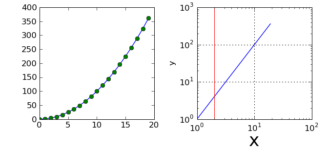
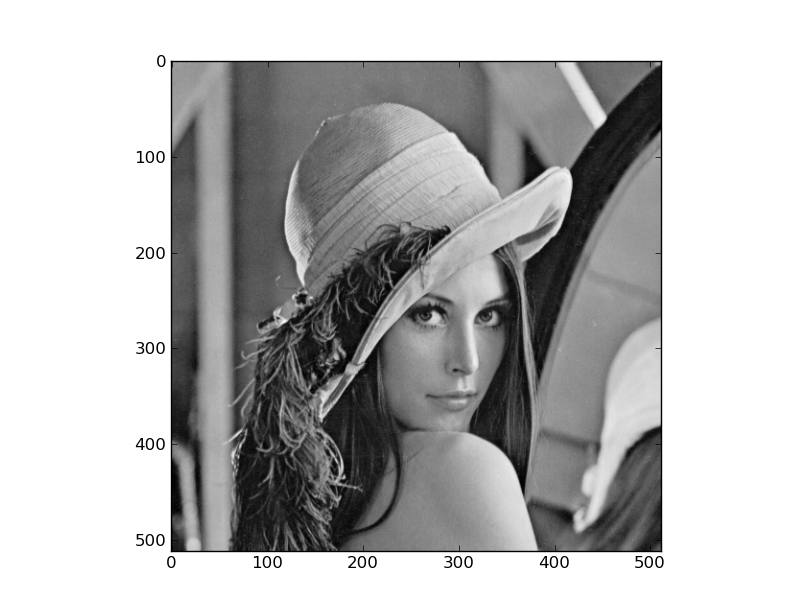
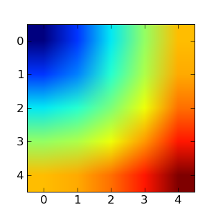

Creating and manipulating numerical data : around Numpy
=======================================================

.. topic:: The array: the basic tool for scientific computing

    .. image:: simple_histo.jpg
       :align: right 

    Frequent manipulation of **discrete sorted datasets** :
 
    * discretized time of an experiment/simulation

    * signal recorded by a measurement device

    * pixels of an image, ...

    The **Numpy** module allows to 

    * create such datasets in one shot

    * realize batch operations on data arrays (no loops on their items)

    Data arrays := ``numpy.ndarray``

Creating NumPy data arrays
--------------------------

A small introductory example::

    >>> import numpy as np
    >>> a = np.array([0, 1, 2])
    >>> a
    array([0, 1, 2])
    >>> print a
    [0 1 2]
    >>> b = np.array([[0., 1.], [2., 3.]])
    >>> b
    array([[ 0.,  1.],
           [ 2.,  3.]])

In practice, we rarely enter items one by one...

    * Evenly spaced values::

        >>> import numpy as np
        >>> a = np.arange(10) # de 0 a n-1
        >>> a
        array([0, 1, 2, 3, 4, 5, 6, 7, 8, 9])
        >>> b = np.arange(1., 9., 2) # syntax : start, end, step
        >>> b
        array([ 1.,  3.,  5.,  7.])

      or by specifying the number of points::

        >>> c = np.linspace(0, 1, 6)
        >>> c
        array([ 0. ,  0.2,  0.4,  0.6,  0.8,  1. ])
        >>> d = np.linspace(0, 1, 5, endpoint=False)
        >>> d
        array([ 0. ,  0.2,  0.4,  0.6,  0.8])

    * Constructors for common arrays::

        >>> a = np.ones((3,3))
        >>> a
        array([[ 1.,  1.,  1.],
               [ 1.,  1.,  1.],
               [ 1.,  1.,  1.]])
        >>> a.dtype
        dtype('float64')
        >>> b = np.ones(5, dtype=np.int)
        >>> b
        array([1, 1, 1, 1, 1])
        >>> c = np.zeros((2,2))
        >>> c
        array([[ 0.,  0.],
               [ 0.,  0.]])
        >>> d = np.eye(3)
        >>> d
        array([[ 1.,  0.,  0.],
               [ 0.,  1.,  0.],
               [ 0.,  0.,  1.]])

Graphical data representation : matplotlib and mayavi
-----------------------------------------------------

Now that we have our first data arrays, we are going to visualize them.
**Matplotlib** is a 2D plotting package. We can import its functions as below::

    >>> import pylab
    >>> # or
    >>> from pylab import * # imports everything in the namespace
 
    
If you launched Ipython with python(x,y), or with ``ipython
-pylab`` (under Linux), all the functions/objects of pylab are already
imported, without needing ``from pylab import *``. In the remainder of this
tutorial, we assume you have already run ``from pylab import *`` or ``ipython
-pylab``: as a consequence, we won't write ``pylab.function()`` but directly
``function``.

**1D curve plotting**

.. sourcecode:: ipython

    In [6]: a = np.arange(20)
    In [7]: plot(a, a**2) # line plot
    Out[7]: [<matplotlib.lines.Line2D object at 0x95abd0c>]
    In [8]: plot(a, a**2, 'o') # dotted plot
    Out[8]: [<matplotlib.lines.Line2D object at 0x95b1c8c>]
    In [9]: clf() # clear figure
    In [10]: loglog(a, a**2)
    Out[10]: [<matplotlib.lines.Line2D object at 0x95abf6c>]
    In [11]: xlabel('x') # a bit too small
    Out[11]: <matplotlib.text.Text object at 0x98923ec>
    In [12]: xlabel('x', fontsize=26) # bigger
    Out[12]: <matplotlib.text.Text object at 0x98923ec>
    In [13]: ylabel('y')
    Out[13]: <matplotlib.text.Text object at 0x9892b8c>
    In [14]: grid()
    In [15]: axvline(2)
    Out[15]: <matplotlib.lines.Line2D object at 0x9b633cc>

   

**2D arrays** (such as images)   

.. sourcecode:: ipython

    In [48]: # 30x30 array with random floats btw 0 and 1
    In [49]: image = np.random.rand(30,30) 
    In [50]: imshow(image)
    Out[50]: <matplotlib.image.AxesImage object at 0x9e954ac>
    In [51]: gray()
    In [52]: hot()
    In [53]: imshow(image, cmap=cm.gray)
    Out[53]: <matplotlib.image.AxesImage object at 0xa23972c>
    In [54]: axis('off') # we remove ticks and labels    

.. image:: imshow.png
   :align: center

There are many other features in matplotlib: color choice, marker size,
latex font, inclusions within figures, histograms, etc.

To go further :

    * matplotlib documentation
      http://matplotlib.sourceforge.net/contents.html

    * an example gallery with corresponding sourcecode
      http://matplotlib.sourceforge.net/gallery.html

**3D plotting**

For 3D visualization, we use another package: **Mayavi**. A quick example:
start with **relaunching iPython** with these options:
**ipython -pylab -wthread**

.. sourcecode:: ipython

    In [59]: from enthought.mayavi import mlab
    In [60]: mlab.figure()
    get fences failed: -1
    param: 6, val: 0
    Out[60]: <enthought.mayavi.core.scene.Scene object at 0xcb2677c>
    In [61]: mlab.surf(image)
    Out[61]: <enthought.mayavi.modules.surface.Surface object at 0xd0862fc>
    In [62]: mlab.axes()
    Out[62]: <enthought.mayavi.modules.axes.Axes object at 0xd07892c>

.. image:: surf.png
   :align: center

The mayavi/mlab window that opens is interactive : by clicking on the left mouse button
you can rotate the image, zoom with the mouse wheel, etc.

.. image:: potential.jpg
   :align: center

For more information on Mayavi :
http://code.enthought.com/projects/mayavi/docs/development/html/mayavi/index.html

Indexing 
--------

The items of an array can be accessed the same way as other Python sequences
(``list``, ``tuple``) ::

    >>> a = np.arange(10)
    >>> a
    array([0, 1, 2, 3, 4, 5, 6, 7, 8, 9])
    >>> a[0], a[2], a[-1]
    (0, 2, 9)

Warning! Indexes begin at 0, like other Python sequences (and C/C++).
In Fortran or Matlab, indexes begin with 1.

For multidimensional arrays, indexes are tuples of integers::

    >>> a = np.diag(np.arange(5))
    >>> a
    array([[0, 0, 0, 0, 0],
           [0, 1, 0, 0, 0],
           [0, 0, 2, 0, 0],
           [0, 0, 0, 3, 0],
           [0, 0, 0, 0, 4]])
    >>> a[1,1]
    1
    >>> a[2,1] = 10 # third line, second column
    >>> a
    array([[ 0,  0,  0,  0,  0],
           [ 0,  1,  0,  0,  0],
           [ 0, 10,  2,  0,  0],
           [ 0,  0,  0,  3,  0],
           [ 0,  0,  0,  0,  4]])
    >>> a[1]
    array([0, 1, 0, 0, 0])

Note that:

* In 2D, the first dimension corresponds to lines, the second to columns.
* for an array ``a`` with more than one dimension,`a[0]` is interpreted by
  taking all elements in the unspecified dimensions.

Slicing
-------

Like indexing, it's similar to Python sequences slicing::

    >>> a = np.arange(10)
    >>> a
    array([0, 1, 2, 3, 4, 5, 6, 7, 8, 9])
    >>> a[2:9:3] # [start:end:step]
    array([2, 5, 8])

Note that the last index is not included!::

    >>> a[:4]
    array([0, 1, 2, 3])

``start:end:step`` is a ``slice`` object which represents the set of indexes
``range(start, end, step)``. A ``slice`` can be explicitly created::

    >>> sl = slice(1, 9, 2)
    >>> a = np.arange(10)
    >>> b = 2*a + 1
    >>> a, b
    (array([0, 1, 2, 3, 4, 5, 6, 7, 8, 9]), array([ 1,  3,  5,  7,  9, 11, 13, 15, 17, 19]))
    >>> a[sl], b[sl]
    (array([1, 3, 5, 7]), array([ 3,  7, 11, 15]))

All three slice components are not required: by default, `start` is 0, `end` is the
last and `step` is 1::

    >>> a[1:3]
    array([1, 2])
    >>> a[::2]
    array([0, 2, 4, 6, 8])
    >>> a[3:]
    array([3, 4, 5, 6, 7, 8, 9])

Of course, it works for multidimensional arrays::

    >>> a = np.eye(5)
    >>> a
    array([[ 1.,  0.,  0.,  0.,  0.],
           [ 0.,  1.,  0.,  0.,  0.],
           [ 0.,  0.,  1.,  0.,  0.],
           [ 0.,  0.,  0.,  1.,  0.],
           [ 0.,  0.,  0.,  0.,  1.]])
    >>> a[2:4,:3] #3rd and 4th lines, 3 first columns
    array([[ 0.,  0.,  1.],
           [ 0.,  0.,  0.]])

All elements specified by a slice can be easily modified::

    >>> a[:3,:3] = 4
    >>> a
    array([[ 4.,  4.,  4.,  0.,  0.],
           [ 4.,  4.,  4.,  0.,  0.],
           [ 4.,  4.,  4.,  0.,  0.],
           [ 0.,  0.,  0.,  1.,  0.],
           [ 0.,  0.,  0.,  0.,  1.]])

A small illustrated summary of Numpy indexing and slicing...

.. image:: numpy_indexing.png
   :align: center

A slicing operation creates a **view** on the original array, which is just a way of
accessing array data. Thus the original array is not copied in memory. *When
modifying the view, the original array is modified as well**::

    >>> a = np.arange(10)
    >>> a 
    array([0, 1, 2, 3, 4, 5, 6, 7, 8, 9])
    >>> b = a[::2]; b
    array([0, 2, 4, 6, 8])
    >>> b[0] = 12
    >>> b
    array([12,  2,  4,  6,  8])
    >>> a # a a été modifié aussi !
    array([12,  1,  2,  3,  4,  5,  6,  7,  8,  9])

This behaviour can be surprising at first sight... but it allows to save a lot
of memory.

Manipulating the shape of arrays
---------------------------------

The shape of an array can be retrieved with the ``ndarray.shape`` method which
returns a tuple with the dimensions of the array::

    >>> a = np.arange(10)
    >>> a.shape
    (10,)
    >>> b = np.ones((3,4))
    >>> b.shape
    (3, 4)
    >>> b.shape[0] # the shape tuple elements can be accessed
    3
    >>> # an other way of doing the same
    >>> np.shape(b)
    (3, 4)

Moreover, the length of the first dimension can be queried with ``np.alen`` (by
analogy with ``len`` for a list) and the total number of elements with
``ndarray.size``::

    >>> np.alen(b)
    3
    >>> b.size
    12

Several NumPy functions allow to create an array with a different shape, from
another array::

    >>> a = np.arange(36)
    >>> b = a.reshape((6, 6))
    >>> b
    array([[ 0,  1,  2,  3,  4,  5],
           [ 6,  7,  8,  9, 10, 11],
           [12, 13, 14, 15, 16, 17],
           [18, 19, 20, 21, 22, 23],
           [24, 25, 26, 27, 28, 29],
           [30, 31, 32, 33, 34, 35]])

``ndarray.reshape`` returns a view, not a copy::

    >>> b[0,0] = 10
    >>> a 
    array([10,  1,  2,  3,  4,  5,  6,  7,  8,  9, 10, 11, 12, 13, 14, 15, 16,
           17, 18, 19, 20, 21, 22, 23, 24, 25, 26, 27, 28, 29, 30, 31, 32, 33,
           34, 35])

An array with a different number of elements can also be created with ``ndarray.resize``::

    >>> a = np.arange(36)
    >>> a.resize((4,2))
    >>> a
    array([[0, 1],
           [2, 3],
           [4, 5],
           [6, 7]])
    >>> b = np.arange(4)
    >>> b.resize(3, 2)
    >>> b
    array([[0, 1],
           [2, 3],
           [0, 0]])

A large array can be tiled with a smaller one::

    >>> a = np.arange(4).reshape((2,2))
    >>> a
    array([[0, 1],
           [2, 3]])
    >>> np.tile(a, (2,3))
    array([[0, 1, 0, 1, 0, 1],
           [2, 3, 2, 3, 2, 3],
           [0, 1, 0, 1, 0, 1],
           [2, 3, 2, 3, 2, 3]])

Exercises : some simple array creations
---------------------------------------

By using miscellaneous constructors, indexing, slicing, and simple operations
(+/-/x/:), large arrays with various patterns can be created.

**Example** : create this array::

    [[ 0  1  2  3  4]
     [ 5  6  7  8  9]
     [10 11 12 13  0]
     [15 16 17 18 19]
     [20 21 22 23 24]]

**Answer**

::

    >>> a = np.arange(25).reshape((5,5))
    >>> a[2, 4] = 0

**Exercises** : Create the following array with the simplest solution::

    [[ 1.  1.  1.  1.]
     [ 1.  1.  1.  1.]
     [ 1.  1.  1.  2.]
     [ 1.  6.  1.  1.]]

    [[0 0 0 0 0]
     [2 0 0 0 0]
     [0 3 0 0 0]
     [0 0 4 0 0]
     [0 0 0 5 0]
     [0 0 0 0 6]]

**Answers** :ref:`reponses1`

Real data: read/write arrays from/to files
------------------------------------------

Often, our experiments or simulations write some results in files. These results
must then be loaded in Python as NumPy arrays to be able to manipulate them. We
also need to save some arrays into files.

**Going to the right folder**

..
    >>> import os, os.path 
    >>> os.chdir('/home/gouillar/sandbox')

    
To move in a folder hierarchy:

    * use the iPython commands: ``cd``, ``pwd``,
      tab-completion.

.. sourcecode:: ipython

  In [1]: mkdir python_scripts

  In [2]: cd python_scripts/ 
  /home/gouillar/python_scripts

  In [3]: pwd
  Out[3]: '/home/gouillar/python_scripts'

  In [4]: ls

  In [5]: np.savetxt('integers.txt', np.arange(10))

  In [6]: ls
  integers.txt

.. 

    * os (system routines) and os.path (path management) modules::

  >>> import os, os.path  
  >>> current_dir = os.getcwd()
  >>> current_dir
  '/home/gouillar/sandbox'
  >>> data_dir = os.path.join(current_dir, 'data')
  >>> data_dir
  '/home/gouillar/sandbox/data'
  >>> if not(os.path.exists(data_dir)):
        ...     os.mkdir('data')
        ...     print "created 'data' folder"
        ...     
  >>> os.chdir(data_dir) # or in Ipython : cd data

IPython can actually be used like a shell, thanks to its integrated features and
the os module.

**Writing a data array in a file**

::

    >>> a = np.arange(100)
    >>> a = a.reshape((10, 10))

         

* Writing a text file (in ASCII)::

    >>> np.savetxt('data_a.txt', a)

* Writing a binary file (``.npy`` extension, recommended format) ::

    >>> np.save('data_a.npy', a)

**Loading a data array from a file**

* Reading from a text file::

    >>> b = np.loadtxt('data_a.txt')

* Reading from a binary file::

    >>> c = np.load('data_a.npy')

.. topic:: To read matlab data files

    ``scipy.io.loadmat`` : the matlab structure of a .mat file is stored as a
    dictionary.

**Opening and saving images: imsave and imread**

::

  >>> import scipy
  >>> from pylab import imread, imsave, savefig
  >>> lena = scipy.lena()
  >>> imsave('lena.png', lena, cmap=cm.gray)
  >>> lena_reloaded = imread('lena.png')
  >>> imshow(lena_reloaded, cmap=gray)
  <matplotlib.image.AxesImage object at 0x989e14c>
  >>> savefig('lena_figure.png')

**Selecting a file from a list**

Each line of ``a`` will be saved in a different file::

    >>> for i, l in enumerate(a):
    ...     print i, l
    ...     np.savetxt('line_'+str(i), l)
    ...     
    0 [0 1 2 3 4 5 6 7 8 9]
    1 [10 11 12 13 14 15 16 17 18 19]
    2 [20 21 22 23 24 25 26 27 28 29]
    3 [30 31 32 33 34 35 36 37 38 39]
    4 [40 41 42 43 44 45 46 47 48 49]
    5 [50 51 52 53 54 55 56 57 58 59]
    6 [60 61 62 63 64 65 66 67 68 69]
    7 [70 71 72 73 74 75 76 77 78 79]
    8 [80 81 82 83 84 85 86 87 88 89]
    9 [90 91 92 93 94 95 96 97 98 99]

To get a list of all files beginning with ``line``, we use the ``glob`` module
which matches all paths corresponding to a pattern. Example::

    >>> import glob
    >>> filelist = glob.glob('line*')
    >>> filelist
    ['line_0', 'line_1', 'line_2', 'line_3', 'line_4', 'line_5', 'line_6', 'line_7', 'line_8', 'line_9']
    >>> # Note that the line is not always sorted
    >>> filelist.sort()
    >>> l2 = np.loadtxt(filelist[2])

Note: arrays can also be created from Excel/Calc files, HDF5 files, etc.
(but with additional modules not described here: xlrd, pytables, etc.).

Simple mathematical and statistical operations on arrays
--------------------------------------------------------

Some operations on arrays are natively available in NumPy (and are generally
very efficient)::

    >>> a = np.arange(10)
    >>> a.min() # or np.min(a)
    0
    >>> a.max() # or np.max(a)
    9
    >>> a.sum() # or np.sum(a)
    45

Operations can also be run along an axis, instead of on all elements::

    >>> a = np.array([[1, 3], [9, 6]])
    >>> a
    array([[1, 3],
           [9, 6]])
    >>> a.mean(axis=0) # the array contains the mean of each column 
    array([ 5. ,  4.5])
    >>> a.mean(axis=1) # the array contains the mean of each line
    array([ 2. ,  7.5])

Many other operations are available. We will discover some of them in this
course.

.. note::

    Arithmetic operations on arrays correspond to operations on each individual
    element. In particular, the multiplication is not a matrix multiplication
    (**unlike Matlab**)! The matrix multiplication is provided by ``np.dot``::

        >>> a = np.ones((2,2))
        >>> a*a
        array([[ 1.,  1.],
               [ 1.,  1.]])
        >>> np.dot(a,a)
        array([[ 2.,  2.],
               [ 2.,  2.]])

**Example** : diffusion simulation using a random walk algorithm

.. image:: random_walk.png
   :align: center 

What is the typical distance from the origin of a random walker after ``t`` left
or right jumps?

.. image:: random_walk_schema.png
   :align: center

::

    >>> nreal = 1000 # number of walks
    >>> tmax = 200 # time during which we follow the walker
    >>> # We randomly choose all the steps 1 or -1 of the walk
    >>> walk = 2 * ( np.random.random_integers(0, 1, (nreal,tmax)) - 0.5 )
    >>> np.unique(walk) # Verification : all steps are 1 or -1
    array([-1.,  1.])
    >>> # We build the walks by summing steps along the time
    >>> cumwalk = np.cumsum(walk, axis=1) # axis = 1 : dimension of time
    >>> sq_distance = cumwalk**2
    >>> # We get the mean in the axis of the steps
    >>> mean_sq_distance = np.mean(sq_distance, axis=0) 

.. sourcecode:: ipython

    In [39]: figure()
    In [40]: plot(mean_sq_distance)
    In [41]: figure()
    In [42]: plot(np.sqrt(mean_sq_distance))

.. image:: diffuse.png
   :align: center
   :width: 750px

We find again that the distance grows like the square root of the time!

**Exercise** : statistics on the number of women in research (INSEE data)

1. Get the following files ``organisms.txt`` and ``women_percentage.txt``
   (from the USB key of the training or http://www.dakarlug.org/pat/scientifique/data/).

2. Create a ``data`` array by opening the ``women_percentage.txt`` file
   with ``np.loadtxt``. What is the size of this array? 

3. The columns correspond to year 2006 to 2001. Create a ``years`` array with
   integers corresponding to these years.

4. The different lines correspond to the research organisms whose names are
   stored in the ``organisms.txt`` file. Create a ``organisms`` array by
   opening this file. Beware that ``np.loadtxt`` creates float arrays by default,
   and it must be specified to use strings instead: ``organisms =
   np.loadtxt('organisms.txt', dtype=str)``

5. Check that the number of lines of ``data`` equals the number of lines of the
   organisms.

6. What is the maximal percentage of women in all organisms, for all years taken
   together? 

7. Create an array with the temporal mean of the percentage of women for each
   organism? (i.e. the mean of ``data`` along axis 1).

8. Which organism had the highest percentage of women in 2004? (hint: np.argmax)

9. Create a histogram of the percentage of women the different organisms in 2006
   (hint: np.histogram, then matplotlib bar or plot for visulalization)

**Answers** :ref:`stat_recherche`

Fancy indexing
--------------

Numpy arrays can be indexed with slices, but also with boolean or integer arrays
(**masks**). This method is called *fancy indexing*.

**Masks** ::

    >>> np.random.seed(3)
    >>> a = np.random.random_integers(0, 20, 15)
    >>> a
    array([10,  3,  8,  0, 19, 10, 11,  9, 10,  6,  0, 20, 12,  7, 14])
    >>> (a%3 == 0)
    array([False,  True, False,  True, False, False, False,  True, False,
            True,  True, False,  True, False, False], dtype=bool)
    >>> mask = (a%3 == 0)
    >>> extract_from_a = a[mask] #one could directly write a[a%3==0]
    >>> extract_from_a # extract a sub-array with the mask
    array([ 3,  0,  9,  6,  0, 12])

Extracting a sub-array using a mask produces a copy of this sub-array, not a
view::

    >>> extract_from_a = -1
    >>> a
    array([10,  3,  8,  0, 19, 10, 11,  9, 10,  6,  0, 20, 12,  7, 14])

Indexing with a mask can be very useful to assign a new value to a sub-array::

    >>> a[mask] = 0 
    >>> a
    array([10,  0,  8,  0, 19, 10, 11,  0, 10,  0,  0, 20,  0,  7, 14])

**Indexing with an array of integers** ::

    >>> a = np.arange(10)
    >>> a[::2] +=3 #to avoid having always the same np.arange(10)...
    >>> a
    array([ 3,  1,  5,  3,  7,  5,  9,  7, 11,  9])
    >>> a[[2, 5, 1, 8]] # or a[np.array([2, 5, 1, 8])]
    array([ 5,  5,  1, 11])

Indexing can be done with an array of integers, where the same index is repeated
several time::

    >>> a[[2, 3, 2, 4, 2]]
    array([5, 3, 5, 7, 5])

New values can be assigned with this kind of indexing::

    >>> a[[9, 7]] = -10
    >>> a
    array([  3,   1,   5,   3,   7,   5,   9, -10,  11, -10])
    >>> a[[2, 3, 2, 4, 2]] +=1
    >>> a
    array([  3,   1,   6,   4,   8,   5,   9, -10,  11, -10])

When a new array is created by indexing with an array of integers, the new array
has the same shape than the array of integers::

    >>> a = np.arange(10)
    >>> idx = np.array([[3, 4], [9, 7]])
    >>> a[idx]
    array([[3, 4],
           [9, 7]])
    >>> b = np.arange(10) 

    >>> a = np.arange(12).reshape(3,4)
    >>> a
    array([[ 0,  1,  2,  3],
           [ 4,  5,  6,  7],
           [ 8,  9, 10, 11]])
    >>> i = np.array( [ [0,1],                        
    ...              [1,2] ] )
    >>> j = np.array( [ [2,1],                     
    ...              [3,3] ] )
    >>> a[i,j]                                     
    array([[ 2,  5],
           [ 7, 11]])

.. image:: numpy_fancy_indexing.png
   :align: center

**Exercise** 

Let's take the same statistics about the percentage of women in the research
(``data`` and ``organisms`` arrays)

1. Create a ``sup30`` array of the same size that ``data`` with a value of 1 if
   the value of ``data`` is greater than 30%, 0 otherwise.

2. Create an array containing the organisme having the greatest percentage of
women of each year.

**Answers** :ref:`stat_recherche`

Broadcasting
------------

Basic operations on ``numpy`` arrays (addition, etc.) are done element by
element, thus work on arrays of the same size. Nevertheless, it's possible to do
operations on arrays of different sizes if ``numpy`` can transform these arrays
so that they all have the same size: this conversion is called **broadcasting**.

The image below gives an example of broadcasting:

.. image:: numpy_broadcasting.png
   :align: center

which gives the following in Ipython::

    >>> a = np.arange(0, 40, 10)
    >>> b = np.arange(0, 3)
    >>> a = a.reshape((4,1)) # a must be changed into a vertical array
    >>> a + b
    array([[ 0,  1,  2],
           [10, 11, 12],
           [20, 21, 22],
           [30, 31, 32]])

We actually already used broadcasting without knowing it!::

    >>> a = np.arange(20).reshape((4,5))
    >>> a
    array([[ 0,  1,  2,  3,  4],
           [ 5,  6,  7,  8,  9],
           [10, 11, 12, 13, 14],
           [15, 16, 17, 18, 19]])
    >>> a[0] = 1 # we assign an array of dimension 0 to an array of dimension 1
    >>> a[:3] = np.arange(1,6)
    >>> a
    array([[ 1,  2,  3,  4,  5],
           [ 1,  2,  3,  4,  5],
           [ 1,  2,  3,  4,  5],
           [15, 16, 17, 18, 19]])

We can even use fancy indexing and broadcasting at the same time. Take again the
same example as above::
::

    >>> a = np.arange(12).reshape(3,4)
    >>> a
    array([[ 0,  1,  2,  3],
           [ 4,  5,  6,  7],
           [ 8,  9, 10, 11]])
    >>> i = np.array( [ [0,1],                        
    ...              [1,2] ] )
    >>> a[i, 2] # same as a[i, 2*np.ones((2,2), dtype=int)]
    array([[ 2,  6],
           [ 6, 10]])

Broadcasting seems a bit magical, but it is actually quite natural to use it
when we want to solve a problem whose output data is an array with more
dimensions than input data.

**Example**: let's construct an array of distances (in miles) between cities of
Route 66: Chicago, Springfield, Saint-Louis, Tulsa,
Oklahoma City, Amarillo, Santa Fe, Albucquerque, Flagstaff and Los
Angeles. 

::

    >>> mileposts = np.array([0, 198, 303, 736, 871, 1175, 1475, 1544,
    ...        1913, 2448])
    >>> ditance_array = np.abs(mileposts - mileposts[:,np.newaxis])
    >>> ditance_array
    array([[   0,  198,  303,  736,  871, 1175, 1475, 1544, 1913, 2448],
           [ 198,    0,  105,  538,  673,  977, 1277, 1346, 1715, 2250],
           [ 303,  105,    0,  433,  568,  872, 1172, 1241, 1610, 2145],
           [ 736,  538,  433,    0,  135,  439,  739,  808, 1177, 1712],
           [ 871,  673,  568,  135,    0,  304,  604,  673, 1042, 1577],
           [1175,  977,  872,  439,  304,    0,  300,  369,  738, 1273],
           [1475, 1277, 1172,  739,  604,  300,    0,   69,  438,  973],
           [1544, 1346, 1241,  808,  673,  369,   69,    0,  369,  904],
           [1913, 1715, 1610, 1177, 1042,  738,  438,  369,    0,  535],
           [2448, 2250, 2145, 1712, 1577, 1273,  973,  904,  535,    0]])

.. image:: route66.png
   :align: center

.. warning:: Good practices

    In the previous example, we can note some good (and bad) practices:

    * Give explicit variable names (no need of a comment to explain what is in
      the variable)

    * Put spaces after commas, around ``=``, etc. A certain number of rules
      for writing "beautiful" code (and more importantly using the same
      conventions as anybody else!) are given in the `Style Guide for Python
      Code <http://www.python.org/dev/peps/pep-0008>`_ and the `Docstring
      Conventions <http://www.python.org/dev/peps/pep-0257>`_ page (to manage
      help strings).

    * Except some rare cases, write variable names and comments in english.

A lot of grid-based or network-based problems can also use broadcasting. For instance,
if we want to compute the distance from the origin of points on a 10x10 grid, we
can do::

    >>> x, y = np.arange(5), np.arange(5)
    >>> distance = np.sqrt(x**2 + y[:, np.newaxis]**2)
    >>> distance
    array([[ 0.        ,  1.        ,  2.        ,  3.        ,  4.        ],
           [ 1.        ,  1.41421356,  2.23606798,  3.16227766,  4.12310563],
           [ 2.        ,  2.23606798,  2.82842712,  3.60555128,  4.47213595],
           [ 3.        ,  3.16227766,  3.60555128,  4.24264069,  5.        ],
           [ 4.        ,  4.12310563,  4.47213595,  5.        ,  5.65685425]])

The values of the distance array can be represented in colour, thanks to the
``pylab.imshow`` function (syntax: ``pylab.imshow(distance)``. See help for
other options).

**Remark** : the ``numpy.ogrid`` function allows to directly create vectors x
and y of the previous example, with two "significant dimensions"::

    >>> x, y = np.ogrid[0:5, 0:5]
    >>> x, y
    (array([[0],
           [1],
           [2],
           [3],
           [4]]), array([[0, 1, 2, 3, 4]]))
    >>> x.shape, y.shape
    ((5, 1), (1, 5))
    >>> distance = np.sqrt(x**2 + y**2)

So, ``np.ogrid`` is very useful as soon as we have to handle computations on a
network. On the other hand, ``np.mgrid`` directly provides matrices full of
indices for cases where we can't (or don't want to) benefit from broadcasting::

    >>> x, y = np.mgrid[0:4, 0:4]
    >>> x
    array([[0, 0, 0, 0],
           [1, 1, 1, 1],
           [2, 2, 2, 2],
           [3, 3, 3, 3]])
    >>> y
    array([[0, 1, 2, 3],
           [0, 1, 2, 3],
           [0, 1, 2, 3],
           [0, 1, 2, 3]])

 
 
Synthesis exercises: a locket with Lena
---------------------------------------

Let's do some manipulations on numpy arrays by starting with the famous image of
Lena (http://www.cs.cmu.edu/~chuck/lennapg/). ``scipy`` provides a 2D array of
this image with the ``scipy.lena`` function::

    >>> import scipy
    >>> lena = scipy.lena()

Here are a few images we will be able to obtain with our manipulations:
use different colormaps, crop the image, change some parts of the image.

* Let's use the imshow function of pylab to display the image.

.. sourcecode:: ipython
    
    In [3]: import pylab 
    In [4]: lena = scipy.lena()
    In [5]: pylab.imshow(lena)

* Lena is then displayed in false colors. A colormap must be specified for her
  to be displayed in grey.

.. sourcecode:: ipython

    In [6]: pylab.imshow(lena, pl.cm.gray)
    In [7]: # ou
    In [8]: gray()

* Create an array of the image with a narrower centring : for example,
  remove 30 pixels from all the borders of the image. To check the result,
  display this new array with ``imshow``.

.. sourcecode:: ipython

    In [9]: crop_lena = lena[30:-30,30:-30]

* We will now frame Lena's face with a black locket. For this, we need to

    * create a mask corresponding to the pixels we want to be black.
      The mask is defined by this condition ``(y-256)**2 + (x-256)**2``
      
.. sourcecode:: ipython

    In [15]: y, x = np.ogrid[0:512,0:512] # x and y indices of pixels 
    In [16]: y.shape, x.shape
    Out[16]: ((512, 1), (1, 512))
    In [17]: centerx, centery = (256, 256) # center of the image
    In [18]: mask = ((y - centery)**2 + (x - centerx)**2)> 230**2

then

    * assign the value 0 to the pixels of the image corresponding to the mask.
      The syntax is extremely simple and intuitive:

.. sourcecode:: ipython

    In [19]: lena[mask]=0
    In [20]: imshow(lena)
    Out[20]: <matplotlib.image.AxesImage object at 0xa36534c>

* Subsidiary question : copy all instructions of this exercise in a script
  called ``lena_locket.py`` then execute this script in iPython with ``%run
  lena_locket.py``.

.. topic:: Conclusion : what do you need to know about numpy arrays to start?

    * Know how to create arrays : ``array``, ``arange``, ``ones``,
      ``zeros``.

    * Know the shape of the array with ``array.shape``, then use slicing
      to obtain different views of the array: ``array[::2]``,
      etc. Change the shape of the array using ``reshape``.

    * Obtain a subset of the elements of an array and/or modify their values
      with masks::
  
  >>> a[a<0] = 0

    * Know miscellaneous operations on arrays, like finding the mean or max
      (``array.max()``, ``array.mean()``). No need to retain everything, but
      have the reflex to search in the documentation (see :ref:`help`) !!

    * For advanced use: master the indexing with arrays of integers, as well as
      broadcasting. Know more functions of numpy allowing to handle array
      operations.

