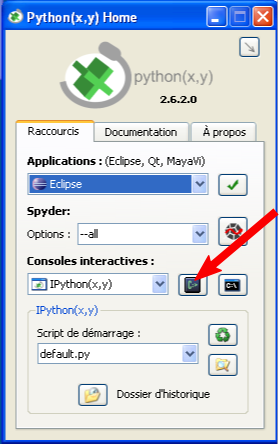
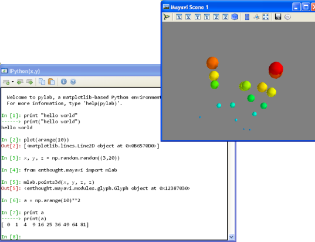

.. _pythonxy:

The Python(x,y) environment 
===========================

http://www.pythonxy.com/

Python(x,y) is a software that integrates a suite of standard
scientific-computing modules written in Python. Users of MS Windows may
find it easier to install once Python(x,y) than installing separately all
thses modules. Installing Python(x,y) is enough to start you off working
(and in particular, run all the examples of the tutorials).

Another solution is the Enthought Python Distribution (EPD), which is a
commercial product available for a larger choice of environments and with
commercial support.  

First steps with Python(x,y)
-----------------------------

Below the starting menu of Python(x,y) is displayed. You can choose
between running an application (a third-party software), or launching an
interactive Python shell. For a scientific-computing session, we choose
to launch a Python shell, from which we will execute commands and launch
scripts.

Among the available interpreters, we recommend to use
`Ipython`, which is a general-purpose advanced shell.

A shell opens up, and you have to wait a few seconds before getting the
command prompt, are many modules are imported before the session starts.

Let us start by a few commands to check that everything works::

    >>> a = "hello world"
    >>>> print a
    >>> # integers from 0 to 10
    >>> a = np.arange(10)
    >>> a 
    >>> from enthought.mayavi import mlab # 3D visualization
    >>> # Create data: coordinates of 3-D points picked at random
    >>> x, y, z = np.random.random((3,20))
    >>> mlab.points3d(x, y, z, z) 

If you get an error while typing::

    >>> from enthought.mayavi import mlab # 3D visualization

you probably did not install the **full** version of Python(x,y).

Among all applications available with Python(x,y), you can use the text
editor ``Scite`` (see arrow below). ``Scite`` handles well Python syntax
highlighting and indentation, as well as script execution. The
**extension** for Python files is **.py**,  saving files with the **.py**
is needed for activating syntax highlighting.

.. image:: Python_scite.png
   :align: center

