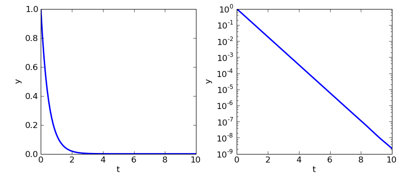

Scipy : high-level scientific computing
=========================================

..
    >>> import numpy as np

.. topic:: Scipy

    .. image:: square_wheels_edited.png
       :align: right

    Le module ``scipy`` regroupe un certain nombre de sous modules qui
    sont autant de boîtes à outils de routines courantes de calcul numérique, 
    regroupées par fonction : fonctions spéciales, interpolation,
    intégration, optimisation, traitement d'images. 

    Il existe dans le monde du calcul scientifique d'autres bibliothèques
    standard d'outils de calcul numériques (ex : la GSL - GNU Scientific 
    Library pour les programmes en C/C++, ou les toolboxes de Matlab). Les
    scientifiques ont trop souvent tendance à oublier leur existence et à
    **réinventer la roue** en reprogrammant leur algorithmes d'intégration,
    d'optimisation, etc. Quand c'est possible, il vaut mieux se servir
    des outils déjà écrits (testés et optimisés !).
    
    Le type de base en entrée des routines scipy est le tableau
    ``numpy.ndarray``, ce qui permet d'appliquer ces opérations
    haut-niveau directement aux tableaux numpy (et de façon très
    efficace).

.. warning:: 

    Ce cours n'est pas une introduction aux méthodes de calcul
    scientifique, et il serait bien ennuyeux d'énumérer une longue liste
    des différentes fonctions et modules de scipy. On a donc choisi de se
    concentrer ici sur quelques exemples simples pour donner une idée générale
    de ce que scipy peut apporter à ses utilisateurs. A chacun ensuite de
    définir les méthodes numériques dont il a besoin, et de chercher ce qu'il
    peut utiliser à l'intérieur des sous-modules pertinents.

To begin with ::

    >>> import scipy

Special functions: ``scipy.special``
----------------------------------------

A library of special functions.

The most standard functions are found in numpy 

.. sourcecode:: ipython

    [In 57]: np.cos, np.sinc, np.tanh
    (<ufunc 'cos'>, <function sinc at 0x8adb6bc>, <ufunc 'tanh'>)

more specialized functions are in ``scipy.special``.

**Exemple** : first-type Bessel function

.. image:: bessel-eq.png
   :align: left

.. image:: bessel.png
   :align: center

(source : linux mag HS40
http://www.linuxmag-france.org/produit.php?produit=609, Gaël Varoquaux)

::

    >>> from scipy.special import jn
    >>> index = 1
    >>> x = np.linspace(0, 10, 200)
    >>> y = jn(index, x)

And many other functions: ``gamma, beta, erf, airy, legendre,
fonctions elliptiques``, etc.

Linear algebra: ``scipy.linalg``
------------------------------------

Standard linear algebra operations.

**Basic operations** ::

    >>> from scipy import linalg
    >>> a = np.array([[1, 2], [3, 4]])
    >>> a = scipy.mat(a) # la transformation tableau -->  matrice est tres simple !
    >>> linalg.eigvals(a) # valeurs propres
    array([-0.37228132+0.j,  5.37228132+0.j])
    >>> linalg.det(a) # determinant
    -2.0
    >>> a.I # matrice inverse
    matrix([[-2. ,  1. ],
            [ 1.5, -0.5]])
    >>> linalg.inv(a) # autre ecriture possible
    array([[-2. ,  1. ],
           [ 1.5, -0.5]])

... and more advanced operations. Example: singular-value decomposition
(SVD) ::
 
    >>> A = scipy.mat('[1 3 2; 1 2 3]') #non-square matrix
    >>> U,s,Vh = linalg.svd(A)
    >>> s # spectre de A
    array([ 5.19615242,  1.        ])
    >>> print U
    [[-0.70710678 -0.70710678]
     [-0.70710678  0.70710678]]

La SVD est très employée en statistiques ou en traitement du signal.::

    >>> l = scipy.lena()
    >>> rows, weight, columns = linalg.svd(l, full_matrices=False)
    >>> white_lena = np.dot(rows, columns)
    >>> weight[20:]=0
    >>> W = scipy.mat(linalg.diagsvd(weight,512,512))
    >>> filtered_lena = np.dot(rows, np.dot(W, columns))

.. image:: svd_lena.png
   :align: center

On trouve dans ``scipy.linalg`` bien d'autres décompositions classiques
(QR, LU, Cholesky, Schur), des solveurs de systèmes linéaires, etc.

Interpolation: ``scipy.interpolate``
---------------------------------------

::

    >>> import scipy.interpolate
    >>> x = np.linspace(0, 1, 10)
    >>> y = np.sin(2*np.pi*x)
    >>> linear_interp = scipy.interpolate.interp1d(x, y) #par defaut, interpolateur lineaire
    >>> cubic_interp = scipy.interpolate.interp1d(x, y, kind='cubic') #interpolateur cubique
    >>> fine_x = np.linspace(0, 1, 50)
    >>> y_fromlinearinterp = linear_interp(fine_x)
    >>> y_fromcubicinterp = cubic_interp(fine_x)

.. image:: interpolation.png
   :align: center

.. sourcecode:: ipython

    In [246]: plot(x, y, 'o', ms=6, label='points originaux')
    Out[246]: [<matplotlib.lines.Line2D object at 0x9ba55ec>]
    In [247]: plot(fine_x, y_fromlinearinterp, '-', lw=2,
    label='interpolation lineaire')
    Out[247]: [<matplotlib.lines.Line2D object at 0xc8300cc>]
    In [248]: plot(fine_x, y_fromcubicinterp, '-', lw=2, label='interpolation
    cubique')
    Out[248]: [<matplotlib.lines.Line2D object at 0xc616b4c>]

Pour des méthodes d'interpolation par splines plus général, voir
``scipy.interpolate.splrep`` et ``scipy.interpolate.splev``.

``scipy.interpolate.interp2d`` est similaire à ``interp1d``, pour des
tableaux 2D.
(mettre une image ?)

Integration: ``scipy.integrate``
-----------------------------------

Différentes routines d'intégration numérique. ``scipy.integrate.quad``
est la plus générale

.. sourcecode:: ipython

    In [92]: from scipy.integrate import quad
    In [93]: quad(np.sin, 0, np.pi/2)
    Out[93]: (0.99999999999999989, 1.1102230246251564e-14)
    In [94]: #erreur très faible (l'erreur souhaitée est un paramètre optionnel de quad)
    In [95]: 1 - Out[93][0] 
    Out[95]: 1.1102230246251565e-16

mais il en existe d'autres dans ce sous-module.

**Equations différentielles ordinaires (ODE)**

Dans ce sous-module, on trouve également un solveur d'équations
différentielles ordinaires, ``scipy.integrate.odeint``. Il s'agit d'un
solveur générique assez sophistiqué, adapté pour les problèmes raides
(stiff en anglais) ou non raides. ``odeint`` résout des systèmes d'ODE du
premier ordre de la forme

``dy1/dt = rhs1(y1, y2, .., t0,...)``

``dy2/dt = rhs2(y1, y2, .., t0,...)``

...

Exemple : résolvons l'ODE ``dy/dt = -2y`` entre ``t=0..10``, pour
``y(t=0)=1``.::

    >>> from scipy.integrate import odeint
    >>> def rhs(y, t): #second membre de l'equa diff
    ...     return -2*y
    ...
    >>> t = np.linspace(0, 10, 100)
    >>> y = odeint(rhs, 1, t) # solution 

.. sourcecode:: ipython

    In [344]: plot(t, y)
    Out[344]: [<matplotlib.lines.Line2D object at 0xcffaa6c>]
    In [345]: clf()
    In [346]: semilogy(t, y)
    Out[346]: [<matplotlib.lines.Line2D object at 0xd0eebec>]

Exemple : oscillation amortie d'une masse au bout d'un ressort (ODE du 2è ordre)

La position de la masse obéit à l'ODE ``y'' + nu y' + om^2 y = 0``, que
l'on peut transformer en un système de deux équations différentielles du
premier ordre, en résolvant pour le vecteur ``Y=(y, y')``. ::

    >>> def rhs(y,t, om, nu):
    ...     return (y[1], -om**2*y[0] - nu*y[1])
    ... 
    >>> y = odeint(rhs, (1, 0), t, args=(3, 1)) # args correspond à (om, nu)

.. image:: spring.png
   :align: center

.. sourcecode:: ipython

    In [385]: plot(t, y[:,0], lw=2, label="y")
    Out[385]: [<matplotlib.lines.Line2D object at 0xd675e2c>]
    In [386]: plot(t, y[:,1], lw=2, label="y'")
    Out[386]: [<matplotlib.lines.Line2D object at 0xd67908c>]
    In [387]: legend()
    Out[387]: <matplotlib.legend.Legend object at 0xd67e26c>

.. topic:: EDP

    .. image:: cahn.png

    .. image:: dendrite.png

    Pour les EDP il n'y a pas de solver dans scipy. Il existe néanmoins
    des packages de solvers d'EDP pour Python, notamment **fipy**
    (http://www.ctcms.nist.gov/fipy/).

Optimisation et fit : ``scipy.optimize``
-----------------------------------------

**Exemple : simulation d'une marche aléatoire**

.. image:: random_walk.png
   :align: center 

Reprenons notre exemple de marcheur aléatoire ::

    >>> nreal = 1000 # nombre de réalisations de la marche
    >>> tmax = 200 # temps sur lequel on suit le marcheur
    >>> # On tire au hasard tous les pas 1 ou -1 de la marche
    >>> walk = 2 * ( np.random.random_integers(0, 1, (nreal,200)) - 0.5 )
    >>> np.unique(walk) # Vérification : tous les pas font bien 1 ou -1
    array([-1.,  1.])
    >>> # On construit les marches en sommant ces pas au cours du temps
    >>> cumwalk = np.cumsum(walk, axis=1) # axis = 1 : dimension du temps
    >>> sq_distance = cumwalk**2
    >>> # On moyenne dans le sens des réalisations  
    >>> mean_distance = np.sqrt(np.mean(sq_distance, axis=0)) 

On va fitter le tableau ``mean_distance`` par une racine carrée.

.. sourcecode:: ipython

    In [40]: plot(mean_distance)
    In [41]: t = np.arange(tmax)
    In [42]: def f(A, y, x): 
       ....:	 """la fonction à optimiser"""
       ....:     err = y - A*np.sqrt(x)
       ....:     return err
       ....: 
    In [43]: coeff = scipy.optimize.leastsq(f, 0.8, args=(mean_distance, t))
    In [44]: coeff
    In [45]: coeff
    Out[45]: (1.0017300505346165, 3)
    In [46]: plot(t, coeff[0]*np.sqrt(t), lw=2)

.. image:: diffusion.png
   :align: center

Si on est paresseux on peut dans ce cas-ci se ramener à un fit polynomial

.. sourcecode:: ipython

    In [47]: t = np.arange(tmax)
    In [48]: np.polyfit(t, mean_distance**2, 1)
    Out[48]: array([ 1.00452036, -0.08389612])

mais ce n'est pas conseillé, car ce n'est plus le même problème
d'optimisation.

Image processing: ``scipy.ndimage``
-----------------------------------------

This submodule offers image processing routines for n-dimensional arrays
(the routines can be used on arrays with a different number of dimensions, 2-D, 3-D, etc.).

Example ::

    >>> import scipy.ndimage
    >>> lena = scipy.lena()
    >>> lena_floue = scipy.ndimage.gaussian_filter(lena, 3)
    >>> lena_rotated = scipy.ndimage.rotate(lena, 45)

.. image:: lena_ndimage.png
   :align: center
